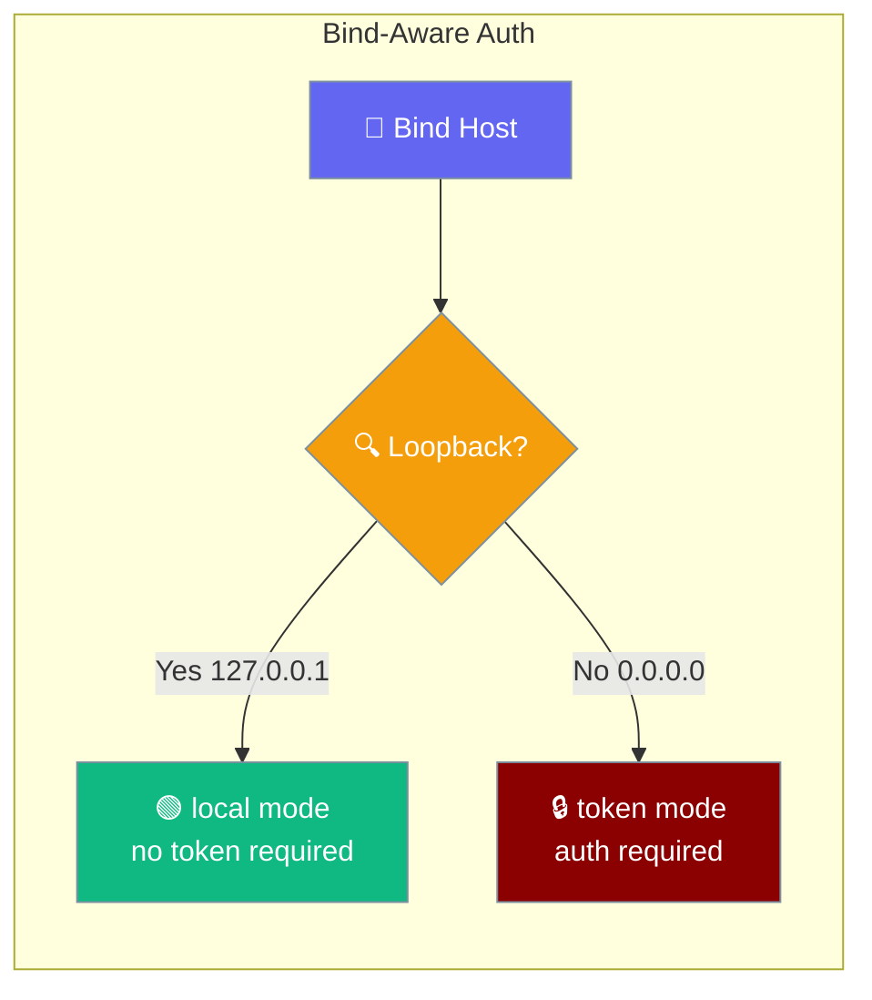
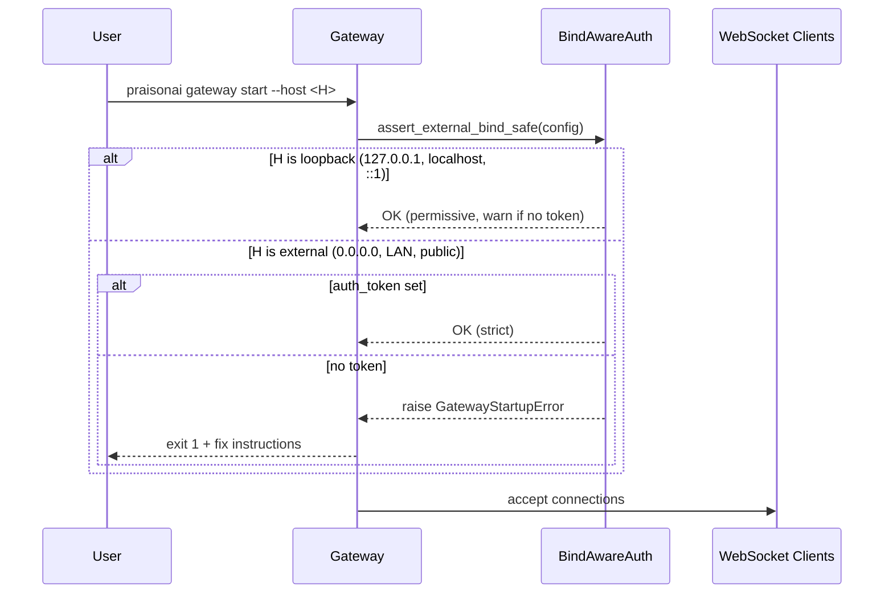
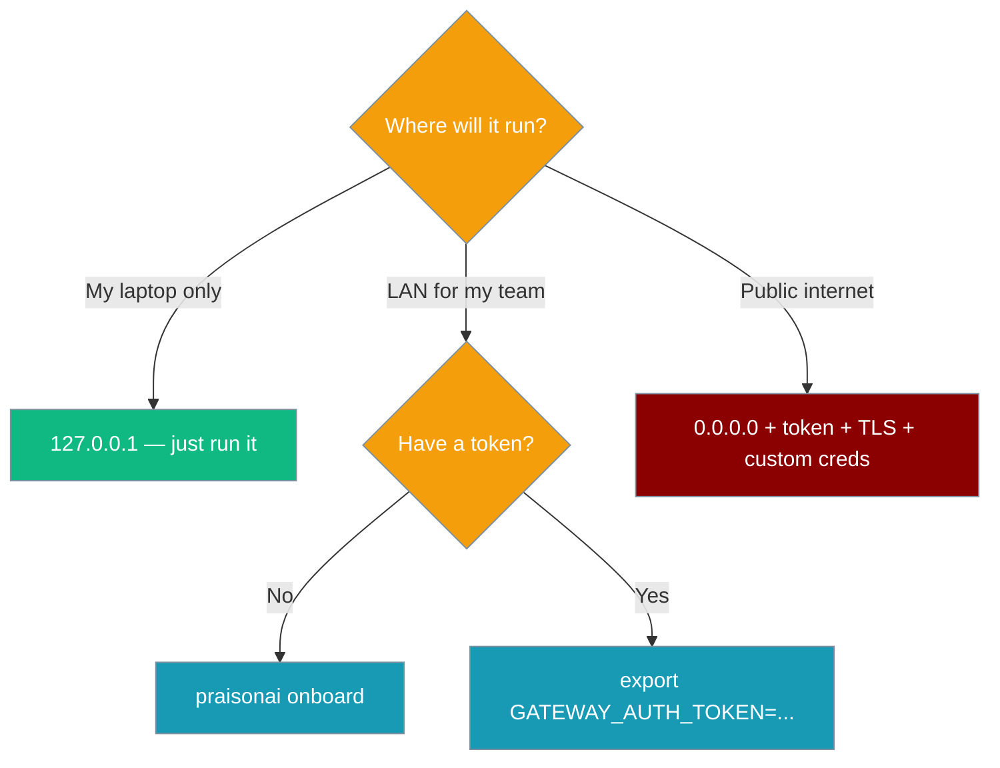

The gateway and chat UI change security behavior based on the interface they bind to — permissive on loopback, strict on external.



## Quick Start

<Steps>
<Step title="Local development (loopback — permissive)">
```python
from praisonaiagents import Agent

agent = Agent(
    name="Local Agent",
    instructions="You are a helpful assistant.",
)

# Serve via gateway on loopback — no token needed
# $ praisonai gateway start --host 127.0.0.1
agent.start("hello")
```
</Step>

<Step title="External deployment (strict — token required)">
```bash
# Option A: Run onboarding (recommended)
praisonai onboard

# Option B: Set a token explicitly
export GATEWAY_AUTH_TOKEN=$(openssl rand -hex 16)
praisonai gateway start --host 0.0.0.0
```
</Step>
</Steps>

---

## How It Works



| Mode | Meaning | Trigger |
|---|---|---|
| `local` | Permissive — no token required | Loopback bind (default) |
| `token` | Token required (auto-generated if absent on loopback) | External bind (default) |
| `password` | Username/password auth | Chainlit UI |
| `trusted-proxy` | Auth handled upstream | Reverse proxy setups |

---

## Interface Detection

| Host | `is_loopback()` | Resolved mode |
|---|---|---|
| `127.0.0.1` | `True` | `local` |
| `127.255.255.255` | `True` | `local` |
| `localhost` | `True` | `local` |
| `::1` | `True` | `local` |
| `0.0.0.0` | `False` | `token` |
| `192.168.1.x` | `False` | `token` |
| `10.0.0.x` | `False` | `token` |
| `8.8.8.8` (public) | `False` | `token` |

---

## User Flows

**Flow A — "I want a quick local demo":** Run on `127.0.0.1`, no config needed. Token auto-generated, fingerprint logged (`gw_****abcd`), saved to `~/.praisonai/.env`.

**Flow B — "I want to share on my LAN":** Run `praisonai onboard` (30s, 3 prompts) OR `export GATEWAY_AUTH_TOKEN=$(openssl rand -hex 16)` → `praisonai gateway start --host 0.0.0.0`.

**Flow C — "I'm deploying to a VPS":** Same as B, but also set `CHAINLIT_USERNAME` / `CHAINLIT_PASSWORD` for the UI, and consider TLS.

**Flow D — "Lab/demo — I accept the risk of admin/admin on external":** `export PRAISONAI_ALLOW_DEFAULT_CREDS=1`.

---

## Environment Variables

| Variable | Scope | Effect |
|---|---|---|
| `GATEWAY_AUTH_TOKEN` | Gateway | Auth token. Required on external bind. Auto-generated + saved to `~/.praisonai/.env` (mode `0600`) on loopback when unset. |
| `CHAINLIT_HOST` | UI | Host the UI binds to (default `127.0.0.1`). Drives UI auth mode resolution. |
| `CHAINLIT_USERNAME` | UI | Username (default `admin`). |
| `CHAINLIT_PASSWORD` | UI | Password (default `admin`). |
| `PRAISONAI_ALLOW_DEFAULT_CREDS` | UI | Escape hatch. Set to `1`/`true`/`yes` to allow `admin/admin` on external bind. **Unsafe — demo only.** |
| `CHAINLIT_AUTH_SECRET` | UI | Session secret. Auto-generated if unset (ephemeral per-process). |

---

## Error Reference

**`GatewayStartupError`** — raised by `assert_external_bind_safe()` when binding externally without a token:
```
Cannot bind to 0.0.0.0 without an auth token.
Fix:  praisonai onboard         (30 seconds, 3 prompts)
Or:   export GATEWAY_AUTH_TOKEN=$(openssl rand -hex 16)
```

**`UIStartupError`** — raised by `register_password_auth()` when `admin/admin` used on external bind:
```
Cannot bind to 0.0.0.0 with default admin/admin credentials.
Fix:  export CHAINLIT_USERNAME=myuser CHAINLIT_PASSWORD=mypass
Lab:  export PRAISONAI_ALLOW_DEFAULT_CREDS=1  (demo only)
```

---

## Token Fingerprinting

Logs now show `gw_****XXXX` (last 4 chars), never the raw token. This is implemented by `get_auth_token_fingerprint()` for safe logging. Retrieve the full token from `~/.praisonai/.env` if needed.

---

## Which Option When



---

## Best Practices

<AccordionGroup>
<Accordion title="Use praisonai onboard for token setup">
Prefer `praisonai onboard` over manual token creation. It handles all the setup automatically and saves the token securely.
</Accordion>

<Accordion title="Never commit ~/.praisonai/.env">
The auto-generated `.env` file contains sensitive tokens. Add it to your `.gitignore` and never commit it to version control.
</Accordion>

<Accordion title="Set custom credentials before external binding">
Always set `CHAINLIT_USERNAME` and `CHAINLIT_PASSWORD` before binding to external interfaces. Never use `admin/admin` in production.
</Accordion>

<Accordion title="Use PRAISONAI_ALLOW_DEFAULT_CREDS only for demos">
The `PRAISONAI_ALLOW_DEFAULT_CREDS=1` escape hatch should only be used for ephemeral demos or testing. Never in production.
</Accordion>
</AccordionGroup>

---

## Related

<CardGroup cols={2}>
<Card title="Gateway Documentation" icon="gateway" href="/docs/gateway">
  Core gateway functionality and configuration
</Card>
<Card title="Onboarding" icon="rocket" href="/docs/features/onboard">
  Quick setup with automatic token generation
</Card>
<Card title="Troubleshooting" icon="wrench" href="/docs/guides/troubleshoot-gateway">
  Common gateway issues and solutions
</Card>
<Card title="Chat Interface" icon="comments" href="/docs/features/chat">
  Chainlit UI security and configuration
</Card>
</CardGroup>