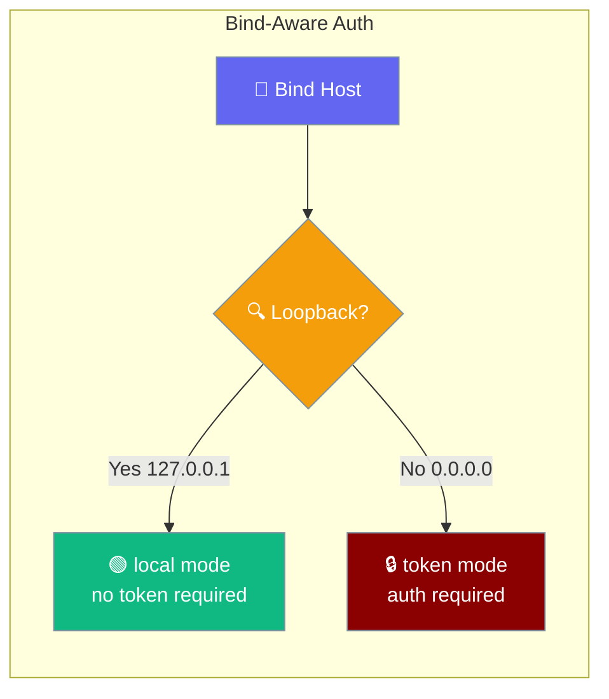
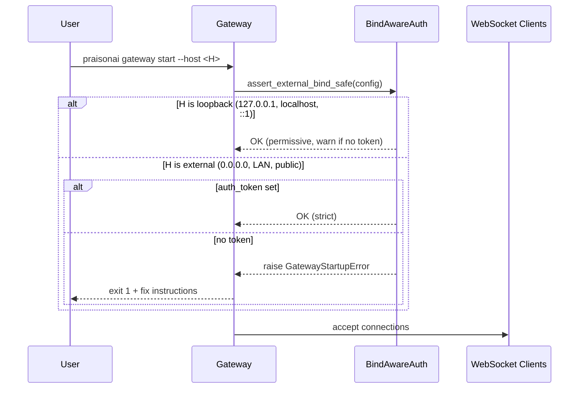
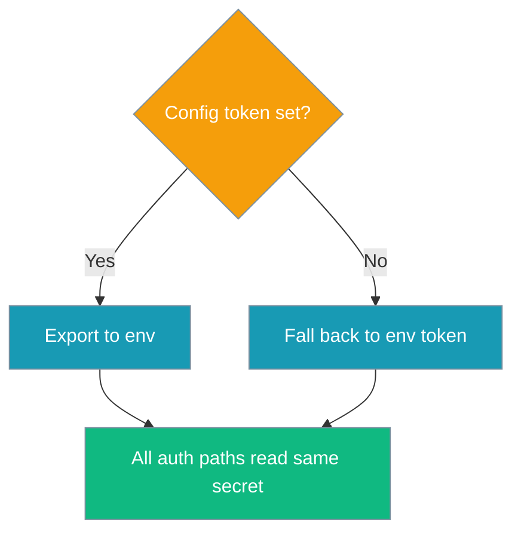
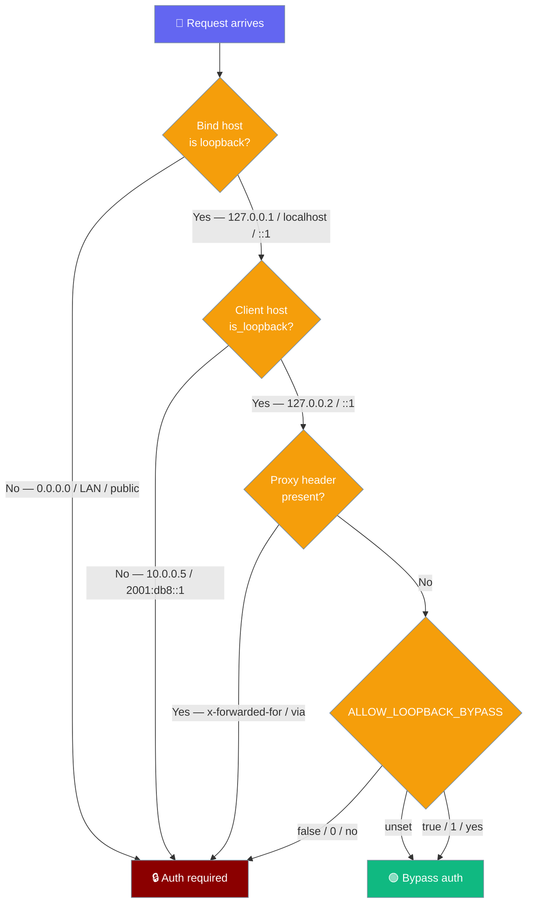
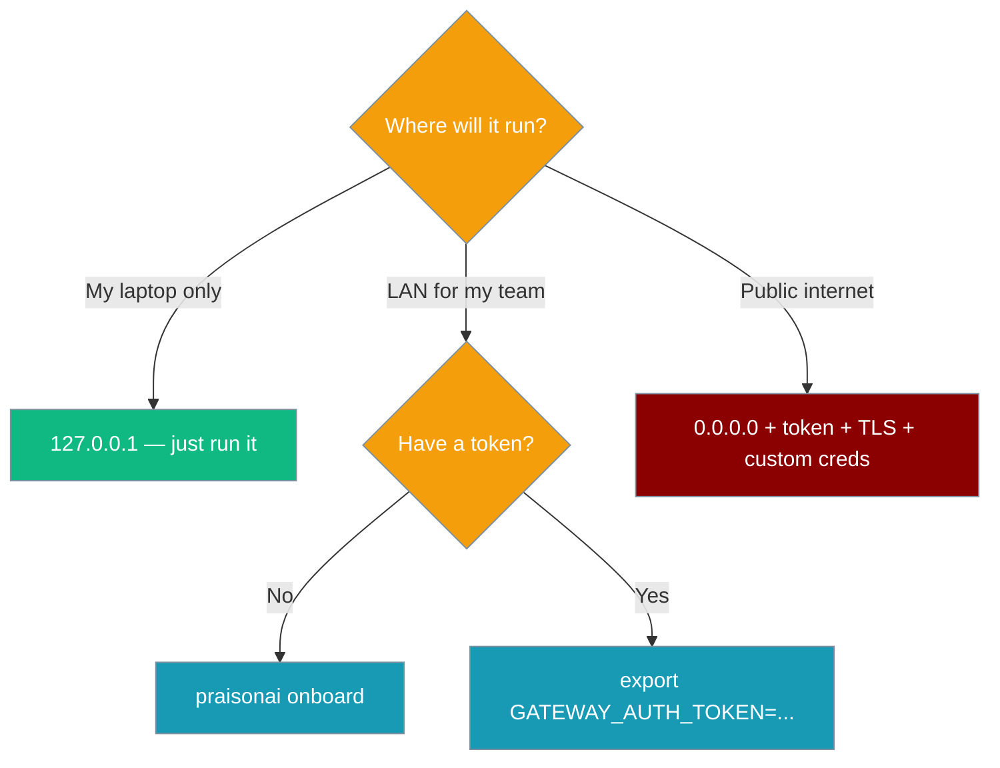
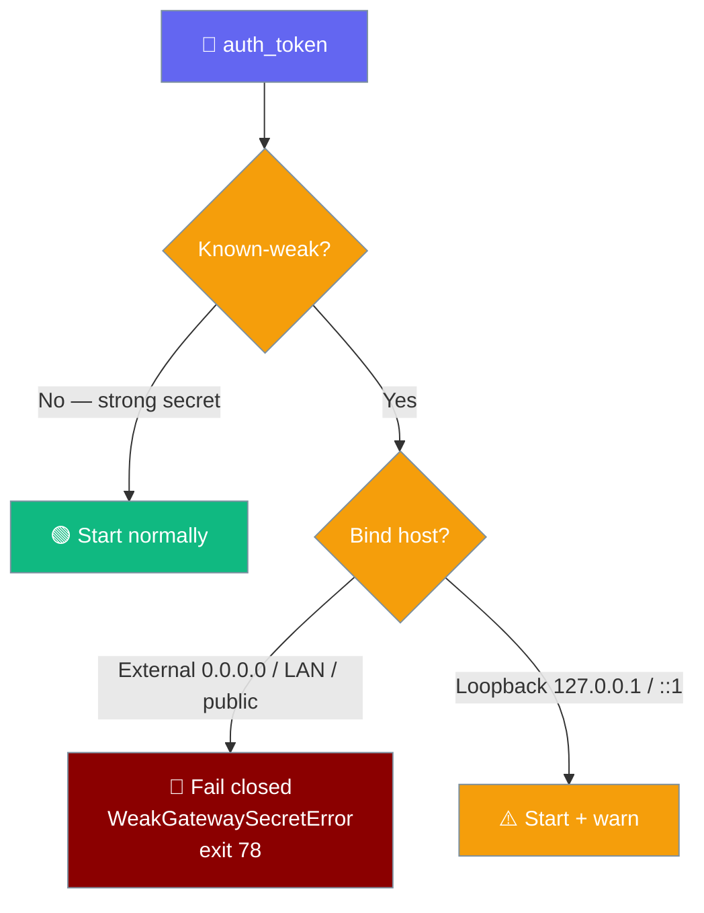

<Note>
The gateway now ships in the `praisonai-bot` package. `praisonai serve gateway` still works exactly as documented here; for a standalone install see [praisonai-bot Migration](/docs/guides/praisonai-bot-migration).
</Note>


The gateway and chat UI change security behaviour based on the interface they bind to — permissive on loopback, strict on external. External binds also refuse a known-weak/placeholder `auth_token` — see [Weak / placeholder secret guard](#weak-placeholder-secret-guard).

```python
from praisonaiagents import Agent

agent = Agent(
    name="Local Agent",
    instructions="You are a helpful assistant.",
)
# Serve on loopback — no token required
# $ praisonai gateway start --host 127.0.0.1
agent.start("hello")
```


The user opens the gateway UI or WebSocket client; bind-aware auth requires a token only when the server listens on a non-loopback host.



## Quick Start

<Steps>
<Step title="Local development (loopback — permissive)">
```python
from praisonaiagents import Agent

agent = Agent(
    name="Local Agent",
    instructions="You are a helpful assistant.",
)

# Serve via gateway on loopback — no token needed
# $ praisonai gateway start --host 127.0.0.1
agent.start("hello")
```
</Step>

<Step title="External deployment (strict — token required)">
```bash
# Option A: Run onboarding (recommended)
praisonai onboard

# Option B: Set a token explicitly
export GATEWAY_AUTH_TOKEN=$(openssl rand -hex 16)
praisonai gateway start --host 0.0.0.0
```
</Step>
</Steps>

---

## How It Works



| Mode | Meaning | Trigger |
|---|---|---|
| `local` | Permissive — no token required | Loopback bind (default) |
| `token` | Token required (auto-generated if absent on loopback) | External bind (default) |
| `password` | Username/password auth | Chainlit UI |
| `trusted-proxy` | Auth handled upstream | Reverse proxy setups |

---

## Token Source Precedence

When `GatewayConfig(auth_token=...)` is set, it is exported to `GATEWAY_AUTH_TOKEN` at gateway startup. **Config wins over env.** All auth paths — HTTP login, magic-link verification, WebSocket handshake — read the same secret.



**Implication:** Rotating the token via `GatewayConfig` is sufficient; you don't need to also `unset GATEWAY_AUTH_TOKEN`.

**Flow — "I rotated my gateway token but magic-link login still fails":** Prior to PR #1744, a stale `GATEWAY_AUTH_TOKEN` env var could shadow a fresh `GatewayConfig.auth_token`. Since PR #1744, config wins — restart the gateway and try again.

---

## Interface Detection

| Host | `is_loopback()` | Resolved mode |
|---|---|---|
| `127.0.0.1` | `True` | `local` |
| `127.255.255.255` | `True` | `local` |
| `localhost` | `True` | `local` |
| `::1` | `True` | `local` |
| `0.0.0.0` | `False` | `token` |
| `192.168.1.x` | `False` | `token` |
| `10.0.0.x` | `False` | `token` |
| `8.8.8.8` (public) | `False` | `token` |

<Note>
The same `is_loopback()` predicate is now applied to the **client host** for auth-bypass decisions, not just the bind host — see [Auth Bypass on Loopback](#auth-bypass-on-loopback).
</Note>

---

## Auth Bypass on Loopback

A loopback-bound gateway is permissive by default — local, non-proxied requests bypass auth without any environment variable.



**Semantic loopback client matching.** The client host is checked with `is_loopback()`, not a fixed 3-string list. Local peers reported as `127.0.0.2`, `127.255.255.255`, or the expanded IPv6 form `0:0:0:0:0:0:0:1` bypass correctly instead of getting a spurious `401`. Non-loopback clients (`10.0.0.5`, `2001:db8::1`) never bypass on a loopback-bound gateway.

**Proxy-header guard.** A request carrying `x-forwarded-for`, `via`, `x-real-ip`, or `x-forwarded-host` never inherits loopback trust — proxied requests always require auth. A missing client address also blocks the bypass.

### Decision Table

| `bind_host` | `client_host` | `ALLOW_LOOPBACK_BYPASS` | Proxy header? | Bypass? |
|---|---|---|---|---|
| `127.0.0.1` | `127.0.0.1` | unset | no | **yes** (default) |
| `localhost` | `127.0.0.1` | unset | no | **yes** (default) |
| `::1` | `::1` | unset | no | **yes** (default) |
| `127.0.0.1` | `127.0.0.2` / `0:0:0:0:0:0:0:1` | unset | no | **yes** (semantic) |
| `0.0.0.0` | `127.0.0.1` | unset | no | no |
| `192.168.1.10` | `127.0.0.1` | unset | no | no |
| `0.0.0.0` | `127.0.0.1` | `true` / `1` | no | yes (force-enable) |
| `127.0.0.1` | `127.0.0.1` | `false` / `0` | no | no (force-disable) |
| `127.0.0.1` | `10.0.0.5` / `2001:db8::1` | any | no | no |
| `127.0.0.1` | `127.0.0.1` | any | **yes** | no |
| any | `None` | any | any | no |

<Warning>
Loopback requests to a loopback-bound gateway also receive **all operator scopes** by default. This is intended for local development — see [Operator Scopes](/docs/features/gateway-operator-scopes).
</Warning>

---

## User Flows

**Flow A — "I want a quick local demo":** Run on `127.0.0.1`, no config needed. Token auto-generated, fingerprint logged (`gw_****abcd`), saved to `~/.praisonai/.env`.

**Flow B — "I want to share on my LAN":** Run `praisonai onboard` (30s, 3 prompts) OR `export GATEWAY_AUTH_TOKEN=$(openssl rand -hex 16)` → `praisonai gateway start --host 0.0.0.0`.

**Flow C — "I'm deploying to a VPS":** Same as B, but also set `CHAINLIT_USERNAME` / `CHAINLIT_PASSWORD` for the UI, and consider TLS.

**Flow D — "Lab/demo — I accept the risk of admin/admin on external":** `export PRAISONAI_ALLOW_DEFAULT_CREDS=1`.

---

## Environment Variables

| Variable | Scope | Effect |
|---|---|---|
| `GATEWAY_AUTH_TOKEN` | Gateway | Auth token. Required on external bind. Auto-generated + saved to `~/.praisonai/.env` (mode `0600`) on loopback when unset. |
| `ALLOW_LOOPBACK_BYPASS` | Gateway | Override for the loopback auth bypass. `true`/`1`/`yes` force-enables bypass even on an external bind (**unsafe**). `false`/`0`/`no` force-disables it on a loopback bind (strict auth for local dev). Unset defaults to the bind-host rule (permissive on loopback). |
| `CHAINLIT_HOST` | UI | Host the UI binds to (default `127.0.0.1`). Drives UI auth mode resolution. |
| `CHAINLIT_USERNAME` | UI | Username (default `admin`). |
| `CHAINLIT_PASSWORD` | UI | Password (default `admin`). |
| `PRAISONAI_ALLOW_DEFAULT_CREDS` | UI | Escape hatch. Set to `1`/`true`/`yes` to allow `admin/admin` on external bind. **Unsafe — demo only.** |
| `CHAINLIT_AUTH_SECRET` | UI | Session secret. Auto-generated if unset (ephemeral per-process). |

---

## Error Reference

**`GatewayStartupError`** — raised by `assert_external_bind_safe()` when binding externally without a token:
```
Cannot bind to 0.0.0.0 without an auth token.
Fix:  praisonai onboard         (30 seconds, 3 prompts)
Or:   export GATEWAY_AUTH_TOKEN=$(openssl rand -hex 16)
```

**`UIStartupError`** — raised by `register_password_auth()` when `admin/admin` used on external bind:
```
Cannot bind to 0.0.0.0 with default admin/admin credentials.
Fix:  export CHAINLIT_USERNAME=myuser CHAINLIT_PASSWORD=mypass
Lab:  export PRAISONAI_ALLOW_DEFAULT_CREDS=1  (demo only)
```

---

## Token Fingerprinting

Logs now show `gw_****XXXX` (last 4 chars), never the raw token. This is implemented by `get_auth_token_fingerprint()` for safe logging. Retrieve the full token from `~/.praisonai/.env` if needed.

---

## Which Option When



---

## Rotating the token

When the operator changes `auth_token` and reloads, every session authenticated under the previous secret is force-closed with WebSocket close code `4001` and reason `credentials_rotated`. Clients should re-authenticate rather than backing off. Defaults on; opt out with `gateway.revoke_on_secret_rotation: false`.

<Card title="Gateway Credential Rotation" icon="key" href="/docs/features/gateway-credential-rotation">
  Full rotation behaviour, the opt-out toggle, and client-side recovery
</Card>

---

## Weak / placeholder secret guard

A publicly-known placeholder like `change-me` is no protection at all — external binds refuse to start on a weak `auth_token`, and loopback prints a warning.



### Behaviour matrix

| Bind | `auth_token` weak? | Behaviour |
|---|---|---|
| External (`0.0.0.0`, LAN, public IP) | Yes | **Fail closed** — raise `WeakGatewaySecretError`; gateway does not start. Exits `EX_CONFIG` (78) — the supervisor should not restart. |
| External | No | Start normally. |
| Loopback (`127.0.0.1`, `localhost`, `::1`) | Yes | **Warn** — gateway starts (permissive-loopback posture) but logs a warning naming the field. |
| Loopback | No | Start normally, no warning. |

### The denylist

`KNOWN_WEAK_SECRETS` is a frozenset of well-known placeholder values. The lookup is whitespace-stripped and case-insensitive, so `CHANGE-ME`, `  change-me  `, and `Change-Me` all match. Empty and `None` also count as weak.

| Known-weak values |
|---|
| `change-me`, `changeme`, `change-me-now`, `changemenow` |
| `your-token-here`, `your_token_here`, `your-secret-here` |
| `secret`, `password`, `passwd`, `test`, `token`, `admin` |
| `default`, `example`, `placeholder`, `none`, `null`, `todo` |
| `$(openssl rand -hex 16)`, `$(openssl rand -hex 32)` |

<Warning>
The last two entries — `$(openssl rand -hex 16)` and `$(openssl rand -hex 32)` — are in the denylist because pasting the fix command as a **literal string** (into YAML or an env value) instead of running it in a shell is the most common footgun. The literal is rejected exactly so this mistake fails loudly.
</Warning>

### The refusal message

On an external bind with a weak token, the gateway raises `WeakGatewaySecretError` with this exact message:

```bash
Refusing to start: gateway.auth_token is a known-weak/placeholder value.
A publicly-known secret provides no real authentication.
Fix:  praisonai onboard         (30 seconds, 3 prompts)
Or:   export GATEWAY_AUTH_TOKEN="$(openssl rand -hex 16)"  (run in a shell so the command is expanded, not pasted literally)
```

### Fix a weak token

<Steps>
<Step title="Option A — run onboarding (recommended)">
```bash
praisonai onboard
```
</Step>

<Step title="Option B — generate a strong token">
```bash
export GATEWAY_AUTH_TOKEN="$(openssl rand -hex 16)"
praisonai gateway start --host 0.0.0.0
```
<Warning>
Run this in a shell so `$(...)` is expanded to a random value. Do **not** paste the literal string `$(openssl rand -hex 16)` into `gateway.yaml` or an env value — that literal is itself in the denylist.
</Warning>
</Step>
</Steps>

### Programmatic use

```python
from praisonaiagents.gateway import (
    is_weak_secret,
    assert_gateway_secret_strong,
    WeakGatewaySecretError,
)

assert not is_weak_secret("my-strong-token")

try:
    assert_gateway_secret_strong("change-me", field="gateway.auth_token")
except WeakGatewaySecretError as e:
    print(e)  # → the multi-line refusal message
```

`assert_gateway_secret_strong` is not bind-aware itself — it raises on any weak value. The bind-aware policy (fail-closed external / warn loopback) is applied at the wrapper call sites.

<Note>
`praisonai gateway doctor` surfaces the same verdict before start — see [Weak-secret check](/docs/features/gateway-cli#weak-secret-check).
</Note>

---

## Best Practices

<AccordionGroup>
<Accordion title="Use praisonai onboard for token setup">
Prefer `praisonai onboard` over manual token creation. It handles all the setup automatically and saves the token securely.
</Accordion>

<Accordion title="Never commit ~/.praisonai/.env">
The auto-generated `.env` file contains sensitive tokens. Add it to your `.gitignore` and never commit it to version control.
</Accordion>

<Accordion title="Set custom credentials before external binding">
Always set `CHAINLIT_USERNAME` and `CHAINLIT_PASSWORD` before binding to external interfaces. Never use `admin/admin` in production.
</Accordion>

<Accordion title="Use PRAISONAI_ALLOW_DEFAULT_CREDS only for demos">
The `PRAISONAI_ALLOW_DEFAULT_CREDS=1` escape hatch should only be used for ephemeral demos or testing. Never in production.
</Accordion>
</AccordionGroup>

---

## Related

<CardGroup cols={2}>
<Card title="Operator Scopes" icon="shield-check" href="/docs/features/gateway-operator-scopes">
  Least-privilege multi-operator access control
</Card>
<Card title="Gateway Documentation" icon="gateway" href="/docs/gateway">
  Core gateway functionality and configuration
</Card>
<Card title="Onboarding" icon="rocket" href="/docs/features/onboard">
  Quick setup with automatic token generation
</Card>
<Card title="Troubleshooting" icon="wrench" href="/docs/guides/troubleshoot-gateway">
  Common gateway issues and solutions
</Card>
<Card title="Chat Interface" icon="comments" href="/docs/features/chat">
  Chainlit UI security and configuration
</Card>
</CardGroup>