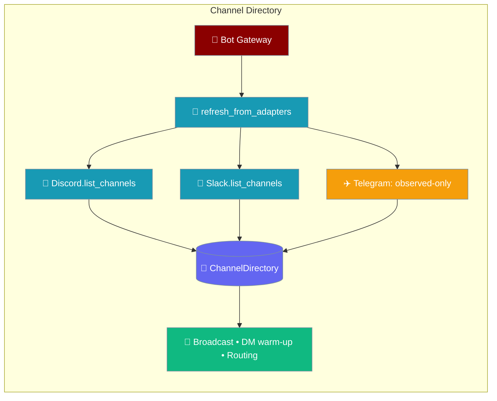
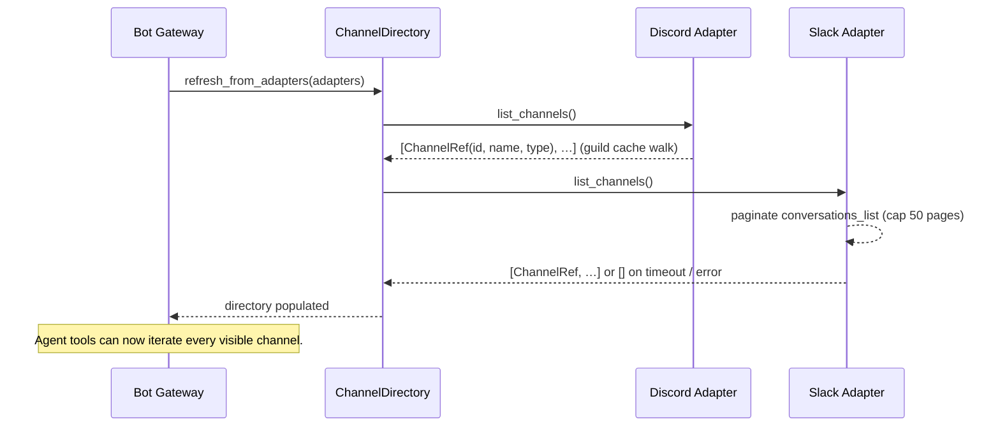

Discover every Discord and Slack channel your bot can address, without waiting for someone to say `@bot` first.



## Quick Start

<Steps>
<Step title="Run an agent on the gateway">
Nothing to enable — if Discord or Slack is configured, its channels are auto-listed on every refresh. Your agent can address every visible channel without a prior inbound message:

```python
from praisonaiagents import Agent

agent = Agent(
    name="Announcer",
    instructions="Post the daily standup summary to every team channel.",
    model="gpt-4o-mini",
)

agent.start("Post 'Standup at 10:00 GMT' to every channel in the directory.")
```
</Step>

<Step title="Configure Discord or Slack">
Enumeration works out of the box — no new keys are required:

```yaml
# gateway.yaml
channels:
  discord:
    platform: discord
    token: "${DISCORD_BOT_TOKEN}"
    # Guilds intent is already enabled by the adapter.

  slack:
    platform: slack
    bot_token: "${SLACK_BOT_TOKEN}"
    # Paginates public + private channels your bot user can access.
```
</Step>
</Steps>

<Note>
Channels the bot has joined but that have never messaged it are now addressable. Previously a channel became reachable only after its first inbound message.
</Note>

---

## How It Works

`ChannelDirectory.refresh_from_adapters` asks each adapter for its channels, then merges them into the observed set.



Each adapter returns a list of `ChannelRef` descriptors. Only `.id` is consumed by the directory; `name` and `type` are for logging and UI.

| Field | Type | Default | Description |
|-------|------|---------|-------------|
| `id` | `str` | — | Platform-native channel identifier (required) |
| `name` | `str` | `""` | Human-readable name, `""` when unknown |
| `type` | `str` | `""` | Platform-native type tag (`"text"`, `"channel"`, `"im"`) |

Adapters implement `list_channels()` optionally. `refresh_from_adapters` looks it up via `getattr(adapter, "list_channels", None)` and skips any adapter that doesn't provide it — Telegram, custom webhook, and IRC descriptor-only adapters stay observed-only, so nothing regresses.

---

## Behavior Details

The directory degrades gracefully — a slow or empty adapter yields fewer entries, never an exception.

| Situation | Result |
|-----------|--------|
| Discord client not ready | Returns `[]` while `client.is_ready()` is `False` |
| Slack timeout or SDK error | Returns `[]`; the refresh loop continues |
| Adapter without `list_channels()` | Skipped — stays observed-only |
| Workspace over 10 000 channels | Only the first 10 000 land in the directory (surfaced in the operator log) |

### Slack pagination and timeout

Slack's async client is driven from the synchronous refresh loop by a sync-safe wrapper — `asyncio.run(...)` when no loop is running, or a short-lived worker thread when a loop is already active. This works whether the gateway starts inside an existing `asyncio.run` or from a plain sync entrypoint.

| Constant | Where | Default | Description |
|----------|-------|---------|-------------|
| `_MAX_LIST_CHANNELS_PAGES` | `bots/slack.py` | `50` | Pagination cap × 200 per page → 10 000-channel ceiling |
| `_LIST_CHANNELS_TIMEOUT` | `bots/slack.py` | `30.0` | Seconds before the Slack coroutine driver degrades to `[]` |
| Discord `guilds` intent | `bots/discord.py` | already on | Required for the guild → text-channels cache. No user action |

<Info>
These constants are not YAML options — they are documented so operators can reason about failure modes. On startup the directory may transiently return `[]`; write agent code that tolerates an empty directory on the first tick.
</Info>

---

## Best Practices

<AccordionGroup>
<Accordion title="Read the directory each turn, don't hand-cache ids">
Channels come and go. Iterate the auto-populated directory on every turn instead of caching channel ids in your agent.
</Accordion>
<Accordion title="Filter large Slack workspaces at the agent level">
On workspaces over 10 000 conversations, add a channel-name prefix or topic-tag filter in your agent — the directory alone stops at the pagination cap.
</Accordion>
<Accordion title="Tolerate an empty directory on startup">
`list_channels()` may return `[]` transiently while a client warms up. Guard agent code so an empty first tick is harmless.
</Accordion>
<Accordion title="Implement list_channels() only when it's cheap">
For a custom platform adapter, `list_channels()` is opt-in. Skip it if enumeration is prohibitively expensive on that platform — the adapter stays observed-only.
</Accordion>
</AccordionGroup>

---

## Related

<CardGroup cols={2}>
<Card title="Gateway" icon="network-wired" href="/docs/gateway">
  Top-level gateway and channel configuration
</Card>
<Card title="Channel Descriptor" icon="plug" href="/docs/features/channel-descriptor">
  How a plugin channel declares its config
</Card>
<Card title="Per-Chat Session Scope" icon="layer-group" href="/docs/features/per-chat-session-scope">
  The scope model channel routing feeds into
</Card>
<Card title="Messaging Bots" icon="robot" href="/docs/features/messaging-bots">
  Connect agents to Discord, Slack, Telegram, and more
</Card>
</CardGroup>
