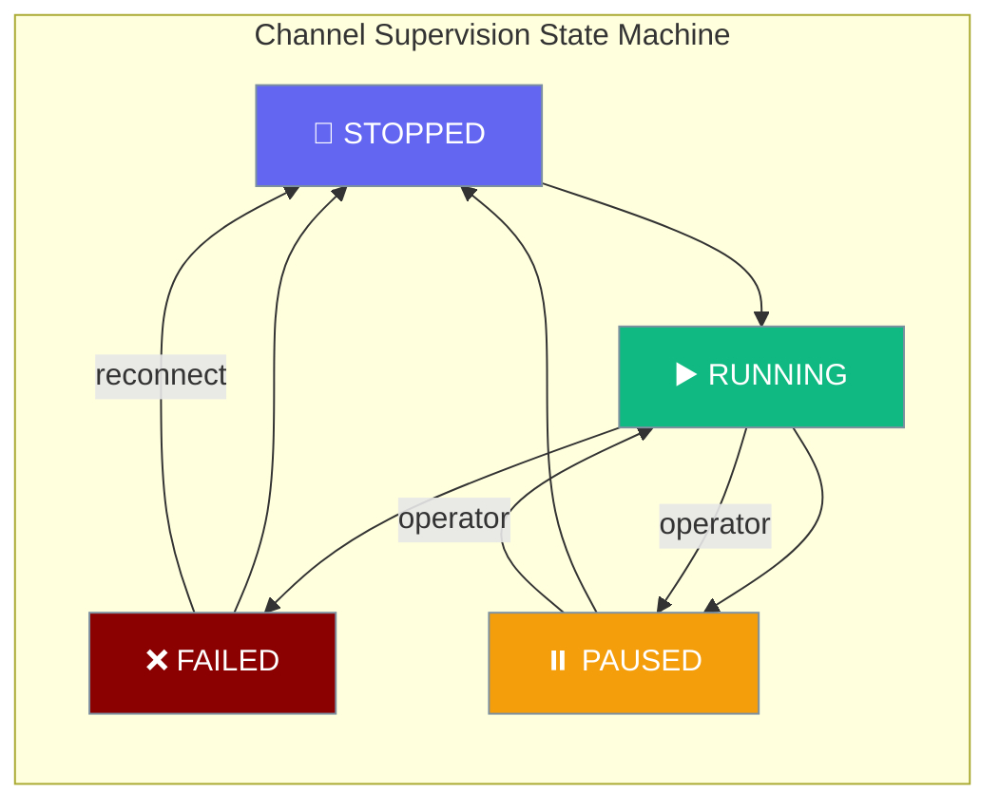
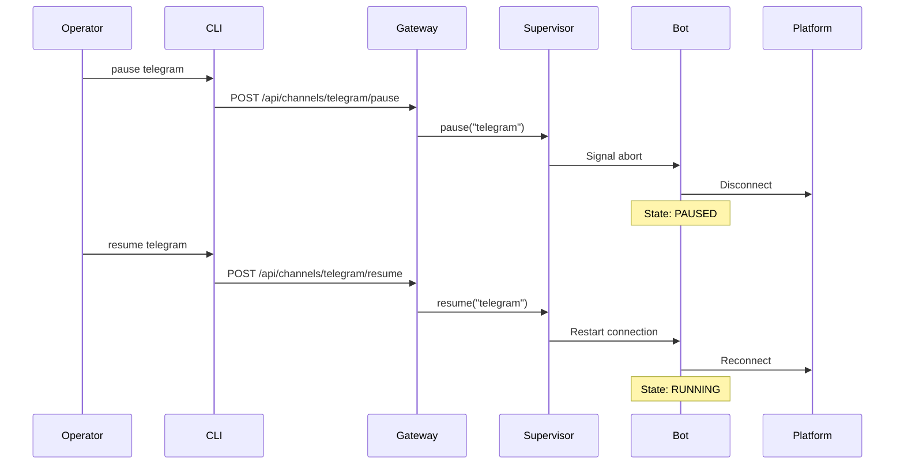

Channel supervision keeps gateway bots alive through network outages with unlimited retries and operator-level pause / resume / reconnect controls.



## Quick Start

Channel supervision is automatically enabled for all gateway channels configured in `gateway.yaml`. No additional setup is required.

<Steps>
<Step title="Basic Gateway Setup">
Create a simple gateway with supervision:

```yaml
# gateway.yaml
agents:
  assistant:
    instructions: "You are a helpful AI assistant."
    model: "gpt-4o-mini"

channels:
  telegram:
    token: "${TELEGRAM_BOT_TOKEN}"
    platform: telegram
```

```bash
praisonai gateway start --config gateway.yaml
```

The `telegram` channel is now under supervision with unlimited retry capability.
</Step>

<Step title="Control Channel Operations">
Pause a problematic channel while investigating issues:

```bash
praisonai gateway pause telegram
```

Resume when ready:

```bash
praisonai gateway resume telegram
```

Force reconnect to reset error state:

```bash
praisonai gateway reconnect telegram
```
</Step>
</Steps>

---

## How It Works

Channel supervision provides resilient error handling through error classification and unlimited retries:



| Component | Responsibility |
|-----------|----------------|
| **ChannelSupervisor** | Manages channel lifecycle and error handling |
| **BackoffPolicy** | Controls retry timing with capped exponential backoff |
| **Error Classification** | Determines if errors are recoverable, fatal, or conflict |
| **Operator Controls** | Provides manual pause/resume/reconnect capabilities |

---

## Channel States

The supervision system tracks four distinct channel states:

| State | Description | Auto-Retry | Operator Actions |
|-------|-------------|------------|------------------|
| `RUNNING` | Channel is actively connected and serving messages | N/A | pause, reconnect |
| `FAILED` | Fatal error occurred (e.g., Telegram conflict, invalid token) | ❌ No | reconnect only |
| `PAUSED` | Manually paused by operator | ❌ No | resume, reconnect |
| `STOPPED` | Clean shutdown or initial state | ❌ No | Automatic restart |

---

## Operator Controls

### Pause Channel

Temporarily stop a channel without losing configuration:

<Tabs>
  <Tab title="CLI">
    ```bash
    praisonai gateway pause telegram --url ws://127.0.0.1:8765
    ```
  </Tab>
  <Tab title="REST API">
    ```bash
    curl -X POST http://127.0.0.1:8765/api/channels/telegram/pause \
         -H "Authorization: Bearer YOUR_TOKEN"
    ```
  </Tab>
</Tabs>

**Effect**: Channel enters `PAUSED` state and stops processing messages. Supervision loop waits indefinitely until resumed.

### Resume Channel

Resume a manually paused channel:

<Tabs>
  <Tab title="CLI">
    ```bash
    praisonai gateway resume telegram --url ws://127.0.0.1:8765
    ```
  </Tab>
  <Tab title="REST API">
    ```bash
    curl -X POST http://127.0.0.1:8765/api/channels/telegram/resume \
         -H "Authorization: Bearer YOUR_TOKEN"
    ```
  </Tab>
</Tabs>

**Effect**: Channel transitions from `PAUSED` to `STOPPED`, then automatically restarts to `RUNNING`.

### Reconnect Channel

Force a complete reconnection and reset error state:

<Tabs>
  <Tab title="CLI">
    ```bash
    praisonai gateway reconnect telegram --url ws://127.0.0.1:8765
    ```
  </Tab>
  <Tab title="REST API">
    ```bash
    curl -X POST http://127.0.0.1:8765/api/channels/telegram/reconnect \
         -H "Authorization: Bearer YOUR_TOKEN"
    ```
  </Tab>
</Tabs>

**Effect**: Resets retry counter, clears error history, forces restart. Works from any state including `FAILED`.


---

## Error Classification

The supervision system classifies errors to determine retry behavior:

| Error Type | Examples | Behavior | Recovery |
|------------|----------|----------|----------|
| **Recoverable** | Network timeouts, DNS failures, temporary API errors | Unlimited retry with exponential backoff | Automatic |
| **Conflict** | Telegram "Conflict: terminated by other getUpdates" | Immediate failure, no retry | Manual `reconnect` after stopping duplicate |
| **Non-Recoverable** | Invalid bot token, missing permissions | Immediate failure, no retry | Manual `reconnect` after fixing config |

The retry policy uses capped exponential backoff:
- Initial delay: 5 seconds
- Maximum delay: 300 seconds (5 minutes)  
- Unlimited attempts for recoverable errors
- Jitter added to prevent thundering herd

---

## Monitoring via `/health`

The enhanced health endpoint includes supervision status for each channel:

<Tabs>
  <Tab title="Request">
    ```bash
    curl http://127.0.0.1:8765/health
    ```
  </Tab>
  <Tab title="Response">
    ```json
    {
      "status": "healthy",
      "uptime": 3600,
      "agents": 2,
      "sessions": 5,
      "clients": 3,
      "channels": {
        "telegram": {
          "platform": "telegram",
          "running": true,
          "supervision": {
            "state": "running",
            "last_error": null,
            "last_error_time": null,
            "next_retry_at": null,
            "total_recoveries": 3,
            "manual_pause": false
          }
        },
        "discord": {
          "platform": "discord", 
          "running": false,
          "supervision": {
            "state": "failed",
            "last_error": "Invalid bot token",
            "last_error_time": 1672531200,
            "next_retry_at": null,
            "total_recoveries": 0,
            "manual_pause": false
          }
        }
      }
    }
    ```
  </Tab>
</Tabs>

Key supervision fields:
- `state`: Current channel state (`running`, `failed`, `paused`, `stopped`)
- `last_error`: Most recent error message (if any)
- `last_error_time`: Unix timestamp of last error
- `next_retry_at`: Unix timestamp of next retry attempt (if scheduled)
- `total_recoveries`: Count of successful recoveries from errors
- `manual_pause`: Whether channel is manually paused by operator

---

## Best Practices

<AccordionGroup>
<Accordion title="When to pause vs reconnect">
Use **pause** for temporary investigations while keeping the channel configuration intact. Use **reconnect** when you need to reset error state after fixing underlying issues like network connectivity or API tokens.
</Accordion>

<Accordion title="Reading total_recoveries as a churn signal">  
High `total_recoveries` counts indicate frequent connection issues. Monitor this metric to identify unstable network conditions or platform-specific problems that may require infrastructure changes.
</Accordion>

<Accordion title="Hooking /health into monitoring systems">
The `/health` endpoint is designed for integration with Prometheus, Datadog, or other monitoring systems. Set up alerts on `state: "failed"` and track `total_recoveries` trends to detect degrading connection quality.
</Accordion>

<Accordion title="Recovering from FAILED state">
Channels in `FAILED` state require manual intervention. Use `reconnect` (not `resume`) to reset the error state and attempt a fresh connection. Always investigate the `last_error` to address root cause issues before reconnecting.
</Accordion>
</AccordionGroup>

---

## Related

<CardGroup cols={2}>
<Card title="Gateway CLI" icon="tower-broadcast" href="/docs/features/gateway-cli">
  Complete CLI reference for gateway management
</Card>
<Card title="Gateway Error Handling" icon="triangle-exclamation" href="/docs/features/gateway-error-handling">
  Error handling strategies for gateway bots
</Card>
</CardGroup>