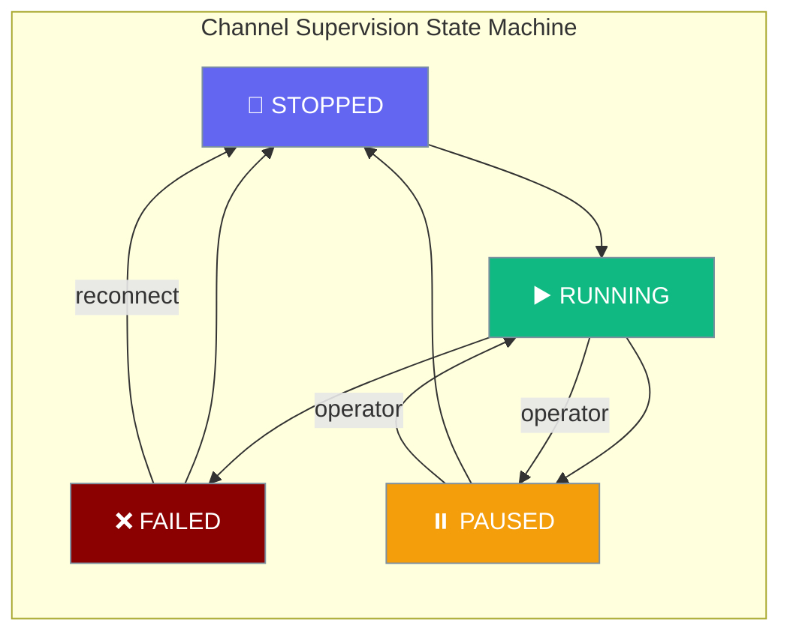
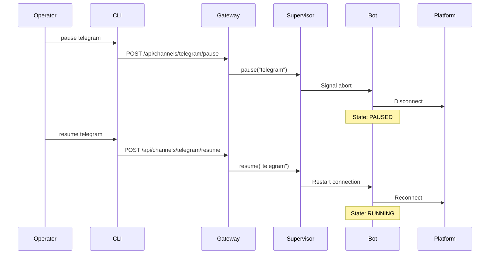
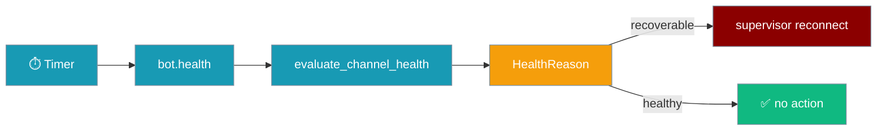
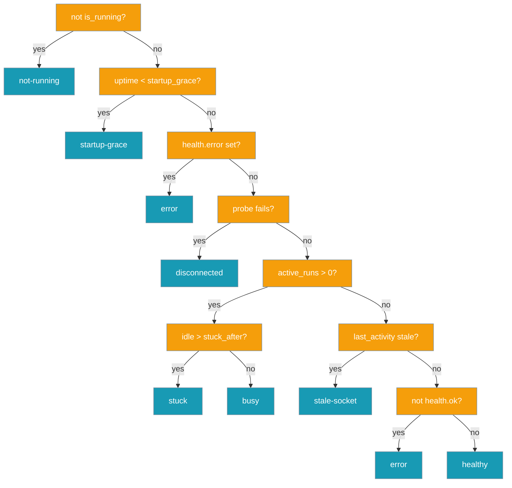
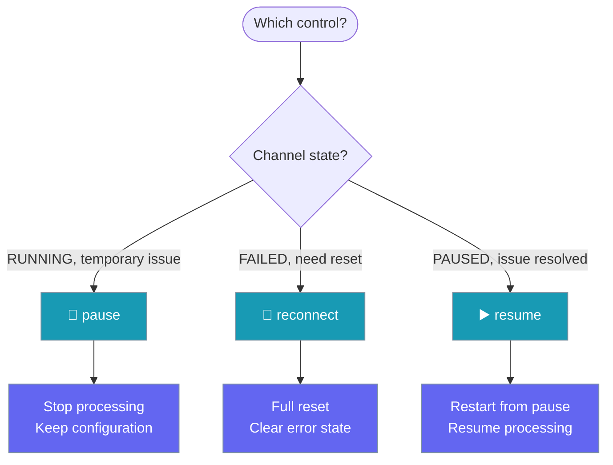

Channel supervision keeps gateway bots alive through network outages with unlimited retries and operator-level pause / resume / reconnect controls.

```yaml
# gateway.yaml — supervision enabled automatically
agents:
  assistant:
    instructions: "You are a helpful AI assistant."
    model: gpt-4o-mini

channels:
  telegram:
    token: "${TELEGRAM_BOT_TOKEN}"
    platform: telegram
```



## Quick Start

Channel supervision is automatically enabled for all gateway channels configured in `gateway.yaml`. No additional setup is required.

<Steps>
<Step title="Basic Gateway Setup">
Create a simple gateway with supervision:

```yaml
# gateway.yaml
agents:
  assistant:
    instructions: "You are a helpful AI assistant."
    model: "gpt-4o-mini"

channels:
  telegram:
    token: "${TELEGRAM_BOT_TOKEN}"
    platform: telegram
```

```bash
praisonai gateway start --config gateway.yaml
```

The `telegram` channel is now under supervision with unlimited retry capability.
</Step>

<Step title="Control Channel Operations">
Pause a problematic channel while investigating issues:

```bash
praisonai gateway pause telegram
```

Resume when ready:

```bash
praisonai gateway resume telegram
```

Force reconnect to reset error state:

```bash
praisonai gateway reconnect telegram
```
</Step>
</Steps>

---

## How It Works

Channel supervision provides resilient error handling through error classification and unlimited retries:



| Component | Responsibility |
|-----------|----------------|
| **ChannelSupervisor** | Manages channel lifecycle and error handling |
| **BackoffPolicy** | Controls retry timing with capped exponential backoff |
| **Error Classification** | Determines if errors are recoverable, fatal, or conflict |
| **Operator Controls** | Provides manual pause/resume/reconnect capabilities |

---

## Channel States

The supervision system tracks four distinct channel states:

| State | Description | Auto-Retry | Operator Actions |
|-------|-------------|------------|------------------|
| `RUNNING` | Channel is actively connected and serving messages | N/A | pause, reconnect |
| `FAILED` | Fatal error occurred (e.g., Telegram conflict, invalid token) | ❌ No | reconnect only |
| `PAUSED` | Manually paused by operator | ❌ No | resume, reconnect |
| `STOPPED` | Clean shutdown or initial state | ❌ No | Automatic restart |

<Note>
Proactive health monitoring can move a channel from `RUNNING` into a restart cycle without a raised exception — for example when transport activity goes stale (`stale-socket`) or a probe fails (`disconnected`).
</Note>

---

## Proactive Health Monitoring

The health monitor periodically asks each channel "Are you really alive?" and restarts the ones that aren't, without waiting for an exception to be raised.



### Enable via YAML

```yaml
gateway:
  host: 127.0.0.1
  port: 8765
  health:
    interval: 300            # seconds between sweeps (default 300)
    startup_grace: 60        # grace window after start (default 60)
    stale_after: 120         # no inbound activity (idle) → stale-socket (default 120)
    stuck_after: 900         # busy with no progress → stuck (default 900)
    max_restarts_per_hour: 10
    enabled: true            # default true
```

### Enable via Python

```python
from praisonai.gateway.health_monitor import HealthMonitorConfig
from praisonai.gateway.supervisor import ChannelSupervisor

health_config = HealthMonitorConfig(interval=120, stale_after=180)
supervisor = ChannelSupervisor(health_config=health_config)
```

### Configuration Options

| Option | Type | Default | Description |
|--------|------|---------|-------------|
| `interval` | `float` | `300.0` | Seconds between health sweeps |
| `startup_grace` | `float` | `60.0` | Seconds after start before checks count |
| `stale_after` | `float` | `120.0` | Seconds without **inbound** transport activity (while idle) → `stale-socket` |
| `stuck_after` | `float` | `900.0` | Seconds a **busy** channel can go without inbound progress → `stuck` |
| `max_restarts_per_hour` | `int` | `10` | Hard cap on restart attempts per channel per hour |
| `enabled` | `bool` | `True` | Whether monitoring is enabled |

### HealthReason values

| Reason | Recoverable | When it fires |
|--------|-------------|---------------|
| `healthy` | No | All checks pass |
| `not-running` | No | `health.is_running` is false |
| `startup-grace` | No | `uptime_seconds < startup_grace` |
| `disconnected` | Yes | `health.probe` exists and `probe.ok` is false |
| `stale-socket` | Yes | Idle and no **inbound** activity for `stale_after` seconds |
| `busy` | **No** | `active_runs > 0` with inbound progress within `stuck_after` — protects long runs from mid-run kills |
| `stuck` | Yes | `active_runs > 0` and no inbound progress for `> stuck_after` — likely wedged |
| `error` | Yes | `health.error` set or `health.ok` is false |

Decision order in `evaluate_channel_health()`:



### Passive inbound liveness

Channel liveness is driven by whether messages are still flowing IN, not just whether the outbound probe (e.g. Telegram `getMe`) succeeds. Every inbound message refreshes the timestamp via `fire_message_received → _note_inbound()`, so a reachable-but-deaf channel will eventually trip `stale-socket` instead of being reported healthy forever. All adapters get this automatically; WhatsApp and Linear are wired explicitly because they bypass the shared handler.

### Run awareness

The evaluator knows about in-flight agent turns (`HealthResult.active_runs`). A busy channel is never killed mid-run — `BUSY` is non-recoverable on purpose. Only when a busy channel has made no inbound progress for `stuck_after` seconds does it escalate to `STUCK` (recoverable).

### Restart guard-rails

- **Startup grace** — no restarts during the first `startup_grace` seconds after connect
- **5-minute cooldown** — implicit cooldown after every restart (logged as `restart cooldown active`)
- **`max_restarts_per_hour`** — when the cap is hit, a warning is logged and the restart is skipped

```
WARNING: channel telegram: max restarts per hour (10) reached, skipping restart
```

### Suspend / resume monitoring

For planned maintenance, suspend health checks on a channel without stopping supervision:

```python
monitor.suspend_channel("telegram")   # skip health sweeps
monitor.resume_channel("telegram")    # resume sweeps
```

---

## Operator Controls

### Pause Channel

Temporarily stop a channel without losing configuration:

<Tabs>
  <Tab title="CLI">
    ```bash
    praisonai gateway pause telegram --url ws://127.0.0.1:8765
    ```
  </Tab>
  <Tab title="REST API">
    ```bash
    curl -X POST http://127.0.0.1:8765/api/channels/telegram/pause \
         -H "Authorization: Bearer YOUR_TOKEN"
    ```
  </Tab>
</Tabs>

**Effect**: Channel enters `PAUSED` state and stops processing messages. Supervision loop waits indefinitely until resumed.

### Resume Channel

Resume a manually paused channel:

<Tabs>
  <Tab title="CLI">
    ```bash
    praisonai gateway resume telegram --url ws://127.0.0.1:8765
    ```
  </Tab>
  <Tab title="REST API">
    ```bash
    curl -X POST http://127.0.0.1:8765/api/channels/telegram/resume \
         -H "Authorization: Bearer YOUR_TOKEN"
    ```
  </Tab>
</Tabs>

**Effect**: Channel transitions from `PAUSED` to `STOPPED`, then automatically restarts to `RUNNING`.

### Reconnect Channel

Force a complete reconnection and reset error state:

<Tabs>
  <Tab title="CLI">
    ```bash
    praisonai gateway reconnect telegram --url ws://127.0.0.1:8765
    ```
  </Tab>
  <Tab title="REST API">
    ```bash
    curl -X POST http://127.0.0.1:8765/api/channels/telegram/reconnect \
         -H "Authorization: Bearer YOUR_TOKEN"
    ```
  </Tab>
</Tabs>

**Effect**: Resets retry counter, clears error history, forces restart. Works from any state including `FAILED`.



---

## Error Classification

The supervision system classifies errors to determine retry behavior:

| Error Type | Examples | Behavior | Recovery |
|------------|----------|----------|----------|
| **Recoverable** | Network timeouts, DNS failures, temporary API errors | Unlimited retry with exponential backoff | Automatic |
| **Conflict** | Telegram "Conflict: terminated by other getUpdates" | Immediate failure, no retry | Manual `reconnect` after stopping duplicate |
| **Non-Recoverable** | Invalid bot token, missing permissions | Immediate failure, no retry | Manual `reconnect` after fixing config |

The retry policy uses capped exponential backoff:
- Initial delay: 5 seconds
- Maximum delay: 300 seconds (5 minutes)  
- Unlimited attempts for recoverable errors
- Jitter added to prevent thundering herd

---

## Monitoring via `/health`

The enhanced health endpoint includes supervision status for each channel:

<Tabs>
  <Tab title="Request">
    ```bash
    curl http://127.0.0.1:8765/health
    ```
  </Tab>
  <Tab title="Response">
    ```json
    {
      "status": "healthy",
      "uptime": 3600,
      "agents": 2,
      "sessions": 5,
      "clients": 3,
      "channels": {
        "telegram": {
          "platform": "telegram",
          "running": true,
          "last_activity": 1672531500,
          "active_runs": 2,
          "supervision": {
            "state": "running",
            "last_error": null,
            "last_error_time": null,
            "next_retry_at": null,
            "total_recoveries": 3,
            "manual_pause": false
          },
          "health_monitor": {
            "enabled": true,
            "running": true,
            "interval": 300,
            "last_check": 1672531200,
            "suspended": false,
            "restart_count": 1,
            "can_restart": true
          }
        },
        "discord": {
          "platform": "discord", 
          "running": false,
          "supervision": {
            "state": "failed",
            "last_error": "Invalid bot token",
            "last_error_time": 1672531200,
            "next_retry_at": null,
            "total_recoveries": 0,
            "manual_pause": false
          }
        }
      }
    }
    ```
  </Tab>
</Tabs>

Key supervision fields:
- `state`: Current channel state (`running`, `failed`, `paused`, `stopped`)
- `last_error`: Most recent error message (if any)
- `last_error_time`: Unix timestamp of last error
- `next_retry_at`: Unix timestamp of next retry attempt (if scheduled)
- `total_recoveries`: Count of successful recoveries from errors
- `manual_pause`: Whether channel is manually paused by operator
- `active_runs`: Number of in-flight agent turns (busy count)
- `last_activity`: Unix timestamp of last **inbound** transport activity (used for `stale-socket` and `stuck` detection)
- `health_monitor.enabled`: Whether proactive monitoring is active
- `health_monitor.restart_count`: Restarts in the current hour
- `health_monitor.can_restart`: Whether guard-rails allow another restart

---

## Best Practices

<AccordionGroup>
<Accordion title="When to pause vs reconnect">
Use **pause** for temporary investigations while keeping the channel configuration intact. Use **reconnect** when you need to reset error state after fixing underlying issues like network connectivity or API tokens.
</Accordion>

<Accordion title="Reading total_recoveries as a churn signal">  
High `total_recoveries` counts indicate frequent connection issues. Monitor this metric to identify unstable network conditions or platform-specific problems that may require infrastructure changes.
</Accordion>

<Accordion title="Hooking /health into monitoring systems">
The `/health` endpoint is designed for integration with Prometheus, Datadog, or other monitoring systems. Set up alerts on `state: "failed"` and track `total_recoveries` trends to detect degrading connection quality.
</Accordion>

<Accordion title="Recovering from FAILED state">
Channels in `FAILED` state require manual intervention. Use `reconnect` (not `resume`) to reset the error state and attempt a fresh connection. Always investigate the `last_error` to address root cause issues before reconnecting.
</Accordion>

<Accordion title="Tuning interval and stale_after for chatty vs quiet channels">
Low-traffic channels need a larger `stale_after` (e.g. 600s) to avoid false `stale-socket` restarts. Chatty channels can use the default 120s.
</Accordion>

<Accordion title="Tuning stuck_after for long-running agent turns">
If your agent regularly runs turns longer than 15 minutes (deep research, long tool chains), raise `stuck_after` so genuine progress isn't classified as wedged. The default 900s covers most chat and triage workloads.
</Accordion>

<Accordion title="When to set max_restarts_per_hour low">
When the upstream API is rate-limited, restart storms make the problem worse. Lower the cap (e.g. 3) so the guard-rail surfaces the issue in logs instead of hammering the API.
</Accordion>
</AccordionGroup>

---

## Related

<CardGroup cols={2}>
<Card title="Gateway CLI" icon="tower-broadcast" href="/docs/features/gateway-cli">
  Complete CLI reference for gateway management
</Card>
<Card title="Gateway Error Handling" icon="triangle-exclamation" href="/docs/features/gateway-error-handling">
  Error handling strategies for gateway bots
</Card>
<Card title="BotOS" icon="robot" href="/docs/features/botos">
  Multi-platform orchestrator with the same supervision and health monitoring
</Card>
</CardGroup>