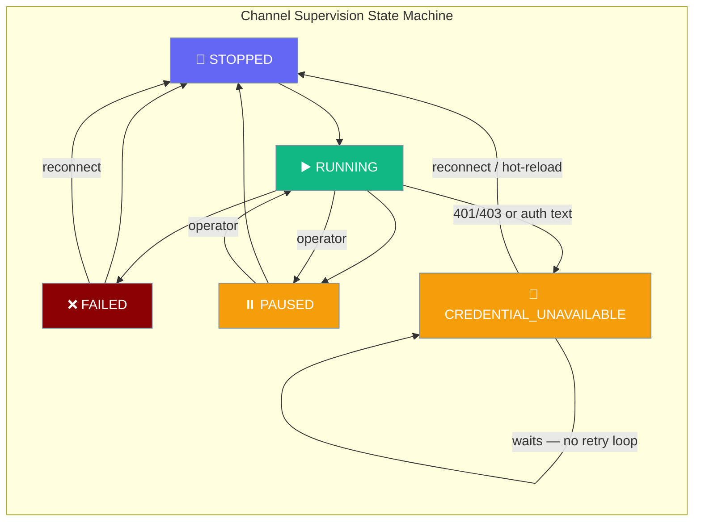
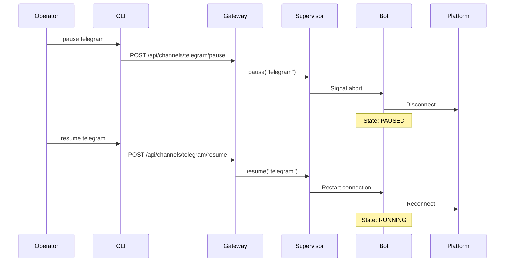
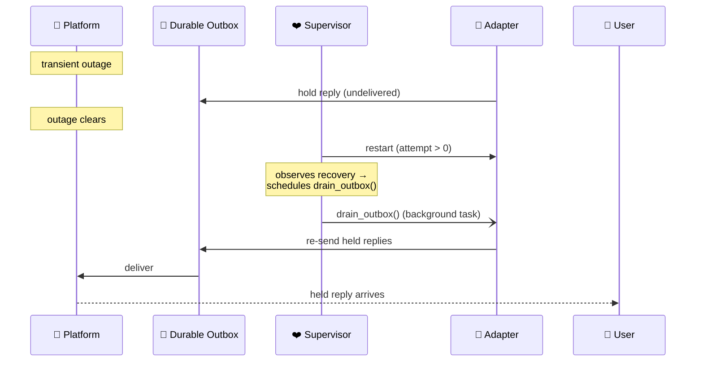
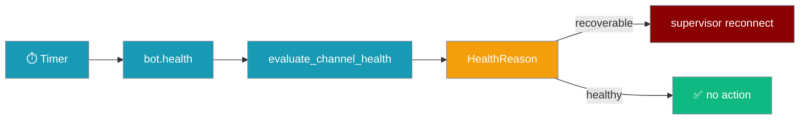
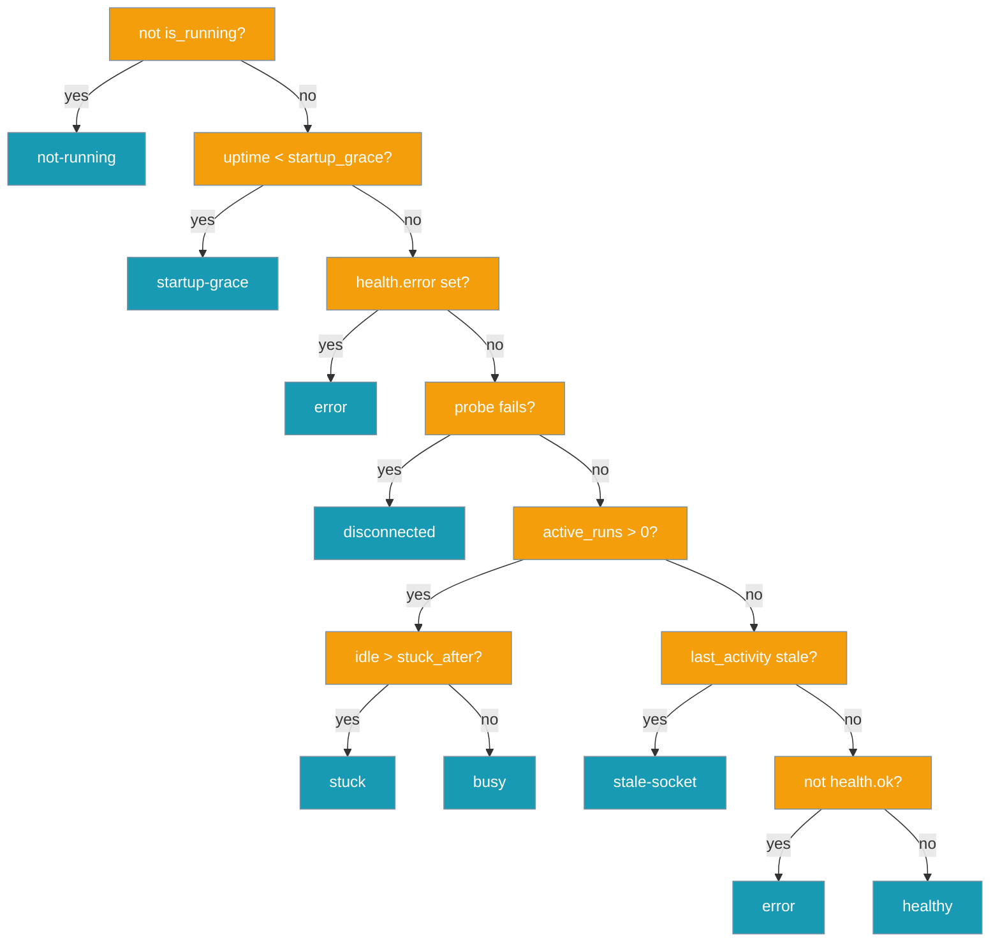
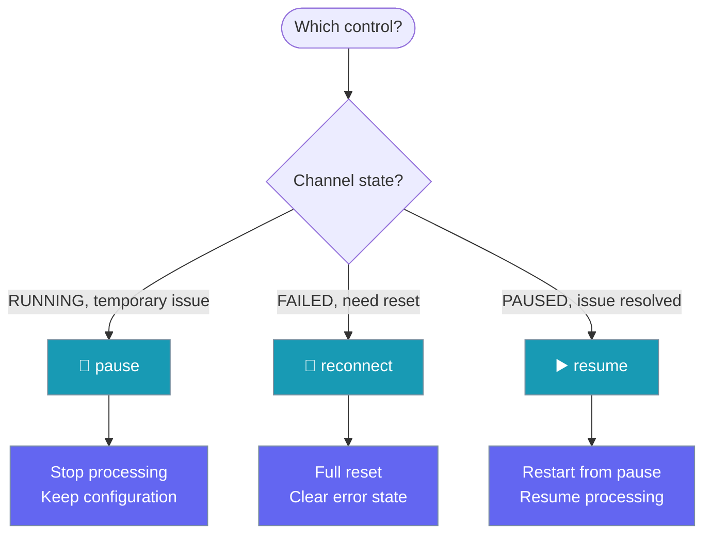
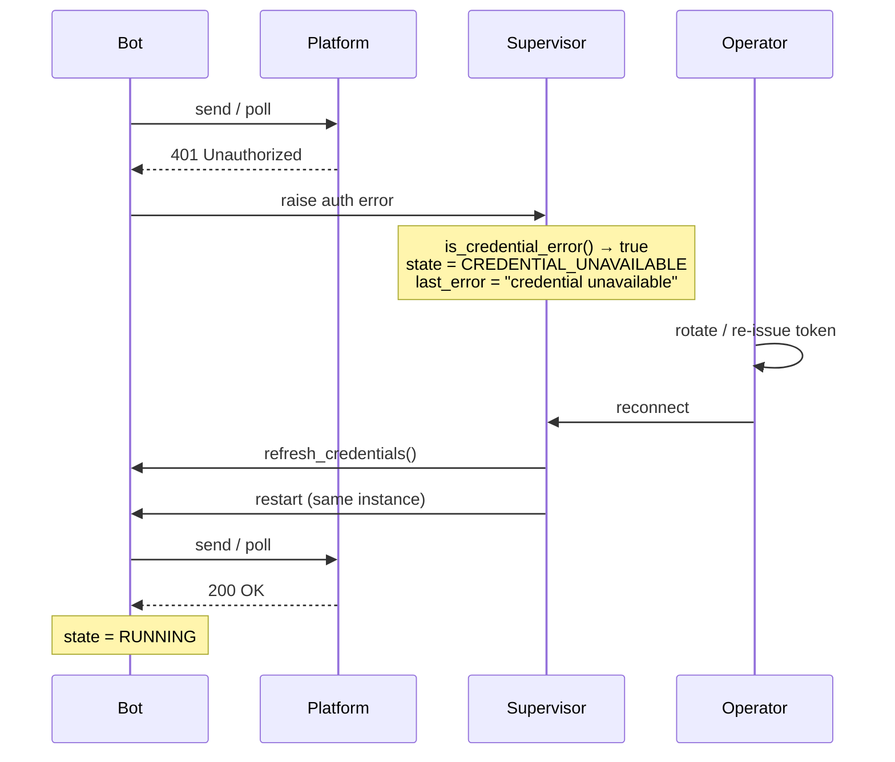

<Note>
The gateway now ships in the `praisonai-bot` package. `praisonai serve gateway` still works exactly as documented here; for a standalone install see [praisonai-bot Migration](/guides/praisonai-bot-migration).
</Note>


```python
from praisonaiagents import Agent

agent = Agent(name="supervisor", instructions="Supervise messages across gateway channels.")
agent.start("Monitor all channels and flag inappropriate content.")
```

Channel supervision keeps gateway bots alive through network outages with unlimited retries and operator-level pause / resume / reconnect controls. Channels with bad or expired tokens never reach the supervisor — `praisonai gateway start --preflight` (default on) aborts before launch when a credential probe fails; see [Pre-flight credential check](/docs/features/gateway-cli#pre-flight-credential-check). Similarly, `praisonai gateway start --strict-tools` (default on) aborts before launch when any tool named in the config cannot be resolved; see [Pre-flight tool check](/docs/features/gateway-cli#pre-flight-tool-check).

```yaml
# gateway.yaml — supervision enabled automatically
agents:
  assistant:
    instructions: "You are a helpful AI assistant."
    model: gpt-4o-mini

channels:
  telegram:
    token: "${TELEGRAM_BOT_TOKEN}"
    platform: telegram
```


The user messages the bot on Telegram; channel supervision reconnects the channel after network blips without operator intervention.


```mermaid
graph LR
    subgraph "Channel Supervision State Machine"
        STOPPED[🛑 STOPPED] --> RUNNING[▶️ RUNNING]
        RUNNING --> FAILED[❌ FAILED]
        RUNNING --> PAUSED[⏸️ PAUSED]
        RUNNING -->|401/403 or auth text| CRED[🔑 CREDENTIAL_UNAVAILABLE]
        FAILED --> STOPPED
        PAUSED --> STOPPED
        CRED -->|reconnect / hot-reload| STOPPED
        CRED -->|waits — no retry loop| CRED

        RUNNING -->|operator| PAUSED
        PAUSED -->|operator| RUNNING
        FAILED -->|reconnect| STOPPED
    end
    
    classDef running fill:#10B981,stroke:#7C90A0,color:#fff
    classDef failed fill:#8B0000,stroke:#7C90A0,color:#fff
    classDef paused fill:#F59E0B,stroke:#7C90A0,color:#fff
    classDef stopped fill:#6366F1,stroke:#7C90A0,color:#fff
    classDef cred fill:#F59E0B,stroke:#7C90A0,color:#fff
    
    class RUNNING running
    class FAILED failed
    class PAUSED paused
    class STOPPED stopped
    class CRED cred
```

## Quick Start

Channel supervision is automatically enabled for all gateway channels configured in `gateway.yaml`. No additional setup is required.

<Steps>
<Step title="Basic Gateway Setup">
Create a simple gateway with supervision:

```yaml
# gateway.yaml
agents:
  assistant:
    instructions: "You are a helpful AI assistant."
    model: "gpt-4o-mini"

channels:
  telegram:
    token: "${TELEGRAM_BOT_TOKEN}"
    platform: telegram
```

```bash
praisonai gateway start --config gateway.yaml
```

The `telegram` channel is now under supervision with unlimited retry capability.
</Step>

<Step title="Control Channel Operations">
Pause a problematic channel while investigating issues:

```bash
praisonai gateway pause telegram
```

Resume when ready:

```bash
praisonai gateway resume telegram
```

Force reconnect to reset error state:

```bash
praisonai gateway reconnect telegram
```
</Step>
</Steps>

---

## How It Works

Channel supervision provides resilient error handling through error classification and unlimited retries:


```mermaid
sequenceDiagram
    participant Operator
    participant CLI
    participant Gateway
    participant Supervisor
    participant Bot
    participant Platform

    Operator->>CLI: pause telegram
    CLI->>Gateway: POST /api/channels/telegram/pause
    Gateway->>Supervisor: pause("telegram")
    Supervisor->>Bot: Signal abort
    Bot->>Platform: Disconnect
    Note over Bot: State: PAUSED
    
    Operator->>CLI: resume telegram
    CLI->>Gateway: POST /api/channels/telegram/resume
    Gateway->>Supervisor: resume("telegram")
    Supervisor->>Bot: Restart connection
    Bot->>Platform: Reconnect
    Note over Bot: State: RUNNING
```

| Component | Responsibility |
|-----------|----------------|
| **ChannelSupervisor** | Manages channel lifecycle and error handling |
| **BackoffPolicy** | Controls retry timing with capped exponential backoff |
| **Error Classification** | Determines if errors are recoverable, fatal, or conflict |
| **Operator Controls** | Provides manual pause/resume/reconnect capabilities |

---

## Channel States

The supervision system tracks five distinct channel states:

| State | Description | Auto-Retry | Operator Actions |
|-------|-------------|------------|------------------|
| `RUNNING` | Channel is actively connected and serving messages | N/A | pause, reconnect |
| `FAILED` | Fatal error occurred (e.g., Telegram conflict, unexpected programming error) | ❌ No | reconnect only |
| `PAUSED` | Manually paused by operator | ❌ No | resume, reconnect |
| `STOPPED` | Clean shutdown or initial state | ❌ No | Automatic restart |
| `CREDENTIAL_UNAVAILABLE` | Runtime credential rejection (401/403, revoked/rotated/expired token). Parked — the supervisor stops hammering the bad token. | ❌ No (waits) | `reconnect` (after fixing token) or a config hot-reload |

<Note>
Proactive health monitoring can move a channel from `RUNNING` into a restart cycle without a raised exception — for example when transport activity goes stale (`stale-socket`) or a probe fails (`disconnected`).
</Note>

---

## Recovery-triggered outbox re-drain

When a channel transitions back to `RUNNING` after a recoverable failure (`monitor.attempt > 0`), the supervisor schedules a background re-drain of the durable outbox so held replies go out promptly.


```mermaid
sequenceDiagram
    participant Platform as 📱 Platform
    participant Outbox as 💾 Durable Outbox
    participant Supervisor as ❤️ Supervisor
    participant Adapter as 📡 Adapter
    participant User as 👤 User

    Note over Platform: transient outage
    Adapter->>Outbox: hold reply (undelivered)
    Note over Platform: outage clears
    Supervisor->>Adapter: restart (attempt > 0)
    Note over Supervisor: observes recovery →<br/>schedules drain_outbox()
    Supervisor-)Adapter: drain_outbox() (background task)
    Adapter->>Outbox: re-send held replies
    Outbox->>Platform: deliver
    Platform-->>User: held reply arrives
```

- **Non-blocking** — scheduled with `asyncio.create_task(...)`, so supervision never waits on the re-drain.
- **Silent no-op without a hook** — the supervisor resolves `drain_outbox` on the supervised object first, then on `bot.adapter`. Bots/adapters without the hook are skipped.
- **Best-effort** — a failed re-drain is logged at `WARNING` and swallowed; the outbox's attempt-and-age policy still governs those messages.
- **Recovery only** — a **clean first start does not trigger it**; only a real recovery (at least one recoverable failure) does.

<Note>
`_on_channel_recovered` is an internal `ChannelSupervisor` method — this behaviour is automatic. There is no new config knob, YAML key, or export to wire up.
</Note>

Cross-references: [Durable Delivery → When the Outbox Drains](/features/durable-delivery#when-the-outbox-drains) (all three drain triggers) and [Outbound Resilience → Automatic crash-recovery on start](/features/outbound-resilience#automatic-crash-recovery-on-start) (the separate boot-time DLQ drainer).

Introduced in [PraisonAI PR #4046](https://github.com/MervinPraison/PraisonAI/pull/4046) (fixes [#4043](https://github.com/MervinPraison/PraisonAI/issues/4043)).

---

## Proactive Health Monitoring

The health monitor periodically asks each channel "Are you really alive?" and restarts the ones that aren't, without waiting for an exception to be raised.


```mermaid
graph LR
    Timer[⏱️ Timer] --> Health[bot.health]
    Health --> Eval[evaluate_channel_health]
    Eval --> Reason[HealthReason]
    Reason -->|recoverable| Restart[supervisor reconnect]
    Reason -->|healthy| OK[✅ no action]

    classDef process fill:#189AB4,stroke:#7C90A0,color:#fff
    classDef decision fill:#F59E0B,stroke:#7C90A0,color:#fff
    classDef action fill:#8B0000,stroke:#7C90A0,color:#fff
    classDef ok fill:#10B981,stroke:#7C90A0,color:#fff

    class Timer,Health,Eval process
    class Reason decision
    class Restart action
    class OK ok
```

### Enable via YAML

```yaml
gateway:
  host: 127.0.0.1
  port: 8765
  health:
    interval: 300            # seconds between sweeps (default 300)
    startup_grace: 60        # grace window after start (default 60)
    stale_after: 120         # no inbound activity (idle) → stale-socket (default 120)
    stuck_after: 900         # busy with no progress (inbound OR in-run) → stuck (default 900)
    max_restarts_per_hour: 10        # per channel
    # Fleet-level crash-loop breaker (aggregate across channels):
    fleet_restarts_per_hour: 40      # int >= 1 (default 40)
    failing_channel_fraction: 0.5    # float in (0.0, 1.0] (default 0.5)
    breaker_cooldown_s: 120          # float >= 0 (default 120)
    enabled: true            # default true
```

### Enable via Python

```python
from praisonai.gateway.health_monitor import HealthMonitorConfig
from praisonai.gateway.supervisor import ChannelSupervisor

health_config = HealthMonitorConfig(interval=120, stale_after=180)
supervisor = ChannelSupervisor(health_config=health_config)
```

### Configuration Options

| Option | Type | Default | Description |
|--------|------|---------|-------------|
| `interval` | `float` | `300.0` | Seconds between health sweeps |
| `startup_grace` | `float` | `60.0` | Seconds after start before checks count |
| `stale_after` | `float` | `120.0` | Seconds without **inbound** transport activity (while idle) → `stale-socket` |
| `stuck_after` | `float` | `900.0` | Seconds a **busy** channel can go without **any progress signal** (inbound transport activity OR in-run progress — tool calls, streamed tokens, emitter events) → `stuck` |
| `max_restarts_per_hour` | `int` | `10` | Hard cap on restart attempts per channel per hour |
| `fleet_restarts_per_hour` | `int` | `40` | Aggregate restart-rate window across the whole fleet (`>= 1`) — see [Fleet-level breaker](/features/gateway-crash-loop-guard#fleet-level-breaker) |
| `failing_channel_fraction` | `float` | `0.5` | Trip the fleet breaker when this fraction of channels is failing/parked (`0.0 < x <= 1.0`) |
| `breaker_cooldown_s` | `float` | `120.0` | Hold channel restarts this long once the fleet breaker trips, then re-arm (`>= 0`) |
| `enabled` | `bool` | `True` | Whether monitoring is enabled |

<Note>
`HealthMonitorConfig.from_dict` **defensively parses** the three fleet keys — a bad value clamps or falls back to the default instead of raising, matching the other numeric keys.
</Note>

### HealthReason values

| Reason | Recoverable | When it fires |
|--------|-------------|---------------|
| `healthy` | No | All checks pass |
| `not-running` | No | `health.is_running` is false |
| `startup-grace` | No | `uptime_seconds < startup_grace` |
| `disconnected` | Yes | `health.probe` exists and `probe.ok` is false |
| `stale-socket` | Yes | Idle and no **inbound** activity for `stale_after` seconds |
| `busy` | **No** | `active_runs > 0` with progress within `stuck_after` — protects long runs from mid-run kills |
| `stuck` | Yes | `active_runs > 0` and no progress (inbound or in-run) for `> stuck_after` — likely wedged |
| `error` | Yes | `health.error` set or `health.ok` is false |

Decision order in `evaluate_channel_health()`:


```mermaid
graph TB
    A[not is_running?] -->|yes| NR[not-running]
    A -->|no| B[uptime < startup_grace?]
    B -->|yes| SG[startup-grace]
    B -->|no| C[health.error set?]
    C -->|yes| E[error]
    C -->|no| D[probe fails?]
    D -->|yes| DC[disconnected]
    D -->|no| R[active_runs > 0?]
    R -->|yes| RS[idle > stuck_after?]
    RS -->|yes| ST[stuck]
    RS -->|no| BS[busy]
    R -->|no| F[last_activity stale?]
    F -->|yes| SS[stale-socket]
    F -->|no| G[not health.ok?]
    G -->|yes| E2[error]
    G -->|no| H[healthy]

    classDef check fill:#F59E0B,stroke:#7C90A0,color:#fff
    classDef result fill:#189AB4,stroke:#7C90A0,color:#fff
    class A,B,C,D,F,G,R,RS check
    class NR,SG,E,DC,SS,E2,H,ST,BS result
```

### Passive inbound liveness

Channel liveness is driven by whether messages are still flowing IN, not just whether the outbound probe (e.g. Telegram `getMe`) succeeds. Every inbound message refreshes the timestamp via `fire_message_received → _note_inbound()`, so a reachable-but-deaf channel will eventually trip `stale-socket` instead of being reported healthy forever. All adapters get this automatically; WhatsApp and Linear are wired explicitly because they bypass the shared handler.

### Run awareness

The evaluator knows about in-flight agent turns (`HealthResult.active_runs`) **and tracks per-run progress** (`HealthResult.last_run_progress`, refreshed on tool calls, streamed tokens, and agent emitter events). A busy channel is never killed mid-run — `BUSY` is non-recoverable on purpose. Only when a busy channel has made **no progress at all** (neither inbound transport activity nor in-run progress) for `stuck_after` seconds does it escalate to `STUCK` (recoverable). An actively-streaming long agent turn stays `BUSY` indefinitely; a genuinely-hung turn that emits nothing for `stuck_after` is still correctly flagged `STUCK`.

<Note>
Before praisonaiagents 1.6.82, only inbound transport activity counted toward progress, so a single long agent turn (deep research, big refactor, slow model) was classified `STUCK` once it crossed `stuck_after` — even while actively streaming. The protocol now honours in-run progress (`HealthResult.last_run_progress`), so progressing long runs stay `BUSY` indefinitely. See [PraisonAI #2400](https://github.com/MervinPraison/PraisonAI/pull/2400).
</Note>

### Restart guard-rails

- **Startup grace** — no restarts during the first `startup_grace` seconds after connect
- **5-minute cooldown** — implicit cooldown after every restart (logged as `restart cooldown active`)
- **`max_restarts_per_hour`** — when the cap is hit, a warning is logged and the restart is skipped
- **[Crash-Loop Guard](/features/gateway-crash-loop-guard)** — a *rapid-fire* breaker (seconds window) that runs around the supervisor loop and halts auto-resume after a burst of crash-on-resume restarts, complementing the per-hour cap
- **[Fleet-level breaker](/features/gateway-crash-loop-guard#fleet-level-breaker)** — an *aggregate* breaker (`fleet_restarts_per_hour`, `failing_channel_fraction`, `breaker_cooldown_s`) that trips **once** when a systemic fault restarts every channel at the same time, instead of each channel silently burning its own budget

```
WARNING: channel telegram: max restarts per hour (10) reached, skipping restart
```

### Fleet breaker status

`get_status()` (surfaced by `gateway status` and `/health`) includes a `fleet` block so operators can see the aggregate breaker at a glance:

```json
{
  "enabled": true,
  "running": true,
  "interval": 300,
  "channels": { "telegram": { "restart_count": 4, "can_restart": false } },
  "fleet": {
    "breaker_tripped": true,
    "fleet_restarts_per_hour": 40,
    "failing_channels": 2,
    "total_channels": 3
  }
}
```

`breaker_tripped: true` means restarts are being held fleet-wide; the same event records one `gateway`/`fleet` entry on the [Degraded-Capability Registry](/features/gateway-degraded-capabilities). See [Fleet-level breaker](/features/gateway-crash-loop-guard#fleet-level-breaker) for the full model.

### Suspend / resume monitoring

For planned maintenance, suspend health checks on a channel without stopping supervision:

```python
monitor.suspend_channel("telegram")   # skip health sweeps
monitor.resume_channel("telegram")    # resume sweeps
```

---

## Operator Controls

### Pause Channel

Temporarily stop a channel without losing configuration:

<Tabs>
  <Tab title="CLI">
    ```bash
    praisonai gateway pause telegram --url ws://127.0.0.1:8765
    ```
  </Tab>
  <Tab title="REST API">
    ```bash
    curl -X POST http://127.0.0.1:8765/api/channels/telegram/pause \
         -H "Authorization: Bearer YOUR_TOKEN"
    ```
  </Tab>
</Tabs>

**Effect**: Channel enters `PAUSED` state and stops processing messages. Supervision loop waits indefinitely until resumed.

### Resume Channel

Resume a manually paused channel:

<Tabs>
  <Tab title="CLI">
    ```bash
    praisonai gateway resume telegram --url ws://127.0.0.1:8765
    ```
  </Tab>
  <Tab title="REST API">
    ```bash
    curl -X POST http://127.0.0.1:8765/api/channels/telegram/resume \
         -H "Authorization: Bearer YOUR_TOKEN"
    ```
  </Tab>
</Tabs>

**Effect**: Channel transitions from `PAUSED` to `STOPPED`, then automatically restarts to `RUNNING`.

### Reconnect Channel

Force a complete reconnection and reset error state:

<Tabs>
  <Tab title="CLI">
    ```bash
    praisonai gateway reconnect telegram --url ws://127.0.0.1:8765
    ```
  </Tab>
  <Tab title="REST API">
    ```bash
    curl -X POST http://127.0.0.1:8765/api/channels/telegram/reconnect \
         -H "Authorization: Bearer YOUR_TOKEN"
    ```
  </Tab>
</Tabs>

**Effect**: Resets retry counter, clears error history, forces restart. Works from any state including `FAILED`.


```mermaid
graph TD
    Start([Which control?]) --> Question{Channel state?}
    Question -->|RUNNING, temporary issue| Pause[👤 pause]
    Question -->|FAILED, need reset| Reconnect[🔄 reconnect]  
    Question -->|PAUSED, issue resolved| Resume[▶️ resume]
    
    Pause --> PauseDesc[Stop processing<br/>Keep configuration]
    Resume --> ResumeDesc[Restart from pause<br/>Resume processing]
    Reconnect --> ReconnectDesc[Full reset<br/>Clear error state]
    
    classDef action fill:#189AB4,stroke:#7C90A0,color:#fff
    classDef desc fill:#6366F1,stroke:#7C90A0,color:#fff
    
    class Pause,Resume,Reconnect action
    class PauseDesc,ResumeDesc,ReconnectDesc desc
```

---

## Error Classification

The supervision system classifies errors to determine retry behavior:

| Error Type | Examples | Behavior | Recovery |
|------------|----------|----------|----------|
| **Recoverable** | Network timeouts, DNS failures, temporary API errors | Unlimited retry with exponential backoff | Automatic |
| **Conflict** | Telegram "Conflict: terminated by other getUpdates" | Immediate failure, no retry | Manual `reconnect` after stopping duplicate |
| **Credential / Auth Rejection** ([`SendErrorKind.AUTH_FATAL`](/features/send-error-taxonomy)) | HTTP 401, Slack `invalid_auth` / `token_revoked` / `not_authed`, "unauthorized", "invalid token", "expired token", "invalid credentials", "invalid api key" | Park in `CREDENTIAL_UNAVAILABLE`, no retry, redacted `last_error = "credential unavailable"` | Automatic on `reconnect()` / hot-reload / `refresh_credentials()` — **no process restart** |
| **Permanent Target** ([`SendErrorKind.FORBIDDEN`](/features/send-error-taxonomy) / [`TARGET_NOT_FOUND`](/features/send-error-taxonomy)) | HTTP 403/404/410, "bot was kicked", "chat not found", "peer_id_invalid" | Short-circuit the retry loop, [mark the target dead](/features/dead-target-registry) by kind | Automatic self-heal when a later send succeeds |
| **Non-Recoverable** | Unexpected programming errors, missing permissions | Immediate failure, no retry | Manual `reconnect` after fixing config |

The retry policy uses capped exponential backoff:
- Initial delay: 5 seconds
- Maximum delay: 300 seconds (5 minutes)  
- Unlimited attempts for recoverable errors
- Jitter added to prevent thundering herd

---

## Runtime credential rejection

A mid-flight 401/403 or revoked-token error is its own outcome — the channel parks in `CREDENTIAL_UNAVAILABLE`, not `FAILED`.

`FAILED` is terminal and assumes a full process restart is needed. A credential rejection is different: it self-heals the moment the operator fixes the token, so the supervisor stops hammering the invalid token and waits — it does **not** loop-retry — until a `reconnect()`, `resume()`, or config hot-reload wakes it, then restarts the **same bot instance** without a process restart.

This is the runtime counterpart of the boot-time case documented on [Degraded Channel Isolation](/features/gateway-degraded-channels): boot-time = an empty token at config load; runtime = a valid-looking token the platform rejected while the channel was live. Both surface identically as `status: "degraded", reason: "credential unavailable"`.


```mermaid
sequenceDiagram
    participant Bot
    participant Platform
    participant Supervisor
    participant Operator

    Bot->>Platform: send / poll
    Platform-->>Bot: 401 Unauthorized
    Bot->>Supervisor: raise auth error
    Note over Supervisor: is_credential_error() → true<br/>state = CREDENTIAL_UNAVAILABLE<br/>last_error = "credential unavailable"
    Operator->>Operator: rotate / re-issue token
    Operator->>Supervisor: reconnect
    Supervisor->>Bot: refresh_credentials()
    Supervisor->>Bot: restart (same instance)
    Bot->>Platform: send / poll
    Platform-->>Bot: 200 OK
    Note over Bot: state = RUNNING
```

<Note>
`last_error` is **always** the literal string `"credential unavailable"` — never the token, never the raw exception message. Operator dashboards can display `last_error` verbatim with no risk of leaking a secret.
</Note>

### Recovering from CREDENTIAL_UNAVAILABLE

<Steps>
<Step title="Fix the credential">
Rotate the env var, refresh the mounted secret file, or re-issue the OAuth token so a fresh, valid credential is available.
</Step>

<Step title="Trigger recovery">
Any of three paths wakes the parked channel:

- **Config hot-reload** — rebuilds the bot with the new token; the reload's abort signal wakes the parked channel. See [Gateway Hot Reload](/features/gateway-hot-reload).
- **`praisonai gateway reconnect <channel>`** — enough when the token lives in an env var (base `Bot.start()` re-reads env-var tokens on restart) or when the bot implements `refresh_credentials()`.
- **`praisonai gateway resume <channel>`** — only if you had also paused it; the `manual_pause` flag is orthogonal to the credential state.
</Step>

<Step title="Verify recovery">
Check `GET /health`: the channel's `status` returns to `running` and it drops out of any `degraded` view.
</Step>
</Steps>

### Implementing `refresh_credentials()` on custom bots

A bot can opt in to re-sourcing its token on wake by exposing a `refresh_credentials()` method — the only new API surface bot authors need for this feature.

```python
from praisonai_bot.bots import Bot  # existing base class

# `my_secret_manager` is illustrative — swap in your own client.
class MySecretManagerBot(Bot):
    async def refresh_credentials(self):
        self._token = await my_secret_manager.rotate(self.platform)
```

- **Duck-typed** — subclassing `Bot` is optional; any object with a callable `refresh_credentials` attribute works.
- **Sync or async** — the supervisor `await`s coroutines.
- **Best-effort** — a raising hook logs a warning and the restart proceeds anyway; if the credential is still bad the channel simply re-parks, so there is no infinite loop.
- **When you need it** — only when your credential lives outside env vars / mounted files and cannot be picked up by a hot-reload or by `Bot.start()` re-reading env vars. Most operators do not need this.

---

## Monitoring via `/health`

The enhanced health endpoint includes supervision status for each channel:

<Tabs>
  <Tab title="Request">
    ```bash
    curl http://127.0.0.1:8765/health
    ```
  </Tab>
  <Tab title="Response">
    ```json
    {
      "status": "healthy",
      "uptime": 3600,
      "agents": 2,
      "sessions": 5,
      "clients": 3,
      "channels": {
        "telegram": {
          "platform": "telegram",
          "running": true,
          "last_activity": 1672531500,
          "active_runs": 2,
          "supervision": {
            "state": "running",
            "last_error": null,
            "last_error_time": null,
            "next_retry_at": null,
            "total_recoveries": 3,
            "manual_pause": false
          },
          "health_monitor": {
            "enabled": true,
            "running": true,
            "interval": 300,
            "last_check": 1672531200,
            "suspended": false,
            "restart_count": 1,
            "can_restart": true
          }
        },
        "discord": {
          "platform": "discord", 
          "running": false,
          "supervision": {
            "state": "failed",
            "last_error": "Fatal error: unexpected programming error",
            "last_error_time": 1672531200,
            "next_retry_at": null,
            "total_recoveries": 0,
            "manual_pause": false
          }
        },
        "slack": {
          "platform": "slack",
          "running": false,
          "status": "degraded",
          "reason": "credential unavailable",
          "supervision": {
            "state": "credential-unavailable",
            "last_error": "credential unavailable",
            "last_error_time": 1672531200,
            "next_retry_at": null,
            "total_recoveries": 0,
            "manual_pause": false
          }
        }
      }
    }
    ```
  </Tab>
</Tabs>

Key supervision fields:
- `state`: Current channel state (`running`, `failed`, `paused`, `stopped`, `credential-unavailable`)
- `last_error`: Most recent error message (if any)
- `last_error_time`: Unix timestamp of last error
- `next_retry_at`: Unix timestamp of next retry attempt (if scheduled)
- `total_recoveries`: Count of successful recoveries from errors
- `manual_pause`: Whether channel is manually paused by operator
- `active_runs`: Number of in-flight agent turns (busy count)
- `last_activity`: Unix timestamp of last **inbound** transport activity (used for `stale-socket` and `stuck` detection)
- `health_monitor.enabled`: Whether proactive monitoring is active
- `health_monitor.restart_count`: Restarts in the current hour
- `health_monitor.can_restart`: Whether guard-rails allow another restart

---

## Best Practices

<AccordionGroup>
<Accordion title="When to pause vs reconnect">
Use **pause** for temporary investigations while keeping the channel configuration intact. Use **reconnect** when you need to reset error state after fixing underlying issues like network connectivity or API tokens.
</Accordion>

<Accordion title="Reading total_recoveries as a churn signal">  
High `total_recoveries` counts indicate frequent connection issues. Monitor this metric to identify unstable network conditions or platform-specific problems that may require infrastructure changes.
</Accordion>

<Accordion title="Hooking /health into monitoring systems">
The `/health` endpoint is designed for integration with Prometheus, Datadog, or other monitoring systems. Set up alerts on `state: "failed"` and track `total_recoveries` trends to detect degrading connection quality. Prefer alerting on the `status: "degraded"` health-endpoint projection for credential issues — it unifies boot-time and runtime `credential unavailable` cases in one check.
</Accordion>

<Accordion title="Recovering from FAILED state">
Channels in `FAILED` state require manual intervention. Use `reconnect` (not `resume`) to reset the error state and attempt a fresh connection. Always investigate the `last_error` to address root cause issues before reconnecting.

An auth/credential rejection **at runtime** now goes to `CREDENTIAL_UNAVAILABLE` (self-healing), not `FAILED`. If you already alert on `state: "failed"` for token expiry, add `state: "credential-unavailable"` to that alert — or, recommended, alert on the `status: "degraded"` health-endpoint projection instead, which unifies the boot-time and runtime cases.
</Accordion>

<Accordion title="Tuning interval and stale_after for chatty vs quiet channels">
Low-traffic channels need a larger `stale_after` (e.g. 600s) to avoid false `stale-socket` restarts. Chatty channels can use the default 120s.
</Accordion>

<Accordion title="Tuning stuck_after for long-running agent turns">
If your agent regularly runs turns longer than 15 minutes (deep research, long tool chains), raise `stuck_after` so genuine progress isn't classified as wedged. The default 900s covers most chat and triage workloads.
</Accordion>

<Accordion title="When to set max_restarts_per_hour low">
When the upstream API is rate-limited, restart storms make the problem worse. Lower the cap (e.g. 3) so the guard-rail surfaces the issue in logs instead of hammering the API.
</Accordion>
</AccordionGroup>

---

## Related

<CardGroup cols={2}>
<Card title="Degraded Channel Isolation" icon="shield-halved" href="/features/gateway-degraded-channels">
  Boot-time credential-unavailable channels — the same degraded surface as runtime rejection
</Card>
<Card title="Dead Target Registry" icon="shield-x" href="/features/dead-target-registry">
  Suppress permanently-dead channels — bot kicked, chat deleted, account deactivated
</Card>
<Card title="Send Error Taxonomy" icon="shield-alert" href="/features/send-error-taxonomy">
  Structured `SendErrorKind` classification behind auth-fatal and permanent-target outcomes
</Card>
<Card title="Gateway CLI" icon="tower-broadcast" href="/features/gateway-cli">
  Complete CLI reference for gateway management
</Card>
<Card title="Gateway Error Handling" icon="triangle-exclamation" href="/features/gateway-error-handling">
  Error handling strategies for gateway bots
</Card>
<Card title="BotOS" icon="robot" href="/features/botos">
  Multi-platform orchestrator with the same supervision and health monitoring
</Card>
<Card title="Bot Loop Protection" icon="shield-halved" href="/features/bot-loop-protection">
  Break runaway bot-to-bot reply loops — a pure decision protocol like `evaluate_channel_health`
</Card>
</CardGroup>