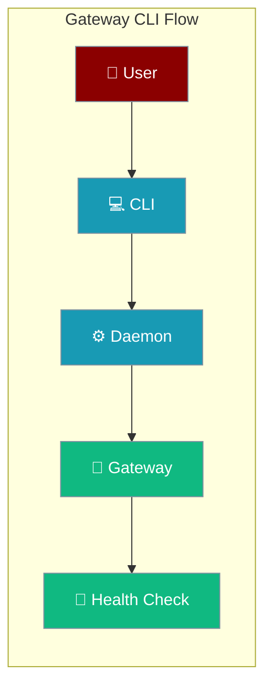

Gateway CLI provides commands for starting, monitoring, and managing the PraisonAI Gateway server and its daemon service.



## Quick Start

<Steps>
<Step title="Start Gateway">
```bash
praisonai gateway start
```
</Step>

<Step title="Check Status">
```bash
praisonai gateway status
```
</Step>

<Step title="Test Health Endpoint">
```bash
curl http://127.0.0.1:8765/health
```
</Step>
</Steps>

---

## Commands

### Gateway Management

| Command | Description | Example |
|---------|-------------|---------|
| `praisonai gateway start` | Start the gateway server | `praisonai gateway start --port 9000` |
| `praisonai gateway status` | Check gateway and daemon status | `praisonai gateway status --daemon-only` |
| `praisonai gateway channels` | List configured channels | `praisonai gateway channels --json` |

### Daemon Service

| Command | Description | Example |
|---------|-------------|---------|
| `praisonai gateway install` | Install as OS daemon | `praisonai gateway install --no-start` |
| `praisonai gateway uninstall` | Remove daemon service | `praisonai gateway uninstall` |
| `praisonai gateway logs` | Show daemon logs | `praisonai gateway logs -n 100` |

### Testing & Debugging

| Command | Description | Example |
|---------|-------------|---------|
| `praisonai gateway send` | Send test message | `praisonai gateway send --channel telegram --channel-id 12345 -m "test"` |

---

## Command Reference

<Tabs>
<Tab title="start">
```bash
praisonai gateway start [OPTIONS]

Options:
  --host TEXT         Host to bind to [default: 127.0.0.1]
  --port INTEGER      Port to listen on [default: 8765]
  --agents TEXT       Path to agent configuration file
  --config TEXT       Path to gateway.yaml for multi-bot mode

Examples:
  praisonai gateway start
  praisonai gateway start --config gateway.yaml
  praisonai gateway start --agents agents.yaml --port 9000
```
</Tab>

<Tab title="status">
```bash
praisonai gateway status [OPTIONS]

Options:
  --host TEXT         Gateway host [default: 127.0.0.1]
  --port INTEGER      Gateway port [default: 8765]
  --daemon-only       Show only daemon status

Examples:
  praisonai gateway status
  praisonai gateway status --port 9000
  praisonai gateway status --daemon-only
```
</Tab>

<Tab title="channels">
```bash
praisonai gateway channels [OPTIONS]

Options:
  -c, --config TEXT   Path to gateway.yaml [default: gateway.yaml]
  --json              Output JSON format

Examples:
  praisonai gateway channels
  praisonai gateway channels --config my-gateway.yaml --json
```
</Tab>
</Tabs>

---

## Status Output Examples

### Healthy Gateway
```bash
$ praisonai gateway status
Daemon service: Running (launchd)
Process ID: 12345
Gateway server: Reachable at http://127.0.0.1:8765/health
  Status: healthy
  Uptime: 3600.5 seconds
  Agents: 2
  Sessions: 1
  Clients: 3
  Channels: 2 configured
```

### Daemon Issues
```bash
$ praisonai gateway status
Daemon service: Installed but not running (launchd)
Gateway not reachable at http://127.0.0.1:8765/health
```

### Not Installed
```bash
$ praisonai gateway status --daemon-only
Daemon service: Not installed (systemd)
```

---

## Platform Support

Gateway CLI works across platforms with native daemon integration:

| Platform | Service Type | Log Location | Management |
|----------|--------------|--------------|------------|
| **macOS** | LaunchAgent | `~/.praisonai/logs/bot-stderr.log` | `launchctl` |
| **Linux** | systemd user service | `journalctl --user -u praisonai` | `systemctl --user` |
| **Windows** | Scheduled Task | Windows Event Log | Task Scheduler |

---

## Configuration Files

<Tabs>
<Tab title="agents.yaml">
```yaml
# Simple agent configuration
agent:
  name: "support"
  instructions: "You are a helpful support agent"
  model: "gpt-4o-mini"
  tools:
    - search_web
  memory: true
```
</Tab>

<Tab title="gateway.yaml">
```yaml
# Multi-bot configuration
agents:
  support:
    instructions: "You are a support agent"
    model: "gpt-4o-mini"
  sales:
    instructions: "You are a sales agent"
    model: "claude-3-5-sonnet-20241022"

channels:
  telegram:
    token: "${TELEGRAM_BOT_TOKEN}"
    routing:
      default: support
  discord:
    token: "${DISCORD_BOT_TOKEN}"
    routing:
      default: sales
```
</Tab>
</Tabs>

---

## Best Practices

<AccordionGroup>
  <Accordion title="Use daemon-only for health checks">
    Use `--daemon-only` flag when monitoring daemon status in scripts or CI/CD pipelines to avoid gateway connection attempts.
  </Accordion>
  
  <Accordion title="Check logs for troubleshooting">
    Always check `praisonai gateway logs` when the daemon is running but gateway is unreachable - this reveals startup errors.
  </Accordion>
  
  <Accordion title="Test channel configuration">
    Use `praisonai gateway send` to test channel bot configuration before deploying to production environments.
  </Accordion>
  
  <Accordion title="Monitor daemon status regularly">
    Set up monitoring that runs `praisonai gateway status --daemon-only` to detect service failures quickly.
  </Accordion>
</AccordionGroup>

---

## Related

<CardGroup cols={2}>
  <Card title="Gateway Server" icon="tower-broadcast" href="/features/gateway">
    Gateway architecture and configuration
  </Card>
  <Card title="Troubleshooting" icon="wrench" href="/guides/troubleshoot-gateway">
    Common gateway issues and solutions
  </Card>
</CardGroup>