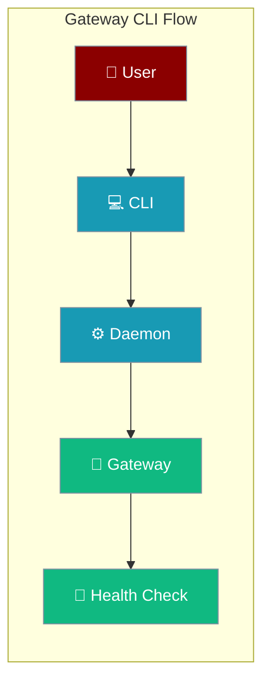
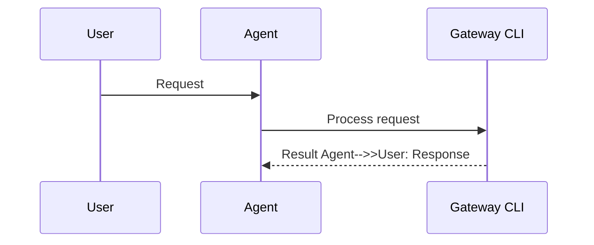
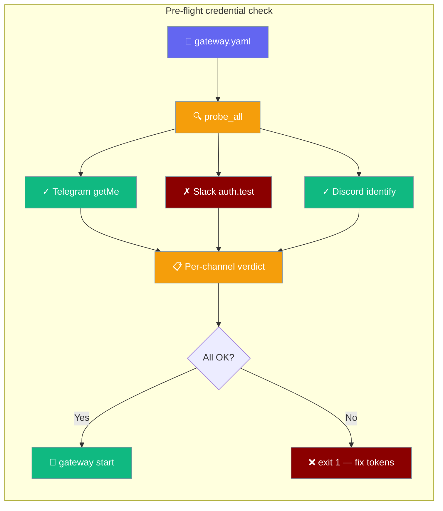
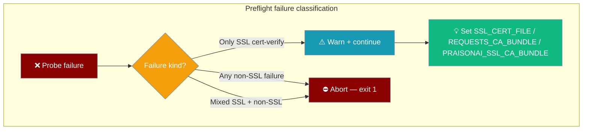
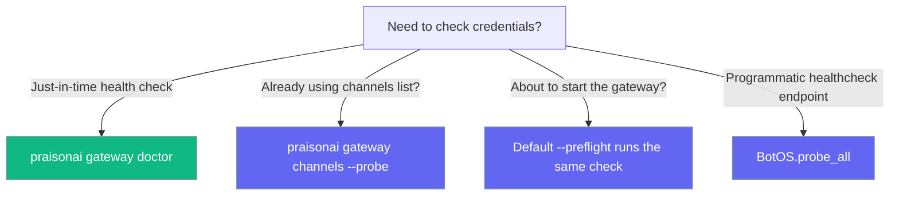
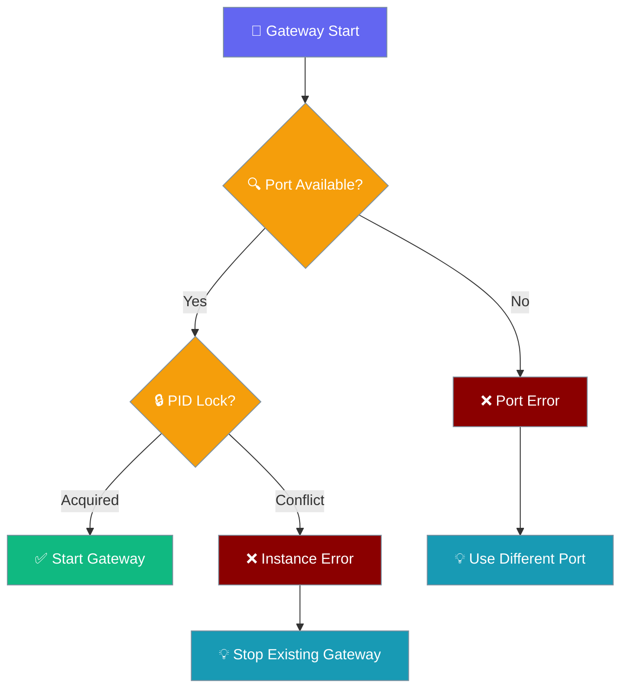

<Note>
The gateway now ships in the `praisonai-bot` package. `praisonai serve gateway` still works exactly as documented here; for a standalone install see [praisonai-bot Migration](/docs/guides/praisonai-bot-migration).
</Note>


```python
from praisonaiagents import Agent

agent = Agent(name="gateway-cli-agent", instructions="Manage gateway via CLI commands.")
agent.start("Start the gateway and show its status.")
```


Gateway CLI provides commands for starting, monitoring, and managing the PraisonAI Gateway server and its daemon service, including channel supervision controls for resilient bot management.

```yaml
# gateway.yaml
agents:
  assistant:
    instructions: "You are a helpful AI assistant."
    model: gpt-4o-mini

channels:
  telegram:
    token: "${TELEGRAM_BOT_TOKEN}"
    platform: telegram
```

```bash
praisonai gateway start --config gateway.yaml
```

<Note>
This page documents the **WebSocket multi-agent Gateway daemon**. The canonical CLI command is `praisonai-bot gateway start` (bot-tier package). When the `praisonai` wrapper is co-installed, `praisonai gateway start` works as a convenience alias.

For the **UI-Gateway** (Pattern C integration), see [`praisonai serve ui-gateway`](/docs/cli/serve#ui-gateway-server-options).

For detailed information about channel resilience and operator controls, see [Channel Supervision](/docs/features/gateway-channel-supervision).
</Note>


The user runs `praisonai gateway start`; the CLI launches the daemon, supervises channels, and keeps the WebSocket gateway reachable.



## How It Works




## Quick Start

<Note>
The gateway runs in the **foreground**. The daemon is installed by `praisonai-bot gateway install` (or automatically by `praisonai-bot onboard`).
</Note>

<Steps>
<Step title="Start Gateway">
```bash
# Canonical (bot-tier, no wrapper required)
praisonai-bot gateway start

# Wrapper alias (requires pip install praisonai)
praisonai gateway start
```
<Tip>Only one gateway can run per host:port. Stop the existing one with `praisonai-bot gateway stop` first, or use a different port.</Tip>
</Step>

<Step title="Check Status">
```bash
praisonai gateway status
```
</Step>

<Step title="Test Health Endpoint">
```bash
curl http://127.0.0.1:8765/health
```
</Step>
</Steps>

---

## Commands

### Gateway Management

| Command | Description | Example |
|---------|-------------|---------|
| `praisonai gateway start` | Start the gateway server (foreground) | `praisonai gateway start --port 9000` |
| `praisonai gateway stop` | Stop a running gateway instance | `praisonai gateway stop --force` |
| `praisonai gateway status` | Check gateway and daemon status | `praisonai gateway status --daemon-only` |
| `praisonai gateway doctor` | Validate channel credentials before start (pre-flight) | `praisonai gateway doctor --config gateway.yaml` |
| `praisonai gateway channels` | List configured channels (add `--probe` to check creds) | `praisonai gateway channels --probe` |

<Tip>
`praisonai-bot gateway status` is safe to run on any platform. On Windows, if PID-lock inspection can't complete, the `/health` probe still runs and shows the authoritative gateway status.
</Tip>

### Daemon Service

| Command | Description | Example |
|---------|-------------|---------|
| `praisonai gateway install` | Install as OS daemon | `praisonai gateway install --no-start` |
| `praisonai gateway uninstall` | Remove daemon service | `praisonai gateway uninstall` |
| `praisonai gateway logs` | Show daemon logs | `praisonai gateway logs -n 100` |
| `praisonai gateway restart` | Graceful drain + relaunch (daemon-aware) | `praisonai gateway restart --drain-timeout 30` |

The installed unit stops (not restarts) on the gateway's fatal-config exit code (78, `EX_CONFIG`). See [Gateway Exit Codes](/docs/features/gateway-exit-codes) for the full contract.

### Channel Control

| Command | Description | Example |
|---------|-------------|---------|
| `praisonai gateway pause` | Pause a channel | `praisonai gateway pause telegram` |
| `praisonai gateway resume` | Resume a paused channel | `praisonai gateway resume telegram` |
| `praisonai gateway reconnect` | Force reconnect a channel | `praisonai gateway reconnect telegram` |

### Inbound Hooks

| Command | Description | Example |
|---------|-------------|---------|
| `praisonai gateway hooks add <path>` | Register an inbound webhook trigger | `praisonai gateway hooks add gmail --agent assistant` |
| `praisonai gateway hooks list` | List registered hooks | `praisonai gateway hooks list` |
| `praisonai gateway hooks remove <path>` | Remove an inbound hook | `praisonai gateway hooks remove gmail` |

See [Gateway Inbound Hooks](/docs/features/gateway-inbound-hooks) for full details.

### Testing & Debugging

| Command | Description | Example |
|---------|-------------|---------|
| `praisonai gateway send` | Send test message | `praisonai gateway send --channel telegram --channel-id 12345 -m "test"` |

---

## Command Reference

<Note>
For the channel-control verbs (`pause` / `resume` / `reconnect`), when `--url` is omitted the target is resolved from `--host` / `--port` (defaulting to the `GATEWAY_PORT` environment variable, then `127.0.0.1:8765`). Previously the URL was always probed at `127.0.0.1:8765` — operators running the gateway on a non-default endpoint had to hand-type the WebSocket URL for every channel control call.
</Note>

<Tabs>
<Tab title="start">
```bash
praisonai gateway start [OPTIONS]

Options:
  --host TEXT                     Host to bind to [default: 127.0.0.1]
  --port INTEGER                  Port to listen on [default: 8765 or $GATEWAY_PORT]
  --agents TEXT                   Path to agent configuration file
  --config TEXT                   Path to gateway.yaml for multi-bot mode
  --reliability [production|default|off]
                                  Reliability preset — composes drain + admission.
                                  production (15s drain + CPU-scaled admission),
                                  default (5s drain, no admission), off (immediate teardown).
                                  Overrides `reliability:` from YAML but is overridden
                                  by explicit --drain-timeout / --max-concurrent-runs.
  --preflight / --no-preflight    Validate channel credentials before
                                  starting (fail fast on bad tokens)
                                  [default: --preflight]
  --identity-store TEXT           Path to the cross-platform identity link-map
                                  JSON (default ~/.praisonai/identity.json).
                                  Enables one continuous session + memory per
                                  paired/linked user across channels (#3020).
                                  Overrides the `identity:` block in gateway.yaml.
  --scale-to-zero                 Quiesce the gateway when idle for --idle-minutes
                                  (scale-to-zero; #3021). Overrides
                                  lifecycle.scale_to_zero.enabled in gateway.yaml.
  --idle-minutes FLOAT            Minutes of no inbound / in-flight work before
                                  quiescing (#3021). Overrides
                                  lifecycle.scale_to_zero.idle_minutes.
  --drain-marker TEXT             Path to watch for an epoch-aware external drain
                                  marker file (#3021). Overrides
                                  lifecycle.drain.marker_path.

Examples:
  praisonai gateway start
  praisonai gateway start --config gateway.yaml
  praisonai gateway start --agents agents.yaml --port 9000
  praisonai gateway start --config gateway.yaml --no-preflight
  praisonai gateway start --config gateway.yaml --reliability production
  GATEWAY_PORT=9000 praisonai gateway start

  # Enable cross-platform continuity without touching gateway.yaml
  praisonai gateway start --config gateway.yaml \
    --identity-store ~/.praisonai/identity.json

  # Enable scale-to-zero + external drain marker without touching gateway.yaml
  praisonai gateway start --config gateway.yaml \
    --scale-to-zero --idle-minutes 10 \
    --drain-marker /data/gateway.drain
```

<Note>
The lifecycle flags synthesize a `lifecycle:` block, so CLI overrides win over YAML. `--scale-to-zero` arms and quiesces even without a `wake_url` — the gateway keeps its listening socket open and self-wakes on the next inbound message. See [Scale-to-Zero](/docs/features/gateway-scale-to-zero), [Drain Trigger](/docs/features/gateway-drain-trigger), and [Crash-Loop Guard](/docs/features/gateway-crash-loop-guard).
</Note>

<Note>
`--reliability` overrides the `reliability:` / `gateway.reliability:` key in YAML. See [Gateway Reliability Presets](/docs/features/gateway-reliability) for profile details and precedence rules.
</Note>

<Note>
`--identity-store` gives every paired/linked user one continuous session across channels and overrides the `identity:` block in `gateway.yaml`. See [Cross-Platform Sessions → In the gateway](/docs/features/cross-platform-mirror#in-the-gateway-praisonai-gateway-start) for the full precedence ladder.
</Note>

<Note>
**Corporate proxies / SSL-inspecting networks.** A preflight failure caused only by `SSLCertVerificationError` / `certificate_verify_failed` does **not** abort the start — the token is usually valid and the runtime adapter's SSL stack is more permissive. The gateway prints a one-line warning naming the three CA-bundle env vars and continues.

If any channel also fails for a non-SSL reason (bad token, unreachable host, timeout), preflight still hard-aborts — fix that channel or pass `--no-preflight`. See [Corporate CA bundle (SSL-inspecting networks)](#corporate-ca-bundle-ssl-inspecting-networks).
</Note>
</Tab>

<Tab title="stop">
```bash
praisonai gateway stop [OPTIONS]

Options:
  --host TEXT         Gateway host [default: 127.0.0.1]
  --port INTEGER      Gateway port [default: 8765 or $GATEWAY_PORT]
  --force             Force stop (kill process)

Examples:
  praisonai gateway stop
  praisonai gateway stop --port 9000
  praisonai gateway stop --force
```

<Note>
`praisonai gateway stop` performs a graceful drain — it waits up to **10 seconds** for in-flight agent turns and queued messages before closing. Use `--force` to skip the drain and terminate immediately.
</Note>
</Tab>

<Tab title="status">
```bash
praisonai gateway status [OPTIONS]

Options:
  --host TEXT         Gateway host [default: 127.0.0.1]
  --port INTEGER      Gateway port [default: 8765 or $GATEWAY_PORT]
  --daemon-only       Show only daemon status

Examples:
  praisonai gateway status
  praisonai gateway status --port 9000
  praisonai gateway status --daemon-only
```
</Tab>

<Tab title="doctor">
```bash
praisonai gateway doctor [OPTIONS]

Options:
  -c, --config TEXT   Path to gateway.yaml [default: gateway.yaml]
  --json              Output JSON

Examples:
  praisonai gateway doctor
  praisonai gateway doctor --config my-gateway.yaml --json
```
</Tab>

<Tab title="channels">
```bash
praisonai gateway channels [OPTIONS]

Options:
  -c, --config TEXT   Path to gateway.yaml [default: gateway.yaml]
  --json              Output JSON format
  --probe             Probe each channel's credentials

Examples:
  praisonai gateway channels
  praisonai gateway channels --config my-gateway.yaml --json
  praisonai gateway channels --probe
```
</Tab>

<Tab title="pause">
```bash
praisonai gateway pause <channel-name> [OPTIONS]

Options:
  --host TEXT   Gateway host [default: 127.0.0.1]
  --port INTEGER Gateway port [default: 8765 or $GATEWAY_PORT]
  --url TEXT    Gateway WebSocket URL — resolved from --host/--port when omitted

Examples:
  praisonai gateway pause telegram
  praisonai gateway pause telegram --port 9000        # non-default port
  GATEWAY_PORT=9000 praisonai gateway pause telegram  # via env
  praisonai gateway pause discord --url ws://localhost:8000  # explicit URL still wins
```
</Tab>

<Tab title="resume">
```bash
praisonai gateway resume <channel-name> [OPTIONS]

Options:
  --host TEXT   Gateway host [default: 127.0.0.1]
  --port INTEGER Gateway port [default: 8765 or $GATEWAY_PORT]
  --url TEXT    Gateway WebSocket URL — resolved from --host/--port when omitted

Examples:
  praisonai gateway resume telegram
  praisonai gateway resume telegram --port 9000        # non-default port
  GATEWAY_PORT=9000 praisonai gateway resume telegram  # via env
  praisonai gateway resume discord --url ws://localhost:8000  # explicit URL still wins
```
</Tab>

<Tab title="reconnect">
```bash
praisonai gateway reconnect <channel-name> [OPTIONS]

Options:
  --host TEXT   Gateway host [default: 127.0.0.1]
  --port INTEGER Gateway port [default: 8765 or $GATEWAY_PORT]
  --url TEXT    Gateway WebSocket URL — resolved from --host/--port when omitted

Examples:
  praisonai gateway reconnect telegram
  praisonai gateway reconnect telegram --port 9000        # non-default port
  GATEWAY_PORT=9000 praisonai gateway reconnect telegram  # via env
  praisonai gateway reconnect discord --url ws://localhost:8000  # explicit URL still wins
```
</Tab>
</Tabs>

---

## Pre-flight credential check

`praisonai gateway doctor` validates every channel's token **before** the gateway starts, so a bad or expired credential fails fast with a precise per-channel reason instead of disappearing into the supervisor's silent reconnect loop.



### Examples

Quick health check:

```bash
$ praisonai gateway doctor
telegram     ✓  @my_support_bot
slack        ✗  SSL certificate verify failed (network/proxy?). Token may still be valid. Try SSL_CERT_FILE=/path/to/corp-ca.pem or gateway start --no-preflight
discord      ✓  @MySupport
```

A non-SSL failure keeps the bare error string:

```bash
$ praisonai gateway doctor
telegram     ✓  @my_support_bot
slack        ✗  invalid_auth (token expired)
discord      ✓  @MySupport
```

CI-friendly JSON — a **single** document with a `probes` block (and a `secrets` block when any channel uses a [secret reference](/docs/features/gateway-secret-references)):

```bash
$ praisonai gateway doctor --json
{
  "probes": {
    "telegram": {"ok": true,  "platform": "telegram", "bot_username": "my_support_bot"},
    "slack":    {"ok": false, "platform": "slack",    "error": "invalid_auth"},
    "discord":  {"ok": true,  "platform": "discord",  "bot_username": "MySupport"}
  },
  "secrets": {
    "telegram": {"token": "available"},
    "slack":    {"token": "available", "app_token": "configured-but-unavailable"},
    "discord":  {"token": "configured"}
  }
}
```

<Note>
The whole output is now one JSON document (`{probes, secrets}`), parseable with a single `json.loads`. Operator scripts that read the earlier two-document output (a probe block plus a separate availability block) must switch to reading `payload["probes"]`.
</Note>

Same verdict via the listing command:

```bash
$ praisonai gateway channels --probe
```

### Credential availability (without revealing values)

`praisonai gateway doctor` also prints a per-channel **credential availability** table so operators can validate secret wiring — including the [secret-reference form](/docs/features/gateway-secret-references) on `token`, `app_token`, and `verify_token` — without ever printing a value.

```bash
$ praisonai gateway doctor
Credential availability (values never shown):
telegram     token         ✓  available
slack        token         ✓  available
slack        app_token     ✗  configured-but-unavailable
whatsapp     verify_token  ✗  missing
```

| State | Meaning |
|-------|---------|
| `available` | Resolved successfully (env set, file present and non-empty) |
| `configured-but-unavailable` | Configured but cannot resolve (empty file, unreadable, empty env var) |
| `configured` | An `exec` reference — configured, but not executed at probe time |
| `missing` | Not set (env var unset, file not found) |

An `exec`-sourced reference reports `configured` without running its command: the command has side effects (a one-shot / rate-limited / rotating secret-manager call) and the network probe resolves the same reference moments later, so executing it here would run it twice.

These states now map cleanly to runtime isolation at boot — a `configured-but-unavailable` or `missing` channel credential isolates just that channel as degraded rather than aborting the gateway. See [Degraded Channel Isolation](/docs/features/gateway-degraded-channels).

The `--json` output is a **single document** with `probes` and `secrets` keys:

```json
{
  "probes":  { "telegram": {"ok": true }, "slack": {"ok": false} },
  "secrets": { "telegram": {"token": "available"},
               "slack":    {"token": "available", "app_token": "configured-but-unavailable"} }
}
```

<Warning>
**Breaking change to the `--json` layout.** Previously `doctor` printed the availability and probe blocks as two separate top-level documents (invalid JSON). It now emits one document with `probes` and `secrets` keys, so `json.loads` can parse the whole output. The `secrets` key is present only when at least one channel configures a credential field.
</Warning>

### Pre-flight gate on start

`praisonai gateway start` runs the same probe automatically before launch when invoked with `--config gateway.yaml`:

```bash
$ praisonai gateway start --config gateway.yaml
slack        ✗  invalid_auth (token expired)

Pre-flight check failed — aborting start. Fix the channel credentials
above or pass --no-preflight to skip.
```

To bypass during local dev (e.g. flaky probe network):

```bash
praisonai gateway start --config gateway.yaml --no-preflight
```

### Corporate CA bundle (SSL-inspecting networks)

On networks that intercept TLS with a corporate CA (proxy / MITM), the probe's HTTP client can reject the certificate chain even though the token is valid and the runtime adapter connects fine. Preflight classifies these SSL cert-verify failures separately and **soft-fails** when they are the only failures.

```bash
$ praisonai gateway start --config gateway.yaml
slack        ✗  SSL certificate verify failed (network/proxy?). Token may still be valid. Try SSL_CERT_FILE=/path/to/corp-ca.pem or gateway start --no-preflight

Pre-flight found SSL certificate-verify failures only (likely a proxy/MITM
network). Tokens may still be valid — continuing start. Set SSL_CERT_FILE /
REQUESTS_CA_BUNDLE / PRAISONAI_SSL_CA_BUNDLE to your corporate CA, or pass
--no-preflight to skip this check.
```

The probe decides its action from the mix of failures:

| Probe outcome (across all channels) | Preflight action |
|-------------------------------------|------------------|
| All channels `ok` | Start proceeds silently. |
| ≥1 channel fails with a non-SSL error (token, network, timeout) | Hard-abort, exit `1`. |
| All failures are SSL cert-verify only | **Soft-fail** — print the SSL warning, continue to start, exit `0`. |
| Mixed: ≥1 SSL cert-verify **and** ≥1 token/network failure | Hard-abort (the non-SSL failure wins), exit `1`. |

<Warning>
Only certificate-verify failures soft-fail. Other TLS handshake failures — `WRONG_VERSION_NUMBER`, `NO_SHARED_CIPHER`, `HANDSHAKE_FAILURE` — still hard-abort, because they usually indicate a real bug that also breaks the channel at runtime.
</Warning>

Point the probe at your corporate CA with one of three env vars, highest precedence first:

| Variable | Precedence | Behaviour |
|----------|------------|-----------|
| `PRAISONAI_SSL_CA_BUNDLE` | Highest — explicit PraisonAI override | Overrides pre-existing `SSL_CERT_FILE` and `REQUESTS_CA_BUNDLE` for the probe. |
| `REQUESTS_CA_BUNDLE` | Middle | Used only if `PRAISONAI_SSL_CA_BUNDLE` is unset. Left alone when the winner came from elsewhere. |
| `SSL_CERT_FILE` | Lowest — Python default | Read by Python's default `ssl` context (used by `aiohttp`). Used only if the two above are unset. |

```bash
export PRAISONAI_SSL_CA_BUNDLE=/path/to/corp-ca.pem
praisonai gateway start --config gateway.yaml
```

A configured-but-missing path warns and leaves the SSL env vars untouched:

```
Warning: CA bundle path '<path>' does not exist — SSL_CERT_FILE / REQUESTS_CA_BUNDLE not updated for probe.
```

<Tip>
The runtime adapter reads the same three env vars, so setting one fixes both the preflight probe and long-lived channel connections.
</Tip>



### Token resolution

The probe loads `~/.praisonai/.env` first, so `${VAR}` placeholders set by `praisonai onboard` resolve exactly like they do at runtime — `doctor`, `channels --probe`, and `start --preflight` all share the same token-resolution path.

### Per-channel timeout

Each probe is bounded by a 15-second deadline; a stuck adapter is reported as `"probe timed out after 15s"` and does not hang the aggregate.

### Exit codes

| Outcome | Exit code |
|---|---|
| All channels probe OK | `0` |
| Any channel fails | `1` |
| `gateway doctor` with no channels configured | `0` |

### When to use which



<AccordionGroup>
  <Accordion title="Programmatic check (Python)">

```python
import asyncio
from praisonai.bots import Bot, BotOS

botos = BotOS(
    bots=[
        Bot("telegram", token="..."),
        Bot("slack",    token="..."),
    ],
    enable_supervision=False,
)

results = asyncio.run(botos.probe_all(timeout=15.0))
for platform, r in results.items():
    print(platform, "ok" if r.ok else r.error)
```

  </Accordion>
</AccordionGroup>

---

## Environment Variables

| Variable | Description | Default |
|----------|-------------|----------|
| `GATEWAY_PORT` | Port for start/stop/status when --port is not passed | `8765` |

<Note>
The `GATEWAY_PORT` environment variable is used by `start`, `stop`, and `status` commands when the `--port` option is not explicitly provided. Invalid values silently fall back to `8765`.
</Note>

---

## Single-Instance Enforcement

PraisonAI enforces a single gateway instance per host:port combination using PID locks.



**Lock File Location:** `~/.praisonai/gateway-<safe_host>-<port>.pid`

The `safe_host` replaces `:` and `.` with `_` (so `127.0.0.1` becomes `127_0_0_1`). Each host:port combination gets its own lock file, allowing multiple gateways on different ports.

### PID-Lock Status Reference

`praisonai gateway status` prints one PID-lock line before the `/health` probe. Look up any line you see:

| Line printed | When |
|---|---|
| `Gateway PID lock: Process <pid> running (<host>:<port>)` | Lock file exists, PID responds to `os.kill(pid, 0)` |
| `Gateway PID lock: Stale lock (process <pid> not running)` | Lock file exists, PID no longer responds (including Windows `SystemError`/`ValueError` cases) |
| `Gateway PID lock: No lock file found` | No lock file at `~/.praisonai/gateway-<safe_host>-<port>.pid` |
| `PID lock status: Utilities not available` | `port_utils` import failed (`ImportError`) |
| `PID lock status: Unavailable (<error>)` | Any other unexpected exception during PID-lock inspection; the `/health` probe still runs |

The port line (`Port <host>:<port>: In use` / `Available`) follows the same section unless PID-lock inspection fails, in which case the single `PID lock status: Unavailable (<error>)` line replaces both.

---

## Restart the Gateway

Use `praisonai gateway restart` — it drains in-flight turns, then relaunches (via the installed service manager when present, otherwise directly).

```bash
# Simple restart with default 10s drain
praisonai gateway restart

# Restart pointing at a config (needed only for the direct-relaunch fallback)
praisonai gateway restart --config gateway.yaml

# Longer drain window for slow agent turns
praisonai gateway restart --drain-timeout 30

# Restart a gateway running on a non-default endpoint
praisonai gateway restart --host 127.0.0.1 --port 9000
# equivalently:  GATEWAY_PORT=9000 praisonai gateway restart
```

<Note>
`gateway restart` is **daemon-aware**: if the gateway is installed as an OS service (`praisonai gateway install`), the platform service manager restarts it (`launchctl kickstart -k`, `systemctl --user restart praisonai-bot`, or `schtasks /End && /Run`) so the installed unit's launch flags are preserved. Otherwise the CLI drains the running PID and relaunches directly in the foreground.
</Note>

<Warning>
The **direct** (non-service) fallback cannot recover CLI-only flags the original process was started with (e.g. `--openai-api`, `--mcp`, `--max-concurrent-runs`). For production, either install the daemon or put all settings in `gateway.yaml` so a restart preserves them.
</Warning>

### Options

| Flag | Type | Default | Description |
|------|------|---------|-------------|
| `--host` | `str` | `127.0.0.1` | Gateway host (used to locate the running instance) |
| `--port` | `int` | `GATEWAY_PORT` env, else `8765` | Gateway port |
| `--config` | `str` | none | Path to `gateway.yaml` for direct-relaunch fallback |
| `--agents` | `str` | none | Path to agent configuration file for direct-relaunch fallback |
| `--drain-timeout` | `float` | `10.0` | Seconds to wait for in-flight agent turns before relaunch |

<Tip>
On **Windows**, `gateway restart` aborts if `schtasks /End` fails — this prevents a duplicate / colliding gateway relaunch that the raw `/End && /Run` chain would silently produce.
</Tip>

### Advanced: OS-native restart

If you need to bypass the CLI (e.g. from a systemd `ExecStartPre`), the same platform commands the daemon dispatcher uses are:

<Tabs>
<Tab title="macOS">
```bash
launchctl kickstart -k gui/$(id -u)/ai.praison.bot
```
</Tab>

<Tab title="Linux">
```bash
systemctl --user restart praisonai-bot
```
</Tab>

<Tab title="Windows">
```bash
schtasks /End /TN PraisonAIGateway && schtasks /Run /TN PraisonAIGateway
```
</Tab>
</Tabs>

<Warning>
Bypassing `gateway restart` skips the graceful drain — in-flight agent turns will be interrupted mid-response. Prefer the CLI verb.
</Warning>

---

## Status Output Examples

### Healthy Gateway
```bash
$ praisonai gateway status
Gateway PID lock: Process 12345 running (127.0.0.1:8765)
Port 127.0.0.1:8765: In use
Daemon service: Running (launchd)
Process ID: 12345
Gateway server: Reachable at http://127.0.0.1:8765/health
  Status: healthy
  Uptime: 3600.5 seconds
  Agents: 2
  Sessions: 1
  Clients: 3
  Channels: 2 configured
```

### PID Lock Unavailable (Windows)
```bash
$ praisonai-bot gateway status --port 18789
PID lock status: Unavailable (kill returned a result with an exception set)
Gateway Status: healthy
  Uptime: 11.4s
  Agents: 1
  Sessions: 0
  Clients: 0
```

<Note>
On Windows, `os.kill(pid, 0)` can raise `SystemError`. From PraisonAI ≥ v4.6.141 the PID-lock inspection is advisory only — this line replaces `Gateway PID lock: …` / `Port …: …` when the check fails, and the `/health` probe still runs so you still see the real status.
</Note>

### Daemon Issues
```bash
$ praisonai gateway status
Daemon service: Installed but not running (launchd)
Gateway not reachable at http://127.0.0.1:8765/health
```

### Not Installed
```bash
$ praisonai gateway status --daemon-only
Daemon service: Not installed (systemd)
```

---

## Platform Support

Gateway CLI works across platforms with native daemon integration:

| Platform | Service Type | Log Location | Management |
|----------|--------------|--------------|------------|
| **macOS** | LaunchAgent (`ai.praison.bot`) | `~/.praisonai/logs/bot-stderr.log` | `launchctl kickstart -k gui/$(id -u)/ai.praison.bot` |
| **Linux** | systemd user service (`praisonai-bot`) | `journalctl --user -u praisonai-bot` | `systemctl --user restart praisonai-bot` |
| **Windows** | Scheduled Task (`PraisonAIGateway`) | Windows Event Log | `schtasks /End /TN PraisonAIGateway && schtasks /Run /TN PraisonAIGateway` |

<Note>
Each generated unit stops (not restarts) on the gateway's fatal-config exit code (78, `EX_CONFIG`) — systemd via `RestartPreventExitStatus=78`, launchd via `KeepAlive`/`ThrottleInterval`, Windows via a `.cmd` wrapper that maps `78` to a clean exit. See [Gateway Exit Codes](/docs/features/gateway-exit-codes).
</Note>

---

## Configuration Files

<Tabs>
<Tab title="agents.yaml">
```yaml
# Simple agent configuration
agent:
  name: "support"
  instructions: "You are a helpful support agent"
  model: "gpt-4o-mini"
  tools:
    - search_web
  memory: true
```
</Tab>

<Tab title="gateway.yaml">
```yaml
# Multi-bot configuration
identity:
  enabled: true                       # one session per paired user across channels (#3020)
  store: ~/.praisonai/identity.json   # optional; ~ expanded, `path:` accepted as alias

agents:
  support:
    instructions: "You are a support agent"
    model: "gpt-4o-mini"
  sales:
    instructions: "You are a sales agent"
    model: "claude-3-5-sonnet-20241022"

channels:
  telegram:
    token: "${TELEGRAM_BOT_TOKEN}"
    routing:
      default: support
  discord:
    token: "${DISCORD_BOT_TOKEN}"
    routing:
      default: sales
  slack:
    # Secret-reference form: read from a mounted file / secret manager
    # instead of plaintext or a process-wide env var.
    token: { source: file, id: /run/secrets/slack_token }
    app_token: { source: exec, id: "vault read -field=token secret/slack" }
    routing:
      default: support
```

See [Secret References](/docs/features/gateway-secret-references) for the full `{ source, id }` form on `token`, `app_token`, and `verify_token`.
</Tab>
</Tabs>

---

## Best Practices

<AccordionGroup>
  <Accordion title="Use daemon-only for health checks">
    Use `--daemon-only` flag when monitoring daemon status in scripts or CI/CD pipelines to avoid gateway connection attempts.
  </Accordion>
  
  <Accordion title="Check logs for troubleshooting">
    Always check `praisonai gateway logs` when the daemon is running but gateway is unreachable - this reveals startup errors.
  </Accordion>
  
  <Accordion title="Test channel configuration">
    Use `praisonai gateway send` to test channel bot configuration before deploying to production environments.
  </Accordion>
  
  <Accordion title="Monitor daemon status regularly">
    Set up monitoring that runs `praisonai gateway status --daemon-only` to detect service failures quickly.
  </Accordion>
</AccordionGroup>

---

## Related

<CardGroup cols={2}>
  <Card title="Gateway Server" icon="tower-broadcast" href="/docs/features/gateway">
    Gateway architecture and configuration
  </Card>
  <Card title="Troubleshooting" icon="wrench" href="/docs/guides/troubleshoot-gateway">
    Common gateway issues and solutions
  </Card>
  <Card title="Secret References" icon="key" href="/docs/features/gateway-secret-references">
    Load credentials from files, env vars, or secret managers
  </Card>
  <Card title="Cross-Platform Sessions" icon="users-rectangle" href="/docs/features/cross-platform-mirror">
    `--identity-store` — one session per user across channels
  </Card>
</CardGroup>