<Note>
The gateway now ships in the `praisonai-bot` package. `praisonai serve gateway` still works exactly as documented here; for a standalone install see [praisonai-bot Migration](/guides/praisonai-bot-migration).
</Note>


```python
from praisonaiagents import Agent

agent = Agent(name="gateway-cli-agent", instructions="Manage gateway via CLI commands.")
agent.start("Start the gateway and show its status.")
```


Gateway CLI provides commands for starting, monitoring, and managing the PraisonAI Gateway server and its daemon service, including channel supervision controls for resilient bot management.

```yaml
# gateway.yaml
agents:
  assistant:
    instructions: "You are a helpful AI assistant."
    model: gpt-4o-mini

channels:
  telegram:
    token: "${TELEGRAM_BOT_TOKEN}"
    platform: telegram
```

```bash
# Onboarded: no flag needed — the CLI discovers ~/.praisonai/bot.yaml
praisonai gateway start

# Explicit path still wins
praisonai gateway start --config gateway.yaml
```

<Note>
This page documents the **WebSocket multi-agent Gateway daemon**. The canonical CLI is `praisonai-bot gateway` (bot-tier package). When the `praisonai` wrapper is co-installed, `praisonai gateway <subcommand>` works as a convenience alias for **every** subcommand documented on this page — `start`, `status`, `stop`, `restart`, `doctor`, `test`, `channels`, `pause` / `resume` / `reconnect`, `install` / `uninstall`, `mint-link`, `logs`, `send`, `hooks`, and `sessions`.

For the **UI-Gateway** (Pattern C integration), see [`praisonai serve ui-gateway`](/docs/cli/serve#ui-gateway-server-options).

For detailed information about channel resilience and operator controls, see [Channel Supervision](/features/gateway-channel-supervision).
</Note>


The user runs `praisonai gateway start`; the CLI launches the daemon, supervises channels, and keeps the WebSocket gateway reachable.

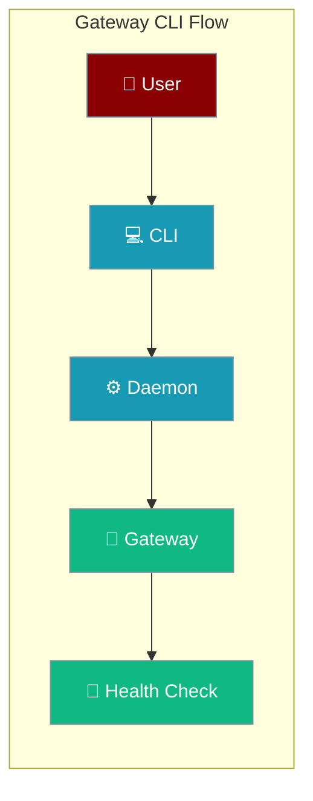
```mermaid
graph LR
    subgraph "Gateway CLI Flow"
        User[👤 User] --> CLI[💻 CLI]
        CLI --> Daemon[⚙️ Daemon]
        Daemon --> Gateway[🗼 Gateway]
        Gateway --> Health[🏥 Health Check]
    end
    
    classDef user fill:#8B0000,stroke:#7C90A0,color:#fff
    classDef tool fill:#189AB4,stroke:#7C90A0,color:#fff
    classDef success fill:#10B981,stroke:#7C90A0,color:#fff
    classDef config fill:#6366F1,stroke:#7C90A0,color:#fff
    
    class User user
    class CLI,Daemon tool
    class Gateway,Health success
```

## How It Works

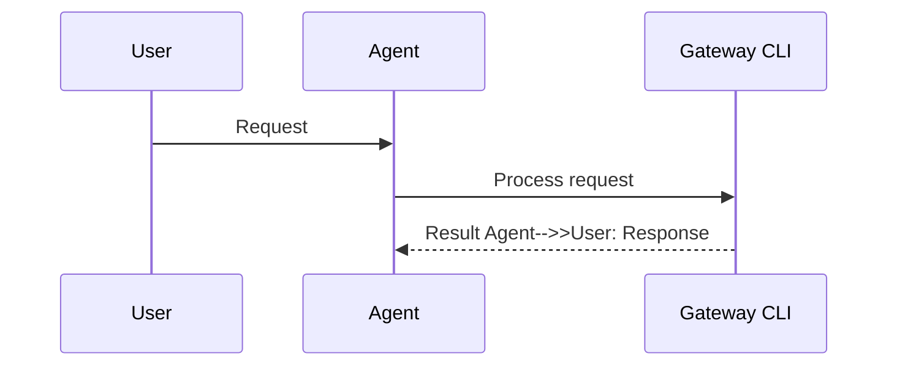
```mermaid
sequenceDiagram
    participant User
    participant Agent
    participant Feature as Gateway CLI

    User->>Agent: Request
    Agent->>Feature: Process request
    Feature-->>Agent: Result    Agent-->>User: Response
```


## Quick Start

<Note>
The gateway runs in the **foreground**. The daemon is installed by `praisonai-bot gateway install` (or automatically by `praisonai-bot onboard`).
</Note>

<Steps>
<Step title="Start Gateway">
```bash
# Canonical (bot-tier, no wrapper required)
praisonai-bot gateway start

# Wrapper alias (requires pip install praisonai)
praisonai gateway start
```

With no `--config`, `start` auto-discovers the onboarded config and prints the file it picked before binding:

```bash
$ praisonai gateway start
Using gateway config: /Users/you/.praisonai/bot.yaml
```

<Tip>Only one gateway can run per host:port. Stop the existing one with `praisonai-bot gateway stop` first, or use a different port.</Tip>
</Step>

<Step title="Check Status">
```bash
praisonai gateway status
```
</Step>

<Step title="Test Health Endpoint">
```bash
curl http://127.0.0.1:8765/health
```
</Step>
</Steps>

---

## Commands

<Info>
**Unknown subcommands degrade gracefully.** `praisonai gateway <typo>` prints the standard usage/error message and exits with a non-zero code, rather than dead-ending with a static list. This applies to both the canonical and wrapper entry points.
</Info>

<Note>
`praisonai gateway …` and `praisonai-bot gateway …` now route through **one** command app, so both expose the same verbs and the same `start`. A degraded gateway's retry hints — `praisonai gateway doctor`, `doctor --fix`, `test` — name commands you can run from either binary. An unknown verb (for example `praisonai gateway doctr`) now prints a rendered usage error and exits non-zero instead of the old `Available commands: start, status, hooks` dead-end, so a new error format is expected.
</Note>

### Which verb do I need?

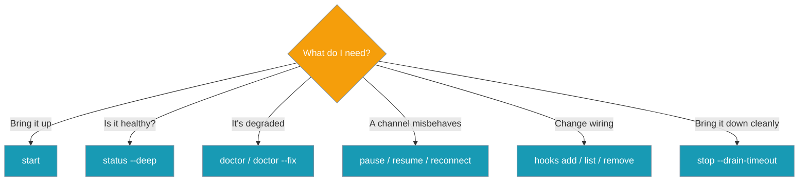
```mermaid
graph TB
    Q{What do I need?}
    Q -->|Bring it up| Start[start]
    Q -->|Is it healthy?| Status[status --deep]
    Q -->|It's degraded| Doctor[doctor / doctor --fix]
    Q -->|A channel misbehaves| Ctl[pause / resume / reconnect]
    Q -->|Change wiring| Hooks[hooks add / list / remove]
    Q -->|Bring it down cleanly| Stop[stop --drain-timeout]

    classDef q fill:#F59E0B,stroke:#7C90A0,color:#fff
    classDef verb fill:#189AB4,stroke:#7C90A0,color:#fff

    class Q q
    class Start,Status,Doctor,Ctl,Hooks,Stop verb
```

### Gateway Management

| Command | Description | Example |
|---------|-------------|---------|
| `praisonai gateway start` | Start the gateway server (foreground) | `praisonai gateway start --port 9000` |
| `praisonai gateway stop` | Stop a running gateway instance | `praisonai gateway stop --force` |
| `praisonai gateway status` | Check gateway and daemon status | `praisonai gateway status --daemon-only` |
| `praisonai gateway doctor` | Validate channel credentials **and route/binding targets** before start, run [plugin health checks](/features/gateway-doctor-plugins), and optionally auto-repair weak auth tokens (`--fix`) | `praisonai gateway doctor --config gateway.yaml --fix` |
| `praisonai gateway test` | One-shot readiness (probes + shell wiring + optional turn) | `praisonai gateway test --config gateway.yaml` |
| `praisonai gateway channels` | List configured channels (add `--probe` to check creds) | `praisonai gateway channels --probe` |

<Tip>
`praisonai-bot gateway status` is safe to run on any platform. On Windows, if PID-lock inspection can't complete, the `/health` probe still runs and shows the authoritative gateway status.
</Tip>

### Daemon Service

| Command | Description | Example |
|---------|-------------|---------|
| `praisonai gateway install` | Install as OS daemon | `praisonai gateway install --no-start` |
| `praisonai gateway uninstall` | Remove daemon service | `praisonai gateway uninstall` |
| `praisonai gateway logs` | Show daemon logs | `praisonai gateway logs -n 100` |
| `praisonai gateway restart` | Graceful drain + relaunch (daemon-aware) | `praisonai gateway restart --drain-timeout 30` |

The installed unit stops (not restarts) on the gateway's fatal-config exit code (78, `EX_CONFIG`). See [Gateway Exit Codes](/features/gateway-exit-codes) for the full contract.

### Channel Control

| Command | Description | Example |
|---------|-------------|---------|
| `praisonai gateway pause` | Pause a channel | `praisonai gateway pause telegram` |
| `praisonai gateway resume` | Resume a paused channel | `praisonai gateway resume telegram` |
| `praisonai gateway reconnect` | Force reconnect a channel | `praisonai gateway reconnect telegram` |

### Inbound Hooks

| Command | Description | Example |
|---------|-------------|---------|
| `praisonai gateway hooks add <path>` | Register an inbound webhook trigger | `praisonai gateway hooks add gmail --agent assistant` |
| `praisonai gateway hooks list` | List registered hooks | `praisonai gateway hooks list` |
| `praisonai gateway hooks remove <path>` | Remove an inbound hook | `praisonai gateway hooks remove gmail` |

See [Gateway Inbound Hooks](/features/gateway-inbound-hooks) for full details.

### Testing & Debugging

| Command | Description | Example |
|---------|-------------|---------|
| `praisonai gateway test` | Full readiness check (see [Gateway Readiness](/features/gateway-readiness)) | `praisonai gateway test --config gateway.yaml --channel slack --turn "Say OK"` |
| `praisonai gateway send` | Send test message | `praisonai gateway send --channel telegram --channel-id 12345 -m "test"` |
| `praisonai gateway diagnostics export` | Write a pre-sanitised support bundle (see [Diagnostics Export](/features/gateway-diagnostics-export)) | `praisonai gateway diagnostics export --config gateway.yaml` |

### Diagnostics

`praisonai gateway diagnostics export` writes a portable, pre-sanitised `.zip` you can attach to a bug report. Full details in [Diagnostics Export](/features/gateway-diagnostics-export).

| Flag | Type | Default | Description |
|------|------|---------|-------------|
| `--config`, `-c` | `str` | `"gateway.yaml"` | Path to `gateway.yaml`. |
| `--output-dir` | `str \| None` | `~/.praisonai/diagnostics` | Directory to write the bundle. |
| `--log-lines` | `int` | `200` | Number of recent (redacted) log lines to include. |
| `--json` | `bool` | `False` | Emit JSON (`{path, manifest}`) instead of the human summary. |

---

## Command Reference

<Note>
For the channel-control verbs (`pause` / `resume` / `reconnect`), when `--url` is omitted the target is resolved from `--host` / `--port` (defaulting to the `GATEWAY_PORT` environment variable, then `127.0.0.1:8765`). Previously the URL was always probed at `127.0.0.1:8765` — operators running the gateway on a non-default endpoint had to hand-type the WebSocket URL for every channel control call.
</Note>

<Tabs>
<Tab title="start">
```bash
praisonai gateway start [OPTIONS]

Options:
  --host TEXT                     Host to bind to [default: 127.0.0.1]
  --port INTEGER                  Port to listen on [default: 8765 or $GATEWAY_PORT]
  --agents TEXT                   Path to agent configuration file
  --config TEXT                   Path to gateway.yaml for multi-bot mode.
                                  When omitted, auto-discovers the onboarded
                                  config (./bot.yaml → ~/.praisonai/bot.yaml →
                                  ./gateway.yaml alias) and prints
                                  "Using gateway config: <path>". Exits 78 with
                                  an onboard hint if none is found.
  --reliability [production|default|off]
                                  Reliability preset — composes drain + admission.
                                  production (15s drain + CPU-scaled admission),
                                  default (5s drain, no admission), off (immediate teardown).
                                  Overrides `reliability:` from YAML but is overridden
                                  by explicit --drain-timeout / --max-concurrent-runs.
  --preflight / --no-preflight    Validate channel credentials before
                                  starting (fail fast on bad tokens)
                                  [default: --preflight]
  --strict-tools / --no-strict-tools
                                  Fail fast if any tool named in the config
                                  cannot be resolved. Use --no-strict-tools to
                                  skip unresolved tools and start anyway (#3553)
                                  [default: --strict-tools]
  --verify-turn / --no-verify-turn
                                  Run one real agent turn before serving so a
                                  missing/invalid model credential fails at
                                  startup, not on the first user message.
                                  Default: on (reads
                                  gateway.preflight.verify_turn, defaults to
                                  true). Use --no-verify-turn for constrained/
                                  offline environments (#4042).
  --identity-store TEXT           Path to the cross-platform identity link-map
                                  JSON (default ~/.praisonai/identity.json).
                                  Enables one continuous session + memory per
                                  paired/linked user across channels (#3020).
                                  Overrides the `identity:` block in gateway.yaml.
  --scale-to-zero                 Quiesce the gateway when idle for --idle-minutes
                                  (scale-to-zero; #3021). Overrides
                                  lifecycle.scale_to_zero.enabled in gateway.yaml.
  --idle-minutes FLOAT            Minutes of no inbound / in-flight work before
                                  quiescing (#3021). Overrides
                                  lifecycle.scale_to_zero.idle_minutes.
  --drain-marker TEXT             Path to watch for an epoch-aware external drain
                                  marker file (#3021). Overrides
                                  lifecycle.drain.marker_path.

Examples:
  praisonai gateway start                        # onboarded: discovers ~/.praisonai/bot.yaml
  praisonai gateway start --config gateway.yaml  # explicit path still wins
  praisonai gateway start --agents agents.yaml --port 9000
  praisonai gateway start --config gateway.yaml --no-preflight
  praisonai gateway start --config gateway.yaml --no-strict-tools
  praisonai gateway start --config gateway.yaml --no-verify-turn
  praisonai gateway start --config gateway.yaml --reliability production
  GATEWAY_PORT=9000 praisonai gateway start

  # Enable cross-platform continuity without touching gateway.yaml
  praisonai gateway start --config gateway.yaml \
    --identity-store ~/.praisonai/identity.json

  # Enable scale-to-zero + external drain marker without touching gateway.yaml
  praisonai gateway start --config gateway.yaml \
    --scale-to-zero --idle-minutes 10 \
    --drain-marker /data/gateway.drain
```

<Note>
The lifecycle flags synthesize a `lifecycle:` block, so CLI overrides win over YAML. `--scale-to-zero` arms and quiesces even without a `wake_url` — the gateway keeps its listening socket open and self-wakes on the next inbound message. See [Scale-to-Zero](/features/gateway-scale-to-zero), [Drain Trigger](/features/gateway-drain-trigger), and [Crash-Loop Guard](/features/gateway-crash-loop-guard).
</Note>

<Note>
`--reliability` overrides the `reliability:` / `gateway.reliability:` key in YAML. See [Gateway Reliability Presets](/features/gateway-reliability) for profile details and precedence rules.
</Note>

<Note>
`--identity-store` gives every paired/linked user one continuous session across channels and overrides the `identity:` block in `gateway.yaml`. See [Cross-Platform Sessions → In the gateway](/docs/features/cross-platform-mirror#in-the-gateway-praisonai-gateway-start) for the full precedence ladder.
</Note>

<Note>
**Corporate proxies / SSL-inspecting networks.** A preflight failure caused only by `SSLCertVerificationError` / `certificate_verify_failed` does **not** abort the start — the token is usually valid and the runtime adapter's SSL stack is more permissive. The gateway prints a one-line warning naming the three CA-bundle env vars and continues.

If any channel also fails for a non-SSL reason (bad token, unreachable host, timeout), preflight still hard-aborts — fix that channel or pass `--no-preflight`. See [Corporate CA bundle (SSL-inspecting networks)](#corporate-ca-bundle-ssl-inspecting-networks).
</Note>

<Note>
`--verify-turn` is governed by **its own toggle**, independent of `--preflight`. `--no-preflight --verify-turn` skips the channel-credential probe but still runs one real model round-trip. Both checks run by default and the turn check never replaces the channel probe. On failure it prints the error and exits `1`. Prompt and timeout are YAML-only (`gateway.preflight.verify_turn_prompt` / `verify_turn_timeout`) — there is no `--verify-turn-prompt` flag. See [Gateway Readiness → Turn pre-flight](/features/gateway-readiness#turn-pre-flight).
</Note>
</Tab>

<Tab title="stop">

```bash
praisonai gateway stop [OPTIONS]

Options:
  --host TEXT         Gateway host [default: 127.0.0.1]
  --port INTEGER      Gateway port [default: 8765 or $GATEWAY_PORT]
  --force             Force stop (kill process)

Examples:
  praisonai gateway stop
  praisonai gateway stop --port 9000
  praisonai gateway stop --force
```

<Note>
`praisonai gateway stop` performs a graceful drain — it waits up to **10 seconds** for in-flight agent turns and queued messages before closing. Use `--force` to skip the drain and terminate immediately.
</Note>
</Tab>

<Tab title="status">
```bash
praisonai gateway status [OPTIONS]

Options:
  --host TEXT         Gateway host [default: 127.0.0.1]
  --port INTEGER      Gateway port [default: 8765 or $GATEWAY_PORT]
  --daemon-only       Show only daemon status

Examples:
  praisonai gateway status
  praisonai gateway status --port 9000
  praisonai gateway status --daemon-only
```
</Tab>

<Tab title="doctor">
```bash
praisonai gateway doctor [OPTIONS]

Options:
  -c, --config TEXT   Path to gateway.yaml [default: gateway.yaml — resolves to
                      the onboarded ~/.praisonai/bot.yaml when present]
  --json              Output JSON
  --channel TEXT      Channel a --turn probe uses (default: first configured)
  --turn TEXT         Run one offline inbound agent turn via
                      BotSessionManager.chat (requires LLM API key)
  --fix               Repair safe findings (mint a strong gateway auth token
                      when weak/missing), then re-validate
  --dry-run           With --fix, preview repairs without writing anything

Examples:
  praisonai gateway doctor
  praisonai gateway doctor --fix
  praisonai gateway doctor --fix --dry-run
  praisonai gateway doctor --config my-gateway.yaml --json
  praisonai gateway doctor --config gateway.yaml --channel slack --turn "Say OK"
  praisonai gateway doctor --config gateway.yaml --json --channel slack --turn "Say OK"
```

<Warning>
`--turn` runs an **offline** agent turn via `BotSessionManager.chat`. It does **not** exercise Slack Bolt/socket handlers or @mention routing — a passing turn test does not guarantee live @mention delivery.
</Warning>
</Tab>

<Tab title="test">
```bash
praisonai gateway test [OPTIONS]

Options:
  -c, --config TEXT   Path to gateway.yaml [default: gateway.yaml — resolves to
                      the onboarded ~/.praisonai/bot.yaml when present]
  --json              Output JSON (single top-level document)
  --channel TEXT      Target channel for --turn (must exist in config)
  --turn TEXT         Offline inbound agent turn via BotSessionManager.chat
                      (requires LLM API key)
  --check-running     Probe REST /info on the running gateway to confirm
                      reachability

Examples:
  praisonai gateway test
  praisonai gateway test --config gateway.yaml
  praisonai gateway test --config gateway.yaml --channel slack \
    --turn "run uname -a with execute_command"
  praisonai gateway test --config gateway.yaml --check-running
  praisonai gateway test --config gateway.yaml --json
```

`test` combines credential probes with offline shell wiring validation, then layers optional checks (`--turn`, `--check-running`). See [Gateway Readiness](/features/gateway-readiness) for the full three-tier checklist.

<Warning>
`--turn` runs an **offline** agent turn via `BotSessionManager.chat`. It does **not** exercise Slack Bolt/socket handlers or @mention routing.
</Warning>
</Tab>

<Tab title="mint-link">
```bash
praisonai gateway mint-link [OPTIONS]

Options:
  --ttl INTEGER   Link time-to-live in seconds [default: 600]

Examples:
  praisonai gateway mint-link
  praisonai gateway mint-link --ttl 3600
```

`mint-link` prints a fresh pairing/magic link that binds a cross-platform identity to the gateway, and also writes it to `~/.praisonai/last-link.txt` (mode `600`). The link resolves against `GATEWAY_HOST` / `GATEWAY_PORT` (defaulting to `127.0.0.1:8765`). It exits `1` when magic-link support is unavailable.
</Tab>

<Tab title="sessions">
```bash
praisonai gateway sessions [OPTIONS]

Examples:
  praisonai gateway sessions          # inspect per-channel session store entries
```

`sessions` inspects — and can prune — the per-channel session store so an operator can see live conversations without opening the store by hand.
</Tab>

<Tab title="logs">
```bash
praisonai gateway logs [OPTIONS]

Options:
  -n INTEGER   Number of trailing lines to show

Examples:
  praisonai gateway logs
  praisonai gateway logs -n 100
```

`logs` tails the gateway's stdout/stderr under the daemon runner (`~/.praisonai/logs/bot-stderr.log` on macOS; `journalctl --user -u praisonai-bot` on Linux).
</Tab>

<Tab title="send">
```bash
praisonai gateway send [OPTIONS]

Options:
  --channel TEXT       Channel to push through (e.g. telegram)
  --channel-id TEXT    Destination id on that channel
  -m, --message TEXT   Message body

Examples:
  praisonai gateway send --channel telegram --channel-id 12345 -m "test"
```

`send` pushes a one-off message through the outbound messenger so you can smoke-test delivery to a real channel without waiting for an inbound trigger.
</Tab>

<Tab title="channels">
```bash
praisonai gateway channels [OPTIONS]

Options:
  -c, --config TEXT   Path to gateway.yaml [default: gateway.yaml — resolves to
                      the onboarded ~/.praisonai/bot.yaml when present]
  --json              Output JSON format
  --probe             Probe each channel's credentials

Examples:
  praisonai gateway channels
  praisonai gateway channels --config my-gateway.yaml --json
  praisonai gateway channels --probe
```
</Tab>

<Tab title="pause">
```bash
praisonai gateway pause <channel-name> [OPTIONS]

Options:
  --host TEXT   Gateway host [default: 127.0.0.1]
  --port INTEGER Gateway port [default: 8765 or $GATEWAY_PORT]
  --url TEXT    Gateway WebSocket URL — resolved from --host/--port when omitted

Examples:
  praisonai gateway pause telegram
  praisonai gateway pause telegram --port 9000        # non-default port
  GATEWAY_PORT=9000 praisonai gateway pause telegram  # via env
  praisonai gateway pause discord --url ws://localhost:8000  # explicit URL still wins
```
</Tab>

<Tab title="resume">
```bash
praisonai gateway resume <channel-name> [OPTIONS]

Options:
  --host TEXT   Gateway host [default: 127.0.0.1]
  --port INTEGER Gateway port [default: 8765 or $GATEWAY_PORT]
  --url TEXT    Gateway WebSocket URL — resolved from --host/--port when omitted

Examples:
  praisonai gateway resume telegram
  praisonai gateway resume telegram --port 9000        # non-default port
  GATEWAY_PORT=9000 praisonai gateway resume telegram  # via env
  praisonai gateway resume discord --url ws://localhost:8000  # explicit URL still wins
```
</Tab>

<Tab title="reconnect">
```bash
praisonai gateway reconnect <channel-name> [OPTIONS]

Options:
  --host TEXT   Gateway host [default: 127.0.0.1]
  --port INTEGER Gateway port [default: 8765 or $GATEWAY_PORT]
  --url TEXT    Gateway WebSocket URL — resolved from --host/--port when omitted

Examples:
  praisonai gateway reconnect telegram
  praisonai gateway reconnect telegram --port 9000        # non-default port
  GATEWAY_PORT=9000 praisonai gateway reconnect telegram  # via env
  praisonai gateway reconnect discord --url ws://localhost:8000  # explicit URL still wins
```
</Tab>
</Tabs>

---

## Config discovery

You no longer need `--config` if you have onboarded — `praisonai gateway start` discovers the config `praisonai onboard` wrote. Every gateway command (`start`, `doctor`, `test`, `status`, `send`, `channels`) uses the same canonical resolution order, so `onboard`, `start`, and `doctor` cannot drift apart.

```bash
praisonai onboard          # writes ~/.praisonai/bot.yaml
praisonai gateway start    # discovers it — no flag needed
```

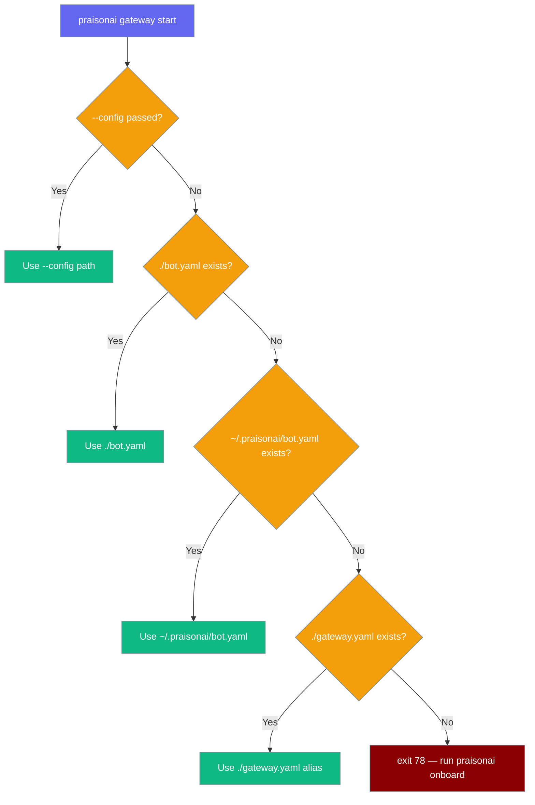
```mermaid
graph TD
    Start[praisonai gateway start] --> Q1{--config passed?}
    Q1 -->|Yes| Use[Use --config path]
    Q1 -->|No| Q2{./bot.yaml exists?}
    Q2 -->|Yes| UseCwd[Use ./bot.yaml]
    Q2 -->|No| Q3{~/.praisonai/bot.yaml exists?}
    Q3 -->|Yes| UseHome[Use ~/.praisonai/bot.yaml]
    Q3 -->|No| Q4{./gateway.yaml exists?}
    Q4 -->|Yes| UseAlias[Use ./gateway.yaml alias]
    Q4 -->|No| Exit[exit 78 — run praisonai onboard]

    classDef start fill:#6366F1,stroke:#7C90A0,color:#fff
    classDef check fill:#F59E0B,stroke:#7C90A0,color:#fff
    classDef ok fill:#10B981,stroke:#7C90A0,color:#fff
    classDef stop fill:#8B0000,stroke:#7C90A0,color:#fff

    class Start start
    class Q1,Q2,Q3,Q4 check
    class Use,UseCwd,UseHome,UseAlias ok
    class Exit stop
```

| Precedence | Source | Notes |
|------------|--------|-------|
| 1 | `--config <path>` / `--agents <path>` | Explicit path always wins |
| 2 | `./bot.yaml` (cwd) | Local project override |
| 3 | `$PRAISONAI_BOT_CONFIG` / `~/.praisonai/bot.yaml` | Env var — `PRAISONAI_HOME`-aware; where `praisonai onboard` writes |
| 4 | `./gateway.yaml` (cwd) | Backward-compatible alias — legacy name |
| — | none | Print onboard hint, exit `78` |

<Note>
`bot.yaml` is the canonical name. `gateway.yaml` continues to load without warning as a backward-compatible alias — it is not the new preferred name. When the optional `praisonai-code` package is installed, its `resolve_bot_config_path` resolver is used; a lean install without it falls through to an equivalent inline resolver that agrees on every path.
</Note>

### `start` with no config

`praisonai gateway start` (no `--config`, no `--agents`) discovers the onboarded config, prints `Using gateway config: <path>`, then binds **with channels** instead of the earlier silent WebSocket-only no-op. If nothing is found it prints a hint and exits `78`:

```bash
$ praisonai gateway start
No gateway config found. Run 'praisonai onboard' to create one, or pass
--config <path> (or --agents <path> for single-agent mode).
$ echo $?
78
```

Passing `--agents <path>` selects single-agent mode and skips channel-config discovery.

### `doctor` / `test` / `status` / `send` / `channels`

These commands default `--config` to a `gateway.yaml` sentinel. When you leave it at the default, they run the **same** discovery order as `start` — so `praisonai gateway doctor` after `praisonai onboard` inspects the onboarded `~/.praisonai/bot.yaml`, not a file onboarding never wrote. An explicit `--config` always wins.

<Note>
The `Path to gateway.yaml [default: gateway.yaml]` help text on these commands resolves to the onboarded `~/.praisonai/bot.yaml` when present — the literal `gateway.yaml` file is only used as the final alias fallback.
</Note>

### Version validation

`praisonai gateway start` also validates the config's `config_version` before binding, applying the same forward-migration `doctor --fix` uses. A config from a newer build **refuses to start** (exit `78`) rather than being silently downgraded. See [Gateway Config Migration › Config version stamp](/features/gateway-config-migration#config-version-stamp).

### What the user sees

The whole reason this discovery exists: before, an onboarded operator who ran `praisonai gateway start` with no flag started silently channel-less, so their Telegram user got no reply.

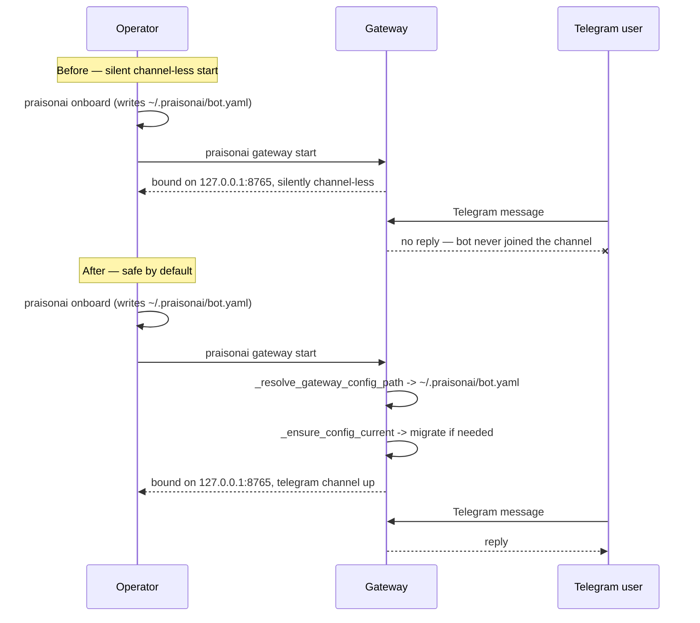
```mermaid
sequenceDiagram
    participant Op as Operator
    participant Gw as Gateway
    participant Us as Telegram user

    Note over Op: Before — silent channel-less start
    Op->>Op: praisonai onboard  (writes ~/.praisonai/bot.yaml)
    Op->>Gw: praisonai gateway start
    Gw-->>Op: bound on 127.0.0.1:8765, silently channel-less
    Us->>Gw: Telegram message
    Gw--x Us: no reply — bot never joined the channel

    Note over Op: After — safe by default
    Op->>Op: praisonai onboard  (writes ~/.praisonai/bot.yaml)
    Op->>Gw: praisonai gateway start
    Gw->>Gw: _resolve_gateway_config_path -> ~/.praisonai/bot.yaml
    Gw->>Gw: _ensure_config_current -> migrate if needed
    Gw-->>Op: bound on 127.0.0.1:8765, telegram channel up
    Us->>Gw: Telegram message
    Gw-->>Us: reply
```

<Warning>
Two behaviours change observably for existing operators — the CLI stopped silently doing the wrong thing.

1. **`gateway start` with no flag now discovers `~/.praisonai/bot.yaml`.** A deploy that relied on the old silent channel-less shape (WebSocket daemon only) now starts with the onboarded channels attached. To keep the old behaviour, point `--config` at a channel-less YAML explicitly, or remove `~/.praisonai/bot.yaml`.
2. **`gateway start` refuses to run a config from a newer build.** A host that pinned an older `praisonaiagents` while keeping a newer config now sees exit `78` at start instead of a silent downgrade. Upgrade the wrapper, or roll the config back to the version the wrapper supports.
</Warning>

For a focused, standalone walkthrough of this resolution, see [Gateway Config Discovery](/features/gateway-config-discovery). Start-time version validation is documented in [Config Migration → At start time](/features/gateway-config-migration#at-start-time).

---

## Pre-flight credential check

`praisonai gateway doctor` validates every channel's token **before** the gateway starts, so a bad or expired credential fails fast with a precise per-channel reason instead of disappearing into the supervisor's silent reconnect loop.

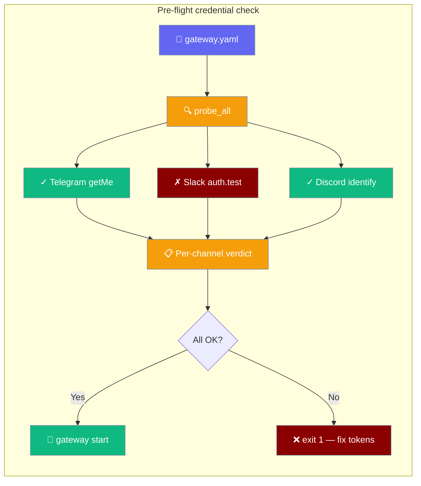
```mermaid
graph LR
    subgraph "Pre-flight credential check"
        Cfg[📄 gateway.yaml] --> Probe[🔍 probe_all]
        Probe --> Tel[✓ Telegram getMe]
        Probe --> Sl[✗ Slack auth.test]
        Probe --> Dis[✓ Discord identify]
        Tel --> Verdict[📋 Per-channel verdict]
        Sl --> Verdict
        Dis --> Verdict
        Verdict --> Exit{All OK?}
        Exit -->|Yes| Start[🚀 gateway start]
        Exit -->|No| Fail[❌ exit 1 — fix tokens]
    end

    classDef input fill:#6366F1,stroke:#7C90A0,color:#fff
    classDef process fill:#F59E0B,stroke:#7C90A0,color:#fff
    classDef ok fill:#10B981,stroke:#7C90A0,color:#fff
    classDef bad fill:#8B0000,stroke:#7C90A0,color:#fff

    class Cfg input
    class Probe,Verdict process
    class Tel,Dis,Start ok
    class Sl,Fail bad
```

### Examples

Quick health check:

```bash
$ praisonai gateway doctor
telegram     ✓  @my_support_bot
slack        ✗  SSL certificate verify failed (network/proxy?). Token may still be valid. Try SSL_CERT_FILE=/path/to/corp-ca.pem or gateway start --no-preflight
discord      ✓  @MySupport
```

A non-SSL failure keeps the bare error string:

```bash
$ praisonai gateway doctor
telegram     ✓  @my_support_bot
slack        ✗  invalid_auth (token expired)
discord      ✓  @MySupport
```

CI-friendly JSON — a **single** document with a `probes` block (and a `secrets` block when any channel uses a [secret reference](/features/gateway-secret-references)):

```bash
$ praisonai gateway doctor --json
{
  "probes": {
    "telegram": {"ok": true,  "platform": "telegram", "bot_username": "my_support_bot"},
    "slack":    {"ok": false, "platform": "slack",    "error": "invalid_auth"},
    "discord":  {"ok": true,  "platform": "discord",  "bot_username": "MySupport"}
  },
  "secrets": {
    "telegram": {"token": "available"},
    "slack":    {"token": "available", "app_token": "configured-but-unavailable"},
    "discord":  {"token": "configured"}
  }
}
```

<Note>
The whole output is now one JSON document (`{probes, secrets}`), parseable with a single `json.loads`. Operator scripts that read the earlier two-document output (a probe block plus a separate availability block) must switch to reading `payload["probes"]`. A weak gateway `auth_token` adds a third top-level key, `gateway_auth_token` — see [Weak-secret check](#weak-secret-check).
</Note>

Same verdict via the listing command:

```bash
$ praisonai gateway channels --probe
```

### Credential availability (without revealing values)

`praisonai gateway doctor` also prints a per-channel **credential availability** table so operators can validate secret wiring — including the [secret-reference form](/features/gateway-secret-references) on `token`, `app_token`, and `verify_token` — without ever printing a value.

```bash
$ praisonai gateway doctor
Credential availability (values never shown):
telegram     token         ✓  available
slack        token         ✓  available
slack        app_token     ✗  configured-but-unavailable
whatsapp     verify_token  ✗  missing
```

| State | Meaning |
|-------|---------|
| `available` | Resolved successfully (env set, file present and non-empty) |
| `configured-but-unavailable` | Configured but cannot resolve (empty file, unreadable, empty env var) |
| `configured` | An `exec` reference — configured, but not executed at probe time |
| `missing` | Not set (env var unset, file not found) |

An `exec`-sourced reference reports `configured` without running its command: the command has side effects (a one-shot / rate-limited / rotating secret-manager call) and the network probe resolves the same reference moments later, so executing it here would run it twice.

These states now map cleanly to runtime isolation at boot — a `configured-but-unavailable` or `missing` channel credential isolates just that channel as degraded rather than aborting the gateway. See [Degraded Channel Isolation](/features/gateway-degraded-channels).

After boot, `GET /health` emits the same `degraded` / `reason: "credential unavailable"` verdict for a channel whose token is rejected **at runtime** (401/403, revoked/rotated/expired) — no new flags. See [Runtime credential rejection](/docs/features/gateway-channel-supervision#runtime-credential-rejection).

The `--json` output is a **single document** with `probes` and `secrets` keys:

```json
{
  "probes":  { "telegram": {"ok": true }, "slack": {"ok": false} },
  "secrets": { "telegram": {"token": "available"},
               "slack":    {"token": "available", "app_token": "configured-but-unavailable"} }
}
```

<Warning>
**Breaking change to the `--json` layout.** Previously `doctor` printed the availability and probe blocks as two separate top-level documents (invalid JSON). It now emits one document with `probes` and `secrets` keys, so `json.loads` can parse the whole output. The `secrets` key is present only when at least one channel configures a credential field.
</Warning>

### Weak-secret check

`gateway doctor` also flags the gateway's own `auth_token` when it matches a well-known placeholder — fails on an external bind, warns on loopback.

On an **external** bind with a weak token, `doctor` prints the full refusal message and exits `1`:

```bash
$ praisonai gateway doctor --config gateway.yaml
Refusing to start: gateway.auth_token is a known-weak/placeholder value.
A publicly-known secret provides no real authentication.
Fix:  praisonai onboard         (30 seconds, 3 prompts)
Or:   export GATEWAY_AUTH_TOKEN="$(openssl rand -hex 16)"  (run in a shell so the command is expanded, not pasted literally)
```

On a **loopback** bind, `doctor` prints a warning and still exits `0`:

```bash
$ praisonai gateway doctor --config gateway.yaml
⚠  gateway.auth_token is a known-weak/placeholder value (loopback bind 127.0.0.1). Rotate before exposing externally.
```

A strong token prints nothing extra — silence is a pass, consistent with the credential-availability table.

The `--json` output gains a top-level `gateway_auth_token` key (present only when the verdict is weak), alongside `probes` and `secrets`. When `--fix` is passed, an optional `fix` key carries the repair report:

```json
{
  "probes":  { "telegram": {"ok": true} },
  "secrets": { "telegram": {"token": "available"} },
  "gateway_auth_token": "weak",
  "fix": "gateway_auth_token: weak → generated a strong token… done\nre-validated: gateway_auth_token now strong"
}
```

| Verdict | Bind | Exit code |
|---|---|---|
| Weak / missing `auth_token` | External | `1` |
| Weak `auth_token` | Loopback | `0` (warning only) |
| Strong `auth_token` | Any | `0` |

<Card title="Weak Secret Guard" icon="shield-exclamation" href="/features/gateway-bind-aware-auth#weak-placeholder-secret-guard">
  Full denylist, bind-aware behaviour matrix, and how to fix a weak `change-me`-style token
</Card>

### Auto-repair with `--fix`

<Tip>
Prefer Python for CI, tests, or per-tenant provisioning? The same repair lifecycle is exposed as `praisonai_bot.repair_gateway_config` — see [Gateway Admin API](/features/gateway-admin-api).
</Tip>

`--fix` repairs safe findings, then re-validates that each finding cleared.

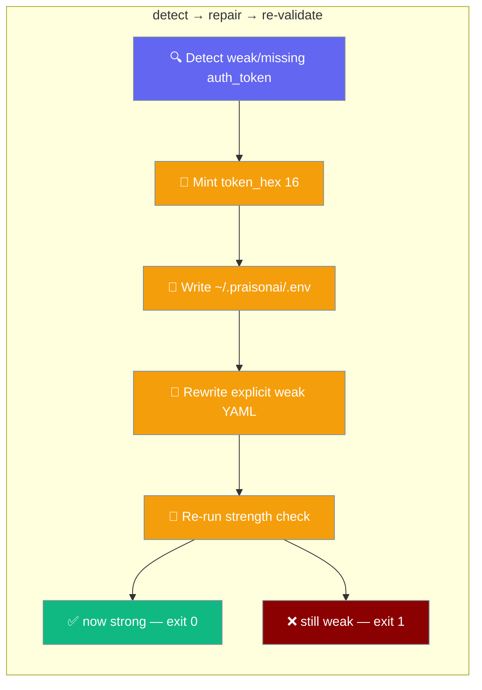
```mermaid
graph LR
    subgraph "detect → repair → re-validate"
        Detect[🔍 Detect weak/missing auth_token] --> Mint[🔑 Mint token_hex 16]
        Mint --> Env[💾 Write ~/.praisonai/.env]
        Env --> Yaml[📄 Rewrite explicit weak YAML]
        Yaml --> Revalidate[🔁 Re-run strength check]
        Revalidate --> OK[✅ now strong — exit 0]
        Revalidate --> Bad[❌ still weak — exit 1]
    end

    classDef input fill:#6366F1,stroke:#7C90A0,color:#fff
    classDef process fill:#F59E0B,stroke:#7C90A0,color:#fff
    classDef ok fill:#10B981,stroke:#7C90A0,color:#fff
    classDef bad fill:#8B0000,stroke:#7C90A0,color:#fff

    class Detect input
    class Mint,Env,Yaml,Revalidate process
    class OK ok
    class Bad bad
```

Repair a weak token, then confirm it cleared:

```bash
$ praisonai gateway doctor --config gateway.yaml --fix
gateway_auth_token: weak → generated a strong token… done
re-validated: gateway_auth_token now strong
```

Preview the repair without writing anything:

```bash
$ praisonai gateway doctor --config gateway.yaml --fix --dry-run
gateway_auth_token: weak → would mint a strong token (--dry-run)
```

| Finding | `--fix` action | Persistence |
|---|---|---|
| `gateway.auth_token` weak/missing | Mint `secrets.token_hex(16)`, export to env, persist to `~/.praisonai/.env` | Survives daemon restart |
| `gateway.auth_token` explicit weak in YAML | Also rewrites `gateway.yaml` in place (preserves `${ENV}` references) | Config file updated |
| Any other finding | Not repaired yet (no dead-end: still surfaced with its own `retry_hint`) | — |

`--dry-run` **still exits `1`** when a repairable finding is present, so CI catches un-fixed states before anything is written.

<Warning>
`--fix` writes to `~/.praisonai/.env` **and** may rewrite an explicit weak `auth_token` in `gateway.yaml` in place. Run `--fix --dry-run` first in production to preview the change. `${ENV}` references in YAML are left untouched — they resolve from the env store the env-var repair already fixed.
</Warning>

### Pre-flight gate on start

`praisonai gateway start` runs the same probe automatically before launch when invoked with `--config gateway.yaml`:

```bash
$ praisonai gateway start --config gateway.yaml
slack        ✗  invalid_auth (token expired)

Pre-flight check failed — aborting start. Fix the channel credentials
above or pass --no-preflight to skip.
```

To bypass during local dev (e.g. flaky probe network):

```bash
praisonai gateway start --config gateway.yaml --no-preflight
```

### Route/binding target check

`praisonai gateway doctor` also validates that every `routes`, `routing`, and `bindings.agent` target names an agent declared in the sibling `agents:` map. A typo — including in the `default` slot — fails with a "did you mean X?" hint instead of silently misrouting traffic.

```bash
$ praisonai gateway doctor --config gateway.yaml
ERROR: Invalid gateway/bot configuration:
channel 'telegram' route 'dm' -> unknown agent 'personl'; did you mean 'personal'? valid agents: personal, support
```

This runs only for multi-agent configs (an `agents:` map is present). Single-bot configs (top-level `platform` + `token`) are unaffected. See [Fail-Fast Validation](/docs/features/gateway-route-bindings#fail-fast-validation) for the full behaviour.

### Corporate CA bundle (SSL-inspecting networks)

On networks that intercept TLS with a corporate CA (proxy / MITM), the probe's HTTP client can reject the certificate chain even though the token is valid and the runtime adapter connects fine. Preflight classifies these SSL cert-verify failures separately and **soft-fails** when they are the only failures.

```bash
$ praisonai gateway start --config gateway.yaml
slack        ✗  SSL certificate verify failed (network/proxy?). Token may still be valid. Try SSL_CERT_FILE=/path/to/corp-ca.pem or gateway start --no-preflight

Pre-flight found SSL certificate-verify failures only (likely a proxy/MITM
network). Tokens may still be valid — continuing start. Set SSL_CERT_FILE /
REQUESTS_CA_BUNDLE / PRAISONAI_SSL_CA_BUNDLE to your corporate CA, or pass
--no-preflight to skip this check.
```

The probe decides its action from the mix of failures:

| Probe outcome (across all channels) | Preflight action |
|-------------------------------------|------------------|
| All channels `ok` | Start proceeds silently. |
| ≥1 channel fails with a non-SSL error (token, network, timeout) | Hard-abort, exit `1`. |
| All failures are SSL cert-verify only | **Soft-fail** — print the SSL warning, continue to start, exit `0`. |
| Mixed: ≥1 SSL cert-verify **and** ≥1 token/network failure | Hard-abort (the non-SSL failure wins), exit `1`. |

<Warning>
Only certificate-verify failures soft-fail. Other TLS handshake failures — `WRONG_VERSION_NUMBER`, `NO_SHARED_CIPHER`, `HANDSHAKE_FAILURE` — still hard-abort, because they usually indicate a real bug that also breaks the channel at runtime.
</Warning>

Point the probe at your corporate CA with one of three env vars, highest precedence first:

| Variable | Precedence | Behaviour |
|----------|------------|-----------|
| `PRAISONAI_SSL_CA_BUNDLE` | Highest — explicit PraisonAI override | Overrides pre-existing `SSL_CERT_FILE` and `REQUESTS_CA_BUNDLE` for the probe. |
| `REQUESTS_CA_BUNDLE` | Middle | Used only if `PRAISONAI_SSL_CA_BUNDLE` is unset. Left alone when the winner came from elsewhere. |
| `SSL_CERT_FILE` | Lowest — Python default | Read by Python's default `ssl` context (used by `aiohttp`). Used only if the two above are unset. |

```bash
export PRAISONAI_SSL_CA_BUNDLE=/path/to/corp-ca.pem
praisonai gateway start --config gateway.yaml
```

A configured-but-missing path warns and leaves the SSL env vars untouched:

```
Warning: CA bundle path '<path>' does not exist — SSL_CERT_FILE / REQUESTS_CA_BUNDLE not updated for probe.
```

<Tip>
The runtime adapter reads the same three env vars, so setting one fixes both the preflight probe and long-lived channel connections.
</Tip>

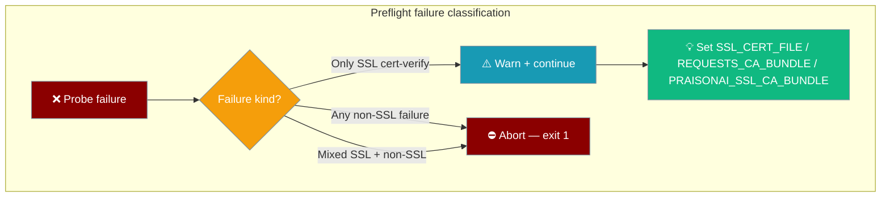
```mermaid
graph TB
    subgraph "Preflight failure classification"
        Fail[❌ Probe failure] --> Kind{Failure kind?}
        Kind -->|Only SSL cert-verify| Soft[⚠️ Warn + continue]
        Kind -->|Any non-SSL failure| Hard[⛔ Abort — exit 1]
        Kind -->|Mixed SSL + non-SSL| Hard
        Soft --> Hint[💡 Set SSL_CERT_FILE / REQUESTS_CA_BUNDLE / PRAISONAI_SSL_CA_BUNDLE]
    end

    classDef fail fill:#8B0000,stroke:#7C90A0,color:#fff
    classDef gate fill:#F59E0B,stroke:#7C90A0,color:#fff
    classDef soft fill:#189AB4,stroke:#7C90A0,color:#fff
    classDef hard fill:#8B0000,stroke:#7C90A0,color:#fff
    classDef ok fill:#10B981,stroke:#7C90A0,color:#fff

    class Fail fail
    class Kind gate
    class Soft soft
    class Hard hard
    class Hint ok
```

### Token resolution

The probe loads `~/.praisonai/.env` first, so `${VAR}` placeholders set by `praisonai onboard` resolve exactly like they do at runtime — `doctor`, `channels --probe`, and `start --preflight` all share the same token-resolution path.

### Per-channel timeout

Each probe is bounded by a 15-second deadline; a stuck adapter is reported as `"probe timed out after 15s"` and does not hang the aggregate.

### Exit codes

| Outcome | Exit code |
|---|---|
| All channels probe OK | `0` |
| Any channel fails | `1` |
| Weak / missing gateway `auth_token` on an external bind | `1` |
| Weak gateway `auth_token` on a loopback bind (warning only) | `0` |
| `gateway doctor` with no channels configured | `0` |

### When to use which

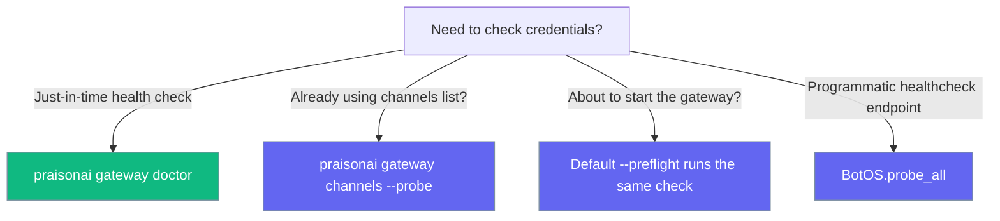
```mermaid
graph TB
    Q[Need to check credentials?] -->|Just-in-time health check| Doctor[praisonai gateway doctor]
    Q -->|Already using channels list?| WithList[praisonai gateway channels --probe]
    Q -->|About to start the gateway?| Auto[Default --preflight runs the same check]
    Q -->|Programmatic healthcheck endpoint| Python[BotOS.probe_all]

    classDef pick fill:#10B981,stroke:#7C90A0,color:#fff
    classDef alt fill:#6366F1,stroke:#7C90A0,color:#fff
    class Doctor pick
    class WithList,Auto,Python alt
```

<AccordionGroup>
  <Accordion title="Programmatic check (Python)">

```python
import asyncio
from praisonai.bots import Bot, BotOS

botos = BotOS(
    bots=[
        Bot("telegram", token="..."),
        Bot("slack",    token="..."),
    ],
    enable_supervision=False,
)

results = asyncio.run(botos.probe_all(timeout=15.0))
for platform, r in results.items():
    print(platform, "ok" if r.ok else r.error)
```

  </Accordion>
</AccordionGroup>

---

## Pre-flight tool check

`praisonai gateway start` validates every tool named in your config **before** the gateway binds, so a typo or an uninstalled optional package fails fast with a per-name reason instead of silently starting a quietly under-powered bot.

<Warning>
**Default changed 2026-07-31.** Before PR #3555 an unresolved tool was silently skipped with only a log warning. The default is now `--strict-tools`, which aborts start with exit `78` and a per-name fix hint. Configs with typo'd or unavailable tools that previously started will now fail — pass `--no-strict-tools` or set `strict_tools: false` in `gateway.yaml` to restore the old warn-and-continue behaviour.
</Warning>

This gate runs one layer above the core resolver's `PRAISONAI_STRICT_TOOLS` / `ToolResolutionError` mechanism — it fires at start-time, before `GatewayHandler.start()` builds any agent. See [Tool Resolution](/features/tool-resolution) for the complementary core-resolver behaviour.

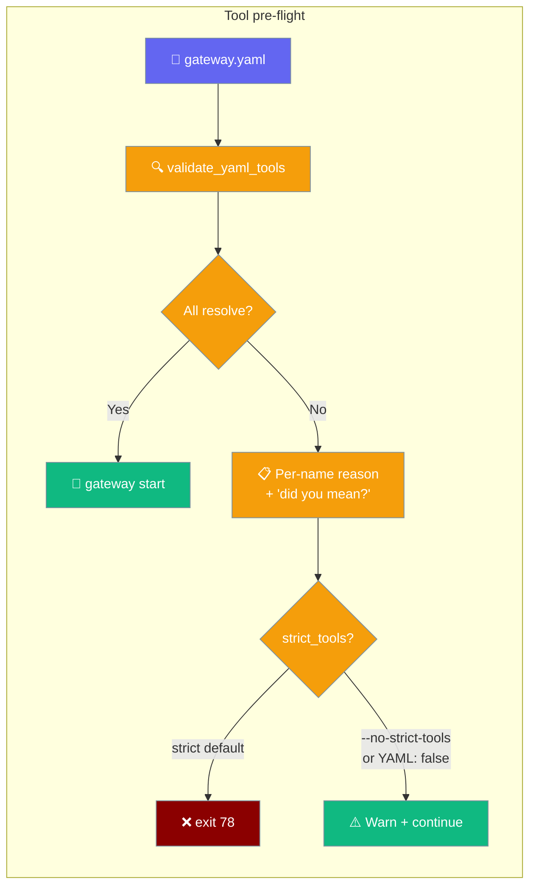
```mermaid
graph LR
    subgraph "Tool pre-flight"
        Cfg[📄 gateway.yaml] --> Probe[🔍 validate_yaml_tools]
        Probe --> All{All resolve?}
        All -->|Yes| Start[🚀 gateway start]
        All -->|No| Reasons[📋 Per-name reason<br/>+ 'did you mean?']
        Reasons --> Mode{strict_tools?}
        Mode -->|strict default| Fail[❌ exit 78]
        Mode -->|--no-strict-tools<br/>or YAML: false| Warn[⚠️ Warn + continue]
    end

    classDef input fill:#6366F1,stroke:#7C90A0,color:#fff
    classDef process fill:#F59E0B,stroke:#7C90A0,color:#fff
    classDef ok fill:#10B981,stroke:#7C90A0,color:#fff
    classDef bad fill:#8B0000,stroke:#7C90A0,color:#fff

    class Cfg input
    class Probe,Reasons,All,Mode process
    class Start,Warn ok
    class Fail bad
```

### Strict mode (default) — fail fast

```bash
$ praisonai gateway start --config gateway.yaml
✗ Tool pre-flight failed:
    - 'duckduckgo_serch' not found. Did you mean 'duckduckgo'?
  Fix the names in your config, or start with --no-strict-tools to run without them.
$ echo $?
78
```

### Non-strict — warn and continue

Two equivalent ways:

<Tabs>
<Tab title="CLI flag">
```bash
praisonai gateway start --config gateway.yaml --no-strict-tools
```
</Tab>

<Tab title="YAML key">
```yaml
# gateway.yaml
strict_tools: false
agents:
  assistant:
    instructions: "..."
    tools: [duckduckgo_serch]        # unresolved but tolerated
```
</Tab>
</Tabs>

Either produces:

```
⚠ Tool pre-flight (non-strict) — starting without:
    - 'duckduckgo_serch' not found. Did you mean 'duckduckgo'?
```

### "Did you mean?" mechanics

Suggestions use stdlib `difflib.get_close_matches` (cutoff `0.7`, one suggestion per unknown). A tool that is registered but currently unloadable (e.g. an optional package not installed) is excluded from its own candidates, so it yields an install hint rather than suggesting the same name back:

```
'firecrawl' not found in any source. Check the spelling, install the package
that provides it, or set PRAISONAI_ALLOW_LOCAL_TOOLS=true for a local tools.py.
```

A project `tools.py` that exists but is gated by the local-tools env var is flagged explicitly:

```
'my_local' not found. A local tools.py exists but local tools are disabled;
set PRAISONAI_ALLOW_LOCAL_TOOLS=true to enable it.
```

An unknown toolset name is reported the same way:

```
    - toolset:research not found (unknown toolset)
```

### Precedence

| Setting | Result |
|---------|--------|
| YAML `strict_tools: false` | Gate disabled (regardless of CLI flag) |
| CLI `--no-strict-tools` | Gate disabled for this invocation |
| CLI `--strict-tools` (default) with no YAML override | Gate strict → fail fast on any unresolved tool |
| No unresolved tools | Pre-flight is silent, start proceeds |

YAML `strict_tools: false` opts a bot out permanently; `--no-strict-tools` is per-invocation. A strict CLI default does **not** override a YAML `strict_tools: false`.

### Env loading

The gate loads `~/.praisonai/.env` before resolving, so `PRAISONAI_ALLOW_LOCAL_TOOLS=true` stored there by `praisonai onboard` is honoured and a gated local `tools.py` is not falsely reported as unresolved. The load is idempotent and existing process env wins — `GatewayHandler.start()` re-loads the same file moments later.

### Exit code

Strict failure exits with `78` (`EX_CONFIG`), which the OS units generated by `praisonai gateway install` treat as **do-not-restart** — an unresolvable tool in the config would loop the daemon otherwise. See [Gateway Exit Codes](/features/gateway-exit-codes).

---

## Environment Variables

| Variable | Description | Default |
|----------|-------------|----------|
| `GATEWAY_PORT` | Port for start/stop/status when --port is not passed | `8765` |

<Note>
The `GATEWAY_PORT` environment variable is used by `start`, `stop`, and `status` commands when the `--port` option is not explicitly provided. Invalid values silently fall back to `8765`.
</Note>

---

## Supervisor exit codes

`praisonai gateway start` returns a supervisor-friendly exit code so a service manager (launchd / systemd / a scheduled task) knows whether to restart the gateway or stop and wait for an operator.

| Code | Meaning | When you see it |
|------|---------|-----------------|
| `0` | Clean shutdown / success | Ctrl+C, `SIGTERM` drain, `stop`, a healthy `status` |
| `75` | Transient failure — supervisor should restart | Network blip, port contention, transient IO |
| `78` | Fatal configuration error — supervisor should stop | Bad `gateway.yaml`, no platforms, duplicate token, unresolved strict tool |

The installed OS unit maps `78` (`EX_CONFIG`) to **do-not-restart** so a broken config cannot crash-loop the daemon, and treats `75` (`EX_TEMPFAIL`) as restartable. See [Gateway Exit Codes](/features/gateway-exit-codes) for the full contract and per-platform wiring.

<Note>
The `doctor` verb uses a simpler `0` / `1` scheme (pass / fix-me) documented under [Pre-flight credential check → Exit codes](#exit-codes) — that is separate from the `start` supervisor protocol above.
</Note>

---

## Single-Instance Enforcement

PraisonAI enforces a single gateway instance per host:port combination using PID locks.

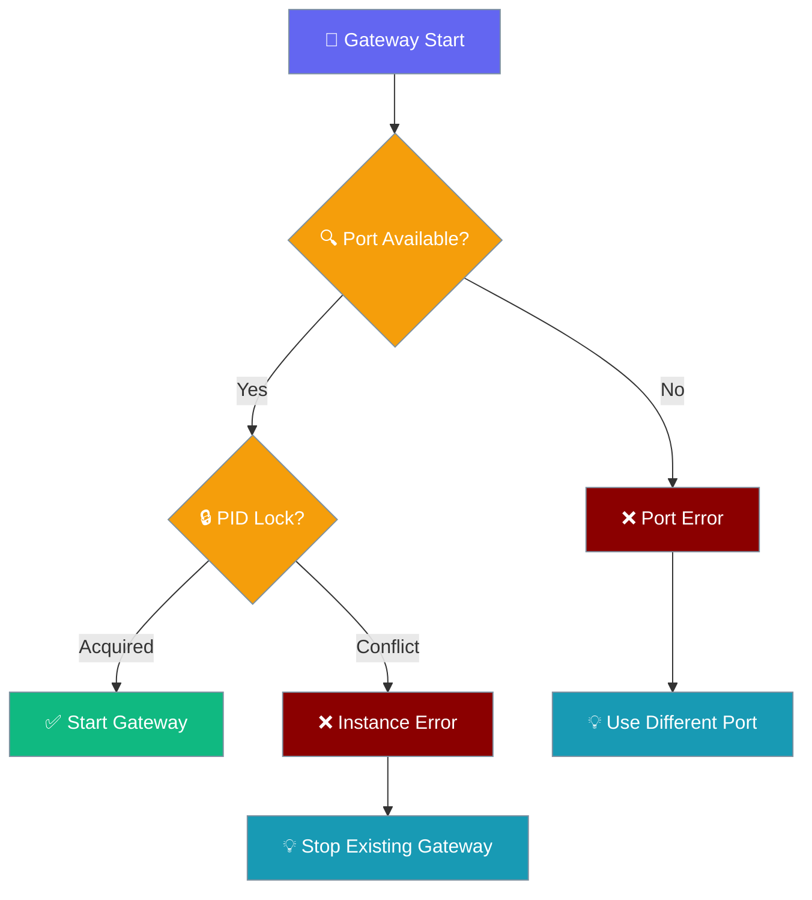
```mermaid
graph TB
    Start[🚀 Gateway Start] --> PortCheck{🔍 Port Available?}
    PortCheck -->|Yes| PIDLock{🔒 PID Lock?}
    PortCheck -->|No| Error1[❌ Port Error]
    PIDLock -->|Acquired| Success[✅ Start Gateway]
    PIDLock -->|Conflict| Error2[❌ Instance Error]
    Error1 --> Stop1[💡 Use Different Port]
    Error2 --> Stop2[💡 Stop Existing Gateway]
    
    classDef start fill:#6366F1,stroke:#7C90A0,color:#fff
    classDef check fill:#F59E0B,stroke:#7C90A0,color:#fff
    classDef success fill:#10B981,stroke:#7C90A0,color:#fff
    classDef error fill:#8B0000,stroke:#7C90A0,color:#fff
    classDef solution fill:#189AB4,stroke:#7C90A0,color:#fff
    
    class Start start
    class PortCheck,PIDLock check
    class Success success
    class Error1,Error2 error
    class Stop1,Stop2 solution
```

**Lock File Location:** `~/.praisonai/gateway-<safe_host>-<port>.pid`

The `safe_host` replaces `:` and `.` with `_` (so `127.0.0.1` becomes `127_0_0_1`). Each host:port combination gets its own lock file, allowing multiple gateways on different ports.

### PID-Lock Status Reference

`praisonai gateway status` prints one PID-lock line before the `/health` probe. Look up any line you see:

| Line printed | When |
|---|---|
| `Gateway PID lock: Process <pid> running (<host>:<port>)` | Lock file exists, PID responds to `os.kill(pid, 0)` |
| `Gateway PID lock: Stale lock (process <pid> not running)` | Lock file exists, PID no longer responds (including Windows `SystemError`/`ValueError` cases) |
| `Gateway PID lock: No lock file found` | No lock file at `~/.praisonai/gateway-<safe_host>-<port>.pid` |
| `PID lock status: Utilities not available` | `port_utils` import failed (`ImportError`) |
| `PID lock status: Unavailable (<error>)` | Any other unexpected exception during PID-lock inspection; the `/health` probe still runs |

The port line (`Port <host>:<port>: In use` / `Available`) follows the same section unless PID-lock inspection fails, in which case the single `PID lock status: Unavailable (<error>)` line replaces both.

---

## Restart the Gateway

Use `praisonai gateway restart` — it drains in-flight turns, then relaunches (via the installed service manager when present, otherwise directly).

```bash
# Simple restart with default 10s drain
praisonai gateway restart

# Restart pointing at a config (needed only for the direct-relaunch fallback)
praisonai gateway restart --config gateway.yaml

# Longer drain window for slow agent turns
praisonai gateway restart --drain-timeout 30

# Restart a gateway running on a non-default endpoint
praisonai gateway restart --host 127.0.0.1 --port 9000
# equivalently:  GATEWAY_PORT=9000 praisonai gateway restart
```

<Note>
`gateway restart` is **daemon-aware**: if the gateway is installed as an OS service (`praisonai gateway install`), the platform service manager restarts it (`launchctl kickstart -k`, `systemctl --user restart praisonai-bot`, or `schtasks /End && /Run`) so the installed unit's launch flags are preserved. Otherwise the CLI drains the running PID and relaunches directly in the foreground.
</Note>

<Note>
The **direct** (non-service) fallback now replays the CLI-only flags the original process was started with (`--openai-api`, `--mcp`, `--reliability`, `--max-concurrent-runs`, `--queue-depth`, `--overflow-policy`, `--identity-store`, `--scale-to-zero`, `--idle-minutes`, `--drain-marker`, `--agents`, `--config`, `--drain-timeout`) from a persisted start-flags artefact — see [Persisted start-flags artefact](#persisted-start-flags-artefact). Flags passed explicitly to `restart` still win; anything else replays the value the running process was launched with.
</Note>

### Options

| Flag | Type | Default | Description |
|------|------|---------|-------------|
| `--host` | `str` | `127.0.0.1` | Gateway host (used to locate the running instance) |
| `--port` | `int` | `GATEWAY_PORT` env, else `8765` | Gateway port |
| `--config` | `str` | none | Path to `gateway.yaml` for direct-relaunch fallback |
| `--agents` | `str` | none | Path to agent configuration file for direct-relaunch fallback |
| `--drain-timeout` | `Optional[float]` | _persisted start value, else `10.0`_ | Seconds to wait for in-flight agent turns before relaunch. Omit to replay the persisted start value; explicit value wins over the persisted one and applies to both the OLD-process drain and the relaunch. |

### Persisted start-flags artefact

`praisonai gateway start` persists the CLI-only runtime flags it was launched with to `~/.praisonai/gateway.start.<host>.<port>.json` so a later `praisonai gateway restart` (direct, non-service path) reproduces the exact posture instead of silently reverting to defaults.

```mermaid
sequenceDiagram
    participant Op as Operator
    participant Start as gateway start
    participant Disk as gateway.start.host.port.json
    participant Restart as gateway restart

    Op->>Start: gateway start --openai-api --reliability production --max-concurrent-runs 8
    Note over Start: validate config / agents / bind slot
    Start->>Disk: write { openai_api, reliability, max_concurrent_runs }
    Start-->>Op: bound on 127.0.0.1:8765

    Op->>Restart: gateway restart
    Restart->>Disk: load persisted flags
    Restart->>Start: relaunch (persisted, drain = persisted OR 10.0)
    Start-->>Op: same posture, no silent revert

    classDef op fill:#8B0000,stroke:#7C90A0,color:#fff
    classDef cli fill:#189AB4,stroke:#7C90A0,color:#fff
    classDef disk fill:#6366F1,stroke:#7C90A0,color:#fff

    class Op op
    class Start,Restart cli
    class Disk disk
```

**Path:** `~/.praisonai/gateway.start.<safe_host>.<port>.json` (or `$PRAISONAI_HOME/gateway.start.<safe_host>.<port>.json` when set). `safe_host` replaces `:` with `_`, so IPv6 hosts work. The artefact is keyed by host:port — multiple gateways on one machine each keep their own posture.

**Persisted keys** (only non-`None` values are stored — `None` means "fall back to YAML"):

| Key | Corresponds to |
|-----|----------------|
| `agent_file` | `--agents` |
| `config_file` | `--config` |
| `drain_timeout` | `--drain-timeout` |
| `max_concurrent_runs` | `--max-concurrent-runs` |
| `queue_depth` | `--queue-depth` |
| `overflow_policy` | `--overflow-policy` |
| `reliability` | `--reliability` |
| `openai_api` | `--openai-api` |
| `mcp` | `--mcp` |
| `identity_store` | `--identity-store` |
| `scale_to_zero` | `--scale-to-zero` |
| `idle_minutes` | `--idle-minutes` |
| `drain_marker` | `--drain-marker` |

**Write timing:** the artefact is written **only after** startup validation passes (config parse, agent-file parse, admission wiring), immediately before the gateway binds. A `start` attempt that fails validation on the same host:port never clobbers the running gateway's saved posture — otherwise the next `restart` would faithfully replay a rejected attempt.

<Note>
On restart, `gateway restart` prints `Replaying persisted start flags: <sorted keys>` before relaunching, so operators see exactly which flags were replayed.
</Note>

**Precedence on `restart`:**

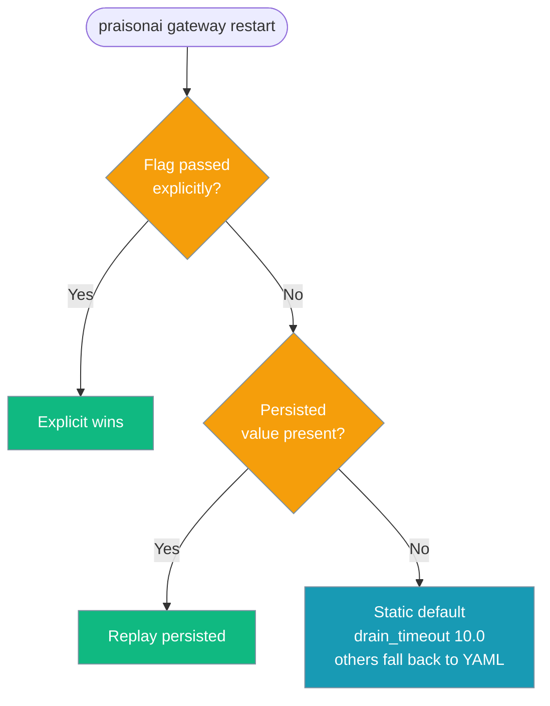
```mermaid
graph TB
    Start([praisonai gateway restart]) --> Explicit{Flag passed<br/>explicitly?}
    Explicit -->|Yes| ExplicitWins[Explicit wins]
    Explicit -->|No| Persisted{Persisted<br/>value present?}
    Persisted -->|Yes| PersistedWins[Replay persisted]
    Persisted -->|No| Default[Static default<br/>drain_timeout 10.0<br/>others fall back to YAML]

    classDef q fill:#F59E0B,stroke:#7C90A0,color:#fff
    classDef ok fill:#10B981,stroke:#7C90A0,color:#fff
    classDef info fill:#189AB4,stroke:#7C90A0,color:#fff

    class Explicit,Persisted q
    class ExplicitWins,PersistedWins ok
    class Default info
```

An **omitted** `--drain-timeout` on `restart` no longer forces a fixed 10s window; it replays the persisted value (and only falls back to `10.0` when nothing is persisted). An **explicit** `--drain-timeout` still wins over the persisted value for **both** the OLD-process drain and the relaunch, so a long configured drain is not silently cut off. Fixes [#3349](https://github.com/MervinPraison/PraisonAI/issues/3349).

<Tip>
On **Windows**, `gateway restart` aborts if `schtasks /End` fails — this prevents a duplicate / colliding gateway relaunch that the raw `/End && /Run` chain would silently produce.
</Tip>

### Advanced: OS-native restart

If you need to bypass the CLI (e.g. from a systemd `ExecStartPre`), the same platform commands the daemon dispatcher uses are:

<Tabs>
<Tab title="macOS">
```bash
launchctl kickstart -k gui/$(id -u)/ai.praison.bot
```
</Tab>

<Tab title="Linux">
```bash
systemctl --user restart praisonai-bot
```
</Tab>

<Tab title="Windows">
```bash
schtasks /End /TN PraisonAIGateway && schtasks /Run /TN PraisonAIGateway
```
</Tab>
</Tabs>

<Warning>
Bypassing `gateway restart` skips the graceful drain — in-flight agent turns will be interrupted mid-response. Prefer the CLI verb.
</Warning>

---

## Status Output Examples

### Healthy Gateway
```bash
$ praisonai gateway status
Gateway PID lock: Process 12345 running (127.0.0.1:8765)
Port 127.0.0.1:8765: In use
Daemon service: Running (launchd)
Process ID: 12345
Gateway server: Reachable at http://127.0.0.1:8765/health
  Status: healthy
  Uptime: 3600.5 seconds
  Agents: 2
  Sessions: 1
  Clients: 3
  Channels: 2 configured
```

### PID Lock Unavailable (Windows)
```bash
$ praisonai-bot gateway status --port 18789
PID lock status: Unavailable (kill returned a result with an exception set)
Gateway Status: healthy
  Uptime: 11.4s
  Agents: 1
  Sessions: 0
  Clients: 0
```

<Note>
On Windows, `os.kill(pid, 0)` can raise `SystemError`. From PraisonAI ≥ v4.6.141 the PID-lock inspection is advisory only — this line replaces `Gateway PID lock: …` / `Port …: …` when the check fails, and the `/health` probe still runs so you still see the real status.
</Note>

### Daemon Issues
```bash
$ praisonai gateway status
Daemon service: Installed but not running (launchd)
Gateway not reachable at http://127.0.0.1:8765/health
```

### Not Installed
```bash
$ praisonai gateway status --daemon-only
Daemon service: Not installed (systemd)
```

---

## Platform Support

Gateway CLI works across platforms with native daemon integration:

| Platform | Service Type | Log Location | Management |
|----------|--------------|--------------|------------|
| **macOS** | LaunchAgent (`ai.praison.bot`) | `~/.praisonai/logs/bot-stderr.log` | `launchctl kickstart -k gui/$(id -u)/ai.praison.bot` |
| **Linux** | systemd user service (`praisonai-bot`) | `journalctl --user -u praisonai-bot` | `systemctl --user restart praisonai-bot` |
| **Windows** | Scheduled Task (`PraisonAIGateway`) | Windows Event Log | `schtasks /End /TN PraisonAIGateway && schtasks /Run /TN PraisonAIGateway` |

<Note>
Each generated unit stops (not restarts) on the gateway's fatal-config exit code (78, `EX_CONFIG`) — systemd via `RestartPreventExitStatus=78`, launchd via `KeepAlive`/`ThrottleInterval`, Windows via a `.cmd` wrapper that maps `78` to a clean exit. See [Gateway Exit Codes](/features/gateway-exit-codes).
</Note>

---

## Configuration Files

<Tabs>
<Tab title="agents.yaml">
```yaml
# Simple agent configuration
agent:
  name: "support"
  instructions: "You are a helpful support agent"
  model: "gpt-4o-mini"
  tools:
    - search_web
  memory: true
```
</Tab>

<Tab title="gateway.yaml">
```yaml
# Multi-bot configuration
identity:
  enabled: true                       # one session per paired user across channels (#3020)
  store: ~/.praisonai/identity.json   # optional; ~ expanded, `path:` accepted as alias

# Opt into the pre-2026-07-31 warn-and-continue behaviour permanently.
# Omit (or set true) to fail fast on any unresolved tool at start (#3553).
strict_tools: false

agents:
  support:
    instructions: "You are a support agent"
    model: "gpt-4o-mini"
  sales:
    instructions: "You are a sales agent"
    model: "claude-3-5-sonnet-20241022"

channels:
  telegram:
    token: "${TELEGRAM_BOT_TOKEN}"
    routing:
      default: support
  discord:
    token: "${DISCORD_BOT_TOKEN}"
    routing:
      default: sales
  slack:
    # Secret-reference form: read from a mounted file / secret manager
    # instead of plaintext or a process-wide env var.
    token: { source: file, id: /run/secrets/slack_token }
    app_token: { source: exec, id: "vault read -field=token secret/slack" }
    routing:
      default: support
```

See [Secret References](/features/gateway-secret-references) for the full `{ source, id }` form on `token`, `app_token`, and `verify_token`.
</Tab>
</Tabs>

---

## Common Patterns

### Diagnose → repair → verify

Inspect first, repair only if needed, then confirm the gateway came back healthy.

```bash
praisonai gateway doctor          # read-only report
praisonai gateway doctor --fix    # apply safe repairs, then re-validate
praisonai gateway status --deep   # per-channel rows + reload state
```

### Zero-downtime posture change

`restart` drains in-flight turns for the given window, then relaunches — replaying the launch posture saved in `~/.praisonai/gateway.start.<host>.<port>.json`, so the process comes back with the same flags it was started with.

```bash
praisonai gateway restart --drain-timeout 60
```

### Add an inbound trigger

Register a webhook that hands inbound events to an agent and delivers the reply to a channel.

```bash
praisonai gateway hooks add gmail --agent triage-agent --deliver-to slack:C123
praisonai gateway hooks list
```

---

## Best Practices

<AccordionGroup>
  <Accordion title="Use daemon-only for health checks">
    Use `--daemon-only` flag when monitoring daemon status in scripts or CI/CD pipelines to avoid gateway connection attempts.
  </Accordion>
  
  <Accordion title="Check logs for troubleshooting">
    Always check `praisonai gateway logs` when the daemon is running but gateway is unreachable - this reveals startup errors.
  </Accordion>
  
  <Accordion title="Test channel configuration">
    Use `praisonai gateway send` to test channel bot configuration before deploying to production environments.
  </Accordion>
  
  <Accordion title="Monitor daemon status regularly">
    Set up monitoring that runs `praisonai gateway status --daemon-only` to detect service failures quickly.
  </Accordion>

  <Accordion title="Set a runtime flag once — every restart replays it">
    Stop, restart with the new flag once, and every subsequent `praisonai gateway restart` replays it automatically — `~/.praisonai/gateway.start.<host>.<port>.json` is your on-host record of what the process was launched with. To reset, delete the artefact.
  </Accordion>

  <Accordion title="Reset to YAML defaults by deleting the artefact">
    `rm ~/.praisonai/gateway.start.<safe_host>.<port>.json` before the next restart to revert to the YAML defaults (or an empty CLI baseline). A corrupt or unreadable artefact is treated as absent — the restart falls back to explicit flags and defaults.
  </Accordion>
</AccordionGroup>

---

## Related

<CardGroup cols={2}>
  <Card title="Gateway Server" icon="tower-broadcast" href="/features/gateway">
    Gateway architecture and configuration
  </Card>
  <Card title="Config Discovery" icon="folder-magnifying-glass" href="/features/gateway-config-discovery">
    Where every `gateway` command looks for the config when `--config` is omitted
  </Card>
  <Card title="Troubleshooting" icon="wrench" href="/guides/troubleshoot-gateway">
    Common gateway issues and solutions
  </Card>
  <Card title="Secret References" icon="key" href="/features/gateway-secret-references">
    Load credentials from files, env vars, or secret managers
  </Card>
  <Card title="Cross-Platform Sessions" icon="users-rectangle" href="/features/cross-platform-mirror">
    `--identity-store` — one session per user across channels
  </Card>
  <Card title="Route Bindings" icon="route" href="/features/gateway-route-bindings#fail-fast-validation">
    Fail-fast validation — route/binding typos caught at config load
  </Card>
  <Card title="Exit Codes" icon="circle-exclamation" href="/features/gateway-exit-codes">
    Exit `78` from the strict tool pre-flight — do-not-restart contract
  </Card>
  <Card title="Tool Resolution" icon="screwdriver-wrench" href="/features/tool-resolution">
    Core-resolver `PRAISONAI_STRICT_TOOLS` — complementary to this start-time gate
  </Card>
</CardGroup>