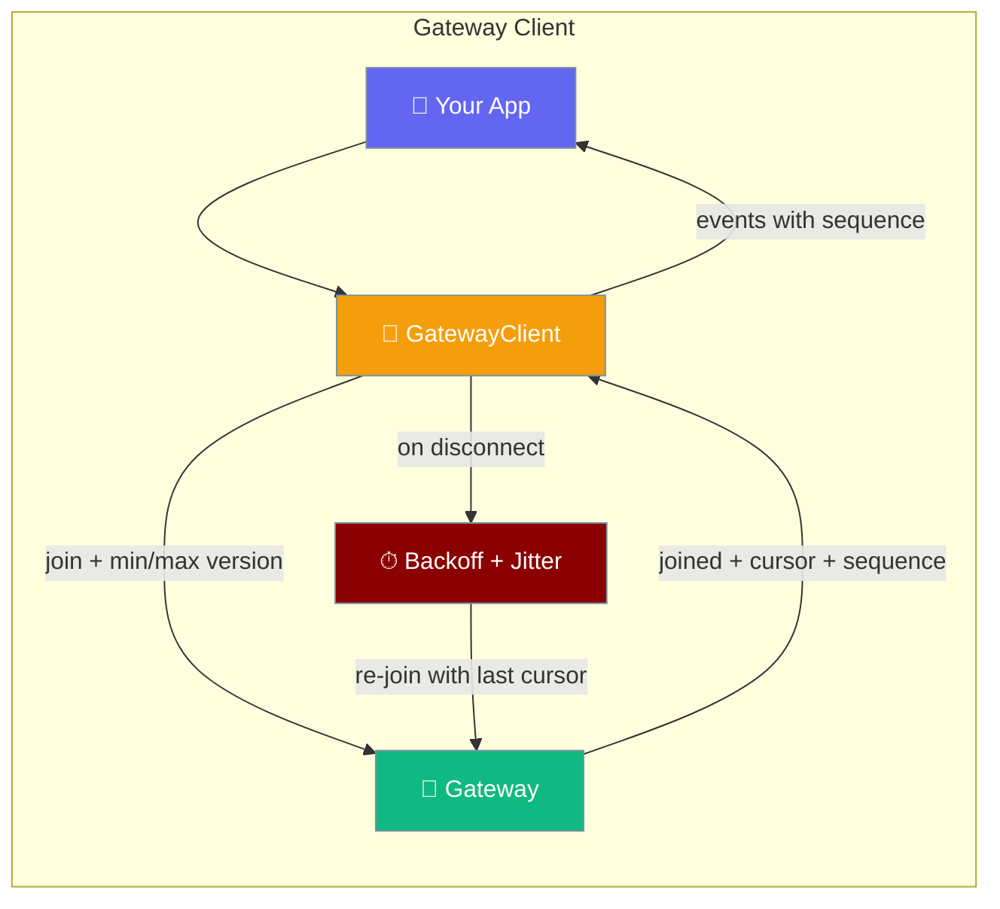
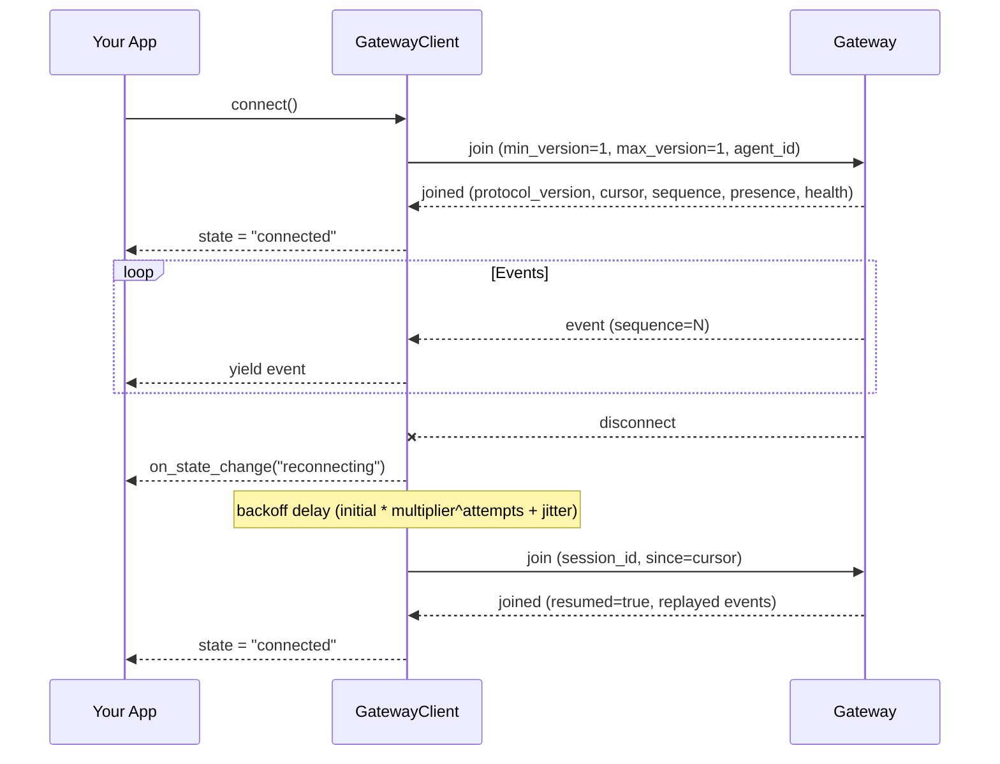
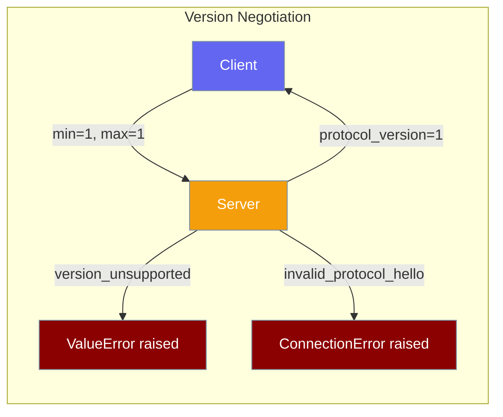
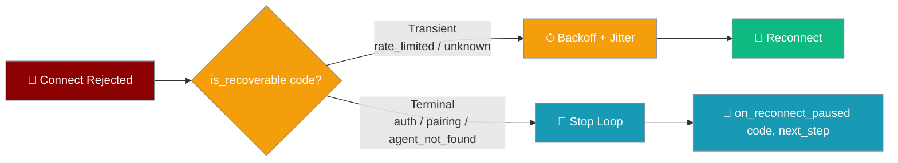
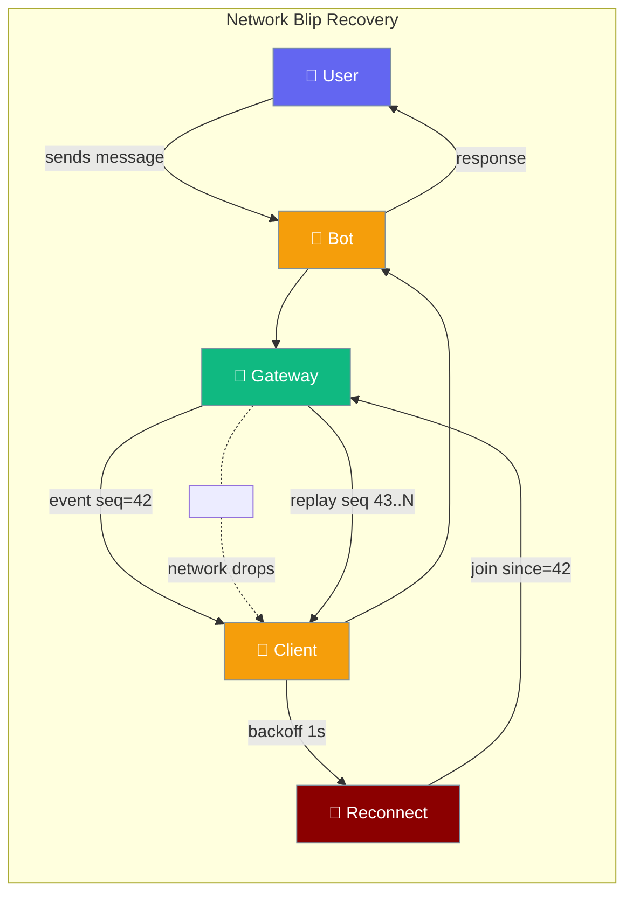

<Note>
The gateway now ships in the `praisonai-bot` package. `praisonai serve gateway` still works exactly as documented here; for a standalone install see [praisonai-bot Migration](/docs/guides/praisonai-bot-migration).
</Note>


```python
from praisonaiagents import Agent

agent = Agent(name="gateway-client", instructions="Connect to the gateway as a client.")
agent.start("Send a message through the gateway client.")
```


`GatewayClient` is a reconnecting WebSocket client that handles version negotiation, exponential backoff with jitter, and event-sequence gap detection — so your integration stays connected without you writing the socket loop.

```python
import asyncio
from praisonai.gateway import GatewayClient

async def main():
    client = GatewayClient(url="ws://localhost:8765", agent_id="my-agent", reconnect=True)
    await client.connect()
    async for event in client.events():
        print(event.type)

asyncio.run(main())
```


The user’s integration connects with `GatewayClient`; the client negotiates the handshake, streams events, and reconnects after disconnects.



## Quick Start

<Steps>

<Step title="Simplest Usage">
```python
import asyncio
from praisonai.gateway import GatewayClient

async def main():
    client = GatewayClient(
        url="ws://localhost:8765",
        agent_id="my-agent",
        reconnect=True
    )

    await client.connect()

    async for event in client.events():
        print(f"Event: {event.type}, Data: {event.data}")

asyncio.run(main())
```
</Step>

<Step title="With Backoff Tuning">
```python
import asyncio
from praisonai.gateway import GatewayClient, BackoffConfig

async def main():
    client = GatewayClient(
        url="ws://localhost:8765",
        agent_id="my-agent",
        reconnect=True,
        backoff=BackoffConfig(
            initial=1.0,
            max=30.0,
            multiplier=2.0,
            jitter=0.2
        )
    )

    await client.connect()

    async for event in client.events():
        print(f"Event: {event.type}")

asyncio.run(main())
```
</Step>

<Step title="With Gap and State Callbacks">
```python
import asyncio
from praisonai.gateway import GatewayClient, BackoffConfig

async def main():
    client = GatewayClient(
        url="ws://localhost:8765",
        agent_id="my-agent",
        reconnect=True,
    )

    def on_gap(expected: int, received: int):
        print(f"Gap detected: expected {expected}, got {received}")
        asyncio.create_task(client.resync())

    def on_state_change(state: str):
        print(f"Connection state changed: {state}")

    client.on_gap = on_gap
    client.on_state_change = on_state_change

    await client.connect()

    async for event in client.events():
        print(f"Event: {event.type}")

asyncio.run(main())
```
</Step>

</Steps>

---

## How It Works



| Stage | What happens |
|-------|--------------|
| **Connect** | TCP/WS opened; `join` includes `min_version`, `max_version`, optional `agent_id`, `token` |
| **Negotiate** | Server picks `min(client_max, MAX_PROTOCOL_VERSION)` or rejects with `version_unsupported` |
| **Stream** | Each event carries a monotonic `sequence`; client tracks `_expected_sequence` |
| **Drop** | `on_state_change("reconnecting")` fires; backoff with jitter (`initial * multiplier^attempts`, clamped to `max`). A server-supplied `retry_after_seconds` from the last rejection is honoured **once** as a lower bound on the next backoff delay, then cleared |
| **Resume** | Re-`join` with `session_id` + `since=cursor`; server replays from cursor; `presence` + `health` returned |
| **Gap** | If received `sequence` ≠ expected, `on_gap(expected, received)` fires; caller can `await client.resync()` |

<Note>
Calling `client.connect()` on an instance whose previous loop had a server-supplied `retry_after` floor **clears** that floor before the new loop starts. Reusing a `GatewayClient` after a terminal failure will not inherit a stale backoff from the prior connection cycle — the clear happens on **every** `connect()` call, not only the first.
</Note>

---

## Configuration Options

**`GatewayClient` constructor:**

| Option | Type | Default | Description |
|--------|------|---------|-------------|
| `url` | `str` | — | WebSocket URL (e.g. `ws://localhost:8765`) |
| `agent_id` | `str` | — | Agent ID to join as |
| `token` | `Optional[str]` | `None` | Auth token, appended as `?token=` query param |
| `reconnect` | `bool` | `True` | Auto-reconnect on disconnect |
| `backoff` | `Optional[BackoffConfig]` | `BackoffConfig()` | Backoff configuration |
| `max_reconnect_attempts` | `Optional[int]` | `None` (infinite) | Max reconnect attempts before giving up |

**`BackoffConfig` fields:**

| Option | Type | Default | Description |
|--------|------|---------|-------------|
| `initial` | `float` | `1.0` | Initial delay in seconds |
| `max` | `float` | `30.0` | Maximum delay in seconds |
| `multiplier` | `float` | `2.0` | Backoff multiplier per attempt |
| `jitter` | `float` | `0.2` | Random jitter factor (0–1) |

**Connection states** (from `ConnectionState`):

| State | Meaning |
|-------|---------|
| `disconnected` | No active connection |
| `connecting` | Attempting initial connection |
| `connected` | Joined and streaming events |
| `reconnecting` | Waiting before next retry |

**Callbacks** (set as attributes on the client instance):

| Attribute | Signature | When it fires |
|-----------|-----------|---------------|
| `on_gap` | `Callable[[int, int], None]` | A monotonic sequence gap is detected (`expected`, `received`) |
| `on_state_change` | `Callable[[str], None]` | Connection state changes |
| `on_reconnect_paused` | `Callable[[ConnectErrorCode, Optional[str]], None]` | The reconnect loop stopped on a **terminal** connect rejection (e.g. `auth_required`, `agent_not_found`). Receives `(code, next_step)` so callers can surface the reason and drive re-auth / re-pair / re-configure. Not fired for transient failures — those keep backing off. |

---

## Protocol Version Negotiation

The client and server negotiate a protocol version during the `join` handshake.

- Constants in `protocols.py`: `PROTOCOL_VERSION = 1`, `MIN_PROTOCOL_VERSION = 1`, `MAX_PROTOCOL_VERSION = 1`.
- Client sends `min_version` and `max_version` in the `join` message.
- Server replies in `joined` with `protocol_version`, `server_min_version`, `server_max_version`.



<Warning>
`version_unsupported` is a **permanent error**. When the server returns `{"type": "error", "code": "version_unsupported"}`, `GatewayClient.connect()` raises `ValueError` and **does not retry**. Wrap your `connect()` call in a `try/except ValueError` and do not loop on this error.
</Warning>

Invalid `min_version`/`max_version` fields (non-integer, or `min > max`) produce `code: "invalid_protocol_hello"` and raise `ConnectionError`.

---

## Terminal vs Transient Connect Errors

Not every connect failure should be retried. The client uses a single classifier — `is_recoverable(code)` from `praisonaiagents.gateway.protocols` — to decide whether to back off and try again, or stop the reconnect loop and surface the failure through `on_reconnect_paused`.



| `ConnectErrorCode` | Classification | Client behaviour |
|--------------------|----------------|------------------|
| `rate_limited` | **Transient** | Back off (honouring `retry_after_seconds` as a lower bound), then reconnect |
| `auth_required` | **Terminal** | Stop loop, fire `on_reconnect_paused(code, next_step="reauthenticate")` |
| `auth_unauthorized` | **Terminal** | Stop loop, fire `on_reconnect_paused(code, next_step="reauthenticate")` |
| `pairing_required` | **Terminal** | Stop loop, fire `on_reconnect_paused(code, next_step="repair")` |
| `protocol_unsupported` | **Terminal** | Stop loop, fire `on_reconnect_paused(code, next_step="upgrade_client"` or `"downgrade_client")` |
| `agent_not_found` | **Terminal** | Stop loop, fire `on_reconnect_paused(code, next_step="do_not_retry")` |
| `origin_not_allowed` | **Terminal** | Stop loop, fire `on_reconnect_paused(code, next_step="do_not_retry")` |
| `configuration_error` | **Terminal** | Stop loop, fire `on_reconnect_paused(code, next_step="do_not_retry")` |
| *(unknown/future code)* | **Transient (fail-open)** | Back off and retry — better to retry a new code than silently strand |

<Note>
`agent_not_found` is terminal because the gateway emits it with a `do_not_retry` recovery step — the agent id in your `hello` frame does not exist on the server, so retrying will not help until a human fixes the id or registers the agent. The client used to loop forever on this code; it now pauses immediately.
</Note>

Surface a terminal reason and drive re-pairing without silently looping:

```python
import asyncio
from praisonai.gateway import GatewayClient
from praisonaiagents.gateway.protocols import ConnectErrorCode

async def main():
    client = GatewayClient(url="ws://localhost:8765", agent_id="assistant")

    def on_reconnect_paused(code: ConnectErrorCode, next_step):
        if code in (ConnectErrorCode.AUTH_REQUIRED, ConnectErrorCode.AUTH_UNAUTHORIZED):
            alert_ops(f"Re-authenticate required ({code}): {next_step}")
        elif code == ConnectErrorCode.PAIRING_REQUIRED:
            trigger_pairing_flow()
        elif code == ConnectErrorCode.AGENT_NOT_FOUND:
            alert_ops(f"agent_id not registered on gateway (next_step={next_step})")
        else:
            alert_ops(f"Terminal connect failure: {code} → {next_step}")

    client.on_reconnect_paused = on_reconnect_paused
    await client.connect()

asyncio.run(main())
```

<Warning>
Once `on_reconnect_paused` fires, `client.connect()` has already set `_running = False`. To resume connecting after the operator fixes the underlying condition (re-auth, re-pair, correct `agent_id`), call `await client.connect()` again — it will start a fresh loop with a cleared backoff floor.
</Warning>

---

## Gap Detection

Every event carries a monotonic `sequence` field; the client tracks `_expected_sequence` and fires `on_gap` when there's a mismatch.

```python
from praisonaiagents import GatewayEvent

# Events from the server carry sequence numbers:
# event.sequence = 1, 2, 3, ...
# If the client receives sequence=5 when expecting 4, on_gap(4, 5) fires.
```

<Warning>
`on_gap` is a **synchronous** `Callable[[int, int], None]`. You cannot `await` inside it. To call `client.resync()` from within the callback, schedule it as a task:

```python
def on_gap(expected: int, received: int):
    asyncio.create_task(client.resync())

client.on_gap = on_gap
```
</Warning>

`client.resync()` resets the cursor to 0 and reconnects, triggering a full state reload from the server.

---

## Resume Snapshot

When reconnecting with a stored `session_id` and `since=cursor`, the server replies with a single `joined` payload that restores full client state in one round trip.

The `joined` payload includes:

| Field | Description |
|-------|-------------|
| `session_id` | Session identifier |
| `cursor` | Current event cursor position |
| `resumed` | `True` if this is a reconnection |
| `sequence` | Current sequence number (aligned with replay) |
| `protocol_version` | Negotiated protocol version |
| `server_min_version` | Server's minimum supported version |
| `server_max_version` | Server's maximum supported version |
| `presence` | List of presence dicts for all connected clients |
| `health` | Gateway health dict |

This means a reconnecting client learns current presence and health **without extra requests** — one round trip restores all state.

---

## Common Patterns

<Tabs>

<Tab title="Basic Reconnecting Consumer">
```python
import asyncio
from praisonai.gateway import GatewayClient

async def main():
    client = GatewayClient(
        url="ws://localhost:8765",
        agent_id="consumer",
        reconnect=True,
    )

    await client.connect()

    async for event in client.events():
        print(f"{event.type}: {event.data}")

asyncio.run(main())
```
</Tab>

<Tab title="Gap Handler with Resync">
```python
import asyncio
from praisonai.gateway import GatewayClient

THRESHOLD = 5  # Force resync if more than 5 events are missed

async def main():
    client = GatewayClient(
        url="ws://localhost:8765",
        agent_id="consumer",
        reconnect=True,
    )

    def on_gap(expected: int, received: int):
        missed = received - expected
        if missed > THRESHOLD:
            print(f"Large gap ({missed} events), forcing resync")
            asyncio.create_task(client.resync())
        else:
            print(f"Small gap ({missed} events), continuing")

    client.on_gap = on_gap

    await client.connect()

    async for event in client.events():
        print(f"{event.type}: {event.data}")

asyncio.run(main())
```
</Tab>

<Tab title="Capped Retries">
```python
import asyncio
from praisonai.gateway import GatewayClient

async def main():
    client = GatewayClient(
        url="ws://localhost:8765",
        agent_id="batch-job",
        reconnect=True,
        max_reconnect_attempts=5,
    )

    try:
        await client.connect()
        async for event in client.events():
            print(f"{event.type}: {event.data}")
    except Exception as e:
        print(f"Connection failed after 5 attempts: {e}")
    finally:
        await client.disconnect()

asyncio.run(main())
```
</Tab>

<Tab title="Authenticated">
```python
import asyncio
import os
from praisonai.gateway import GatewayClient

async def main():
    client = GatewayClient(
        url="ws://localhost:8765",
        agent_id="secure-agent",
        token=os.environ["GATEWAY_TOKEN"],
        reconnect=True,
    )

    await client.connect()

    async for event in client.events():
        print(f"{event.type}: {event.data}")

asyncio.run(main())
```
</Tab>

</Tabs>

---

## Network Blip: What Users See

When a network blip occurs, the client handles reconnection silently — users see no errors and events resume from the cursor automatically.



The bot keeps responding because:
1. Events are buffered until the cursor is confirmed
2. The `since=cursor` on reconnect replays any events delivered while offline
3. Users see continuous responses with no error messages

---

## Best Practices

<AccordionGroup>

<Accordion title="Pick a backoff that matches your network">
The defaults (`initial=1.0`, `max=30.0`, `multiplier=2.0`) suit residential and cellular networks. For LAN-only deployments with fast recovery, tighten `initial` to `0.1` and `max` to `5.0`.

```python
from praisonai.gateway import BackoffConfig

lan_backoff = BackoffConfig(initial=0.1, max=5.0, multiplier=2.0, jitter=0.1)
```
</Accordion>

<Accordion title="Handle terminal failures with on_reconnect_paused">
The reconnect loop stops on terminal codes (`auth_*`, `pairing_required`, `protocol_unsupported`, `agent_not_found`, `origin_not_allowed`, `configuration_error`). Without a callback you have no way to know it stopped — logs are the only signal. Always set `on_reconnect_paused` before `connect()` and route the code to re-auth, re-pair, or an ops alert. See [Terminal vs Transient Connect Errors](#terminal-vs-transient-connect-errors) for the full classification.

```python
client.on_reconnect_paused = lambda code, step: alert_ops(f"Connect abandoned: {code} → {step}")
await client.connect()
```
</Accordion>

<Accordion title="Treat version_unsupported as a permanent failure">
`connect()` raises `ValueError` on `version_unsupported` and stops retrying. Wrap it and alert your ops team — this means the server and client are incompatible and need a coordinated upgrade. This is the protocol-negotiation counterpart to the other terminal codes covered in [Terminal vs Transient Connect Errors](#terminal-vs-transient-connect-errors).

```python
try:
    await client.connect()
except ValueError as e:
    # Permanent — do not loop, alert immediately
    alert_ops(f"Protocol mismatch: {e}")
    raise
```
</Accordion>

<Accordion title="Wire on_gap to your replay or snapshot path">
If your app already has its own snapshot mechanism, prefer it over `resync()`. A targeted snapshot is faster than a full cursor reset.

```python
def on_gap(expected: int, received: int):
    if received - expected > 100:
        # Large gap — use app-level snapshot
        asyncio.create_task(app.load_snapshot())
    else:
        # Small gap — let cursor replay handle it
        pass
```
</Accordion>

<Accordion title="Pin max_reconnect_attempts in batch jobs">
Long-running batch jobs should not retry forever on a dead gateway. Set `max_reconnect_attempts` so the job fails fast and can be requeued.

```python
client = GatewayClient(
    url="ws://localhost:8765",
    agent_id="batch-processor",
    max_reconnect_attempts=3,
)
```
</Accordion>

</AccordionGroup>

---

## Related

<CardGroup cols={2}>
  <Card title="Gateway" icon="tower-broadcast" href="/docs/features/gateway">
    WebSocket control plane for multi-agent coordination
  </Card>
  <Card title="Gateway Overview" icon="map" href="/docs/features/gateway-overview">
    Architecture and deployment patterns
  </Card>
  <Card title="Session Persistence" icon="clock" href="/docs/features/session-persistence">
    How sessions survive across processes
  </Card>
  <Card title="Push Notifications" icon="bell" href="/docs/features/push-notifications">
    Channel-based pub/sub and delivery guarantees
  </Card>
</CardGroup>
