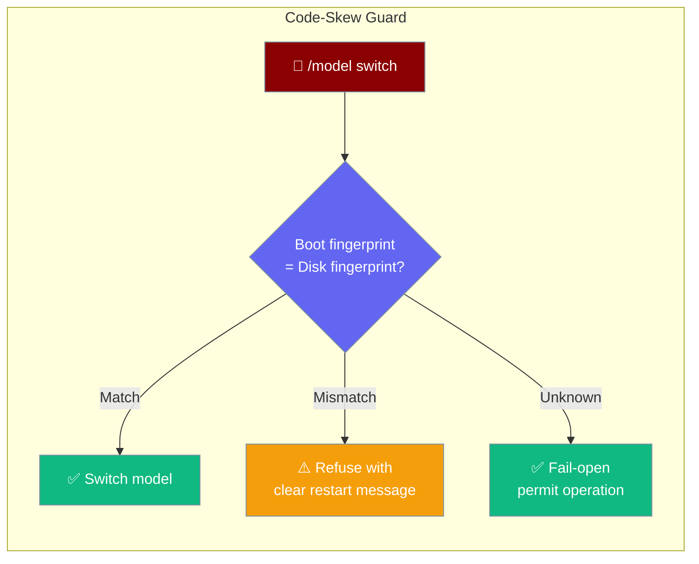
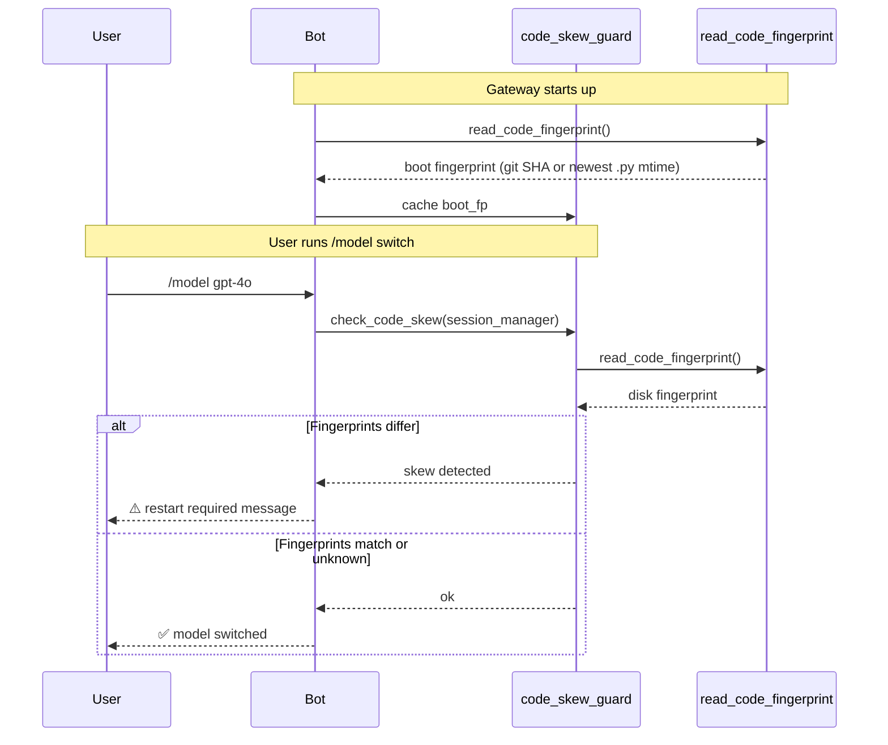

After an in-place update — `git pull`, `pip install -U`, or auto-update on a durable volume — a `/model` switch previously crashed with a cryptic `ImportError` from a lazy import loaded after startup. The code-skew guard detects the mismatch and refuses the operation with a clear message.



## Quick Start

<Steps>
<Step title="The guard is on by default">

No configuration needed. If someone runs `git pull` while the gateway is running and then sends `/model gpt-4o`, they'll see:

```
⚠️ Gateway code changed on disk since it started (2aa28d1 → def5678).
Restart the gateway to apply updates before switching models.
```

</Step>

<Step title="Opt out if needed">

```python
from praisonai.bots import Bot
from praisonaiagents import Agent

agent = Agent(name="assistant", instructions="Help users")
bot = Bot("telegram", agent=agent)
session_manager = bot.session_manager
session_manager.code_skew_guard = False  # disable the guard
bot.run()
```

</Step>

<Step title="Update code in place and try /model">

With the bot running, update the code on disk (`git pull`) then ask the bot to switch models:

```
/model gpt-4o
⚠️ Gateway code changed on disk since it started (2aa28d1 → def5678). Restart the gateway to apply updates before switching models.
```

Restart the process, then try again — the switch will succeed.

</Step>

<Step title="Opt out of the guard (optional)">

For CI runners or environments where in-place updates are deliberate:

```python
from praisonaiagents import Agent

agent = Agent(name="Bot", instructions="You are a helpful assistant.")
session_manager = agent.session_manager
session_manager.code_skew_guard = False
agent.start("Hello")
```

</Step>
</Steps>

---

## How It Works



### Fingerprint Sources

The fingerprint is determined by `read_code_fingerprint()`, which tries these in order:

1. **Git SHA** — `git rev-parse HEAD` in the checkout directory (most reliable)
2. **Newest `.py` mtime** — modification time of the most recently changed Python file (fallback when git is unavailable)
3. **`None`** — if both fail, the fingerprint is unknown

When a fingerprint is `None`, `detect_code_skew` returns `False` (fail-open) — the guard never blocks when it can't determine the code state.

---

## Configuration Options

| Setting | Type | Default | Description |
|---------|------|---------|-------------|
| `session_manager.code_skew_guard` | `bool` | `True` | Enable or disable the guard for all hot operations on this session manager |

<Note>
The guard is fail-open: when fingerprints can't be determined (no git, no `.py` files found), it permits the operation rather than blocking it.
</Note>

---

## User-Facing Message

When the guard detects a skew, the user sees a message like:

```
⚠️ Gateway code changed on disk since it started (2aa28d1 → def5678).
Restart the gateway to apply updates before switching models.
```

The fingerprints shown are the boot fingerprint and the current disk fingerprint, making it easy to confirm which version is running vs. which version is on disk.

---

## Common Patterns

### Automated deployment with code-skew detection

```bash
#!/bin/bash
# After deploying a new version:
git pull
pip install -U praisonai

# The running gateway will now detect skew on the next /model command
# and prompt users to restart — no silent ImportError.
# Graceful restart:
systemctl restart praisonai-gateway
```

### Check skew before a scheduled model rotation

```python
from praisonaiagents.gateway import read_code_fingerprint, detect_code_skew

boot_fp = read_code_fingerprint()   # saved at startup
current_fp = read_code_fingerprint()

if detect_code_skew(boot_fp, current_fp):
    # Restart before rotating models
    raise RuntimeError("Code skew detected — restart the gateway first")
```

---

## Best Practices

<AccordionGroup>

<Accordion title="Restart after in-place updates before hot operations">
The guard catches this automatically, but a clean restart is always safer than a hot operation on stale imports. Plan deployments to restart the gateway after `git pull` / `pip install`.
</Accordion>

<Accordion title="Keep git metadata available">
The guard prefers git SHA for fingerprinting. Deployments from a proper git checkout give better fingerprint accuracy than bare file installs.
</Accordion>

<Accordion title="Fail-open is intentional">
If fingerprinting fails (e.g. no git, no `.py` files), the guard permits the operation. This prevents blocking legitimate use in non-git environments while still protecting typical deployments.
</Accordion>

<Accordion title="Only blocks hot operations">
The guard only fires on specific hot operations like `/model`. Normal message processing continues unaffected — users can still chat; only model-switch commands are blocked.
</Accordion>

</AccordionGroup>

---

## Related

<CardGroup cols={2}>
<Card title="Gateway Exit Codes" icon="circle-stop" href="/docs/features/gateway-exit-codes">
  Signal transient vs. fatal failures to supervisors
</Card>
<Card title="Gateway Hot Reload" icon="rotate" href="/docs/features/gateway-hot-reload">
  Reload configuration without restarting
</Card>
<Card title="Bot Commands" icon="terminal" href="/docs/features/bot-commands">
  Built-in and custom /commands for bots
</Card>
<Card title="Gateway Overview" icon="server" href="/docs/features/gateway-overview">
  Gateway architecture and startup sequence
</Card>
</CardGroup>
