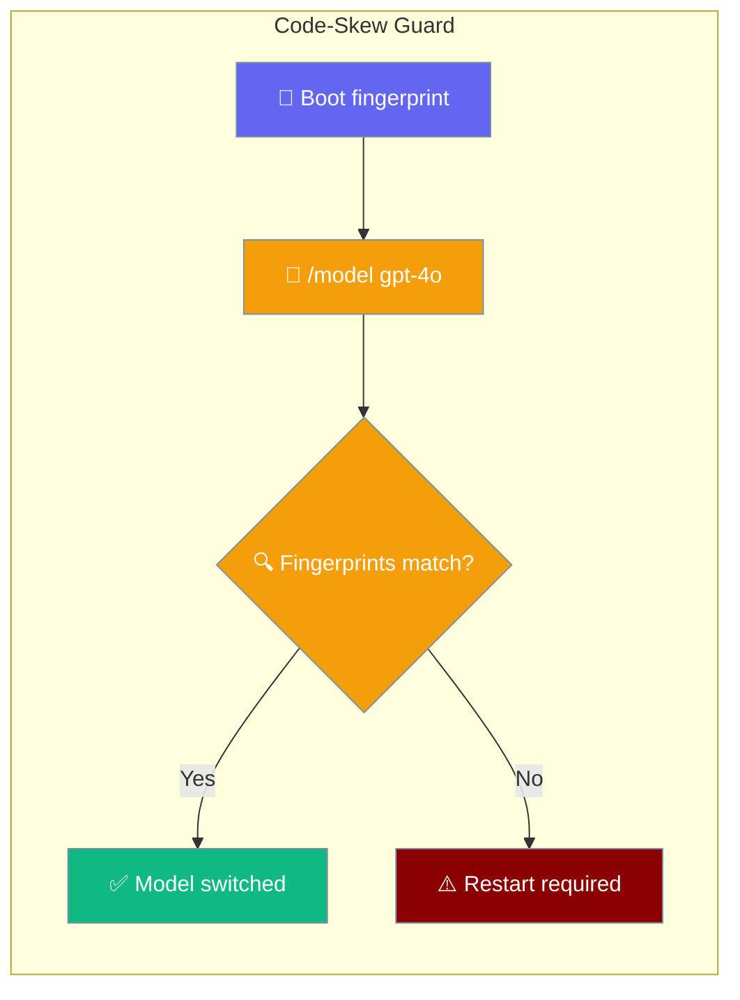
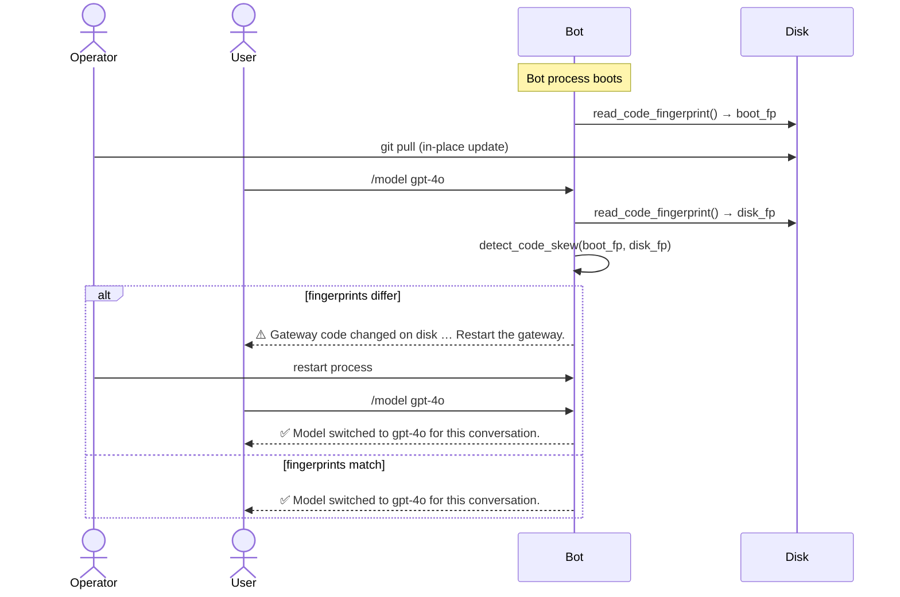

Self-hosted gateways stay alive for days. A `git pull` or `pip install -U` against a running checkout can crash the next `/model` switch with a cryptic import error. The code-skew guard catches this before it happens.



## Quick Start

<Steps>
<Step title="Run the bot — the guard is on by default">

No code change needed. The guard captures a fingerprint at startup and checks it before each `/model` switch.

```python
from praisonaiagents import Agent

agent = Agent(
    name="Bot",
    instructions="You are a helpful assistant."
)
agent.start("Hello")
```

</Step>

<Step title="Update code in place and try /model">

With the bot running, update the code on disk (`git pull`) then ask the bot to switch models:

```
/model gpt-4o
⚠️ Gateway code changed on disk since it started (2aa28d1 → def5678). Restart the gateway to apply updates before switching models.
```

Restart the process, then try again — the switch will succeed.

</Step>

<Step title="Opt out of the guard (optional)">

For CI runners or environments where in-place updates are deliberate:

```python
from praisonaiagents import Agent

agent = Agent(name="Bot", instructions="You are a helpful assistant.")
session_manager = agent.session_manager
session_manager.code_skew_guard = False
agent.start("Hello")
```

</Step>
</Steps>

---

## How It Works



| Step | What happens |
|------|--------------|
| Boot | `capture_boot_fingerprint(session_manager)` reads `git rev-parse HEAD` of the `praisonai` and `praisonaiagents` packages, combined with the newest `.py` `mtime` (dirty checkouts still register an edit). |
| Hot op | Before `/model` does anything, `check_code_skew(session_manager)` re-reads the on-disk fingerprint and compares. |
| Match | Fingerprints are equal — model switch proceeds normally. |
| Mismatch | Returns a "restart required" message with the short SHAs so you know exactly what changed. |
| Fail-open | Any error (no git, unreadable dir, broken import) returns `None` — the switch proceeds. The guard **never blocks** normal operation. |

---

## Configuration

| Option | Type | Default | Description |
|--------|------|---------|-------------|
| `session_manager.code_skew_guard` | `bool` | `True` | Set to `False` to disable the guard. The `/model` switch runs without the pre-flight check. |

---

## Advanced: Using the Pure Predicate

```python
from praisonaiagents.gateway import detect_code_skew

boot = "2aa28d1c5f1046765cc579dd6a077f0df9a5765d"
disk = "def56789abcdef0123456789abcdef0123456789"
result = detect_code_skew(boot, disk)
```

Returns `("2aa28d1", "def5678")` on mismatch, or `None` when fingerprints are equal or unknown. Use this directly for custom gating or testing.

---

## Best Practices

<AccordionGroup>
<Accordion title="Restart immediately after any in-place update">
After `git pull` or `pip install -U`, restart the gateway process before users switch models. The guard message is your reminder.
</Accordion>

<Accordion title="The guard is fail-open — don't worry about it blocking production">
If the fingerprint can't be read (no git, restricted filesystem, etc.), the check is silently skipped and the switch proceeds. Zero operational risk.
</Accordion>

<Accordion title="Disable only in controlled environments">
Use `session_manager.code_skew_guard = False` only in CI or sandboxed runners where you control all updates. Keep it enabled in production gateways.
</Accordion>
</AccordionGroup>

---

## Related

<CardGroup cols={2}>
  <Card title="Bot Chat Commands" icon="terminal" href="/docs/features/bot-commands">
    The full `/model` command and other built-in chat commands.
  </Card>
  <Card title="Gateway Hot-Reload" icon="rotate" href="/docs/features/gateway-hot-reload">
    Live-edit gateway.yaml and restart only what changed.
  </Card>
</CardGroup>
