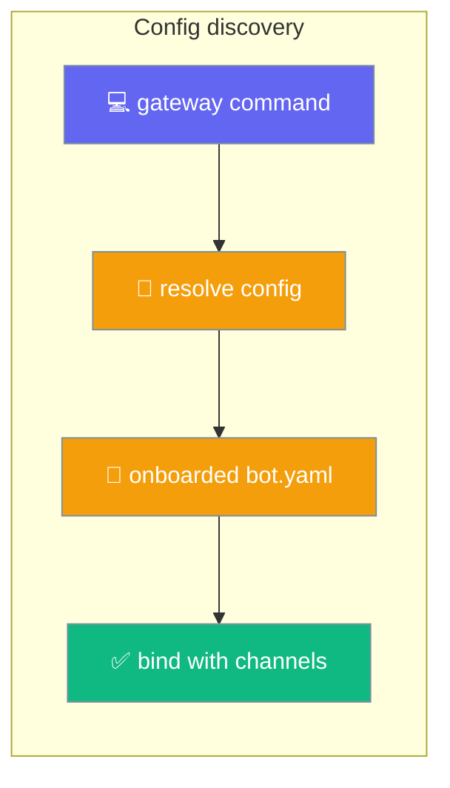
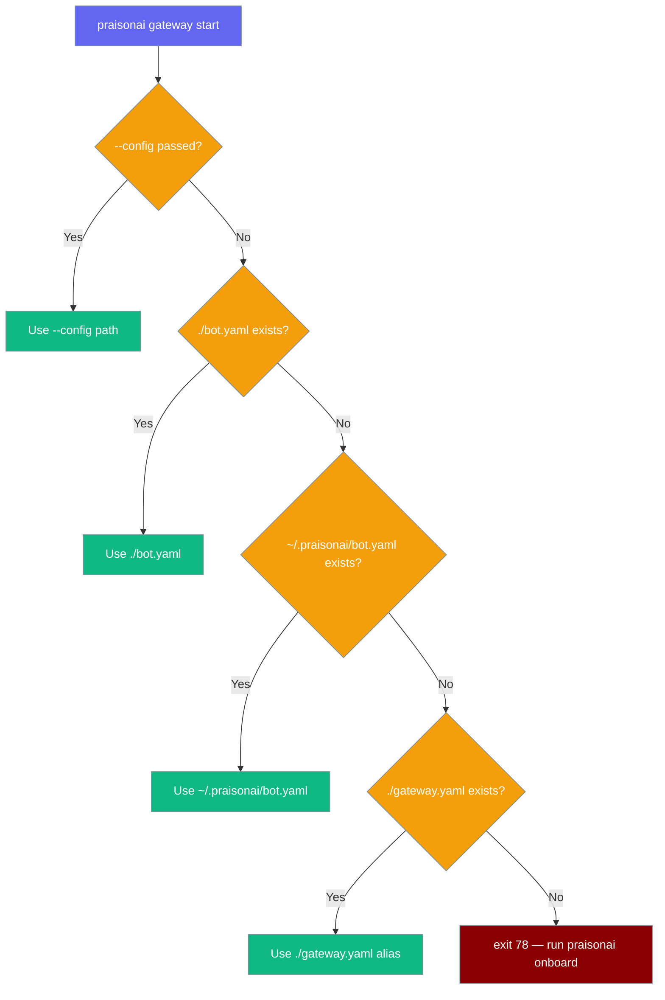

Every `praisonai gateway` command resolves its config through one canonical order, so `onboard`, `start`, `doctor`, `test`, `status`, `send`, and `channels` never look at different files.



## Quick Start

<Steps>
<Step title="Onboard once">
```bash
# Writes ~/.praisonai/bot.yaml + ~/.praisonai/.env
praisonai onboard
```
</Step>

<Step title="Start with no --config">
```bash
# Discovers the onboarded file automatically — no --config needed
praisonai gateway start
# → Using gateway config: /Users/you/.praisonai/bot.yaml
```

`start` prints the file it picked before binding, so you always know which config is live.
</Step>
</Steps>

---

## How It Works

Resolution walks a fixed precedence: an explicit `--config` always wins, then the working-dir config, then the onboarded home config, then the legacy alias.



| Precedence | Source | Notes |
|-----------|--------|-------|
| 1 | `--config <path>` on the CLI | Wins for every command. |
| 2 | `./bot.yaml` in the working dir | Back-compat for checked-in configs. |
| 3 | `$PRAISONAI_BOT_CONFIG` if set, else `~/.praisonai/bot.yaml` | Where `praisonai onboard` writes. Honours `$PRAISONAI_HOME`. |
| 4 | `./gateway.yaml` | Accepted alias for backward compatibility. |
| 5 | (none) | `gateway start` exits `78` with an onboard hint. |

Discovery works even without the optional `praisonai-code` package installed — the home fallback is a plain filesystem convention, not owned by any one package.

---

## Configuration Options

Two environment variables steer discovery when the defaults don't fit.

| Variable | Effect |
|----------|--------|
| `PRAISONAI_BOT_CONFIG` | Absolute path to the home config, used instead of `~/.praisonai/bot.yaml` at precedence 3. |
| `PRAISONAI_HOME` | Base directory for `~/.praisonai`; the home config resolves to `$PRAISONAI_HOME/bot.yaml`. |

---

## Common Patterns

### `start` with no config found

When nothing is discovered, `start` prints an actionable hint and exits `78` instead of silently starting channel-less:

```bash
$ praisonai gateway start
No gateway config found. Run 'praisonai onboard' to create one, or pass
--config <path> (or --agents <path> for single-agent mode).
$ echo $?
78
```

### Single-agent mode skips channel discovery

Pass `--agents <path>` to run one agent with no channel config — discovery is skipped:

```bash
praisonai gateway start --agents agents.yaml --port 9000
```

### Diagnostics use the same file `start` binds

`doctor`, `test`, `status`, `send`, and `channels` default `--config` to a `gateway.yaml` sentinel. Left at the default, they run the same discovery order, so a `doctor` run inspects exactly what `start` would bind:

```bash
praisonai onboard
praisonai gateway doctor   # inspects ~/.praisonai/bot.yaml, not a missing gateway.yaml
```

---

## Best Practices

<AccordionGroup>
<Accordion title="Onboard, then start with no flags">
`praisonai onboard` → `praisonai gateway start` is the happy path. `start` discovers the onboarded config and prints `Using gateway config: <path>` so you always see which file is live.
</Accordion>

<Accordion title="Check in ./bot.yaml for project-local configs">
A `./bot.yaml` in the working dir wins over the home config (precedence 2). Commit it to keep a project's gateway config alongside its code.
</Accordion>

<Accordion title="Point at a custom home with PRAISONAI_BOT_CONFIG">
Set `PRAISONAI_BOT_CONFIG` (or `PRAISONAI_HOME`) to run multiple onboarded profiles from one machine without passing `--config` every time.
</Accordion>

<Accordion title="Treat exit 78 as 'run onboard'">
An exit `78` from `start` means no config was found — run `praisonai onboard` or pass `--config`. The installed daemon units treat `78` as do-not-restart, so a missing config won't loop the service.
</Accordion>
</AccordionGroup>

---

## Related

<CardGroup cols={2}>
  <Card title="Gateway CLI" icon="tower-broadcast" href="/features/gateway-cli">
    Every gateway command, its flags, and the discovery order in context
  </Card>
  <Card title="Onboarding" icon="wand-magic-sparkles" href="/features/onboard">
    Writes the `~/.praisonai/bot.yaml` that discovery finds
  </Card>
  <Card title="Config Migration" icon="arrows-rotate" href="/features/gateway-config-migration">
    Start-time `config_version` validation on the discovered config
  </Card>
  <Card title="Exit Codes" icon="circle-exclamation" href="/features/gateway-exit-codes">
    Exit `78` — the do-not-restart contract when no config is found
  </Card>
</CardGroup>
