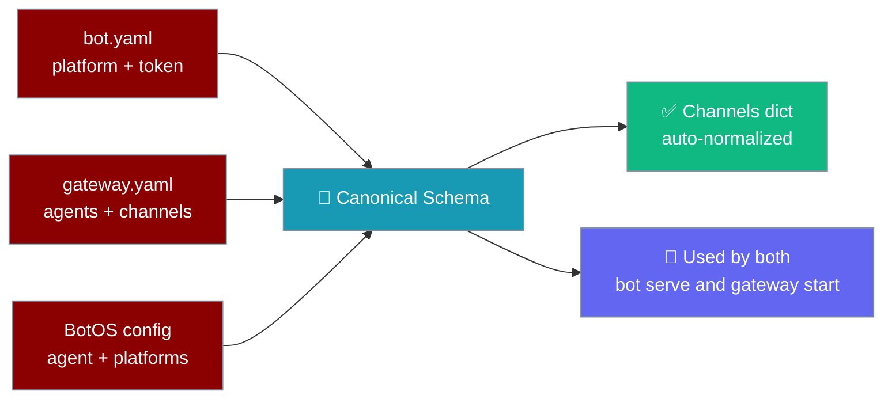
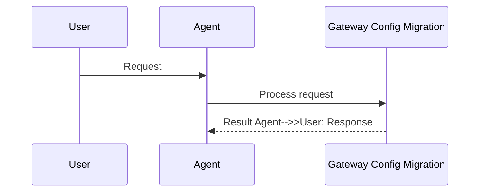

<Note>
The gateway now ships in the `praisonai-bot` package. `praisonai serve gateway` still works exactly as documented here; for a standalone install see [praisonai-bot Migration](/docs/guides/praisonai-bot-migration).
</Note>


```python
from praisonaiagents import Agent

agent = Agent(name="migration-agent", instructions="Migrate gateway configuration to the new format.")
agent.start("Migrate my gateway.yaml from the old schema to the new one.")
```


PraisonAI auto-migrates legacy `bot.yaml` and BotOS `platforms:` configs to the canonical `GatewayConfigSchema` at load time — on both `praisonai bot serve` and `praisonai gateway start` — and `praisonai doctor` reports migration opportunities so you can persist them.

```bash
praisonai doctor --only gateway_config_migration
```


The user runs `praisonai doctor`; migration reports legacy bot.yaml or BotOS configs and normalises them to the gateway schema at load time.



## How It Works




## Quick Start

<Steps>

<Step title="Detect legacy format">

```bash
praisonai doctor --only gateway_config_migration
```

If your config is already canonical, you will see **PASS — Config uses current format**.

</Step>

<Step title="Review WARN output">

Example when migration is available:

```
⚠ Gateway Config Migration [MEDIUM]
  Config can be migrated: 2 change(s)
  • Single-bot format can be migrated to multi-channel format
  • telegram: allowed_users string → list migration available
```

</Step>

<Step title="Persist canonical YAML">

Rewrite your config to the canonical `channels:` form (see migration table below). At runtime, legacy shapes already load — persisting is optional but recommended for clarity.

</Step>

</Steps>

---

## Migration Table

### Single-bot → multi-channel

**Before** (legacy `bot.yaml`):

```yaml
platform: telegram
token: ${TELEGRAM_BOT_TOKEN}
agent:
  name: assistant
  instructions: "Help users"
```

**After** (canonical):

```yaml
agent:
  name: assistant
  instructions: "Help users"
channels:
  telegram:
    platform: telegram
    token: ${TELEGRAM_BOT_TOKEN}
```

### BotOS `platforms:` → `channels:`

**Before**:

```yaml
agent:
  name: assistant
platforms:
  telegram:
    token: ${TELEGRAM_BOT_TOKEN}
  discord:
    token: ${DISCORD_BOT_TOKEN}
```

**After**:

```yaml
agent:
  name: assistant
channels:
  telegram:
    token: ${TELEGRAM_BOT_TOKEN}
  discord:
    token: ${DISCORD_BOT_TOKEN}
```

### String `allowed_users` → list

**Before**:

```yaml
channels:
  telegram:
    token: ${TELEGRAM_BOT_TOKEN}
    allowed_users: "123456,789012"
```

**After**:

```yaml
channels:
  telegram:
    token: ${TELEGRAM_BOT_TOKEN}
    allowed_users:
      - "123456"
      - "789012"
```

---

## Behaviour Notes

- Migration runs on both `praisonai bot serve` and `praisonai gateway start` — before PR #3019, only `bot serve` migrated.
- `BotYamlSchema` is an alias of `GatewayConfigSchema` — existing Python imports keep working.
- `group_policy` defaults to `mention_only` for **new** channels without an explicit value. Configs that explicitly set `respond_all` keep that value.
- Comma-separated `allowed_users` strings are auto-converted to lists at load time.
- All three YAML shapes (`platform`+`token`, `agents`+`channels`, `platforms:`) validate against one schema — see [Gateway](/docs/features/gateway).

---

## Best Practices

<AccordionGroup>
<Accordion title="Run doctor before upgrading">
Use `praisonai doctor --only gateway_config_migration` after pulling a new PraisonAI release to see whether your persisted YAML can be simplified.
</Accordion>

<Accordion title="Persist canonical YAML when WARN appears">
Runtime auto-migration is transparent, but persisting the canonical `channels:` form makes configs easier to diff and review in PRs.
</Accordion>

<Accordion title="Keep explicit group_policy values">
`group_policy` defaults to `mention_only` for new channels only. If your bot should respond to every message, set `respond_all` explicitly rather than relying on legacy defaults.
</Accordion>

<Accordion title="Convert allowed_users to lists">
Comma-separated strings still load, but list form is clearer and matches the schema validators.
</Accordion>
</AccordionGroup>

---

## Related

<CardGroup cols={2}>
  <Card title="Gateway" icon="tower-broadcast" href="/docs/features/gateway">
    Full gateway and channel configuration reference
  </Card>
  <Card title="Doctor" icon="stethoscope" href="/docs/cli/doctor">
    Gateway doctor checks and remediation
  </Card>
</CardGroup>
