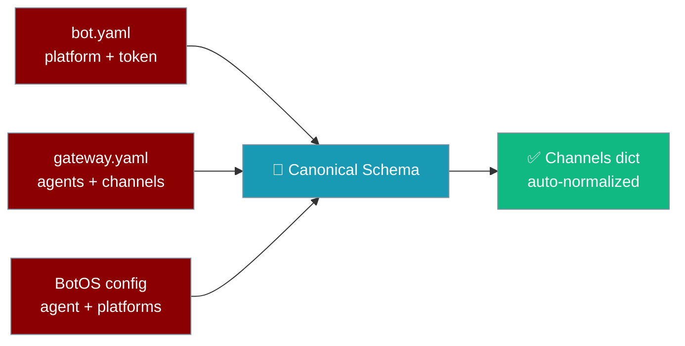
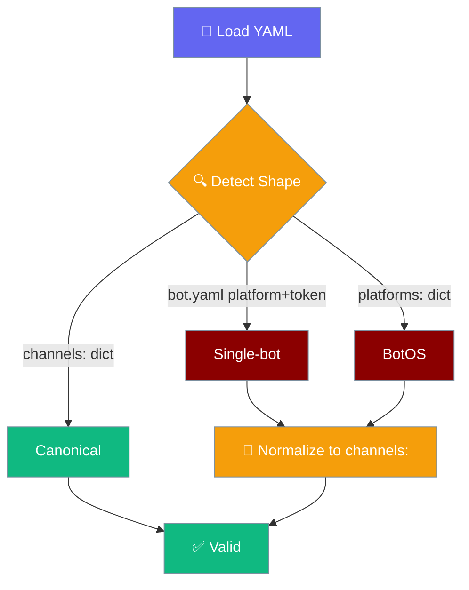

PraisonAI auto-migrates legacy `bot.yaml` and BotOS `platforms:` configs to the canonical `GatewayConfigSchema` at load time — `praisonai doctor` reports migration opportunities so you can persist them.



## Quick Start

<Steps>

<Step title="Detect legacy format">

```bash
praisonai doctor --only gateway_config_migration
```

If your config is already canonical, you will see **PASS — Config uses current format**.

</Step>

<Step title="Review WARN output">

Example when migration is available:

```
⚠ Gateway Config Migration [MEDIUM]
  Config can be migrated: 2 change(s)
  • Single-bot format can be migrated to multi-channel format
  • telegram: allowed_users string → list migration available
```

</Step>

<Step title="Persist canonical YAML">

Rewrite your config to the canonical `channels:` form (see migration table below). At runtime, legacy shapes already load — persisting is optional but recommended for clarity.

</Step>

</Steps>

---

## How It Works



| Shape | Key Indicator | Auto-normalized |
|-------|--------------|----------------|
| Single-bot | Top-level `platform:` + `token:` | ✅ |
| BotOS | `platforms:` dict | ✅ |
| Canonical | `channels:` dict | Already valid |

---

## Migration Table

### Single-bot → multi-channel

**Before** (legacy `bot.yaml`):

```yaml
platform: telegram
token: ${TELEGRAM_BOT_TOKEN}
agent:
  name: assistant
  instructions: "Help users"
```

**After** (canonical):

```yaml
agent:
  name: assistant
  instructions: "Help users"
channels:
  telegram:
    platform: telegram
    token: ${TELEGRAM_BOT_TOKEN}
```

### BotOS `platforms:` → `channels:`

**Before**:

```yaml
agent:
  name: assistant
platforms:
  telegram:
    token: ${TELEGRAM_BOT_TOKEN}
  discord:
    token: ${DISCORD_BOT_TOKEN}
```

**After**:

```yaml
agent:
  name: assistant
channels:
  telegram:
    token: ${TELEGRAM_BOT_TOKEN}
  discord:
    token: ${DISCORD_BOT_TOKEN}
```

### String `allowed_users` → list

**Before**:

```yaml
channels:
  telegram:
    token: ${TELEGRAM_BOT_TOKEN}
    allowed_users: "123456,789012"
```

**After**:

```yaml
channels:
  telegram:
    token: ${TELEGRAM_BOT_TOKEN}
    allowed_users:
      - "123456"
      - "789012"
```

---

## Behaviour Notes

- `BotYamlSchema` is an alias of `GatewayConfigSchema` — existing Python imports keep working.
- `group_policy` defaults to `mention_only` for **new** channels without an explicit value. Configs that explicitly set `respond_all` keep that value.
- Comma-separated `allowed_users` strings are auto-converted to lists at load time.
- All three YAML shapes (`platform`+`token`, `agents`+`channels`, `platforms:`) validate against one schema — see [Gateway](/docs/features/gateway).

---

## Best Practices

<AccordionGroup>
  <Accordion title="Persist the canonical form after migration">
    Auto-normalization runs at load time — your bot works without rewriting the file. Persisting the canonical YAML makes the on-disk config match what the schema produces, reducing confusion for future editors.
  </Accordion>
  <Accordion title="Run gateway_config_migration in CI">
    Add `praisonai doctor --only gateway_config_migration --strict` to your deployment pipeline. It exits `1` on WARN so legacy shapes never silently enter production.
  </Accordion>
  <Accordion title="Convert allowed_users strings to lists explicitly">
    Comma-separated strings are auto-converted at runtime, but YAML lists are easier to maintain and diff — convert them once and keep them as lists.
  </Accordion>
</AccordionGroup>

---

## Related

<CardGroup cols={2}>
  <Card title="Gateway" icon="tower-broadcast" href="/docs/features/gateway">
    Full gateway and channel configuration reference
  </Card>
  <Card title="Doctor" icon="stethoscope" href="/docs/cli/doctor">
    Gateway doctor checks and remediation
  </Card>
</CardGroup>
