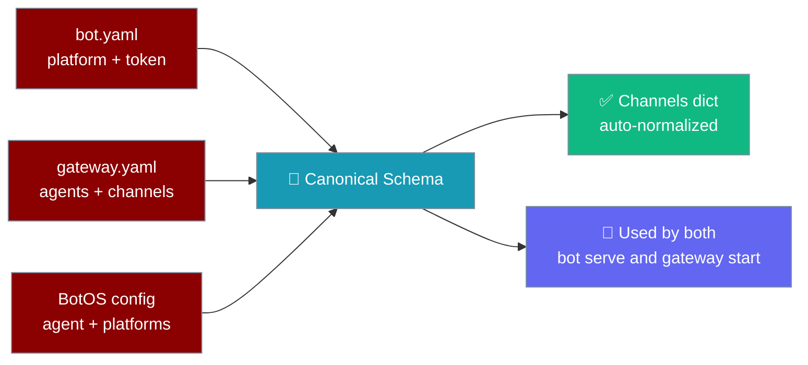
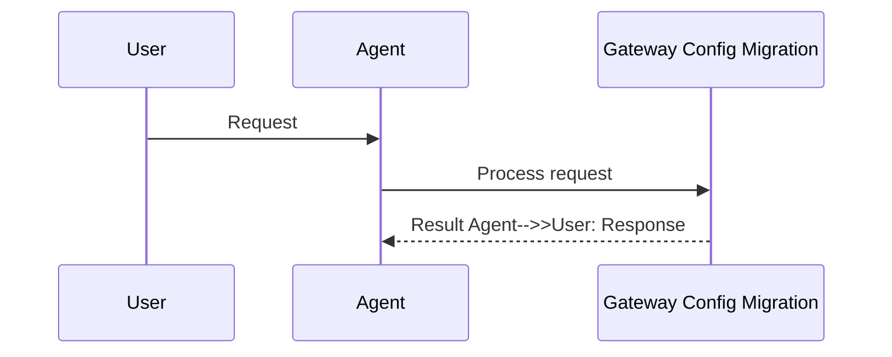
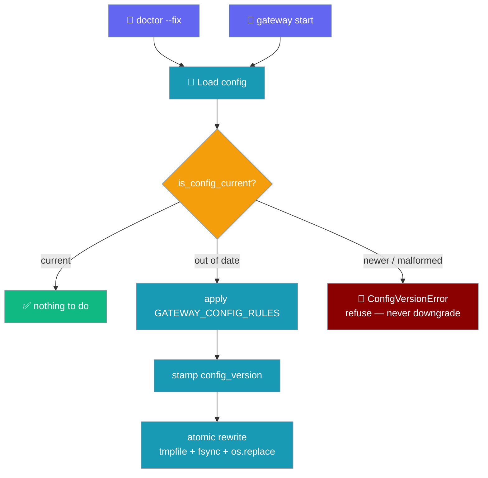
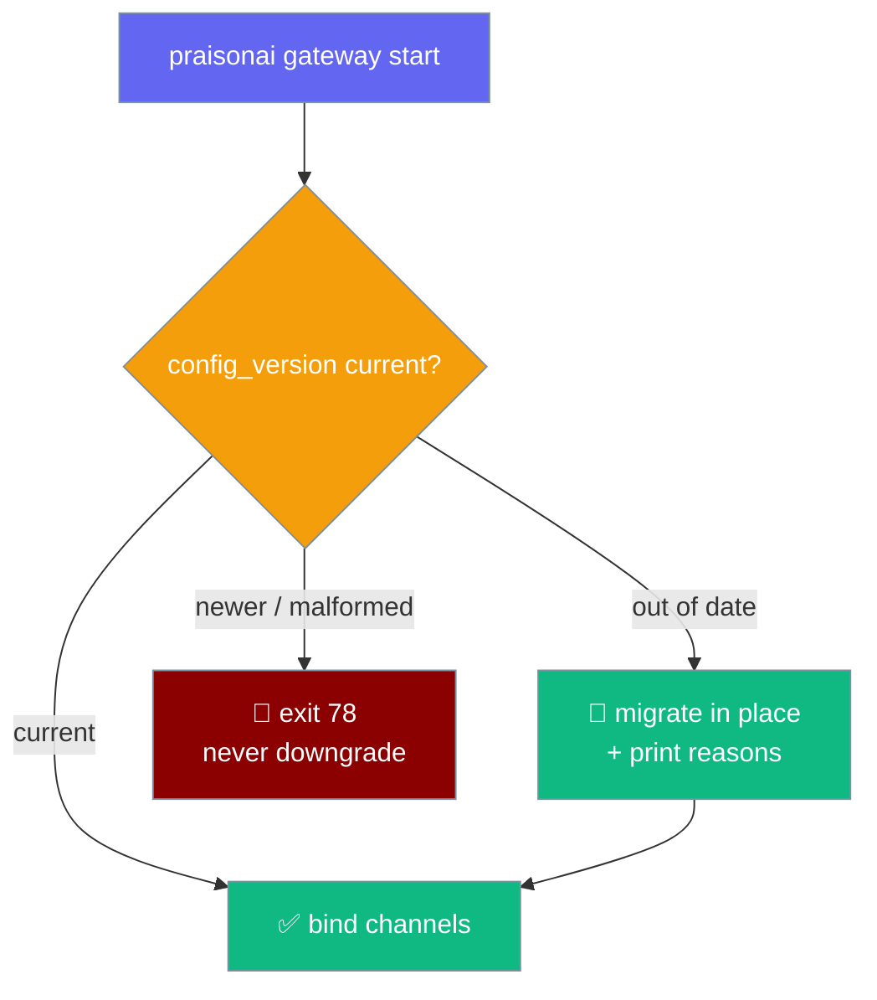

<Note>
The gateway now ships in the `praisonai-bot` package. `praisonai serve gateway` still works exactly as documented here; for a standalone install see [praisonai-bot Migration](/guides/praisonai-bot-migration).
</Note>


```python
from praisonaiagents import Agent

agent = Agent(name="migration-agent", instructions="Migrate gateway configuration to the new format.")
agent.start("Migrate my gateway.yaml from the old schema to the new one.")
```


PraisonAI auto-migrates legacy `bot.yaml` and BotOS `platforms:` configs to the canonical `GatewayConfigSchema` at load time — on both `praisonai bot serve` and `praisonai gateway start` — and `praisonai doctor` reports migration opportunities so you can persist them.

```bash
praisonai doctor --only gateway_config_migration
```


The user runs `praisonai doctor`; migration reports legacy bot.yaml or BotOS configs and normalises them to the gateway schema at load time.


```mermaid
graph LR
    A[bot.yaml<br/>platform + token] --> M[🧩 Canonical Schema]
    B[gateway.yaml<br/>agents + channels] --> M
    C[BotOS config<br/>agent + platforms] --> M
    M --> N[✅ Channels dict<br/>auto-normalized]
    M --> P[🔀 Used by both<br/>bot serve and gateway start]

    classDef legacy fill:#8B0000,stroke:#7C90A0,color:#fff
    classDef schema fill:#189AB4,stroke:#7C90A0,color:#fff
    classDef result fill:#10B981,stroke:#7C90A0,color:#fff
    classDef caption fill:#6366F1,stroke:#7C90A0,color:#fff

    class A,B,C legacy
    class M schema
    class N result
    class P caption

```

## How It Works


```mermaid
sequenceDiagram
    participant User
    participant Agent
    participant Feature as Gateway Config Migration

    User->>Agent: Request
    Agent->>Feature: Process request
    Feature-->>Agent: Result    Agent-->>User: Response
```


## Quick Start

<Steps>

<Step title="Detect legacy format">

```bash
praisonai doctor --only gateway_config_migration
```

If your config is already canonical, you will see **PASS — Config uses current format**.

</Step>

<Step title="Review WARN output">

Example when migration is available:

```
⚠ Gateway Config Migration [MEDIUM]
  Config can be migrated: 2 change(s)
  • Single-bot format can be migrated to multi-channel format
  • telegram: allowed_users string → list migration available
```

</Step>

<Step title="Persist canonical YAML">

Rewrite your config to the canonical `channels:` form (see migration table below). At runtime, legacy shapes already load — persisting is optional but recommended for clarity.

</Step>

</Steps>

---

## Migration Table

### Single-bot → multi-channel

**Before** (legacy `bot.yaml`):

```yaml
platform: telegram
token: ${TELEGRAM_BOT_TOKEN}
agent:
  name: assistant
  instructions: "Help users"
```

**After** (canonical):

```yaml
agent:
  name: assistant
  instructions: "Help users"
channels:
  telegram:
    platform: telegram
    token: ${TELEGRAM_BOT_TOKEN}
```

### BotOS `platforms:` → `channels:`

**Before**:

```yaml
agent:
  name: assistant
platforms:
  telegram:
    token: ${TELEGRAM_BOT_TOKEN}
  discord:
    token: ${DISCORD_BOT_TOKEN}
```

**After**:

```yaml
agent:
  name: assistant
channels:
  telegram:
    token: ${TELEGRAM_BOT_TOKEN}
  discord:
    token: ${DISCORD_BOT_TOKEN}
```

### String `allowed_users` → list

**Before**:

```yaml
channels:
  telegram:
    token: ${TELEGRAM_BOT_TOKEN}
    allowed_users: "123456,789012"
```

**After**:

```yaml
channels:
  telegram:
    token: ${TELEGRAM_BOT_TOKEN}
    allowed_users:
      - "123456"
      - "789012"
```

---

## Config version stamp

Gateway config now carries a canonical, integer `config_version` stamp. The **runtime** story is unchanged — the load-time shim still auto-migrates legacy shapes on every load — but the **upgrade** story is new: both `praisonai gateway doctor --fix` and `praisonai gateway start` apply the same declarative rule set, move an out-of-date config forward, and stamp the new version. `start` runs the gate **before binding** (PR #3884); `doctor --fix` runs it on demand.

<Info>
Runtime load auto-migrates legacy shapes but does **not** write the stamp. The stamp is persisted to disk by `praisonai gateway doctor --fix` and — as of PR #3884 — by `praisonai gateway start` when it forward-migrates an out-of-date config before binding.
</Info>

Import the public surface from `praisonaiagents.gateway`:

```python
from praisonaiagents.gateway import (
    GATEWAY_CONFIG_VERSION,
    ConfigVersionError,
    is_config_current,
    migrate_config_with_doctor,
)
```

| Symbol | Kind | What it is |
|--------|------|------------|
| `GATEWAY_CONFIG_VERSION` | `int` constant | Current canonical version (starts at `1`). |
| `ConfigVersionError` | `ValueError` subclass | Raised when the stamp is a version **newer** than this build supports, or is malformed (`bool` / `str` / `float`). |
| `LegacyConfigRule` | dataclass | `detect`, `fix`, `reason` — one declarative migration step. |
| `GATEWAY_CONFIG_RULES` | `List[LegacyConfigRule]` | Ordered rule list applied by `doctor --fix`. |
| `is_config_current(raw)` | `bool` | True iff `raw["config_version"] == GATEWAY_CONFIG_VERSION`. Raises `ConfigVersionError` on malformed stamps. |
| `migrate_config_with_doctor(raw)` | `Tuple[Dict, List[str]]` | Returns `(migrated_copy, applied_reasons)`. Copies input, applies rules, stamps `config_version`. Idempotent. Raises `ConfigVersionError` on newer/malformed stamps. |

### Rules currently in scope

`GATEWAY_CONFIG_RULES` holds two ordered migration steps.

| Rule name | Before → After | Note |
|-----------|----------------|------|
| `allowed_users_csv_to_list` | `allowed_users: "alice,bob"` → `["alice", "bob"]` (per channel) | Empty string → `[]`. |
| `group_policy_default` | channel missing `group_policy` → `group_policy: "mention_only"` | Sets the secure default. |

<Warning>
**Version safety.** `doctor` refuses to downgrade a config written by a newer build — it never migrates a config whose stamp is newer than this build supports. A malformed stamp (`true`, `"1"`, `1.0`) is **rejected** as `ConfigVersionError`, not silently coerced.
</Warning>

---

## Doctor-driven migration

`praisonai gateway doctor` inspects `gateway.yaml` and reports version drift; `--fix` applies the rules and stamps the file atomically.

Two entry points now converge on the same version check and forward-migration path — `doctor --fix` and `gateway start`.


```mermaid
graph TB
    Doctor[🔧 doctor --fix] --> Load
    Start[🚀 gateway start] --> Load
    Load[📄 Load config] --> Check{is_config_current?}
    Check -->|current| OK[✅ nothing to do]
    Check -->|out of date| Apply[apply GATEWAY_CONFIG_RULES]
    Check -->|newer / malformed| Refuse[🛑 ConfigVersionError<br/>refuse — never downgrade]
    Apply --> Stamp[stamp config_version]
    Stamp --> Write[atomic rewrite<br/>tmpfile + fsync + os.replace]

    classDef entry fill:#6366F1,stroke:#7C90A0,color:#fff
    classDef load fill:#189AB4,stroke:#7C90A0,color:#fff
    classDef gate fill:#F59E0B,stroke:#7C90A0,color:#fff
    classDef good fill:#10B981,stroke:#7C90A0,color:#fff
    classDef stop fill:#8B0000,stroke:#7C90A0,color:#fff
    classDef act fill:#189AB4,stroke:#7C90A0,color:#fff

    class Doctor,Start entry
    class Load load
    class Check gate
    class OK good
    class Refuse stop
    class Apply,Stamp,Write act
```

### Start-time migration (new — PR #3884)

`praisonai gateway start` runs the same `is_config_current` check and `migrate_config_with_doctor` forward-migration **before binding**. If the stamped version is behind, `start` applies the same declarative rule set that `doctor --fix` uses. If the stamp is **newer** than this build supports (or malformed — `bool` / `str` / `float`), `start` refuses (`ConfigVersionError`, exit `78`) rather than downgrading a config a newer build wrote. See [Gateway CLI › Version validation](/features/gateway-cli#version-validation).

### Detection (no flag)

When the stamp is missing / stale, or any rule's `detect` fires, `doctor` prints:

```
config: out of date (config_version unstamped -> 1); run 'gateway doctor --fix'
```

A newer or malformed stamp prints the error instead — doctor does **not** attempt to migrate:

```
config: config_version 2 is newer than supported (1)
```

### `--fix`

`--fix` loads `gateway.yaml`, calls `migrate_config_with_doctor`, and rewrites the file **atomically** (tmpfile in the same dir + `fsync` + `os.replace`), so an interrupted `--fix` can never leave the file truncated. It prints one `config: <reason>` line per applied rule plus the version bump:

```bash
praisonai gateway doctor --config gateway.yaml --fix
```

```
config: migrating allowed_users (string) -> list [rule: allowed_users_csv_to_list]
config: setting group_policy secure default 'mention_only' [rule: group_policy_default]
config: config_version unstamped -> 1
```

### `--fix --dry-run`

Preview without writing — every line is prefixed with `would`:

```bash
praisonai gateway doctor --config gateway.yaml --fix --dry-run
```

```
config: would migrate allowed_users (string) -> list [rule: allowed_users_csv_to_list]
config: would stamp config_version unstamped -> 1 (--dry-run)
```

### JSON keys

`--json` adds these keys (alongside any existing ones):

```json
{
  "probes": {},
  "config_version": "out-of-date",
  "config_version_error": "config_version 2 is newer than supported (1)",
  "config_fix": "config: migrating allowed_users (string) -> list [rule: allowed_users_csv_to_list]\nconfig: setting group_policy secure default 'mention_only' [rule: group_policy_default]\nconfig: config_version unstamped -> 1"
}
```

| Key | Values | Present when |
|-----|--------|--------------|
| `config_version` | `"out-of-date"` \| `"unsupported"` | Stamp is stale, or newer/malformed. |
| `config_version_error` | error message | Stamp is newer/malformed (`unsupported`). |
| `config_fix` | multi-line report | `--fix` applied one or more rules. |

<Note>
If your installed `praisonaiagents` predates the migration API, `doctor` is a no-op for this check — the wrapper guards the import and logs no error. Upgrade `praisonaiagents` to get the config-version stamp.
</Note>

---

## At start time

`praisonai gateway start` runs the **same** `config_version` check `doctor` does — before binding — so `start` and `doctor` never disagree about whether a config is current. An out-of-date config is migrated forward in place; a config from a newer build (or with a malformed stamp) refuses to start rather than being downgraded.


```mermaid
graph TB
    Start[praisonai gateway start] --> Check{config_version current?}
    Check -->|current| Bind[✅ bind channels]
    Check -->|out of date| Migrate[🔧 migrate in place<br/>+ print reasons]
    Migrate --> Bind
    Check -->|newer / malformed| Refuse[🛑 exit 78<br/>never downgrade]

    classDef start fill:#6366F1,stroke:#7C90A0,color:#fff
    classDef gate fill:#F59E0B,stroke:#7C90A0,color:#fff
    classDef ok fill:#10B981,stroke:#7C90A0,color:#fff
    classDef stop fill:#8B0000,stroke:#7C90A0,color:#fff

    class Start start
    class Check gate
    class Bind,Migrate ok
    class Refuse stop
```

An out-of-date config migrates forward and prints the bump before binding:

```bash
$ praisonai gateway start
config: migrated config_version 0 -> 1
```

A config written by a newer build refuses to start with exit `78`:

```bash
$ praisonai gateway start
config: config_version 2 is newer than supported (1)
$ echo $?
78
```

Exit `78` (`EX_CONFIG`) is the do-not-restart contract the installed daemon units honour — a config from the future loops the daemon otherwise. See [Gateway Exit Codes](/features/gateway-exit-codes).

<Note>
The start-time check runs against whichever config `start` resolved — including the auto-discovered `~/.praisonai/bot.yaml` when `--config` is omitted. See [Gateway Config Discovery](/features/gateway-config-discovery).
</Note>

---

## Programmatic migration

Call `migrate_config_with_doctor` directly to migrate a config in memory — it copies the input (no mutation), applies the rules, and stamps the version. A second call returns `applied == []` because it is idempotent.

```python
from praisonaiagents.gateway import (
    GATEWAY_CONFIG_VERSION,
    ConfigVersionError,
    is_config_current,
    migrate_config_with_doctor,
)

raw = {
    "channels": {
        "telegram": {"token": "...", "allowed_users": "alice,bob"},
    },
}

if not is_config_current(raw):
    migrated, applied = migrate_config_with_doctor(raw)
    # migrated["channels"]["telegram"]["allowed_users"] == ["alice", "bob"]
    # migrated["channels"]["telegram"]["group_policy"] == "mention_only"
    # migrated["config_version"] == GATEWAY_CONFIG_VERSION
    for reason in applied:
        print("applied:", reason)
```

<Note>
`is_config_current` and `migrate_config_with_doctor` raise `ConfigVersionError` on a newer or malformed stamp — an older binary must never downgrade a config a newer build wrote. Catch it to surface a clear "upgrade this host" message.
</Note>

---

## Behaviour Notes

- **Load-time auto-migration of legacy shapes** (channel-less BotOS, `platforms:`, CSV `allowed_users`) runs on both `praisonai bot serve` and `praisonai gateway start` — before PR #3019, only `bot serve` migrated.
- **Start-time `config_version` gate (new — PR #3884).** `praisonai gateway start` now also runs the stamped `config_version` check + forward-migration rules that used to be `doctor`-only — before binding. This is separate from the load-time legacy-shape shim above: `start` **applies** the versioned rule set, not just the load-time auto-migration.
- `BotYamlSchema` is an alias of `GatewayConfigSchema` — existing Python imports keep working.
- `group_policy` defaults to `mention_only` for **new** channels without an explicit value. Configs that explicitly set `respond_all` keep that value.
- `observe` is a newly-accepted `group_policy` value (PR #3381). Configs never migrate **to** `observe` automatically — set it explicitly. See [`observe`: passive group context](/docs/features/bot-gateway#observe-passive-group-context).
- Comma-separated `allowed_users` strings are auto-converted to lists at load time.
- All three YAML shapes (`platform`+`token`, `agents`+`channels`, `platforms:`) validate against one schema — see [Gateway](/features/gateway).
- `MultiChannelGatewayConfig` and `ChannelRouteConfig` remain public exports — neither is deprecated. The `config_version` stamp does not retire them.
- The `--fix` auto-repair also mints a strong `gateway.auth_token` when weak/missing, then re-validates — see [Gateway CLI › Auto-repair](/docs/features/gateway-cli#auto-repair-with-fix) and [Pre-flight credential check](/docs/features/gateway-cli#pre-flight-credential-check).

---

## Best Practices

<AccordionGroup>
<Accordion title="Run doctor before upgrading">
Use `praisonai doctor --only gateway_config_migration` after pulling a new PraisonAI release to see whether your persisted YAML can be simplified.
</Accordion>

<Accordion title="Persist canonical YAML when WARN appears">
Runtime auto-migration is transparent, but persisting the canonical `channels:` form makes configs easier to diff and review in PRs.
</Accordion>

<Accordion title="Keep explicit group_policy values">
`group_policy` defaults to `mention_only` for new channels only. If your bot should respond to every message, set `respond_all` explicitly rather than relying on legacy defaults.
</Accordion>

<Accordion title="Convert allowed_users to lists">
Comma-separated strings still load, but list form is clearer and matches the schema validators.
</Accordion>
</AccordionGroup>

---

## Related

<CardGroup cols={2}>
  <Card title="Fleet Breaker" icon="shield-halved" href="/features/gateway-fleet-breaker">
    Stops fleet-wide reconnect storms when every channel restarts at once
  </Card>
  <Card title="Gateway" icon="tower-broadcast" href="/features/gateway">
    Full gateway and channel configuration reference
  </Card>
  <Card title="Config Discovery" icon="folder-magnifying-glass" href="/features/gateway-config-discovery">
    Which config `start` and `doctor` resolve when `--config` is omitted
  </Card>
  <Card title="Exit Codes" icon="circle-exclamation" href="/features/gateway-exit-codes">
    Exit `78` — the do-not-restart contract for a config from a newer build
  </Card>
</CardGroup>
