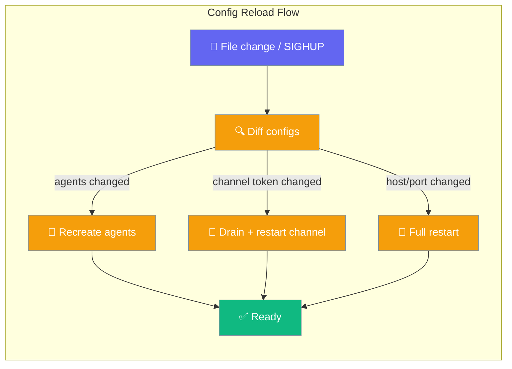
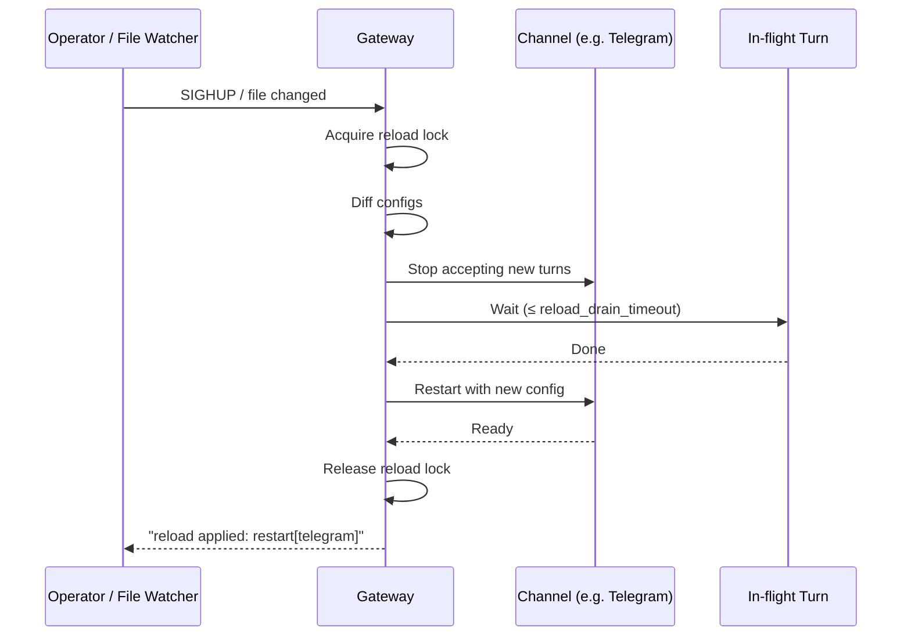

<Note>
The gateway now ships in the `praisonai-bot` package. `praisonai serve gateway` still works exactly as documented here; for a standalone install see [praisonai-bot Migration](/docs/guides/praisonai-bot-migration).
</Note>

Edit `gateway.yaml` and save — the running gateway diffs it and restarts only what changed, in-flight turns included.

```python
from praisonaiagents import Agent

agent = Agent(name="ops", instructions="Operate gateway configuration reloads.")
agent.start("Reload gateway.yaml after I edit agents or channels.")
```

The user edits `gateway.yaml` or sends SIGHUP; the gateway diffs the file and recreates only agents or channels whose settings changed.

```bash
# Edit your config, then signal the running gateway to reload
kill -HUP $(cat ~/.praisonai/gateway.pid)
```



## Quick Start

<Steps>

<Step title="Edit gateway.yaml">
```yaml
# Change an agent instruction and save
agents:
  support:
    instructions: "You are a friendly support agent."  # changed
    model: gpt-4o-mini
```
</Step>

<Step title="Signal the gateway">
```bash
kill -HUP $(cat ~/.praisonai/gateway.pid)
# or via systemd
systemctl reload praisonai-gateway
```

The gateway diffs the config, drains any affected channels, and applies the change — the WebSocket server never drops.
</Step>

<Step title="Watch the audit log">
```
reload applied: agents; restart[telegram]
```

Each line tells you exactly what changed and which channels were restarted.
</Step>

</Steps>

---

## Three Trigger Paths

<Tabs>

<Tab title="File-based (event-driven)">
Install the optional `watchdog` package for instant, debounced change detection:

```bash
pip install "praisonai[gateway]"
# installs watchdog>=3.0.0
```

With `watchdog` installed, filesystem events (inotify on Linux, FSEvents on macOS, ReadDirectoryChangesW on Windows) trigger a reload within the debounce window (default 1 s) automatically — no signal required.
</Tab>

<Tab title="File-based (polling fallback)">
Without `watchdog`, the gateway falls back to mtime polling every 5 s automatically. Zero config change needed to opt in or out — the gateway chooses the best available mechanism at startup.

```bash
# No extra package needed — polling kicks in automatically
praisonai gateway start --config gateway.yaml
```
</Tab>

<Tab title="Operator-triggered (SIGHUP)">
Send SIGHUP to the gateway process to force an immediate reload:

```bash
kill -HUP <gateway-pid>
# or via systemd
systemctl reload praisonai-gateway
```

SIGHUP runs the same diff-driven reload path as the file watcher. Concurrent SIGHUPs (e.g. script fires two in quick succession) are serialized — the second waits for the first to finish.

<Warning>
SIGHUP does not exist on Windows. The gateway skips the SIGHUP handler silently on Windows and falls back to polling or file-event watching only.
</Warning>
</Tab>

</Tabs>

---

## Drain-Coordinated Restart

Channel restarts drain in-flight turns before bouncing, using the same `drain_timeout` coroutine as shutdown.

```yaml
# gateway.yaml
gateway:
  drain_timeout: 30         # shutdown drain budget
  reload_drain_timeout: 10  # reload-specific budget (wins over drain_timeout for reloads)
```

<Note>
When `reload_drain_timeout` is unset, it falls back to `drain_timeout`. Set it shorter for faster ops iteration without loosening your shutdown drain budget.
</Note>



---

## What Gets Restarted?

| Config change | Action |
|---------------|--------|
| Agent `instructions` / `model` / `tools` | Recreate affected agents in-place |
| Channel `token` or platform args | Drain + restart that single channel |
| Gateway `host` / `port` | Full restart (WebSocket server stays up) |
| Scheduler / routes / guardrails | Full channel restart |

---

## YAML Reference

```yaml
gateway:
  drain_timeout: 30           # shutdown drain window (seconds)
  reload_drain_timeout: 10    # reload drain window; falls back to drain_timeout if unset
```

---

## Optional Dependency

<Info>
`pip install "praisonai[gateway]"` adds `watchdog>=3.0.0` for event-driven watching. Without it the gateway uses mtime polling (5 s interval). Both modes apply the same reload logic — the only difference is detection latency.
</Info>

---

## Best Practices

<AccordionGroup>

<Accordion title="Test reloads on a canary channel first">
Apply config changes to one channel (e.g. a staging Telegram bot) before rolling to all channels. The per-channel restart scope makes this safe — the reload touches only what changed.
</Accordion>

<Accordion title="Set reload_drain_timeout shorter than drain_timeout">
A 10 s reload drain with a 30 s shutdown drain lets you iterate faster during on-call while keeping the shutdown window wide enough for long provider calls.
</Accordion>

<Accordion title="Grep the audit trail after every reload">
Log lines like `reload applied: agents; restart[telegram]` are your audit trail. Ship them to your log aggregator and alert on unexpected full restarts.
</Accordion>

</AccordionGroup>

---

## Related

<CardGroup cols={2}>
  <Card title="Reliability Preset" icon="shield-check" href="/docs/features/gateway-reliability">
    One-switch production posture that includes drain settings
  </Card>
  <Card title="Graceful Drain" icon="circle-stop" href="/docs/features/gateway-graceful-drain">
    Drain-only knob — full reference and sequence diagram
  </Card>
  <Card title="Gateway CLI" icon="terminal" href="/docs/features/gateway-cli">
    CLI commands for starting, stopping, and managing the gateway
  </Card>
  <Card title="Gateway" icon="tower-broadcast" href="/docs/features/gateway">
    WebSocket control plane overview and full YAML reference
  </Card>
</CardGroup>
