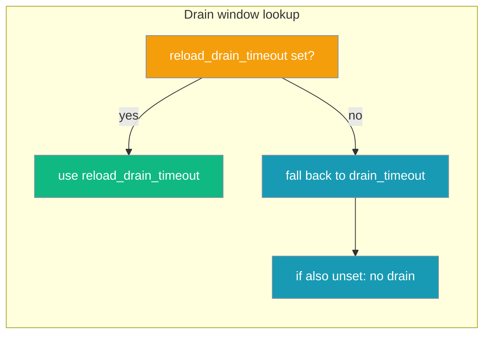

Edit `gateway.yaml` while the gateway is running and the change applies automatically — no restart, no dropped connections.

```bash
pip install "praisonai[gateway]"
praisonai gateway start --config gateway.yaml
# Edit gateway.yaml and save — reload applies within seconds
```

```mermaid
sequenceDiagram
    participant Op as Operator
    participant FS as gateway.yaml
    participant GW as Gateway
    participant Ch as Channel (bot)
    Op->>FS: edit gateway.yaml
    FS-->>GW: watchdog event (or mtime poll)
    Op->>GW: kill -HUP pid (equivalent)
    GW->>GW: diff config
    GW->>Ch: drain(reload_drain_timeout)
    Ch-->>GW: in-flight turns finished
    GW->>Ch: restart with new config
    GW-->>Op: log "reload applied: agents; restart[telegram]"
```

## Quick Start

<Steps>
<Step title="Install the gateway extra">

```bash
pip install "praisonai[gateway]"
```

This installs `watchdog>=3.0.0` for event-driven file watching. The gateway falls back to mtime polling when `watchdog` is not installed.
</Step>

<Step title="Edit gateway.yaml — auto-detected">

```yaml
# gateway.yaml
agents:
  assistant:
    instructions: "You are a helpful assistant."

gateway:
  reload_drain_timeout: 10.0   # seconds to drain a channel on reload
```

Save the file. The running gateway detects the change within the watchdog debounce window and reloads automatically.
</Step>

<Step title="Trigger a reload manually via SIGHUP">

```bash
systemctl reload praisonai-gateway
# or
kill -HUP $(pgrep -f 'praisonai gateway start')
```

`SIGHUP` runs the same `reload_config` path as a file change — no shutdown. Best-effort on Windows (SIGHUP unavailable, see fallback below).
</Step>

<Step title="Tune the drain window">

```yaml
gateway:
  reload_drain_timeout: 10.0   # seconds to drain a channel on reload
  # If unset, falls back to gateway.drain_timeout
  drain_timeout: 5.0
```

`reload_drain_timeout` controls how long a channel restart waits for in-flight turns to finish. If unset, it falls back to `drain_timeout`.
</Step>
</Steps>

---

## What Triggers a Reload

Two paths trigger the same `reload_config` routine:

| Trigger | Mechanism |
|---------|-----------|
| File edit | `watchdog` filesystem event (if installed) or mtime polling every 5 s |
| Manual | `kill -HUP <pid>` or `systemctl reload praisonai-gateway` |

Both paths debounce rapid consecutive writes before applying — a burst of saves from an editor doesn't cause multiple reloads.

---

## What Gets Restarted

The gateway diffs the new config against the running config and restarts only what changed:

| Change | Action |
|--------|--------|
| `agents.*` | Recreate agents (no channel restart) |
| `channels.<name>.*` | Restart that one channel with drain |
| `routes`, `scheduler` | Full channel restart with drain |

The WebSocket server itself keeps running throughout — connected clients are not disconnected unless their channel is restarting.

---

## `reload_drain_timeout` vs `drain_timeout`



Keep `reload_drain_timeout` separate from `drain_timeout` so you can tune reload drain independently from shutdown drain. A typical production setup:

```yaml
gateway:
  drain_timeout: 15.0          # graceful shutdown — wait up to 15s
  reload_drain_timeout: 5.0    # config reload — faster channel bounce
```

---

## Windows / No-Watchdog Fallback

| Environment | File watching | SIGHUP |
|-------------|--------------|--------|
| Linux / macOS + `watchdog` installed | Event-driven (instant) | Supported |
| Linux / macOS without `watchdog` | mtime polling (5 s interval) | Supported |
| Windows + `watchdog` installed | Event-driven (instant) | Not available |
| Windows without `watchdog` | mtime polling (5 s interval) | Not available |

On Windows, use the file-watch path only. `kill -HUP` is not available; trigger reloads by saving the config file.

---

## Reading the Log Line

A concise summary is logged after each reload:

```
reload applied: agents; restart[telegram]
```

| Part | Meaning |
|------|---------|
| `agents` | Agent definitions were updated (no channel restart) |
| `restart[telegram]` | The `telegram` channel was restarted with drain |
| `restart[telegram,discord]` | Multiple channels were restarted |
| _(empty)_ | Config was identical; no changes applied |

---

## Best Practices

<AccordionGroup>
<Accordion title="Install watchdog for instant detection">

Without `watchdog`, the gateway polls every 5 seconds. With `watchdog` installed (`pip install "praisonai[gateway]"`), changes are detected within milliseconds via filesystem events.
</Accordion>

<Accordion title="Set reload_drain_timeout smaller than drain_timeout">

A short reload drain (5s) keeps channel restarts fast. A longer shutdown drain (15s) gives in-flight conversations more time to complete. Keep them separate.
</Accordion>

<Accordion title="Validate before saving">

A bad config (YAML syntax error, missing required field) is rejected at reload time — the gateway keeps the last-known-good config and logs an error. Test with `praisonai gateway validate gateway.yaml` before saving to the watched path.
</Accordion>

<Accordion title="Use SIGHUP in CI/CD pipelines">

After updating `gateway.yaml` in a deploy pipeline, send `kill -HUP $(cat /var/run/praisonai.pid)` to trigger reload without downtime. No restart, no new process.
</Accordion>
</AccordionGroup>

---

## Related

<CardGroup cols={2}>
<Card title="Gateway Overview" icon="network-wired" href="/docs/features/gateway-overview">
  Gateway architecture and configuration overview
</Card>
<Card title="Gateway CLI" icon="terminal" href="/docs/features/gateway-cli">
  CLI commands including gateway start and reload
</Card>
<Card title="Gateway Reliability" icon="shield-check" href="/docs/features/gateway-reliability">
  Graceful drain and admission control presets
</Card>
<Card title="Gateway Graceful Drain" icon="hourglass" href="/docs/features/gateway-graceful-drain">
  Fine-grained drain timeout configuration
</Card>
</CardGroup>
