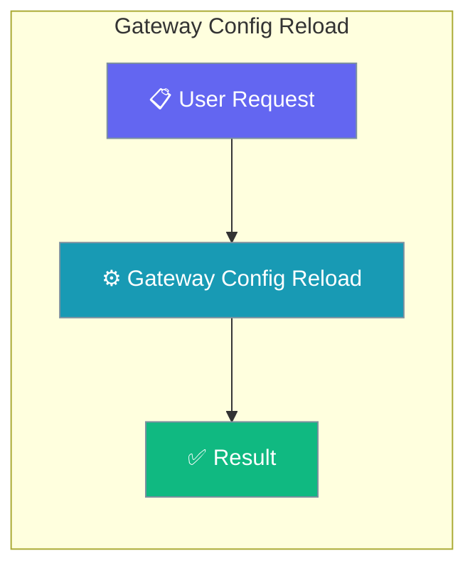
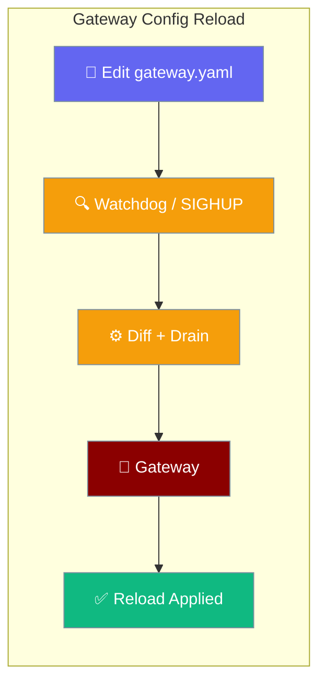
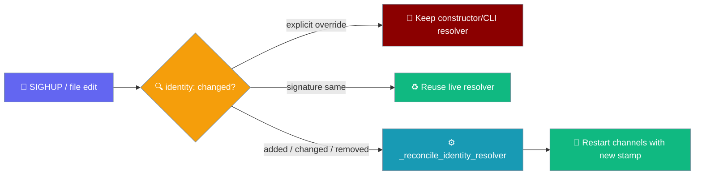

<Note>
The gateway now ships in the `praisonai-bot` package. `praisonai serve gateway` still works exactly as documented here; for a standalone install see [praisonai-bot Migration](/docs/guides/praisonai-bot-migration).
</Note>

Edit `gateway.yaml` while the gateway is running and the change applies automatically — no restart, no dropped connections.

```bash
pip install "praisonai[gateway]"
praisonai gateway start --config gateway.yaml
# Edit gateway.yaml and save — reload applies within seconds
```

The operator edits `gateway.yaml`; the gateway diffs and hot-reloads without dropping in-flight turns.



## How It Works

```mermaid
sequenceDiagram
    participant Op as Operator
    participant FS as gateway.yaml
    participant GW as Gateway
    participant Ch as Channel (bot)
    Op->>FS: edit gateway.yaml
    FS-->>GW: watchdog event (or mtime poll)
    Op->>GW: kill -HUP pid (equivalent)
    GW->>GW: diff config
    GW->>Ch: drain(reload_drain_timeout)
    Ch-->>GW: in-flight turns finished
    GW->>Ch: restart with new config
    GW-->>Op: log "reload applied: agents; restart[telegram]"
```

## Quick Start

<Steps>

<Step title="Install the gateway extra">

```bash
pip install "praisonai[gateway]"
```

This installs `watchdog>=3.0.0` for event-driven file watching. The gateway falls back to mtime polling when `watchdog` is not installed.
</Step>

<Step title="Edit gateway.yaml — auto-detected">

```yaml
# gateway.yaml
agents:
  assistant:
    instructions: "You are a helpful assistant."

gateway:
  reload_drain_timeout: 10.0   # seconds to drain a channel on reload
```

Save the file. The running gateway detects the change within the watchdog debounce window and reloads automatically.
</Step>

<Step title="Trigger a reload manually via SIGHUP">

```bash
systemctl reload praisonai-gateway
# or
kill -HUP $(pgrep -f 'praisonai gateway start')
```

`SIGHUP` runs the same `reload_config` path as a file change — no shutdown. Best-effort on Windows (SIGHUP unavailable, see fallback below).
</Step>

<Step title="Tune the drain window">

```yaml
gateway:
  reload_drain_timeout: 10.0   # seconds to drain a channel on reload
  # If unset, falls back to gateway.drain_timeout
  drain_timeout: 5.0
```

`reload_drain_timeout` controls how long a channel restart waits for in-flight turns to finish. If unset, it falls back to `drain_timeout`.
</Step>

<Step title="Watch the audit log">
```
reload applied: agents; restart[telegram]
```

Each line tells you exactly what changed and which channels were restarted.
</Step>

</Steps>

---

## What Triggers a Reload

Two paths trigger the same `reload_config` routine:

| Trigger | Mechanism |
|---------|-----------|
| File edit | `watchdog` filesystem event (if installed) or mtime polling every 5 s |
| Manual | `kill -HUP <pid>` or `systemctl reload praisonai-gateway` |

Both paths debounce rapid consecutive writes before applying — a burst of saves from an editor doesn't cause multiple reloads.

<Tabs>

<Tab title="File-based (event-driven)">
With `watchdog` installed, filesystem events (inotify on Linux, FSEvents on macOS, ReadDirectoryChangesW on Windows) trigger a reload within the debounce window (default 1 s) automatically — no signal required.
</Tab>

<Tab title="File-based (polling fallback)">
Without `watchdog`, the gateway falls back to mtime polling every 5 s automatically. Zero config change needed to opt in or out — the gateway chooses the best available mechanism at startup.
</Tab>

<Tab title="Operator-triggered (SIGHUP)">
Send SIGHUP to the gateway process to force an immediate reload:

```bash
kill -HUP <gateway-pid>
# or via systemd
systemctl reload praisonai-gateway
```

Concurrent SIGHUPs are serialized — the second waits for the first to finish.

<Warning>
SIGHUP does not exist on Windows. The gateway skips the SIGHUP handler silently on Windows and falls back to polling or file-event watching only.
</Warning>
</Tab>

</Tabs>

---

## What Gets Restarted

| Config change | Action |
|---------------|--------|
| Agent `instructions` / `model` / `tools` | Recreate affected agents in-place |
| Channel `token` or platform args | Drain + restart that single channel |
| Gateway `host` / `port` | Full restart (WebSocket server stays up) |
| Scheduler / routes / guardrails | Full channel restart |
| `identity:` block | Rebuild + re-stamp the identity resolver, restart affected channels |

The WebSocket server itself keeps running throughout — connected clients are not disconnected unless their channel is restarting.

---

## Reloadable Sections › `identity:`

Editing the top-level `identity:` block reconciles the cross-platform identity resolver on the next reload, so paired users keep one continuous session across channels ([#3020](/docs/features/cross-platform-mirror#in-the-gateway-praisonai-gateway-start)).

| Reload behaviour | Details |
|---|---|
| Block added (`enabled: true`) | A new `StoreBackedIdentityResolver` is built and stamped onto every channel; existing channels restart so they pick it up. |
| Block removed or `enabled: false` | Resolver is cleared back to `None` — channels revert to per-platform session keys. |
| Block changed (`store:` re-pointed) | Old resolver replaced with a new one pointing at the new store; channels restart. |
| Block **unchanged** across reload | Existing resolver is reused (link cache + store handle survive) — no churn. |
| Constructor / CLI resolver present | YAML changes are **ignored** for the resolver — the explicit override always wins. |

Reconciliation runs *before* channels (re)start, via `_reconcile_identity_resolver()`, so freshly restarted bots pick up the new resolver rather than a stale one. The gateway records the block's `(enabled, store)` signature via `_signature_for_identity()` — an unchanged signature preserves the live resolver so the link cache and store handle survive reloads that don't touch `identity:`.

The gateway also stamps a shared turn-lock onto every channel bot so a user unified across channels cannot scramble their transcript when two channels deliver at once — see [Concurrent Turns Across Adapters](/docs/features/cross-platform-mirror#concurrent-turns-across-adapters).



<Note>
A constructor or `--identity-store` resolver is marked explicit (`_identity_resolver_explicit=True`) and is never rebuilt from YAML — even when the `identity:` block changes. See the [precedence ladder](/docs/features/cross-platform-mirror#precedence).
</Note>

---

## Drain-Coordinated Restart

Channel restarts drain in-flight turns before bouncing, using the same `drain_timeout` coroutine as shutdown.

```yaml
# gateway.yaml
gateway:
  drain_timeout: 30         # shutdown drain budget
  reload_drain_timeout: 10  # reload-specific budget (wins over drain_timeout for reloads)
```

---

## Windows / No-Watchdog Fallback

| Environment | File watching | SIGHUP |
|-------------|--------------|--------|
| Linux / macOS + `watchdog` installed | Event-driven (instant) | Supported |
| Linux / macOS without `watchdog` | mtime polling (5 s interval) | Supported |
| Windows + `watchdog` installed | Event-driven (instant) | Not available |
| Windows without `watchdog` | mtime polling (5 s interval) | Not available |

---

## YAML Reference

```yaml
identity:
  enabled: true               # reconciled on reload; false clears the resolver
  store: ~/.praisonai/identity.json  # re-pointing rebuilds the resolver

gateway:
  drain_timeout: 30           # shutdown drain window (seconds)
  reload_drain_timeout: 10    # reload drain window; falls back to drain_timeout if unset
```

---

## Rotating the shared secret during reload

The reload path also picks up changes to `gateway.auth_token`. When the reloaded config carries a new secret, the gateway adopts it inline and — by default — revokes every live session still on the old secret.

Adopting a new secret has three side effects:

1. `self.config.auth_token` is updated to the new value.
2. `GATEWAY_AUTH_TOKEN` in the environment is updated so all auth paths (HTTP, magic-link, WS) read the same value.
3. Stale live sessions are force-closed with WebSocket close code `4001` and reason `credentials_rotated` — unless `revoke_on_secret_rotation: false`.

| Situation in reloaded `gateway.yaml` | Outcome |
|---|---|
| `auth_token` absent | Full no-op. Running secret + live sessions untouched. |
| `auth_token` present, resolves to empty (`""` or unset `${VAR}`) | Running secret kept. A warning is logged. |
| `auth_token` present, same as running secret | No-op (0 revoked). |
| `auth_token` present, differs | Adopt new secret, export to env, revoke stale sessions (unless opted out). |
| `auth_token` not a string (e.g. `12345`) | Coerced to `str`, avoiding a mid-reload `TypeError`. |
| `revoke_on_secret_rotation: false` | Secret adopted for new connections only; live sessions stay on the old secret. |
| `revoke_on_secret_rotation: "false"` / `"0"` / `"no"` / `"off"` | Also disables revocation. |
| `revoke_on_secret_rotation` truthy (default) | Every session on the old secret is force-closed with `(4001, "credentials_rotated")`. |

<Card title="Gateway Credential Rotation" icon="key" href="/docs/features/gateway-credential-rotation">
  Client-side recovery, the rotation mermaid, and the full behaviour matrix
</Card>

---

## Optional Dependency

<Info>
`pip install "praisonai[gateway]"` adds `watchdog>=3.0.0` for event-driven watching. Without it the gateway uses mtime polling (5 s interval). Both modes apply the same reload logic — the only difference is detection latency.
</Info>

On Windows, use the file-watch path only. `kill -HUP` is not available; trigger reloads by saving the config file.

---

## Reading the Log Line

A concise summary is logged after each reload:

```
reload applied: agents; restart[telegram]
```

| Part | Meaning |
|------|---------|
| `agents` | Agent definitions were updated (no channel restart) |
| `restart[telegram]` | The `telegram` channel was restarted with drain |
| `restart[telegram,discord]` | Multiple channels were restarted |
| _(empty)_ | Config was identical; no changes applied |

---

## Best Practices

<AccordionGroup>

<Accordion title="Install watchdog for instant detection">

Without `watchdog`, the gateway polls every 5 seconds. With `watchdog` installed (`pip install "praisonai[gateway]"`), changes are detected within milliseconds via filesystem events.
</Accordion>

<Accordion title="Test reloads on a canary channel first">
Apply config changes to one channel (e.g. a staging Telegram bot) before rolling to all channels. The per-channel restart scope makes this safe — the reload touches only what changed.
</Accordion>

<Accordion title="Set reload_drain_timeout shorter than drain_timeout">
A short reload drain (5s–10s) keeps channel restarts fast. A longer shutdown drain (15s–30s) gives in-flight conversations more time to complete. Keep them separate.
</Accordion>

<Accordion title="Validate before saving">

A bad config (YAML syntax error, missing required field) is rejected at reload time — the gateway keeps the last-known-good config and logs an error. Test with `praisonai gateway validate gateway.yaml` before saving to the watched path.
</Accordion>

<Accordion title="Grep the audit trail after every reload">
Log lines like `reload applied: agents; restart[telegram]` are your audit trail. Ship them to your log aggregator and alert on unexpected full restarts.
</Accordion>

<Accordion title="Use SIGHUP in CI/CD pipelines">

After updating `gateway.yaml` in a deploy pipeline, send `kill -HUP $(cat /var/run/praisonai.pid)` to trigger reload without downtime. No restart, no new process.
</Accordion>

</AccordionGroup>

---

## Related

<CardGroup cols={2}>
<Card title="Gateway" icon="tower-broadcast" href="/docs/features/gateway">
  WebSocket control plane overview and full YAML reference
</Card>
<Card title="Gateway CLI" icon="terminal" href="/docs/features/gateway-cli">
  CLI commands for starting, stopping, and managing the gateway
</Card>
<Card title="Gateway Reliability" icon="shield-check" href="/docs/features/gateway-reliability">
  Graceful drain and admission control presets
</Card>
<Card title="Gateway Graceful Drain" icon="hourglass" href="/docs/features/gateway-graceful-drain">
  Drain-only knob — full reference and sequence diagram
</Card>
<Card title="Credential Rotation" icon="key" href="/docs/features/gateway-credential-rotation">
  Revoke live sessions when the shared secret rotates
</Card>
<Card title="Cross-Platform Sessions" icon="users-rectangle" href="/docs/features/cross-platform-mirror">
  The `identity:` block — one session per user across channels
</Card>
</CardGroup>
