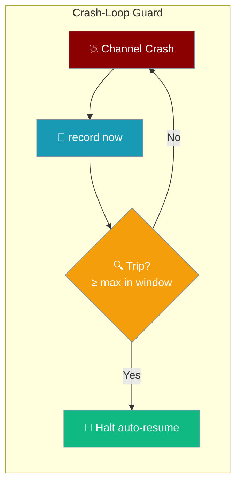
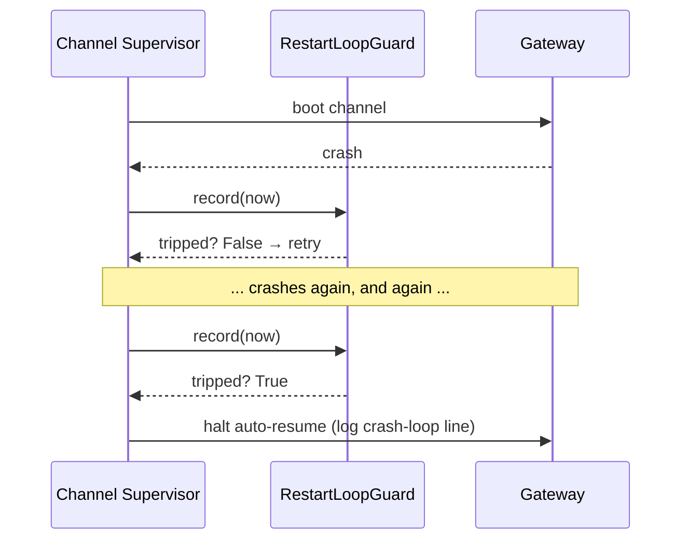

```python
from praisonaiagents import Agent

agent = Agent(name="assistant", instructions="Be helpful.")
# A crash-loop guard protects this agent's channel from a tight restart loop
agent.start("Anyone there?")
```

Stop auto-resurrecting a channel that keeps crashing on resume, before it burns the process into a tight restart loop.



## Quick Start

<Steps>

<Step title="Simplest — enable via gateway.yaml">

```yaml
# gateway.yaml
lifecycle:
  restart_loop_guard:
    enabled: true
```

```bash
praisonai gateway start --config gateway.yaml
```

Defaults trip the breaker after **3** rapid restarts within **60 seconds** for any channel.

</Step>

<Step title="Custom window">

```yaml
# gateway.yaml
lifecycle:
  restart_loop_guard:
    enabled: true
    max_restarts: 5
    window_seconds: 120
```

Trip only after 5 restarts inside a 2-minute window — more tolerant of transient flaps.

</Step>

<Step title="Python — build the pure guard">

```python
import time
from praisonaiagents.gateway import RestartLoopGuard

guard = RestartLoopGuard(max_restarts=3, window_seconds=60)

# Each time a supervised channel boot crashes:
if guard.record(now=time.monotonic()):
    # too many restarts too fast — stop auto-resuming this channel
    ...
```

When the guard trips, the gateway logs the crash-loop-halted line and stops auto-resurrecting that channel.

</Step>

</Steps>

---

## How It Works

The guard runs *around* the channel supervisor loop. Each crashed boot is recorded; once the trailing window holds `max_restarts` events, the gateway stops resurrecting that channel.



| Behaviour | Detail |
|-----------|--------|
| **Rolling window** | `record(now)` drops events older than `window_seconds` before counting. |
| **Trip condition** | `len(events) >= max_restarts` within the window. |
| **On trip** | The channel stops auto-resurrecting; the gateway keeps serving other channels and real inbound. |
| **Clean run** | A supervised run that returns normally calls `reset()`, clearing the history. |
| **Off by default** | No guard configured = existing unlimited-retry behaviour, unchanged. |

---

## Configuration Options

### `RestartLoopGuard` constructor

```python
from praisonaiagents.gateway import RestartLoopGuard

guard = RestartLoopGuard(max_restarts=3, window_seconds=60.0)
```

| Option | Type | Default | Description |
|--------|------|---------|-------------|
| `max_restarts` | `int` | `3` | Restart events within `window_seconds` needed to trip. Must be `>= 1` — raises `ValueError` otherwise. |
| `window_seconds` | `float` | `60.0` | Trailing rolling-window length in seconds. Must be `> 0` — raises `ValueError` otherwise. |

**Methods:**

| Method | Returns | Description |
|--------|---------|-------------|
| `record(now)` | `bool` | Record a restart at monotonic `now` and return whether the breaker tripped. |
| `tripped(now)` | `bool` | Non-recording check of whether the breaker is currently tripped. |
| `reset()` | `None` | Clear the recorded restart history (e.g. after a clean run). |

### `lifecycle.restart_loop_guard:` YAML block

Accepted at the top level of `gateway.yaml` **or** nested under `gateway:`.

```yaml
lifecycle:
  restart_loop_guard:
    enabled: true
    max_restarts: 3
    window_seconds: 60
```

| Field | Type | Default | Description |
|-------|------|---------|-------------|
| `enabled` | `bool` | `true` | Turns the guard on when the block is present. |
| `max_restarts` | `int` | `3` | Passed to `RestartLoopGuard(max_restarts=…)`. |
| `window_seconds` | `float` | `60.0` | Passed to `RestartLoopGuard(window_seconds=…)`. |

### Imports

```python
from praisonaiagents.gateway import RestartLoopGuard
```

<Note>
`RestartLoopGuard` exports from `praisonaiagents.gateway`. Top-level `praisonaiagents` does not re-export it.
</Note>

---

## How It Composes With Channel Supervision

The crash-loop guard is a **rapid-fire** breaker (seconds window) that runs *around* the supervisor loop. It is orthogonal to the [Channel Supervision](/docs/features/gateway-channel-supervision) health-monitor machinery:

| Layer | Where it runs | Window | Purpose |
|-------|---------------|--------|---------|
| **Crash-Loop Guard** | Around the supervisor loop | Seconds (`window_seconds`) | Break a tight crash-on-resume loop fast. |
| **`max_restarts_per_hour`** | Inside the health-monitor sweep | Per hour | Slower cap on total restarts. |

Tune both for a two-tier defence: the guard catches immediate crash storms; `max_restarts_per_hour` catches slow, persistent flapping.

### Log signal

When the guard trips, the gateway emits:

```
ERROR: Channel 'telegram' crash-loop breaker tripped (>= 3 restarts in 60s); halting auto-resume: <original exception>
```

---

## Best Practices

<AccordionGroup>

<Accordion title="Start with the defaults (3 / 60s)">
The defaults trip after 3 restarts within 60 seconds — a rate that only a genuine crash-on-resume loop hits. Change them only when a channel legitimately flaps (e.g. a flaky upstream) and you want more tolerance.
</Accordion>

<Accordion title="Combine with max_restarts_per_hour for two-tier defence">
The guard is a fast breaker; `max_restarts_per_hour` on [Channel Supervision](/docs/features/gateway-channel-supervision#restart-guard-rails) is a slow per-hour cap. Enable both so a rapid crash storm is stopped in seconds and slow persistent flapping is stopped over the hour.
</Accordion>

<Accordion title="After a trip, fix the cause then reconnect">
A trip means the channel stopped auto-resurrecting. Once the underlying crash is fixed, run `praisonai gateway reconnect <channel>` (see [Channel Supervision → Reconnect](/docs/features/gateway-channel-supervision#reconnect-channel)) to reset error state and bring the channel back.
</Accordion>

</AccordionGroup>

---

## Related

<CardGroup cols={2}>
  <Card title="Channel Supervision" icon="heart-pulse" href="/docs/features/gateway-channel-supervision">
    Self-healing channels — the supervisor the guard wraps.
  </Card>
  <Card title="Gateway Exit Codes" icon="hashtag" href="/docs/features/gateway-exit-codes">
    Restart-intent exit codes that pair with crash forensics.
  </Card>
  <Card title="Scale to Zero" icon="moon" href="/docs/features/gateway-scale-to-zero">
    Sibling lifecycle policy — idle-quiesce for serverless hosts.
  </Card>
  <Card title="Drain Trigger" icon="power-off" href="/docs/features/gateway-drain-trigger">
    Sibling lifecycle policy — epoch-safe external drain marker.
  </Card>
</CardGroup>
