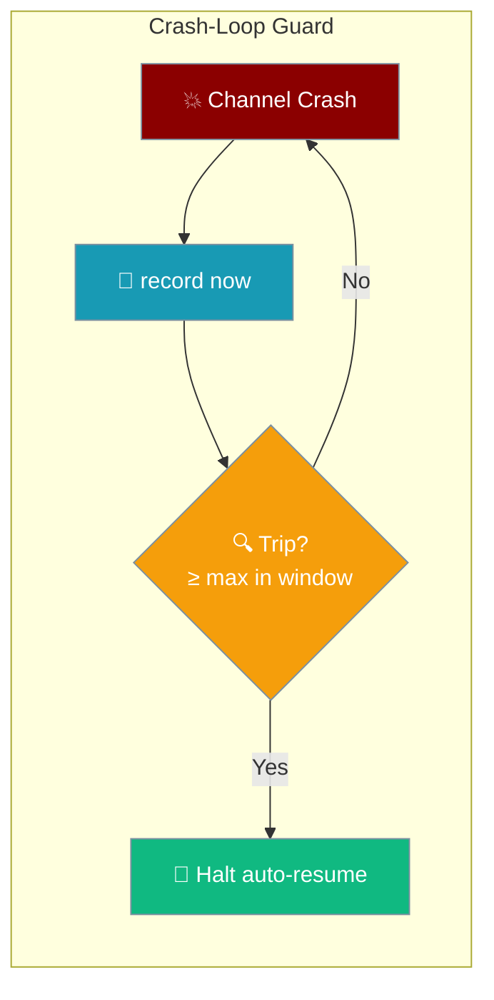
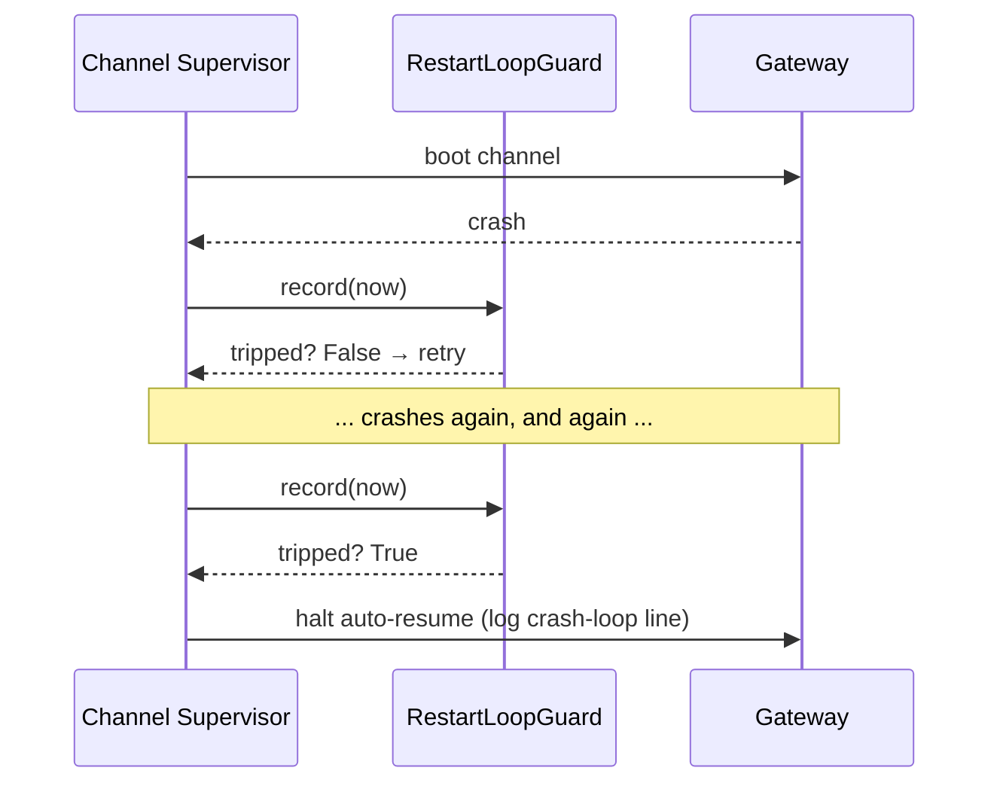
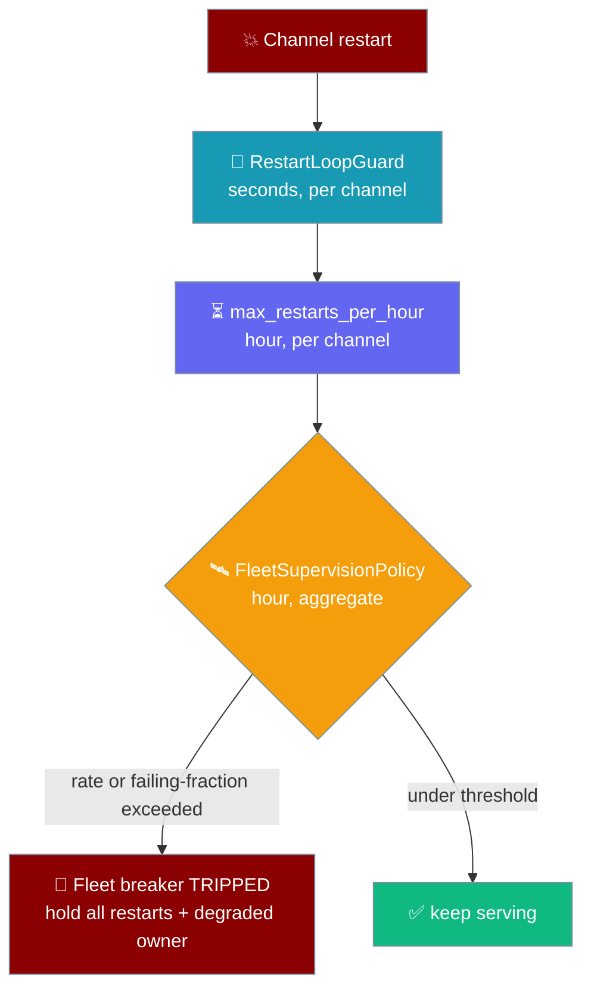

```python
from praisonaiagents import Agent

agent = Agent(name="assistant", instructions="Be helpful.")
# A crash-loop guard protects this agent's channel from a tight restart loop
agent.start("Anyone there?")
```

Stop auto-resurrecting a channel that keeps crashing on resume, before it burns the process into a tight restart loop.


```mermaid
graph LR
    subgraph "Crash-Loop Guard"
        C[💥 Channel Crash] --> R[🧮 record now]
        R --> T{🔍 Trip?<br/>≥ max in window}
        T -->|No| C
        T -->|Yes| H[🛑 Halt auto-resume]
    end

    classDef input fill:#8B0000,stroke:#7C90A0,color:#fff
    classDef process fill:#189AB4,stroke:#7C90A0,color:#fff
    classDef gate fill:#F59E0B,stroke:#7C90A0,color:#fff
    classDef stop fill:#10B981,stroke:#7C90A0,color:#fff

    class C input
    class R process
    class T gate
    class H stop
```

## Quick Start

<Steps>

<Step title="Simplest — enable via gateway.yaml">

```yaml
# gateway.yaml
lifecycle:
  restart_loop_guard:
    enabled: true
```

```bash
praisonai gateway start --config gateway.yaml
```

Defaults trip the breaker after **3** rapid restarts within **60 seconds** for any channel.

</Step>

<Step title="Custom window">

```yaml
# gateway.yaml
lifecycle:
  restart_loop_guard:
    enabled: true
    max_restarts: 5
    window_seconds: 120
```

Trip only after 5 restarts inside a 2-minute window — more tolerant of transient flaps.

</Step>

<Step title="Python — build the pure guard">

```python
import time
from praisonaiagents.gateway import RestartLoopGuard

guard = RestartLoopGuard(max_restarts=3, window_seconds=60)

# Each time a supervised channel boot crashes:
if guard.record(now=time.monotonic()):
    # too many restarts too fast — stop auto-resuming this channel
    ...
```

When the guard trips, the gateway logs the crash-loop-halted line and stops auto-resurrecting that channel.

</Step>

</Steps>

---

## How It Works

The guard runs *around* the channel supervisor loop. Each crashed boot is recorded; once the trailing window holds `max_restarts` events, the gateway stops resurrecting that channel.


```mermaid
sequenceDiagram
    participant Sup as Channel Supervisor
    participant Guard as RestartLoopGuard
    participant GW as Gateway

    Sup->>GW: boot channel
    GW-->>Sup: crash
    Sup->>Guard: record(now)
    Guard-->>Sup: tripped? False → retry
    Note over Sup,GW: ... crashes again, and again ...
    Sup->>Guard: record(now)
    Guard-->>Sup: tripped? True
    Sup->>GW: halt auto-resume (log crash-loop line)
```

| Behaviour | Detail |
|-----------|--------|
| **Rolling window** | `record(now)` drops events older than `window_seconds` before counting. |
| **Trip condition** | `len(events) >= max_restarts` within the window. |
| **On trip** | The channel stops auto-resurrecting; the gateway keeps serving other channels and real inbound. |
| **Clean run** | A supervised run that returns normally calls `reset()`, clearing the history. |
| **Off by default** | No guard configured = existing unlimited-retry behaviour, unchanged. |

---

## Configuration Options

### `RestartLoopGuard` constructor

```python
from praisonaiagents.gateway import RestartLoopGuard

guard = RestartLoopGuard(max_restarts=3, window_seconds=60.0)
```

| Option | Type | Default | Description |
|--------|------|---------|-------------|
| `max_restarts` | `int` | `3` | Restart events within `window_seconds` needed to trip. Must be `>= 1` — raises `ValueError` otherwise. |
| `window_seconds` | `float` | `60.0` | Trailing rolling-window length in seconds. Must be `> 0` — raises `ValueError` otherwise. |

**Methods:**

| Method | Returns | Description |
|--------|---------|-------------|
| `record(now)` | `bool` | Record a restart at monotonic `now` and return whether the breaker tripped. |
| `tripped(now)` | `bool` | Non-recording check of whether the breaker is currently tripped. |
| `reset()` | `None` | Clear the recorded restart history (e.g. after a clean run). |

### `lifecycle.restart_loop_guard:` YAML block

Accepted at the top level of `gateway.yaml` **or** nested under `gateway:`.

```yaml
lifecycle:
  restart_loop_guard:
    enabled: true
    max_restarts: 3
    window_seconds: 60
```

| Field | Type | Default | Description |
|-------|------|---------|-------------|
| `enabled` | `bool` | `true` | Turns the guard on when the block is present. |
| `max_restarts` | `int` | `3` | Passed to `RestartLoopGuard(max_restarts=…)`. |
| `window_seconds` | `float` | `60.0` | Passed to `RestartLoopGuard(window_seconds=…)`. |

### Imports

```python
from praisonaiagents.gateway import RestartLoopGuard
```

<Note>
`RestartLoopGuard` exports from `praisonaiagents.gateway`. Top-level `praisonaiagents` does not re-export it.
</Note>

---

## How It Composes With Channel Supervision

The crash-loop guard is a **rapid-fire** breaker (seconds window) that runs *around* the supervisor loop. It is orthogonal to the [Channel Supervision](/features/gateway-channel-supervision) health-monitor machinery:

| Layer | Where it runs | Window | Scope | Purpose |
|-------|---------------|--------|-------|---------|
| **Crash-Loop Guard** (`RestartLoopGuard`) | Around the supervisor loop | Seconds (`window_seconds`) | Per channel | Break a tight crash-on-resume loop fast. |
| **`max_restarts_per_hour`** | Inside the health-monitor sweep | Per hour | Per channel | Slower cap on total restarts. |
| **Fleet breaker** (`FleetSupervisionPolicy`) | Above the whole fleet | Per hour | Aggregate | Trip once on a fleet-wide storm instead of every channel silently burning its own budget. |

Tune all three for a layered defence: the guard catches immediate crash storms per channel; `max_restarts_per_hour` catches slow, persistent flapping per channel; the [fleet breaker](#fleet-level-breaker) catches a systemic fault that restarts every channel at once.

### Log signal

When the guard trips, the gateway emits:

```
ERROR: Channel 'telegram' crash-loop breaker tripped (>= 3 restarts in 60s); halting auto-resume: <original exception>
```

---

## Fleet-level breaker

The per-channel guards above catch one bad channel. A systemic fault — a bad shared provider, a network partition, an org-wide expired token — restarts **every** channel at once, and each one silently burns its own `max_restarts_per_hour` budget in a fleet-wide reconnect storm. `FleetSupervisionPolicy` sits on top of the per-channel budgets and trips **one** operator-visible breaker instead.


```mermaid
graph TB
    Crash[💥 Channel restart] --> L1[🧮 RestartLoopGuard<br/>seconds, per channel]
    L1 --> L2[⏳ max_restarts_per_hour<br/>hour, per channel]
    L2 --> L3{🛰️ FleetSupervisionPolicy<br/>hour, aggregate}
    L3 -->|rate or failing-fraction exceeded| Trip[🛑 Fleet breaker TRIPPED<br/>hold all restarts + degraded owner]
    L3 -->|under threshold| Serve[✅ keep serving]

    classDef input fill:#8B0000,stroke:#7C90A0,color:#fff
    classDef l1 fill:#189AB4,stroke:#7C90A0,color:#fff
    classDef l2 fill:#6366F1,stroke:#7C90A0,color:#fff
    classDef gate fill:#F59E0B,stroke:#7C90A0,color:#fff
    classDef good fill:#10B981,stroke:#7C90A0,color:#fff

    class Crash input
    class L1 l1
    class L2 l2
    class L3 gate
    class Trip input
    class Serve good
```

### `FleetSupervisionPolicy` — a pure aggregate breaker

`FleetSupervisionPolicy` is a pure, dependency-free, side-effect-free breaker — the aggregate sibling of `RestartLoopGuard`. Import it from `praisonaiagents.gateway`:

```python
import time
from praisonaiagents.gateway import FleetSupervisionPolicy

policy = FleetSupervisionPolicy(
    fleet_restarts_per_hour=40,
    failing_channel_fraction=0.5,
    breaker_cooldown_s=120.0,
)

now = time.monotonic()

# Record a fleet restart — True once the aggregate breaker trips.
if policy.note_restart(now):
    ...  # hold channel restarts; a systemic storm is underway

# Or trip on failing fraction: half the fleet failing/parked.
if policy.note_fleet_state(failing=2, total=3, now=now):
    ...

# Non-recording check (re-arms cleanly once cooldown elapses).
policy.tripped(now)

# Clear all recorded history + any active trip.
policy.reset()
```

| Parameter | Type | Default | Constraint | Purpose |
|-----------|------|---------|------------|---------|
| `fleet_restarts_per_hour` | `int` | `40` | `>= 1` | Aggregate restart-rate window (rolling hour). |
| `failing_channel_fraction` | `float` | `0.5` | `0.0 < x <= 1.0` | Trip when this fraction of the fleet is failing/parked. |
| `breaker_cooldown_s` | `float` | `120.0` | `>= 0` | Hold restarts this long once tripped, then re-arm. |

| Method | Returns | Semantics |
|--------|---------|-----------|
| `note_restart(now)` | `bool` | Record a fleet restart. True if tripped now or still within cooldown. While tripped it does **not** record new events — held (non-)restarts must not renew the window. |
| `note_fleet_state(failing, total, now)` | `bool` | Trip when `failing/total >= failing_channel_fraction`. True if tripped now or still cooling down. |
| `tripped(now)` | `bool` | Non-recording check. When cooldown elapses the breaker re-arms cleanly — the event window is cleared so pre-trip events cannot immediately re-trip. |
| `reset()` | `None` | Clear all recorded history + any active trip. |

<Warning>
**Validation.** Out-of-range constructor values raise `ValueError` — `fleet_restarts_per_hour < 1`, `failing_channel_fraction` outside `(0.0, 1.0]`, or `breaker_cooldown_s < 0`.
</Warning>

### Recovery

The breaker re-arms cleanly after `breaker_cooldown_s` — once cooldown elapses, `tripped()` clears the event window so pre-trip events cannot immediately re-trip it. When wired into the gateway, the degraded-owner fact (see below) clears on the next monitor sweep **without** an external `get_status()` poll: wait one `breaker_cooldown_s` after the underlying cause is fixed and the entry disappears on its own.

### Observability

When wired into the gateway, `get_status()` / `gateway status` / `/health` gain a `fleet` block:

```json
{
  "enabled": true,
  "running": true,
  "interval": 300,
  "channels": { "...": { "restart_count": 4, "can_restart": false } },
  "fleet": {
    "breaker_tripped": true,
    "fleet_restarts_per_hour": 40,
    "failing_channels": 2,
    "total_channels": 3
  }
}
```

When the fleet breaker trips, the monitor records exactly **one** entry on the shared [Degraded-Capability Registry](/features/gateway-degraded-capabilities):

| Field | Value |
|-------|-------|
| `owner_kind` | `"gateway"` |
| `owner_id` | `"fleet"` |
| `state` | `"stale"` |
| `reason` | `"channel crash-loop: <N>/<M> channels failing"` (or `"channel crash-loop"` when `total == 0`) |
| `retry_hint` | `"praisonai gateway doctor"` |

The log line on trip:

```
ERROR: Fleet crash-loop breaker TRIPPED: holding channel restarts (2/3 channels failing, reason=...). Backing off for 120s; run 'praisonai gateway doctor' to diagnose.
```

<Note>
The `fleet` block and the degraded owner flow through `health()` / `gateway status` / `gateway doctor` automatically — `WebSocketGateway` constructs the supervisor with the shared `degraded_registry`, so there is nothing to wire. A `None` registry keeps supervision fully functional (the breaker still holds restarts); it is only silent on the aggregate degraded surface. The standalone single-channel `Bot` path is unaffected — a 1-channel fleet never false-trips.
</Note>

<Info>
`FleetSupervisionPolicy` is YAML-only + direct-Python configuration. It is not an `Agent` constructor parameter, and you never construct `ChannelHealthMonitor` yourself — the public Python surface is `FleetSupervisionPolicy` plus the `gateway.health.*` YAML keys. Tune the three keys on [Channel Supervision › Restart guard-rails](/features/gateway-channel-supervision#restart-guard-rails).
</Info>

---

## Best Practices

<AccordionGroup>

<Accordion title="Start with the defaults (3 / 60s)">
The defaults trip after 3 restarts within 60 seconds — a rate that only a genuine crash-on-resume loop hits. Change them only when a channel legitimately flaps (e.g. a flaky upstream) and you want more tolerance.
</Accordion>

<Accordion title="Combine with max_restarts_per_hour for two-tier defence">
The guard is a fast breaker; `max_restarts_per_hour` on [Channel Supervision](/docs/features/gateway-channel-supervision#restart-guard-rails) is a slow per-hour cap. Enable both so a rapid crash storm is stopped in seconds and slow persistent flapping is stopped over the hour.
</Accordion>

<Accordion title="After a trip, fix the cause then reconnect">
A trip means the channel stopped auto-resurrecting. Once the underlying crash is fixed, run `praisonai gateway reconnect <channel>` (see [Channel Supervision → Reconnect](/docs/features/gateway-channel-supervision#reconnect-channel)) to reset error state and bring the channel back.
</Accordion>

<Accordion title="Tune failing_channel_fraction for the fleet breaker">
`_count_failing_channels` treats a channel as failing when its per-channel restart budget is exhausted (`not can_restart`). With `max_restarts_per_hour = 0` (disabled), idle channels with no recorded restarts are **not** counted as failing — so a quiet fleet never false-trips the aggregate breaker. Lower `failing_channel_fraction` only when you want the breaker to fire before half the fleet is down.
</Accordion>

<Accordion title="Wait one cooldown after fixing a fleet-wide fault">
Once you fix the systemic cause (rotate the shared token, heal the partition), the fleet breaker holds restarts for `breaker_cooldown_s` then re-arms on its own. The `gateway/fleet` degraded owner clears on the next monitor sweep — no external `gateway status` poll required.
</Accordion>

</AccordionGroup>

---

## Related

<CardGroup cols={2}>
  <Card title="Channel Supervision" icon="heart-pulse" href="/features/gateway-channel-supervision">
    Self-healing channels — the supervisor the guard wraps.
  </Card>
  <Card title="Gateway Exit Codes" icon="hashtag" href="/features/gateway-exit-codes">
    Restart-intent exit codes that pair with crash forensics.
  </Card>
  <Card title="Scale to Zero" icon="moon" href="/features/gateway-scale-to-zero">
    Sibling lifecycle policy — idle-quiesce for serverless hosts.
  </Card>
  <Card title="Drain Trigger" icon="power-off" href="/features/gateway-drain-trigger">
    Sibling lifecycle policy — epoch-safe external drain marker.
  </Card>
  <Card title="Event-Loop Watchdog" icon="stethoscope" href="/features/gateway-loop-watchdog">
    Another source of `EX_TEMPFAIL (75)` — a wedged asyncio loop.
  </Card>
</CardGroup>
