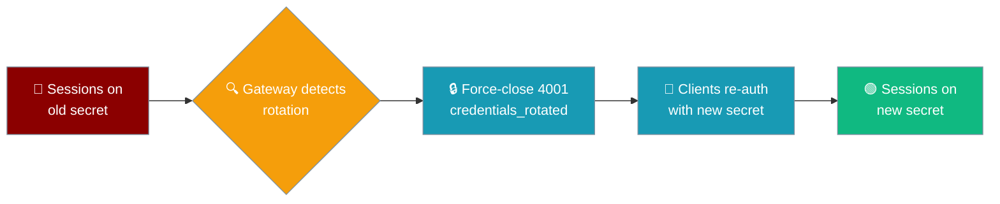
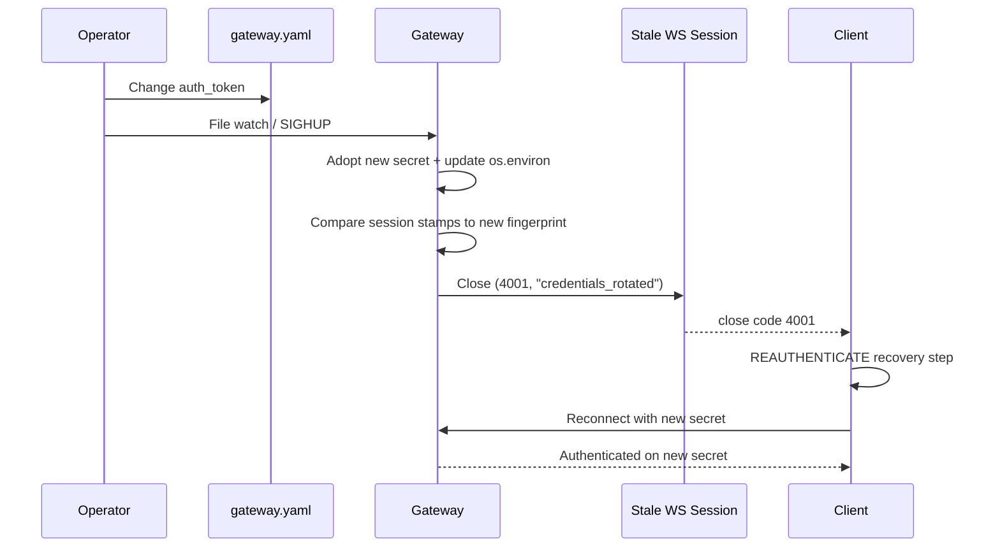
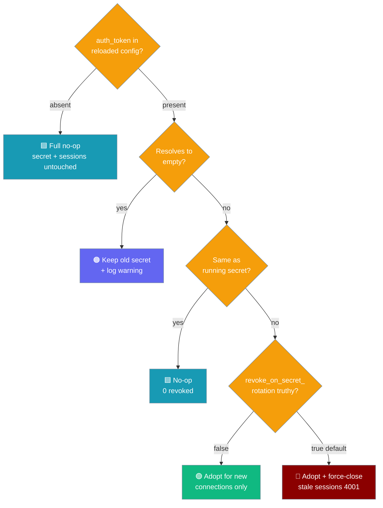

<Note>
The gateway now ships in the `praisonai-bot` package. `praisonai serve gateway` still works exactly as documented here; for a standalone install see [praisonai-bot Migration](/docs/guides/praisonai-bot-migration).
</Note>

Rotate the shared gateway secret and every already-connected client using the old token is force-closed within one reload cycle — no full process restart, no leaked credential left trusted.



An agent connects through the gateway; if the operator later rotates the secret, the agent's client is told to re-authenticate rather than back off.

```python
from praisonaiagents import Agent

agent = Agent(name="Ops Agent", instructions="Report status", gateway=True)
agent.start("ping")
# If the operator rotates the gateway secret, this agent's client will receive
# WebSocket close (4001, "credentials_rotated") and should re-authenticate.
```

## Quick Start

<Steps>
<Step title="Rotate the token in gateway.yaml">
```yaml
# gateway.yaml
gateway:
  auth_token: "${GATEWAY_AUTH_TOKEN_NEW}"     # was: ${GATEWAY_AUTH_TOKEN_OLD}
  revoke_on_secret_rotation: true              # default; shown for clarity
```
</Step>

<Step title="Trigger the hot-reload path">
File watch picks the change up automatically, or send SIGHUP:

```bash
kill -HUP "$(pgrep -f 'praisonai serve gateway')"
```

Every WS session that authenticated under the old secret closes with code `4001` and reason `credentials_rotated`. Sessions already on the new secret stay connected.
</Step>
</Steps>

---

## How It Works

At connect time the gateway stamps each authenticated session with a truncated SHA-256 fingerprint of the active secret. When the reload path notices a new `auth_token`, it adopts it and closes every session whose stamp doesn't match the new fingerprint. Sessions on the new secret are left untouched. The raw secret is never logged — only the digest.



The `CREDENTIALS_ROTATED` close reason is described in the SDK as:

> The shared gateway secret this session authenticated under is no longer the active secret (an operator rotated `auth_token` and hot-reloaded, or otherwise revoked it). The server force-closes every session stamped with a stale secret so a leaked/revoked credential stops working within one reload cycle, without a full process restart. Clients should re-authenticate and reconnect with fresh credentials rather than backing off as if the server were down.

---

## Configuration

```yaml
gateway:
  auth_token: "${GATEWAY_AUTH_TOKEN}"
  revoke_on_secret_rotation: true   # default
```

| Option | Type | Default | Description |
|---|---|---|---|
| `gateway.auth_token` | `str` | — | Shared secret. Env substitution (`${VAR}`) supported. Non-string values are coerced to `str`, so unquoted YAML integers don't crash reload. |
| `gateway.revoke_on_secret_rotation` | `bool` / `str` | `true` | When `true` (default), rotating `auth_token` force-closes every live session on the old secret. When `false` (also accepts `"false"`, `"0"`, `"no"`, `"off"`), the new secret is adopted only for **new** connections; existing sessions stay connected under the old secret. |

---

## Rotation Behaviour — Decision Matrix

When does rotation actually happen?



| Situation in reloaded `gateway.yaml` | Outcome |
|---|---|
| `auth_token` absent | Full no-op. Running secret + live sessions untouched. |
| `auth_token` present, resolves to empty (`""` or unset `${VAR}`) | Running secret kept. A warning is logged so an operator "clearing the secret" isn't left guessing. |
| `auth_token` present, string, same as running secret | No-op (returns `0` revoked). |
| `auth_token` present, differs from running secret | Adopt new secret, export to `GATEWAY_AUTH_TOKEN`, revoke stale live sessions (unless opted out). |
| `auth_token` is not a string (e.g. `auth_token: 12345`) | Coerced to `str` before env assignment, avoiding a mid-reload `TypeError`. |
| `revoke_on_secret_rotation: false` | Secret still adopted for **new** connections; **live** sessions left connected under the old secret. |
| `revoke_on_secret_rotation: "false"` / `"0"` / `"no"` / `"off"` | Also disables revocation. Normalised via `str(...).strip().lower() in {"1","true","yes","on"}`. |
| `revoke_on_secret_rotation` truthy (default) | Every session whose stamped fingerprint no longer matches is force-closed with `(4001, "credentials_rotated")`. |
| No `auth_token` configured at all (loopback mode) | Sessions map to the sentinel `"no-auth"` and are handled consistently. |

---

## Client-Side — How to Re-authenticate

Force-closed sessions receive:

| Field | Value |
|---|---|
| WebSocket close code | `4001` |
| WebSocket close reason | `credentials_rotated` (from `GatewayCloseCode.CREDENTIALS_ROTATED`) |
| Recovery hint | `ConnectRecoveryStep.REAUTHENTICATE` |

Treat `(4001, "credentials_rotated")` as **"re-authenticate with fresh credentials"** — **not** as "server is down, back off". A well-behaved client:

1. Reads the new secret from its own credential source (env, secrets manager, `praisonai auth login`).
2. Reconnects immediately with the new token.
3. Reports back to the operator if the fresh token also fails.

```javascript
ws.addEventListener("close", (event) => {
  if (event.code === 4001 && event.reason === "credentials_rotated") {
    const token = process.env.GATEWAY_AUTH_TOKEN;   // freshly rotated secret
    reconnectWithToken(token);                        // re-auth, do NOT back off
  }
});
```

---

## Security Notes

- The raw `auth_token` is **never logged, exported, or persisted** by this feature — only a 16-char truncated SHA-256 stamp is kept per session for comparison.
- When rotation adopts a new secret, it also updates `GATEWAY_AUTH_TOKEN` in the environment so **all** auth paths (HTTP, magic-link, WS) read the same value — matching [Bind-Aware Auth](/docs/features/gateway-bind-aware-auth) (config wins over env).
- If `auth_token` is declared but resolves to empty (e.g. an unset `${VAR}`), the previous secret is kept and a warning is logged instead of silently clearing auth.
- Loopback-only gateways (no `auth_token`) map to the sentinel `"no-auth"` — rotation is meaningless in that mode.

---

## Common Patterns

### Scheduled quarterly rotation

```yaml
gateway:
  auth_token: "${GATEWAY_AUTH_TOKEN_Q3_2026}"
  revoke_on_secret_rotation: true
```

Rotate the referenced env var and reload — old sessions disconnect, clients re-auth with the new secret.

### Suspected leak — revoke now

```bash
export GATEWAY_AUTH_TOKEN_NEW="$(openssl rand -hex 32)"
sed -i 's/GATEWAY_AUTH_TOKEN_OLD/GATEWAY_AUTH_TOKEN_NEW/' /etc/praisonai/gateway.yaml
kill -HUP "$(pgrep -f 'praisonai serve gateway')"
```

Every session on the leaked secret is disconnected within one reload cycle.

### Coordinated cutover — adopt now, evict later

```yaml
gateway:
  auth_token: "${GATEWAY_AUTH_TOKEN_NEW}"
  revoke_on_secret_rotation: false   # give clients a grace window
```

Later, flip `revoke_on_secret_rotation` back to `true` and reload to evict any laggards still on the old secret.

---

## Best Practices

<AccordionGroup>
<Accordion title="Keep revocation on by default">
Instant revocation is the whole point. Opt out only for staged cutovers where clients need a grace window on the old secret.
</Accordion>

<Accordion title="Quote your token values">
Write `auth_token: "12345"` with quotes. The non-string coercion path exists as a safety net, not a style guide.
</Accordion>

<Accordion title="Check the warning if nothing rotates">
If you see `auth_token present in reloaded config but resolved to empty; keeping the previous secret`, your `${VAR}` isn't set — the old secret is still active.
</Accordion>

<Accordion title="Branch on the wire code, not the message">
`4001` plus reason `credentials_rotated` is stable; the human-readable close message is not. Branch on the code and reason.
</Accordion>
</AccordionGroup>

---

## Related

<CardGroup cols={2}>
<Card title="Gateway Config Reload" icon="arrows-rotate" href="/docs/features/gateway-config-reload">
  Hot-reload architecture this feature plugs into
</Card>
<Card title="Bind-Aware Auth" icon="shield" href="/docs/features/gateway-bind-aware-auth">
  Where the shared `auth_token` is required at all
</Card>
<Card title="Gateway" icon="tower-broadcast" href="/docs/gateway">
  Overview plus all other gateway features
</Card>
<Card title="Gateway Edge Protections" icon="shield-halved" href="/docs/features/gateway-edge-protections">
  Other WebSocket close codes (4028, 4029) and pre-auth guards
</Card>
<Card title="Secret References" icon="key" href="/docs/features/gateway-secret-references">
  Source channel credentials from env, file, or a secret-manager CLI
</Card>
</CardGroup>
