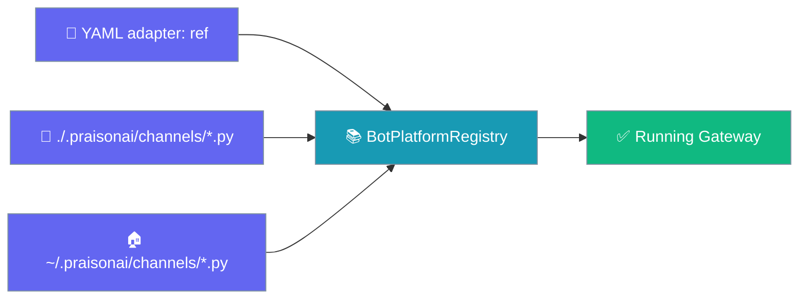
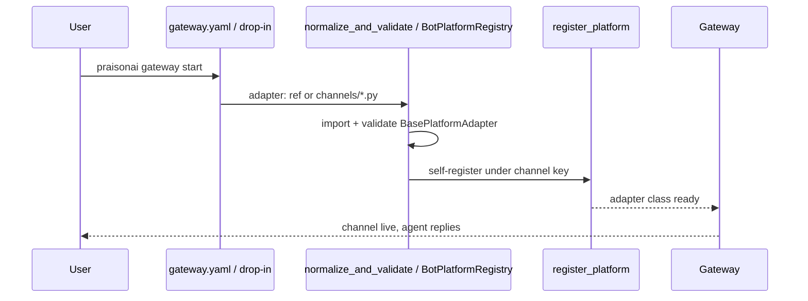
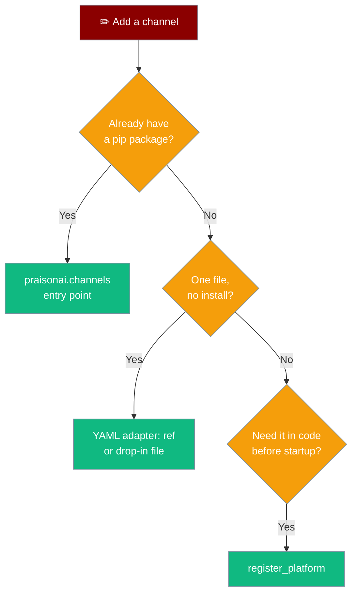

Point a channel at your adapter class from YAML, or drop a `.py` file into `.praisonai/channels/`, and `praisonai gateway start` picks it up — no pip install, no `register_platform()` call.



Your agent replies on the custom channel the same way it does on a built-in one — the channel is just a new door into the same agent.

```python
from praisonaiagents import Agent

agent = Agent(
    name="support",
    instructions="Answer questions on our intranet chat.",
)
agent.start("Reply to intranet messages using our knowledge base.")
```

## Quick Start

<Steps>
<Step title="YAML adapter: import string">

Point a channel at your adapter class with a dotted `"module:Class"` string. The gateway imports, validates, and self-registers it before startup.

```yaml
# gateway.yaml
channels:
  my_intranet_chat:
    adapter: "my_company.adapters:IntranetBot"
    token: ${INTRANET_TOKEN}
    routes:
      default: support
```

```bash
praisonai gateway start
```

</Step>

<Step title="Drop-in file">

Copy a single-file adapter into `~/.praisonai/channels/` and start — no packaging, no config edit.

```bash
mkdir -p ~/.praisonai/channels
cp adapters.py ~/.praisonai/channels/
praisonai gateway start
```

Any `BasePlatformAdapter` subclass in the file registers under its `platform_name`.

</Step>
</Steps>

---

## How It Works

The gateway resolves a channel's adapter class from three inputs, self-registers it, then starts it like any built-in.



A single-file adapter needs only the four abstract methods:

```python
# ~/.praisonai/channels/intranet.py
from praisonaiagents.bots import BasePlatformAdapter


class IntranetBot(BasePlatformAdapter):
    platform_name = "my_intranet_chat"

    async def connect(self, *, is_reconnect: bool = False) -> bool:
        return True

    async def disconnect(self) -> None:
        return None

    async def send(self, chat_id, content, *, reply_to=None, metadata=None):
        ...

    async def get_chat_info(self, chat_id):
        return {}
```

---

## Choosing Between the Surfaces

Five registration paths reach the same adapter class — pick the one that matches your packaging.



---

## Precedence Ladder

The first surface that resolves a channel key wins — a registered platform is never shadowed.

| Order | Surface | Wins When |
|-------|---------|-----------|
| 1 | Registered platform (built-in / entry point / `register_platform`) | The `platform` name is already registered |
| 2 | YAML `adapter:` import ref | `platform` is not registered and `adapter:` is set |
| 3 | Filesystem drop-in (project or user) | An adapter file declares the `platform_name` |
| 4 | Error: `Unknown channel type` | Nothing above resolves the key |

---

## Trust Model

User-global drop-ins are trusted; project-local drop-ins require an explicit opt-in.

<Warning>
Files in `./.praisonai/channels/` (project-local) load **only** when `PRAISONAI_ALLOW_PROJECT_PLUGINS=true`. This mirrors the single-file plugin trust gate: code that ships inside a checked-out repo should not run on the gateway host without your consent. Files in `~/.praisonai/channels/` (user-global) are trusted and always load.
</Warning>

```bash
# Allow project-local channel files for this run
PRAISONAI_ALLOW_PROJECT_PLUGINS=true praisonai gateway start
```

The trust check is scoped to the *channels* directory, so a symlinked `channels` dir is still recognised while a symlinked file cannot slip the gate.

---

## Configuration Options

The `adapter` field is the only new YAML key — it is a loader-only hint and is never passed to the adapter's `__init__`.

| Option | Type | Default | Description |
|--------|------|---------|-------------|
| `adapter` | `str` | `None` | Dotted `"module.path:ClassName"` import string. Class must subclass `BasePlatformAdapter`. Ignored if `platform` is already registered. |

If the adapter class exposes a `channel_descriptor` (attribute or callable), that descriptor is used at registration; otherwise the channel registers with `descriptor=None`.

---

## Common Patterns

### Enterprise intranet chat (YAML `adapter:`)

Point a channel at a packaged internal adapter and pull the token from the environment.

```yaml
# gateway.yaml
channels:
  my_intranet_chat:
    adapter: "my_company.adapters:IntranetBot"
    token: ${INTRANET_TOKEN}
    routes:
      default: support
```

```bash
praisonai gateway start
```

### Prototype in one file (drop-in)

Skip packaging entirely — drop a single file into the user-global directory.

```bash
mkdir -p ~/.praisonai/channels
cp intranet.py ~/.praisonai/channels/
praisonai gateway start
```

### Overriding a built-in

You cannot silently override a built-in from `adapter:` — a registered `platform` always wins. To swap a built-in, register in code before startup.

```python
from praisonai.bots._registry import register_platform
from my_company.adapters import CustomSlackBot

register_platform("slack", CustomSlackBot)
```

---

## Error Surface

Malformed refs fail fast with a clear `ValueError` so a typo never starts a silent, broken channel.

| Trigger | Example | Error |
|---------|---------|-------|
| No colon in ref | `"my_company.adapters.IntranetBot"` | `ValueError` — ref must be `"module:Class"` |
| Empty module or class | `":IntranetBot"` / `"my_company.adapters:"` | `ValueError` — empty module/class |
| Unimportable module | `"missing_pkg.adapters:IntranetBot"` | `ValueError` — module import failed |
| Missing class attribute | `"my_company.adapters:NoSuchBot"` | `ValueError` — class not found in module |
| Not a `BasePlatformAdapter` | class that does not subclass the base | `ValueError` — not a `BasePlatformAdapter` |

---

## Best Practices

<AccordionGroup>

<Accordion title="Keep adapters in a versioned repo path">
Store the adapter file in a checked-in project path and copy it into `~/.praisonai/channels/` at deploy time, so the running channel is reproducible from source control.
</Accordion>

<Accordion title="Pin secrets via ${ENV} refs, never inline">
Reference tokens as `${INTRANET_TOKEN}` in `gateway.yaml`. Never inline a secret in the YAML or the drop-in file — both are easy to leak.
</Accordion>

<Accordion title="Keep the drop-in file dependency-free">
A single-file adapter should import only `BasePlatformAdapter` and stdlib. Do heavy SDK imports lazily inside `connect()` so a missing dependency never breaks gateway startup.
</Accordion>

<Accordion title="Package once the adapter is stable">
When an adapter is shared across teams, promote it to a `praisonai.channels` entry point. Packaging gives you versioning and dependency pinning that a drop-in file cannot.
</Accordion>

</AccordionGroup>

---

## Related

<CardGroup cols={2}>
<Card title="Bot Platform Plugins" icon="puzzle-piece" href="/features/bot-platform-plugins">
  All five registration paths and the precedence ladder.
</Card>
<Card title="Build a Platform Adapter" icon="plug" href="/features/bot-platform-adapter">
  Subclass `BasePlatformAdapter` — chunking, retries, typing for free.
</Card>
</CardGroup>
