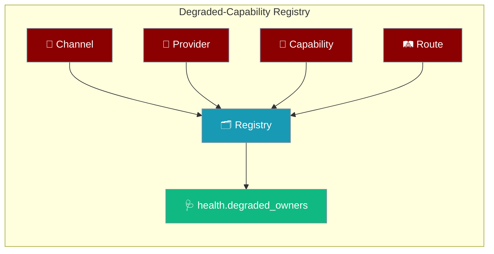
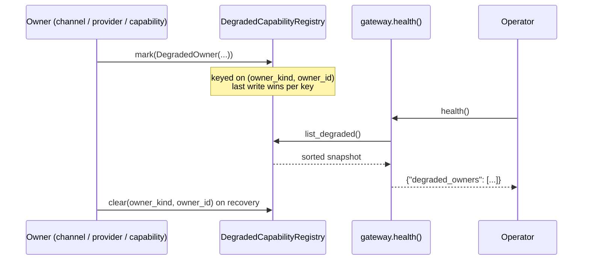
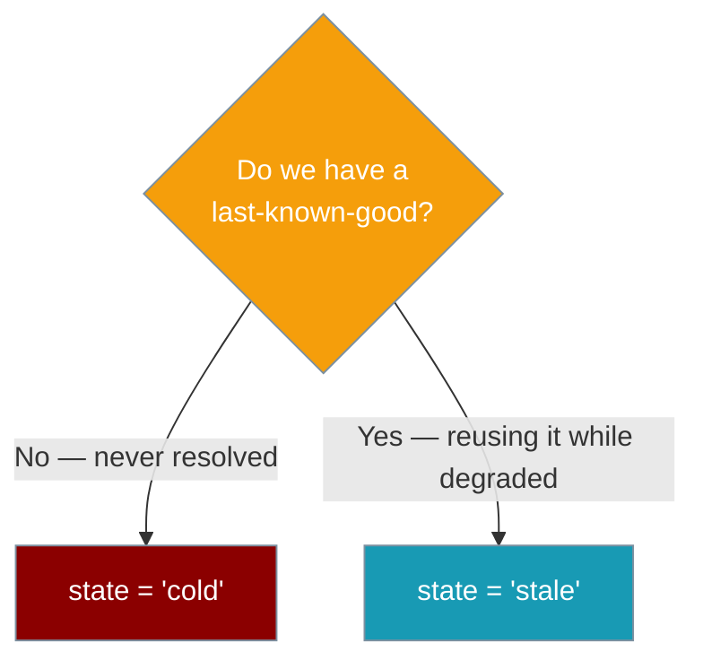

When any part of the gateway degrades — a channel, an LLM provider, an MCP capability, a route, or the gateway itself — it shows up once in a single, redacted `degraded_owners` list with an exact next action.



Before this registry the gateway recorded degradation in several disconnected places but surfaced only degraded **channels** through `health()`. Provider credential failures, unresolved `SecretRef` capabilities, and route-level failures were classified but never exposed — a partial degraded state where some failures stayed invisible until a message silently went nowhere. A single process-local registry now collects every degraded owner at the boundary that owns it, so `health()` lists them all with a consistent, redacted shape and an actionable next step.

<Note>
This is a purely additive surface — there is no `gateway.yaml` knob and no CLI flag. The channel-only `channels` map in `health()` is unchanged, so existing monitors keep working. The registry, its dataclass, its protocol, and the closed vocabularies are all public exports from `praisonaiagents.gateway`.
</Note>

---

## Quick Start

<Steps>
<Step title="See it in health()">
The 90% path — read the surface, no code to write. Any degraded owner (channel, provider, capability, route, or gateway) appears in one place.

```python
from praisonaiagents import Agent
from praisonai_bot.gateway import BotGateway   # or the wrapper your setup uses

agent = Agent(name="assistant", instructions="Be helpful.")
gateway = BotGateway(config="gateway.yaml")

# Any degraded owner — channel / provider / capability / route / gateway —
# now shows up in one place under health()["degraded_owners"].
print(gateway.health().get("degraded_owners", []))
```

Example output when a Slack token is unavailable at boot **and** an MCP capability failed to resolve a secret:

```json
[
  {"owner_kind": "capability", "owner_id": "mcp:notion",
   "state": "cold", "reason": "secret unresolved",
   "retry_hint": "praisonai gateway doctor --fix"},
  {"owner_kind": "channel", "owner_id": "slack",
   "state": "cold", "reason": "credential unavailable",
   "retry_hint": "praisonai gateway doctor --fix"}
]
```
</Step>

<Step title="Record your own degraded owner">
Advanced — for integrations building on the gateway. Mark degradation at the boundary that owns it, then clear on recovery.

```python
from praisonaiagents.gateway import DegradedCapabilityRegistry, DegradedOwner

registry = DegradedCapabilityRegistry()

# Mark degradation at the boundary that owns it
registry.mark(DegradedOwner(
    owner_kind="provider",         # channel | provider | capability | route | gateway
    owner_id="openai",             # stable identity
    state="cold",                  # cold (no last-known-good) | stale (reusing LKG)
    reason="auth rejected (401)",  # redacted, operator-safe
    retry_hint="re-set OPENAI_API_KEY",
))

# Clear on recovery
registry.clear("provider", "openai")

# Read a stable, sorted snapshot
for owner in registry.list_degraded():
    print(owner.owner_kind, owner.owner_id, owner.reason)
```
</Step>
</Steps>

---

## How It Works

Each owner writes into the registry at its own boundary; `health()` reads a sorted snapshot on demand.



The registry is process-local and thread-safe, keyed on `(owner_kind, owner_id)` so a repeated failure for the same owner updates the existing entry instead of stacking duplicates.

---

## Fields Reference

`DegradedOwner` is a frozen dataclass with five fields — `retry_hint` is the only one with a default.

| Field | Type | Default | Description |
|-------|------|---------|-------------|
| `owner_kind` | `str` | *required* | One of `channel`, `provider`, `capability`, `route`, `gateway`. Anything else raises `ValueError` at construction. |
| `owner_id` | `str` | *required* | Stable identity for the owner (e.g. `telegram:main`, `openai`, `mcp:notion`). |
| `state` | `str` | *required* | Either `cold` (no last-known-good) or `stale` (reusing last-known-good). Anything else raises `ValueError`. |
| `reason` | `str` | *required* | Redacted, operator-safe explanation. Must never leak token/secret material. |
| `retry_hint` | `str` | `""` | The exact next action, e.g. `praisonai gateway doctor --fix`. Every `retry_hint` MUST name a command that exists — `praisonai gateway doctor --fix` is the canonical example (see [Gateway CLI › Auto-repair](/docs/features/gateway-cli#auto-repair-with-fix)). |

---

## Closed Vocabularies

Two tuples define the only valid values — import them instead of hard-coding string literals.

| Constant | Values |
|----------|--------|
| `OWNER_KINDS` | `("channel", "provider", "capability", "route", "gateway")` |
| `DEGRADED_STATES` | `("cold", "stale")` |

Both are exported from `praisonaiagents.gateway`, so callers can validate against them before constructing a `DegradedOwner`.

---

## Registry Methods

`DegradedCapabilityRegistry` is the default in-process implementation of the `DegradedCapabilityProtocol`.

| Method | Signature | Behaviour |
|--------|-----------|-----------|
| `mark` | `mark(owner: DegradedOwner) -> None` | Record (or update) a degraded owner. Last write wins per `(owner_kind, owner_id)` key. Thread-safe. |
| `clear` | `clear(owner_kind: str, owner_id: str) -> None` | Remove on recovery. Idempotent — clearing a missing key is a no-op. |
| `list_degraded` | `list_degraded() -> List[DegradedOwner]` | Stable, sorted-by-`(owner_kind, owner_id)` snapshot. |
| `to_list` | `to_list() -> List[Dict[str, str]]` | Same as `list_degraded()` rendered as plain dicts for JSON. |

---

## `cold` vs `stale`

Pick the state by whether a last-known-good value exists.



Use `cold` when the owner never resolved a working value (a token that was never set). Use `stale` when it is still serving from a last-known-good value while degraded.

---

## The `health()` Surface

`degraded_owners` sits alongside the existing `channels` map and lists every degraded owner in one redacted shape.

```json
{
  "status": "healthy",
  "channels": { "telegram": {"running": true}, "slack": {"status": "degraded"} },
  "degraded_owners": [
    {
      "owner_kind": "channel",
      "owner_id": "slack",
      "state": "cold",
      "reason": "credential unavailable",
      "retry_hint": "praisonai gateway doctor --fix"
    },
    {
      "owner_kind": "provider",
      "owner_id": "openai",
      "state": "cold",
      "reason": "auth rejected (401)",
      "retry_hint": "re-set OPENAI_API_KEY"
    }
  ]
}
```

<Info>
- The channel-only `channels` map is unchanged — this is a purely additive surface, safe for existing monitors.
- `degraded_owners` is present only when the list is non-empty.
- The aggregation is defensive — `health()` never raises even if a registry read fails.
</Info>

---

## Common Patterns

Read the surface once and act on it — for alerting or for CI.

**Poll for degradation from an ops script** — alert on any channel (matches existing on-call playbooks) plus any provider (new).

```python
degraded = gateway.health().get("degraded_owners", [])
for owner in degraded:
    if owner["owner_kind"] in ("channel", "provider"):
        alert(f"{owner['owner_kind']} {owner['owner_id']} degraded: {owner['reason']}")
```

**Fail a CI check on any degraded owner** — same call, exit non-zero when the list is non-empty.

```python
import sys

degraded = gateway.health().get("degraded_owners", [])
if degraded:
    for owner in degraded:
        print(owner["owner_kind"], owner["owner_id"], owner["retry_hint"])
    sys.exit(1)
```

---

## Best Practices

<AccordionGroup>
<Accordion title="Use the closed vocabularies">
Import `OWNER_KINDS` and `DEGRADED_STATES` from `praisonaiagents.gateway` and validate against them before constructing a `DegradedOwner`. The frozen dataclass raises `ValueError` on an unknown `owner_kind` or `state`, so checking first turns a runtime crash into a clean guard.
</Accordion>

<Accordion title="Redact secrets in reason">
The registry is operator-facing — a token or secret in `reason` surfaces on every dashboard, log line, and status probe. Say what failed, not what the value was: `"auth rejected (401)"`, not the key itself.
</Accordion>

<Accordion title="Set an actionable retry_hint">
`praisonai gateway doctor --fix` is the sanctioned default — the command exists and actually repairs a weak/missing gateway auth token, then re-validates (see [Gateway CLI › Auto-repair](/docs/features/gateway-cli#auto-repair-with-fix)). Every `retry_hint` in this registry MUST name a command that exists. Prefer a specific one that names the exact env var, secret file, or rotation command — e.g. `re-set OPENAI_API_KEY` — so the operator's next step is unambiguous.
</Accordion>

<Accordion title="Clear on recovery">
`mark()` alone leaves the entry until the process restarts. Pair every `mark()` at the failure point with a `clear()` on the success path so `health()` reflects reality instead of a stale failure.
</Accordion>
</AccordionGroup>

---

## Related

<CardGroup cols={2}>
<Card title="Degraded Channel Isolation" icon="shield-halved" href="/docs/features/gateway-degraded-channels">
  The channel-specific boot-time isolation contract this composes over.
</Card>
<Card title="Gateway Channel Supervision" icon="heart-pulse" href="/docs/features/gateway-channel-supervision">
  The runtime supervisor that produces the `stale` channel entries.
</Card>
<Card title="Gateway CLI" icon="terminal" href="/docs/features/gateway-cli">
  `gateway doctor` / `gateway status` — the operator surfaces that render `degraded_owners`.
</Card>
<Card title="Gateway Secret References" icon="key" href="/docs/features/gateway-secret-references">
  The source of `credential unavailable` reasons.
</Card>
</CardGroup>
