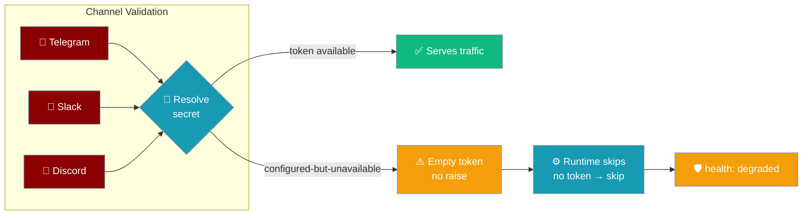
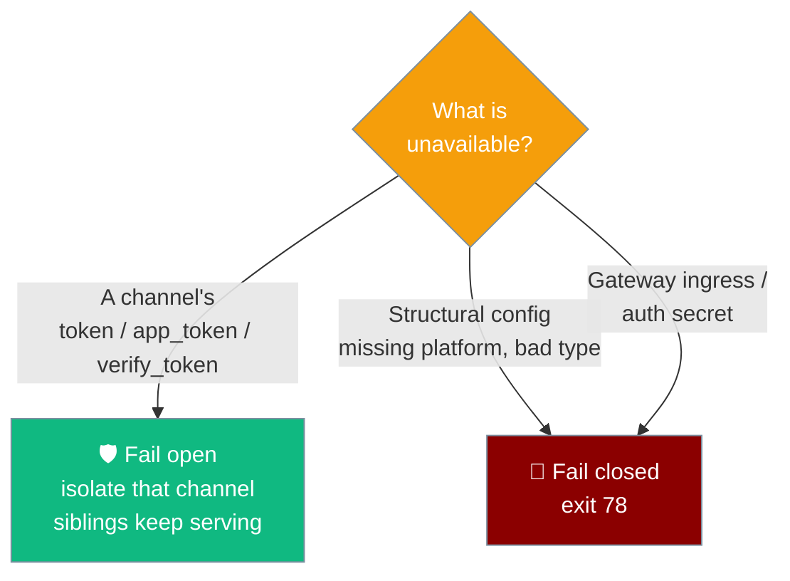

One channel's unavailable credential isolates just that channel as degraded — every healthy channel keeps serving.

```python
from praisonaiagents import Agent

agent = Agent(name="assistant", instructions="Be helpful.")
# Rotate Slack's token overnight — Telegram + Discord keep serving; Slack is
# marked degraded until the new token is available.
agent.start("Anyone there?")
```



Before this change one channel's `ValueError` aborted the whole `GatewayConfigSchema`, taking every channel offline. Now the schema returns an empty token for the unavailable credential, the runtime's pre-existing "no token → skip" path isolates that one channel, and `health()` reports it as degraded.

<Note>
This is a resilience contract, not a new API. Nothing changes in how you write `gateway.yaml` — the same [Secret References](/docs/features/gateway-secret-references) you already use now fail open per-channel instead of failing closed for the whole gateway.
</Note>

---

## What Changed

A single channel's unavailable credential is isolated; structural errors and the gateway's own ingress secret still fail closed.

| Scenario | Before | After |
|----------|--------|-------|
| Single channel token env var unset at boot | `GatewayConfigSchema` raised; **all** channels dead | Only that channel is skipped and marked degraded; siblings keep serving |
| `{source: file, id: /run/secrets/x}` file empty at boot | Same — whole gateway down | Same isolation as above |
| Structurally invalid config (missing `platform:`) | Fails closed | **Still fails closed** (unchanged) |
| Gateway's own ingress / auth secret unavailable | Fails closed | **Still fails closed** (unchanged) |
| Preflight probe running (`--preflight`, default) | Hard-abort on failure | **Unchanged** — preflight still hard-aborts. Isolation only kicks in when preflight is skipped or a credential drops between preflight and full config load |

The single most important distinction: a **channel** credential fails open (isolated, degraded); the **gateway's own** config and ingress secret fail closed (abort).



---

## How to Observe the Degraded State

The degraded channel is visible in the startup log, `gateway doctor`, `channels --probe`, and `GET /health` — no value is ever printed.

### Startup log

One redacted WARNING is logged per degraded channel. An unset `${ENV}` token logs:

```
Channel token env var 'SLACK_BOT_TOKEN' not set — channel will be skipped (degraded). Set it with: export SLACK_BOT_TOKEN=your_token
```

A `{source, id}` reference that resolves to `configured-but-unavailable` / `missing` logs:

```
Channel secret configured-unavailable — channel will be skipped (degraded): env var 'SLACK_BOT_TOKEN' empty
```

The token value is never printed — resolved secrets are registered for redaction.

### `praisonai gateway doctor`

The `secrets` block reports `configured-but-unavailable` or `missing` for the affected field.

```bash
$ praisonai gateway doctor
Credential availability (values never shown):
telegram     token         ✓  available
slack        token         ✓  available
slack        app_token     ✗  configured-but-unavailable
```

See [Credential availability (without revealing values)](/docs/features/gateway-cli#credential-availability-without-revealing-values) for the full table.

### `praisonai gateway channels --probe`

The channel listing surfaces the same per-channel verdict — a one-line probe you can run against a live gateway.

### `GET /health` on the running gateway

The degraded channel appears under `channels`, distinguished from a running channel by `status: "degraded"` and a `reason`.

```json
{
  "status": "healthy",
  "channels": {
    "telegram": { "platform": "telegram", "running": true },
    "discord":  { "platform": "discord",  "running": true },
    "slack":    {
      "platform": "slack",
      "running": false,
      "status": "degraded",
      "reason": "credential unavailable"
    }
  }
}
```

A degraded channel stays queryable in `health()` — it does not silently vanish, so a monitor can tell "configured-but-unavailable" apart from "never configured".

---

## How to Recover

<Steps>
<Step title="Fix the credential">
Rotate the env var, refill the mounted secret file, or restore the secret manager so the token resolves to `available` again.
</Step>

<Step title="Reload the config">
An empty credential is resolved once at config load, so `praisonai gateway reconnect <channel>` alone does **not** re-read it — reconnect drives the channel supervisor, not the secret resolver. Trigger a config reload (or restart) so the schema re-resolves the now-available token. See [Channel Supervision](/docs/features/gateway-channel-supervision) for reconnect/pause/resume.
</Step>

<Step title="Confirm it recovered">
On the next config load, a channel that previously degraded but now has a token is removed from the degraded set automatically. Verify with `praisonai gateway doctor` or `GET /health`.
</Step>
</Steps>

<Note>
[Gateway Hot Reload](/docs/features/gateway-hot-reload) picks the new credential up without a full restart — the reload re-resolves every channel's secret and drops recovered channels out of the degraded set.
</Note>

---

## When You Do NOT Want This Behaviour

Some operators prefer strict fail-closed — enforce it at the operator layer, not the schema.

Preflight (`--preflight`, the default) still hard-aborts on a credential failure at start. The isolation contract only matters after the gateway is already running, or when preflight was explicitly skipped with `--no-preflight`.

There is intentionally **no** knob to make the schema raise again — that behaviour was removed precisely because it took healthy channels down. To gate a deploy on strict availability, fail the release if `praisonai gateway doctor --json` reports any `configured-but-unavailable` or `missing`:

```bash
praisonai gateway doctor --config gateway.yaml --json > doctor.json
python -c "import json,sys; d=json.load(open('doctor.json')); \
  bad=[(c,f,v) for c,fs in d.get('secrets',{}).items() for f,v in fs.items() if v not in ('available','configured')]; \
  sys.exit(1) if bad else None"
```

---

## Best Practices

<AccordionGroup>
<Accordion title="Gate deploys on praisonai gateway doctor --json">
Read the `secrets` block and fail the deploy if any field is not `available` (or `configured` for `exec` sources). This gives you strict fail-closed at release time while keeping the resilient fail-open behaviour at runtime.
</Accordion>

<Accordion title="Use {source: file} for K8s / Docker secrets">
A mounted secret file survives a container restart; a process env var may not. Cross-link: [Secret References](/docs/features/gateway-secret-references). File-sourced credentials keep resolving after a restart, so a channel recovers on the next config load without manual intervention.
</Accordion>

<Accordion title="Alert on the degraded WARNING log line">
The `channel will be skipped (degraded)` WARNING is your operator canary. Wire it into your alerting so a rotated-but-not-yet-refilled credential pages you before users notice the channel is quiet.
</Accordion>

<Accordion title="Never rely on preflight alone for continuous safety">
Preflight only checks credentials at start. A token can go stale after preflight passes — expiry, rotation, a secret-store blip. Degraded-channel isolation is what keeps the other channels serving when that happens.
</Accordion>
</AccordionGroup>

---

## Related

<CardGroup cols={2}>
<Card title="Gateway Secret References" icon="key" href="/docs/features/gateway-secret-references">
  Load credentials from files, env vars, or secret managers.
</Card>
<Card title="Gateway CLI" icon="terminal" href="/docs/features/gateway-cli">
  `gateway doctor` and `channels --probe` credential availability.
</Card>
<Card title="Gateway Channel Supervision" icon="arrows-rotate" href="/docs/features/gateway-channel-supervision">
  Reconnect, pause, and resume individual channels.
</Card>
<Card title="Gateway Reliability Presets" icon="shield" href="/docs/features/gateway-reliability">
  Drain, admission, and fail-closed opt-outs.
</Card>
</CardGroup>
