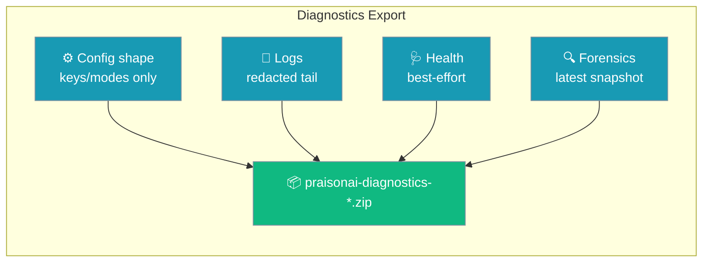
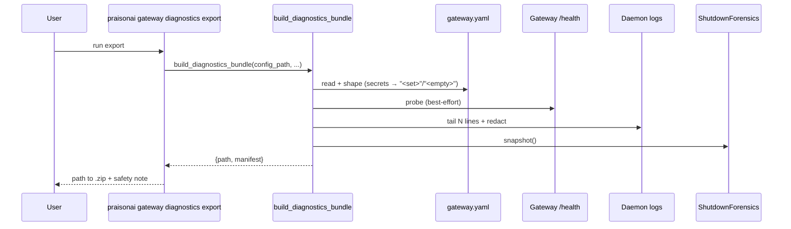
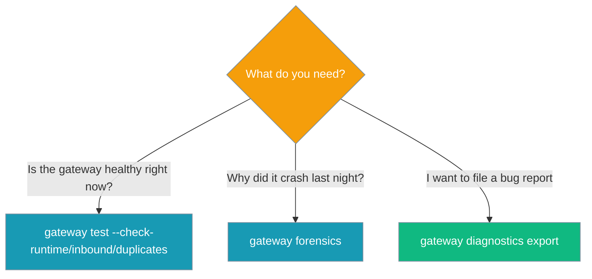

One command writes a portable, pre-sanitised `.zip` — config shape, redacted logs, health, and forensics — safe to attach to a bug report without leaking secrets.



## Quick Start

An agent operator hits a snag and asks for a bundle in one line.

```python
from praisonaiagents import Agent

agent = Agent(
    name="Gateway Operator",
    instructions=(
        "When a user reports the bot is misbehaving, run "
        "'praisonai gateway diagnostics export' and share the resulting zip path."
    ),
)

agent.start("Something is off with the Slack bot — grab a support bundle so I can share it.")
```

<Steps>
<Step title="Export a bundle">
```bash
praisonai gateway diagnostics export
# → ~/.praisonai/diagnostics/praisonai-diagnostics-YYYYMMDD-HHMMSS.zip
```
</Step>

<Step title="Point at a specific config">
```bash
praisonai gateway diagnostics export --config gateway.yaml
```
</Step>

<Step title="Emit JSON for scripts">
```bash
praisonai gateway diagnostics export --json
```
</Step>
</Steps>

---

## How It Works

Each section is best-effort — a section that cannot be gathered is recorded as an error instead of aborting the bundle.



The archive lands at `~/.praisonai/diagnostics/praisonai-diagnostics-<timestamp>.zip`. The path is unique — a `-N` suffix is appended when a same-second stamp collides, so no bundle is silently overwritten.

| File in `.zip` | Content |
|----------------|---------|
| `summary.txt` | Human-readable overview (redacted). |
| `config_shape.json` | Config reduced to **keys/modes only** — credential values collapsed to `"<set>"` / `"<empty>"`, all other scalars replaced with their type name (e.g. `"<str>"`, `"<int>"`). No endpoints, ids, or free-text values leak. |
| `logs.txt` | Redacted tail of the local daemon service log (fallback when the gateway is down). Passes through `redact_secrets`. |
| `health.json` | Best-effort reachability of the running gateway (`{reachable, detail}`). |
| `forensics.json` | Latest fast `ShutdownForensics().snapshot()` — no chat/prompt data. |
| `manifest.json` | Tool name, issue reference (`4044`), UTC `generated_at`, list of sections, `redacted: true`, list of files. |

---

## CLI Options

| Flag | Type | Default | Description |
|------|------|---------|-------------|
| `--config`, `-c` | `str` | `"gateway.yaml"` | Path to `gateway.yaml` (resolved through `_resolve_doctor_config`). |
| `--output-dir` | `str \| None` | `None` → `~/.praisonai/diagnostics` (honours `$PRAISONAI_HOME`) | Directory to write the bundle. |
| `--log-lines` | `int` | `200` | Number of recent (redacted) log lines to include. |
| `--json` | `bool` | `False` | Emit JSON (`{path, manifest}`) instead of the human summary. |

---

## Python API

The bundler is typer-free, so you can call it directly.

```python
from praisonai_bot.gateway.diagnostics import build_diagnostics_bundle

result = build_diagnostics_bundle(
    "gateway.yaml",
    output_dir="/tmp/bundles",
    log_lines=500,
)

print(result["path"])       # /tmp/bundles/praisonai-diagnostics-....zip
print(result["manifest"])   # dict with tool, issue, generated_at, sections, files
```

Signature:

```python
def build_diagnostics_bundle(
    config_path: Optional[str],
    *,
    output_dir: Optional[str] = None,
    include: Sequence[str] = ("summary", "health", "config_shape", "logs", "forensics"),
    log_lines: int = 200,
) -> Dict[str, Any]: ...
```

Skip sections you do not need with `include`:

```python
from praisonai_bot.gateway.diagnostics import build_diagnostics_bundle

# Lightweight report — no health probe, no forensics
build_diagnostics_bundle(
    "gateway.yaml",
    include=("summary", "config_shape", "logs"),
)
```

---

## Safety Guarantees

<Warning>
The bundle never includes chat text, prompts, tool outputs, credentials, or raw tokens.

- Config credentials collapse to `"<set>"` / `"<empty>"`; raw values never survive anywhere in the shape.
- Non-credential scalars are reduced to their type name (e.g. `"<str>"`, `"<int>"`).
- Every text section passes through `redact_secrets` before archiving; registered secrets appear as `[REDACTED]`.
- The export runs to completion even when the gateway is unreachable or the config file is missing — each section records `{"error": ...}` instead of aborting.
- Rapid back-to-back exports never overwrite each other (unique path resolution).
</Warning>

---

## Which Diagnostic Do I Need?



---

## Best Practices

<AccordionGroup>
<Accordion title="Attach the whole zip, not individual files">
The `manifest.json` records exactly what was collected. Sharing the full archive keeps the report self-describing.
</Accordion>
<Accordion title="Export even when the gateway is down">
The command falls back to local daemon logs on purpose — a bundle is most useful precisely when the gateway is unreachable.
</Accordion>
<Accordion title="Widen --log-lines for slow-manifesting bugs">
The default `200` is a fast tail. Use `--log-lines 2000` when you need a longer window to catch an intermittent failure.
</Accordion>
<Accordion title="Use --json in scripts and CI">
The JSON payload gives you `path` for auto-upload and `manifest` for indexing.
</Accordion>
<Accordion title="Verify before sharing">
Open `config_shape.json` once and confirm every secret slot shows `"<set>"` / `"<empty>"`, never a raw value.
</Accordion>
</AccordionGroup>

---

## Related

<CardGroup cols={2}>
<Card title="Tiered Diagnostics" icon="stethoscope" href="/features/gateway-tiered-diagnostics">
  Live health / inbound / duplicate checks.
</Card>
<Card title="Gateway Forensics" icon="magnifying-glass" href="/features/gateway-forensics">
  Deep post-incident inspection (the snapshot embedded here).
</Card>
<Card title="Gateway CLI" icon="terminal" href="/features/gateway-cli">
  Full gateway CLI reference.
</Card>
<Card title="Secret References" icon="key" href="/features/gateway-secret-references">
  Where the redacted secrets come from.
</Card>
</CardGroup>
