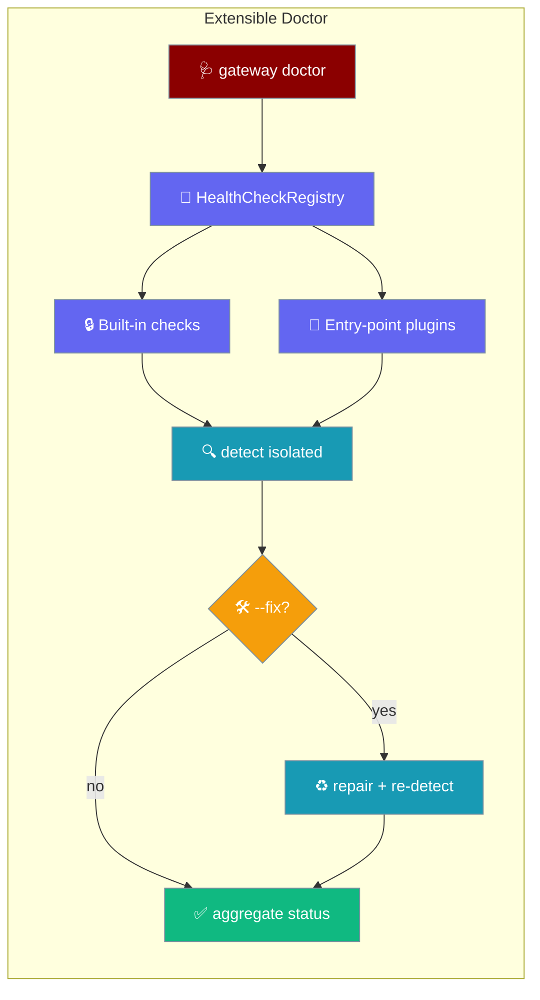
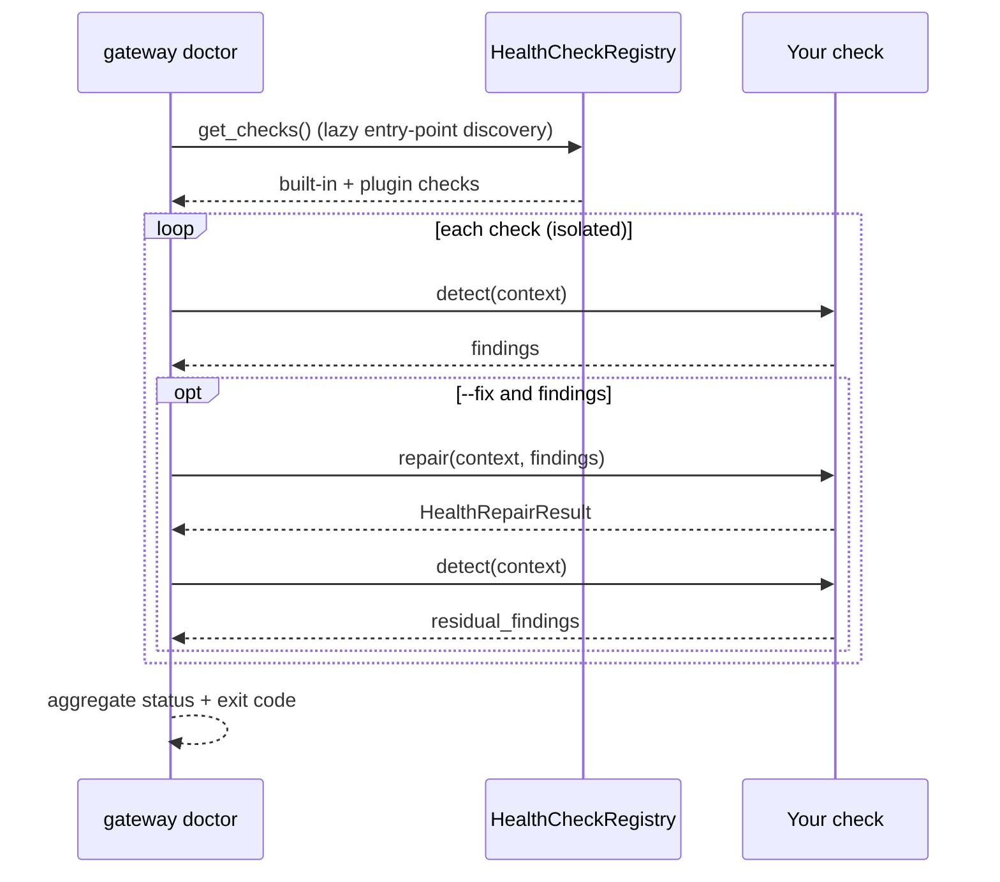
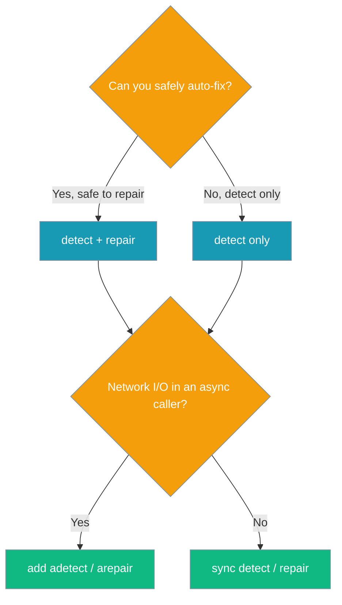

`praisonai gateway doctor` runs every health check registered against `praisonai.health_checks`, so a tool or channel package can surface its own status — and optional auto-repair — alongside the built-in gateway checks.



An agent can run the same registry to report live health before answering an ops question.

```python
from praisonaiagents import Agent
from praisonaiagents.runtime import run_health_checks

def check_stack_health() -> str:
    """Run every registered health check and return a one-line summary."""
    results = run_health_checks({"config_path": "gateway.yaml"})
    return f"{len(results)} checks: " + ", ".join(
        f"{r.check_id}={'ok' if not r.residual_findings else 'issue'}"
        for r in results
    )

agent = Agent(
    name="Ops Assistant",
    instructions="Check gateway health before answering ops questions.",
    tools=[check_stack_health],
)
agent.start("Is the gateway healthy right now?")
```

## Quick Start

<Steps>
<Step title="Write a diagnostic-only check">
A check needs a namespaced `check_id` and a `detect` method that returns findings without changing anything.

```python
from praisonaiagents.runtime import HealthCheckProtocol, Finding

class WebhookCheck:
    check_id = "channel/example/webhook"

    def detect(self, context) -> list[Finding]:
        if webhook_grant_expired():  # your own probe
            return [Finding(
                rule_id=self.check_id,
                severity="error",
                message="Slack webhook OAuth grant has expired",
                fix_description="Re-mint the webhook credential",
            )]
        return []
```
</Step>

<Step title="Advertise it via entry point">
Third-party packages expose checks through the `praisonai.health_checks` group in `pyproject.toml`.

```toml
[project.entry-points."praisonai.health_checks"]
example_webhook = "my_package.health:WebhookCheck"
```

The entry point may resolve to a class (called with no arguments) or an instance. Discovery is lazy — it runs on the first `doctor` invocation.
</Step>

<Step title="Run the doctor">
Install your package, then run the doctor. Your check appears next to the built-ins.

```bash
praisonai gateway doctor --config gateway.yaml
```

```
health checks: 3 run, 0 repaired, 2 validated
channel/example/webhook: error: Slack webhook OAuth grant has expired; fix: Re-mint the webhook credential
```
</Step>
</Steps>

---

## How It Works

`gateway doctor` asks the registry for every check, runs each in an isolated try/except, then — with `--fix` — repairs and re-detects.



| Behaviour | What happens |
|-----------|--------------|
| Failure isolation | An exception in one check produces a result with an `error` and a synthesised `error`-severity `Finding`; other checks still run. |
| Repair lifecycle | With `fix=True` and non-empty findings, `repair(context, findings)` runs, then `detect()` runs again so `residual_findings` reflects the post-repair state. |
| Protected IDs | Built-ins register as `protected=True` (`core/gateway/auth-token`, `core/gateway/config-version`). A plugin that shadows a protected ID is dropped with a `UserWarning`. |
| Duplicate IDs | A second non-protected registration under the same ID replaces the first with a `UserWarning`. |
| Malformed repair | A `repair()` returning anything other than `HealthRepairResult` or `None` raises `TypeError`, which the registry catches and turns into a `repair failed:` residual finding. |
| Async offload | `arun` calls `adetect`/`arepair` when present, else offloads the sync method with `asyncio.to_thread` so the event loop stays responsive. |

---

## Choose Your Check Type

Pick the smallest surface that fits — detect only, add a repair, or go async when you touch the network.



Add a `repair` method to auto-fix, and honour `dry_run` so `--dry-run` only previews.

```python
from praisonaiagents.runtime import HealthCheckProtocol, HealthRepairResult, Finding

class WebhookCheck:
    check_id = "channel/example/webhook"

    def detect(self, context) -> list[Finding]:
        if webhook_grant_expired():
            return [Finding(
                rule_id=self.check_id,
                severity="error",
                message="Slack webhook OAuth grant has expired",
                fix_description="Re-mint the webhook credential",
            )]
        return []

    def repair(self, context, findings) -> HealthRepairResult:
        if context.get("dry_run"):
            return HealthRepairResult(changed=False, message="would re-mint webhook credential")
        remint_webhook_credential()
        return HealthRepairResult(changed=True, message="webhook credential re-minted")
```

Return `adetect` / `arepair` coroutines when a check hits the network, so it never blocks a caller's event loop.

```python
class WebhookCheck:
    check_id = "channel/example/webhook"

    async def adetect(self, context) -> list[Finding]:
        if await webhook_grant_expired_async():
            return [Finding(
                rule_id=self.check_id,
                severity="error",
                message="Slack webhook OAuth grant has expired",
                fix_description="Re-mint the webhook credential",
            )]
        return []
```

---

## Reference

The protocol requires `check_id` and `detect`; the rest are duck-typed and optional.

| Method / Property | Required | Purpose |
|-------------------|----------|---------|
| `check_id` | Yes | Stable namespaced identifier (must contain `/`). `id` is accepted as a compatibility alias. |
| `detect(context)` | Yes | Return current findings without mutating external state. |
| `repair(context, findings)` | No | Apply a safe fix; return `HealthRepairResult`. |
| `adetect(context)` | No | Async variant of `detect`. |
| `arepair(context, findings)` | No | Async variant of `repair`. |

`HealthCheckResult` — one check's detect → repair → re-validate outcome:

| Field | Type | Default | Description |
|-------|------|---------|-------------|
| `check_id` | `str` | — | The check's identifier. |
| `findings` | `List[Finding]` | — | What `detect()` saw before repair. |
| `residual_findings` | `List[Finding]` | — | What `detect()` sees after repair. |
| `repair` | `Optional[HealthRepairResult]` | `None` | The repair outcome, if `--fix` ran a repair. |
| `error` | `Optional[str]` | `None` | Set when the check raised. |
| `repaired` | `bool` (property) | — | `True` when `repair.changed` and `residual_findings` is empty. |

`HealthRepairResult` — a frozen dataclass returned by `repair()`:

| Field | Type | Default | Description |
|-------|------|---------|-------------|
| `changed` | `bool` | — | `True` when the repair mutated state. |
| `message` | `str` | `""` | Human-readable summary. |
| `details` | `Mapping[str, Any]` | `{}` | Structured extra data. |

Well-known `context` keys the gateway passes to every check:

| Key | Type | Description |
|-----|------|-------------|
| `config_path` | `str` | Path to `gateway.yaml`. |
| `dry_run` | `bool` | `True` under `--dry-run`; preview only, write nothing. |

---

## --fix, dry-run, and JSON output

`--fix` runs each check's `repair()`, and `--dry-run` is threaded through the shared `context` so checks preview without writing. `--json` output carries a top-level `health` block.

```json
{
  "health": {
    "checksRun": 3,
    "repaired": 1,
    "validated": 3,
    "results": [
      { "id": "core/gateway/auth-token", "findings": [], "repair": {}, "residual_findings": [], "repaired": true, "error": null },
      { "id": "channel/example/webhook", "findings": [], "repair": null, "residual_findings": [], "repaired": false, "error": null }
    ]
  }
}
```

The exit code is `1` whenever any residual `Finding` with `severity == "error"` remains — across built-in **or** plugin checks.

---

## Best Practices

<AccordionGroup>
<Accordion title="Namespace check_id under your package">
Use a slash-separated identifier such as `channel/slack/webhook` or `tool/postgres/connectivity`. The registry enforces the `/` and raises `ValueError` on an unnamespaced ID.
</Accordion>

<Accordion title="Keep detect() fast and side-effect-free">
`detect()` runs on every `doctor` invocation. Probe cheaply, avoid writes, and never mutate external state — repairs belong in `repair()`.
</Accordion>

<Accordion title="Make repair() idempotent">
Repairs may re-run, so a second call should be safe. Return `HealthRepairResult(changed=False, message="…")` when there is nothing to do.
</Accordion>

<Accordion title="Honour the dry_run flag">
Under `--dry-run`, `context["dry_run"]` is `True`. Return `HealthRepairResult(changed=False, message="would …")` and write nothing so operators can preview safely.
</Accordion>
</AccordionGroup>

---

## Related

<CardGroup cols={2}>
<Card title="Doctor CLI" icon="stethoscope" href="/cli/doctor-cli">
  Built-in gateway and environment checks.
</Card>
<Card title="Gateway CLI" icon="terminal" href="/features/gateway-cli">
  Run, inspect, and validate the gateway.
</Card>
<Card title="Gateway Config Migration" icon="rotate" href="/features/gateway-config-migration">
  How the config-version check migrates `gateway.yaml`.
</Card>
</CardGroup>
