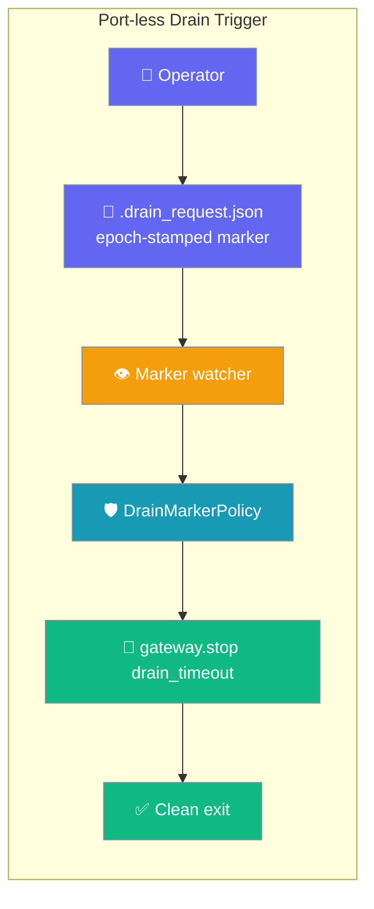
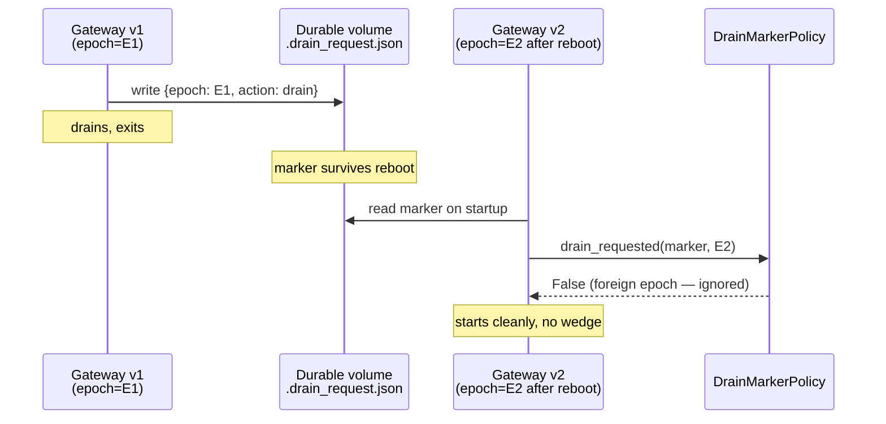
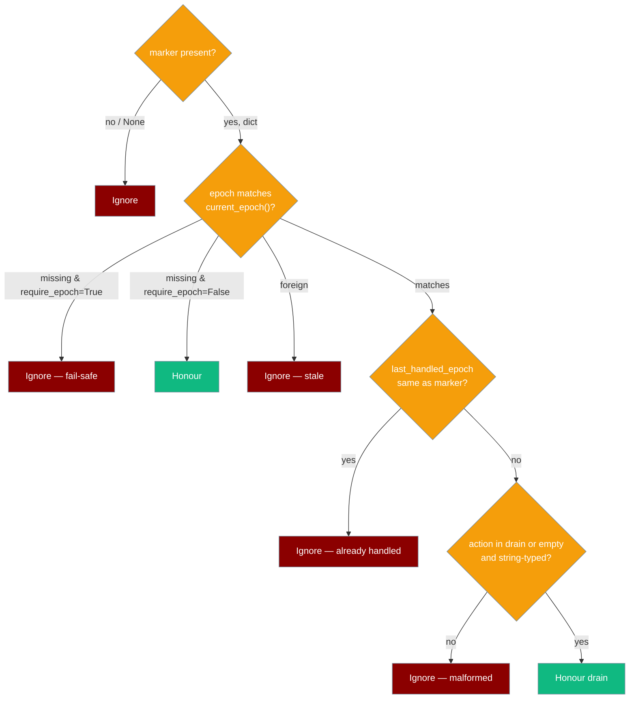

```python
from praisonaiagents import Agent

agent = Agent(name="drain-agent", instructions="Drain the gateway queue gracefully.")
agent.start("Drain all pending messages before shutting down the gateway.")
```


Ask a running gateway to finish in-flight turns and exit — without exposing any inbound port, and without a left-over signal wedging a restarted instance.


The operator drops a drain marker file; the gateway finishes in-flight turns and exits without exposing an inbound drain port.



## Quick Start

<Steps>

<Step title="Import the policy and epoch function">

```python
from praisonaiagents.gateway import DrainMarkerPolicy, current_epoch
```

</Step>

<Step title="Build the policy once at startup">

```python
policy = DrainMarkerPolicy()
epoch = current_epoch()
```

</Step>

<Step title="Run a watcher loop">

```python
import asyncio
import json
import os
from time import monotonic
from praisonaiagents.gateway import DrainMarkerPolicy, current_epoch

policy = DrainMarkerPolicy()
last_handled = None
path = os.path.expanduser("~/.praisonai/gateway/.drain_request.json")

async def watch(gateway):
    global last_handled
    while True:
        if os.path.exists(path):
            with open(path) as f:
                marker = json.load(f)
        else:
            marker = None
        if policy.drain_requested(
            marker,
            current_epoch(),
            monotonic(),
            last_handled_epoch=last_handled,
        ):
            last_handled = marker.get("epoch")
            await gateway.stop(drain_timeout=30)
            return
        await asyncio.sleep(1)
```

<Note>
The built-in marker watcher and `praisonai gateway drain` CLI are not yet merged — write your own watcher loop for now (pattern above). This page will be updated when the follow-up PR ships.
</Note>

</Step>

</Steps>

---

## How It Works

### Restart-Safety Story

The entire point of this feature: a marker stamped with `current_epoch()` is silently ignored by any *other* instance of the gateway — even if the marker file survives a reboot on a durable volume.



### Decision Tree — When Is a Marker Honoured?



---

## The Drain Marker Contract

Write this JSON to the marker path:

```json
{
  "epoch": "<output of current_epoch() at write time>",
  "action": "drain"
}
```

- **Default marker path** (convention from PraisonAI #2390, not yet enforced in code): `~/.praisonai/gateway/.drain_request.json`
- `action` defaults to `"drain"` if absent. Any other value (including a non-string) is ignored.
- Missing / empty / non-string `epoch` is ignored unless `require_epoch=False` is passed to the policy.

---

## Configuration Options

### `DrainMarkerPolicy` constructor

```python
from praisonaiagents.gateway import DrainMarkerPolicy

policy = DrainMarkerPolicy(require_epoch=True)
```

| Param | Type | Default | Description |
|-------|------|---------|-------------|
| `require_epoch` | `bool` | `True` | When `True`, a marker without a non-empty string `epoch` is ignored (fail-safe). Set `False` only when intentionally accepting hand-rolled or legacy markers. |

### `DrainMarkerPolicy.drain_requested()` parameters

| Param | Type | Default | Description |
|-------|------|---------|-------------|
| `marker` | `dict \| None` | — | Parsed marker contents, or `None` when no marker file is present. Non-dicts return `False`. |
| `current_epoch` | `str` | — | The current instantiation epoch — pass the return value of `current_epoch()`. |
| `now` | `float` | — | A monotonic timestamp. Unused by the default policy, but keeps the call site stable when subclasses add TTL/debounce. |
| `last_handled_epoch` | `str \| None` | `None` (kwarg-only) | If equal to the marker's `epoch`, the request is treated as already handled and ignored — a polling watcher fires only once per instantiation. |

### `current_epoch()` — what it returns

| Signal | Source | Notes |
|--------|--------|-------|
| Kernel boot id | `/proc/sys/kernel/random/boot_id` | Changes on every reboot. |
| PID-1 start time | Field 22 of `/proc/1/stat` | Changes on every boot / container (re)start. |
| **Fail-closed default** | `""` (empty string) when either signal is unavailable | Mac / Windows / sandboxed containers without `/proc` return `""`. Every marker is foreign to an empty epoch unless `require_epoch=False`. |

```python
from praisonaiagents.gateway import current_epoch

epoch = current_epoch()
# Linux: "550e8400-e29b-41d4-a716-446655440000:12345"
# Mac / Windows / no /proc: ""
```

---

## Common Patterns

### 1. Operator-side: write the marker

```python
import json
import os
from praisonaiagents.gateway import current_epoch

path = os.path.expanduser("~/.praisonai/gateway/.drain_request.json")
os.makedirs(os.path.dirname(path), exist_ok=True)
with open(path + ".tmp", "w") as f:
    json.dump({"epoch": current_epoch(), "action": "drain"}, f)
os.replace(path + ".tmp", path)
```

Writing to `<path>.tmp` then `os.replace()` makes the write atomic — a half-written JSON file is treated as malformed and ignored.

### 2. Gateway-side: minimal watcher loop

```python
import asyncio
import json
import os
from time import monotonic
from praisonaiagents.gateway import DrainMarkerPolicy, current_epoch

policy = DrainMarkerPolicy()
last_handled = None
path = os.path.expanduser("~/.praisonai/gateway/.drain_request.json")

async def watch(gateway):
    global last_handled
    while True:
        if os.path.exists(path):
            with open(path) as f:
                marker = json.load(f)
        else:
            marker = None
        if policy.drain_requested(
            marker,
            current_epoch(),
            monotonic(),
            last_handled_epoch=last_handled,
        ):
            last_handled = marker.get("epoch")
            await gateway.stop(drain_timeout=30)
            return
        await asyncio.sleep(1)
```

### 3. Accepting legacy markers without an epoch (advanced)

```python
from praisonaiagents.gateway import DrainMarkerPolicy

policy = DrainMarkerPolicy(require_epoch=False)
```

Only do this if you own both ends and have a different staleness story.

---

## Best Practices

<AccordionGroup>

<Accordion title="Always stamp markers with current_epoch()">
The whole restart-safety guarantee depends on it. Leave `require_epoch=True` (the default). An unstamped marker is silently ignored — this is intentional and protects newly started instances from stale files.
</Accordion>

<Accordion title="Write the marker atomically">
Write to `<path>.tmp` then `os.replace()` — a half-written JSON file is parsed as malformed and ignored, leaving the previous request still active. Atomic rename is the only safe pattern on most filesystems.
</Accordion>

<Accordion title="Pair with drain_timeout">
`DrainMarkerPolicy` only decides *when* to drain; the actual bounded wait still goes through `gateway.stop(drain_timeout=...)` documented on the [Session Continuity](/docs/features/gateway-session-continuity) page. Without a `drain_timeout`, shutdown cancels in-flight turns immediately.
</Accordion>

<Accordion title="Don't store secrets in the marker">
The epoch is non-secret and opaque. Treat the marker file as world-readable convention metadata, not a control-plane secret. Anyone who can write to the marker path can trigger a drain.
</Accordion>

</AccordionGroup>

---

<Warning>
The `praisonai gateway drain` CLI command and the built-in marker watcher in `gateway/server.py` are mentioned as the wrapper-side companions to this predicate in [PraisonAI #2390](https://github.com/MervinPraison/PraisonAI/issues/2390) but are **not yet merged**. Until they land, the predicate is consumed by writing your own watcher (pattern 2 above). This page will be updated to document the CLI + YAML `gateway.drain` block when the follow-up PR ships.
</Warning>

---

## Related

<CardGroup cols={2}>
  <Card title="Scale to Zero" icon="moon" href="/docs/features/gateway-scale-to-zero">
    ScaleToZeroPolicy — sibling idle-policy predicate
  </Card>
  <Card title="Session Continuity" icon="shield-check" href="/docs/features/gateway-session-continuity">
    drain_timeout and in-process drain
  </Card>
  <Card title="Bot Gateway" icon="plug" href="/docs/features/bot-gateway">
    Bot Gateway overview
  </Card>
  <Card title="Gateway" icon="tower-broadcast" href="/docs/features/gateway">
    Gateway and Control Plane top-level page
  </Card>
</CardGroup>
