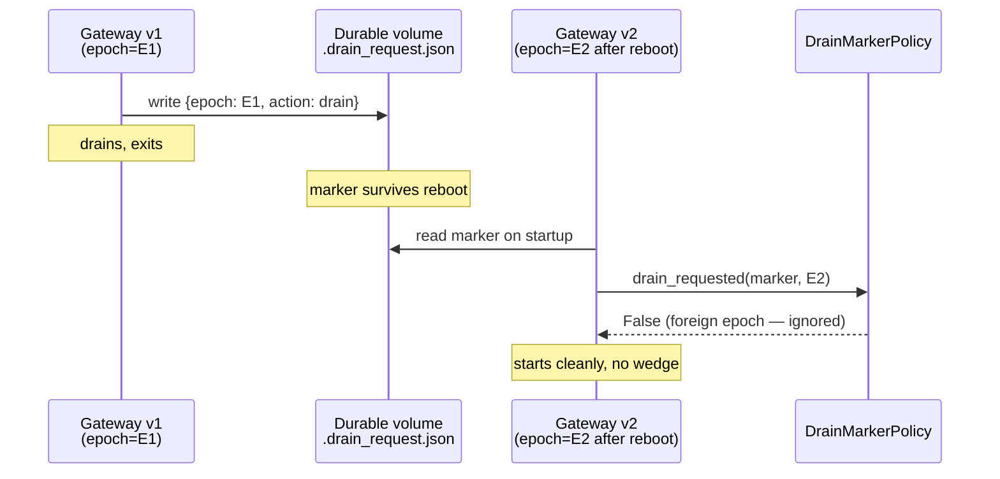

Ask a running gateway to finish in-flight turns and exit — without exposing any inbound port, and without a left-over signal wedging a restarted instance.


## Quick Start

<Steps>

<Step title="Build the policy at startup">

```python
from time import monotonic
from praisonaiagents.gateway import DrainMarkerPolicy, current_epoch

# Build the policy once at startup
policy = DrainMarkerPolicy()

# In a background watcher you write yourself today
# (the praisonai gateway drain CLI + built-in watcher land in a follow-up PR)
async def on_marker_tick(marker_dict, last_handled):
    if policy.drain_requested(
        marker_dict,
        current_epoch(),
        now=monotonic(),
        last_handled_epoch=last_handled,
    ):
        # Finish in-flight turns, stop accepting new ones, exit cleanly.
        await gateway.stop(drain_timeout=30)
```

</Step>

<Step title="Write the drain marker (operator side)">

```python
import json
import os
from praisonaiagents.gateway import current_epoch

path = os.path.expanduser("~/.praisonai/gateway/.drain_request.json")
os.makedirs(os.path.dirname(path), exist_ok=True)
with open(path, "w") as f:
    json.dump({"epoch": current_epoch(), "action": "drain"}, f)
```

</Step>

</Steps>

---

## Drain marker contract

```json
{
  "epoch": "<output of current_epoch() at write time>",
  "action": "drain"
}
```

| Field | Detail |
|-------|--------|
| **Default path** | `~/.praisonai/gateway/.drain_request.json` (convention from [PraisonAI #2390](https://github.com/MervinPraison/PraisonAI/issues/2390); not yet enforced in code) |
| **`action`** | Defaults to `"drain"` when absent. Any other value (including a non-string) is ignored. |
| **`epoch`** | Missing, empty, or non-string values are ignored unless `require_epoch=False` is passed. |

---

## Restart safety



---

## When is a marker honoured?

```mermaid
graph TB
    Q{"marker present?"}
    Q -->|no / None| IGNORE1[Ignore]
    Q -->|yes, dict| EP{"epoch matches<br/>current_epoch&#40;&#41;?"}
    EP -->|missing &amp; require_epoch=True| IGNORE2[Ignore — fail-safe]
    EP -->|missing &amp; require_epoch=False| ACT1[Honour]
    EP -->|foreign| IGNORE3[Ignore — stale]
    EP -->|matches| DEDUP{"last_handled_epoch<br/>same as marker?"}
    DEDUP -->|yes| IGNORE4[Ignore — already handled]
    DEDUP -->|no| ACTION{"action ∈ {&quot;&quot;, &quot;drain&quot;}<br/>and string-typed?"}
    ACTION -->|no| IGNORE5[Ignore — malformed]
    ACTION -->|yes| ACT2[Honour drain]

    classDef question fill:#F59E0B,stroke:#7C90A0,color:#fff
    classDef ignore fill:#8B0000,stroke:#7C90A0,color:#fff
    classDef act fill:#10B981,stroke:#7C90A0,color:#fff
    class Q,EP,DEDUP,ACTION question
    class IGNORE1,IGNORE2,IGNORE3,IGNORE4,IGNORE5 ignore
    class ACT1,ACT2 act
```



---

## Configuration Options

### `DrainMarkerPolicy` constructor

```python
from praisonaiagents.gateway import DrainMarkerPolicy

policy = DrainMarkerPolicy(require_epoch=True)
```

| Param | Type | Default | Description |
|-------|------|---------|-------------|
| `require_epoch` | `bool` | `True` | When `True`, a marker without a non-empty string `epoch` is ignored (fail-safe). Set `False` only when intentionally accepting hand-rolled / legacy markers. |

### `DrainMarkerPolicy.drain_requested()`

| Param | Type | Default | Description |
|-------|------|---------|-------------|
| `marker` | `dict \| None` | — | Parsed marker contents, or `None` when no marker file is present. Non-dicts return `False`. |
| `current_epoch` | `str` | — | The current instantiation epoch — pass the return value of `current_epoch()`. |
| `now` | `float` | — | A monotonic timestamp. Unused by the default policy, but the call site should not change when subclasses add TTL/debounce. |
| `last_handled_epoch` | `str \| None` | `None` (kwarg-only) | If equal to the marker's `epoch`, the request is treated as already handled and ignored, so a polling watcher fires only once per instantiation. |

### `current_epoch()` behaviour

| Signal | Source | Notes |
|--------|--------|-------|
| Kernel boot id | `/proc/sys/kernel/random/boot_id` | Changes on every reboot. |
| PID-1 start time | Field 22 of `/proc/1/stat` | Changes on every boot / container (re)start. |
| **Fail-closed default** | `""` (empty string) when either signal is unavailable | Mac / Windows / sandboxed containers without `/proc` return `""`. Pair with `DrainMarkerPolicy` — every marker is foreign to an empty epoch unless `require_epoch=False`. |

---

## Common Patterns

### Operator-side: write the marker

```python
import json
import os
from praisonaiagents.gateway import current_epoch

path = os.path.expanduser("~/.praisonai/gateway/.drain_request.json")
os.makedirs(os.path.dirname(path), exist_ok=True)
with open(path, "w") as f:
    json.dump({"epoch": current_epoch(), "action": "drain"}, f)
```

### Gateway-side: minimal watcher loop

```python
import asyncio
import json
import os
from time import monotonic
from praisonaiagents.gateway import DrainMarkerPolicy, current_epoch

policy = DrainMarkerPolicy()
last_handled = None
path = os.path.expanduser("~/.praisonai/gateway/.drain_request.json")

async def watch():
    global last_handled
    while True:
        marker = json.load(open(path)) if os.path.exists(path) else None
        if policy.drain_requested(
            marker, current_epoch(), monotonic(), last_handled_epoch=last_handled
        ):
            last_handled = marker.get("epoch")
            await gateway.stop(drain_timeout=30)
            return
        await asyncio.sleep(1)
```

### Accepting legacy markers without an epoch (advanced)

```python
# Only do this if you own both ends and have a different staleness story.
policy = DrainMarkerPolicy(require_epoch=False)
```

---

## Best Practices

<AccordionGroup>

<Accordion title="Always stamp markers with current_epoch()">
The whole restart-safety guarantee depends on it. Leave `require_epoch=True` (the default).
</Accordion>

<Accordion title="Write the marker atomically">
Write to `<path>.tmp` then `os.replace()` — a half-written JSON file is parsed as malformed and ignored, leaving the previous request still active.
</Accordion>

<Accordion title="Pair with drain_timeout">
`DrainMarkerPolicy` only decides *when* to drain; the actual bounded wait still goes through `gateway.stop(drain_timeout=...)` documented on the [Session Continuity](/docs/features/gateway-session-continuity) page.
</Accordion>

<Accordion title="Don't store secrets in the marker">
The epoch is non-secret and opaque; treat the marker file as world-readable convention metadata, not a control-plane secret.
</Accordion>

</AccordionGroup>

<Warning>
The `praisonai gateway drain` CLI command and the built-in marker watcher in `gateway/server.py` are mentioned as the wrapper-side companions to this predicate in [PraisonAI #2390](https://github.com/MervinPraison/PraisonAI/issues/2390) but are **not yet merged**. Until they land, the predicate is consumed by writing your own watcher (pattern above). This page will be updated to document the CLI + YAML `gateway.drain` block when the follow-up PR ships.
</Warning>

---

## Related

<CardGroup cols={2}>
  <Card title="Scale to Zero" icon="moon" href="/docs/features/gateway-scale-to-zero">
    `ScaleToZeroPolicy` — sibling idle-policy predicate
  </Card>
  <Card title="Session Continuity" icon="shield-check" href="/docs/features/gateway-session-continuity">
    `drain_timeout` and in-process drain
  </Card>
  <Card title="Bot Gateway" icon="plug" href="/docs/features/bot-gateway">
    Bot Gateway overview
  </Card>
  <Card title="Gateway & Control Plane" icon="gateway" href="/docs/gateway">
    Gateway top-level page
  </Card>
</CardGroup>
