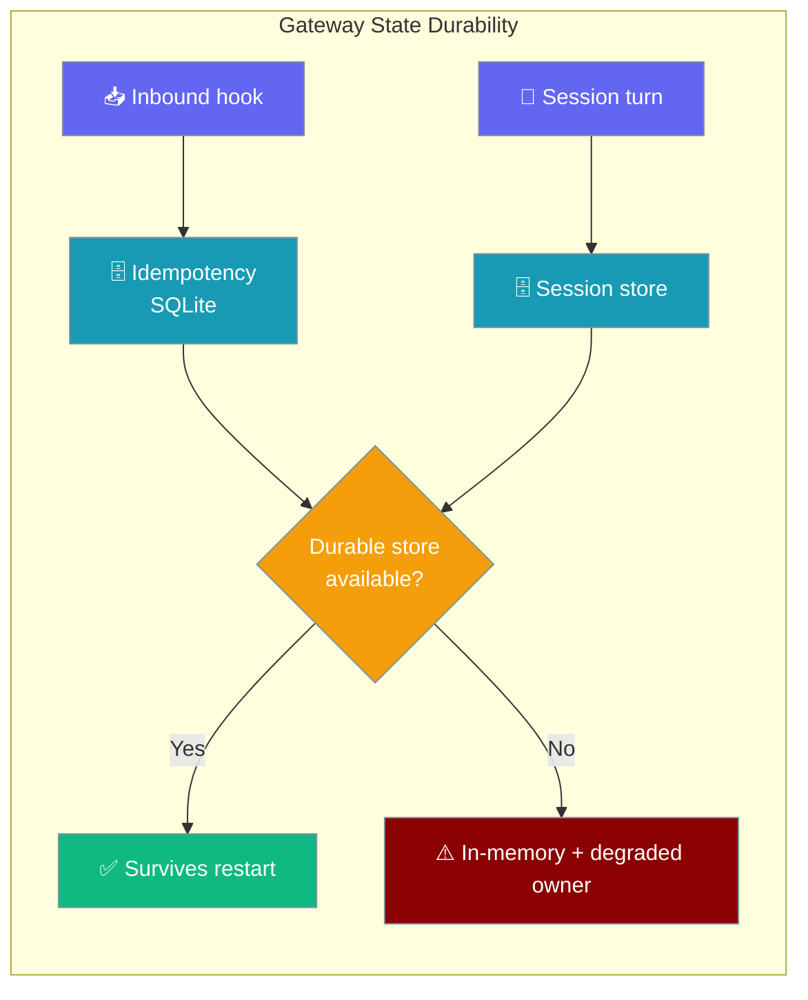
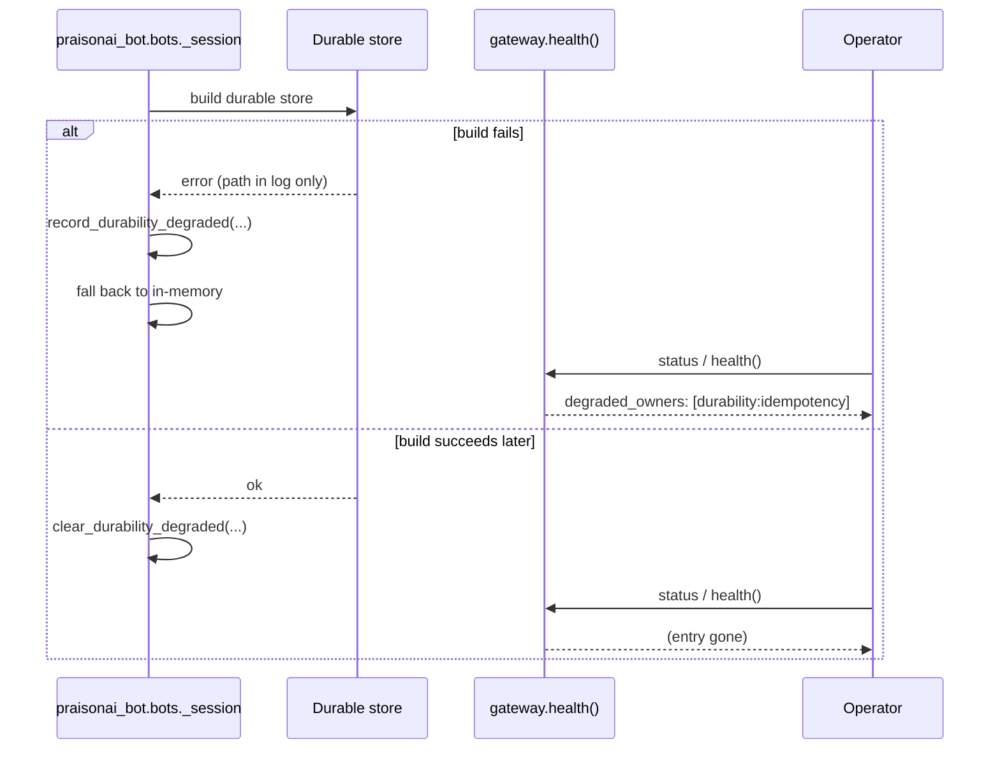

The gateway's webhook idempotency and session history are durable by default — a restart no longer re-processes webhooks or drops history.

```python
from praisonaiagents import Agent
from praisonai.gateway import Gateway

agent = Agent(name="assistant", instructions="Be helpful.")
gw = Gateway(agents=[agent])
gw.register_hook({"path": "alerts", "agent": "assistant", "auth": "secret"})
gw.start()   # webhook idempotency + session history are durable by default
```

When a durable store cannot initialise, the gateway logs, records a redacted `gateway` / `durability:*` degraded owner, and keeps serving in-memory so inbound delivery never stops.



## What's Durable, Out of the Box

| State | Backend | Location |
|-------|---------|----------|
| Webhook idempotency | SQLite | `~/.praisonai/state/hook_idempotency.sqlite` |
| Session history | The configured `get_default_session_store()` | See [Gateway Session Persistence](/features/gateway-session-persistence) |

Both survive a routine gateway restart. Webhook dedup keys persist across a redelivery window, and session history is not dropped when the process cycles.

<Note>
Durability is the **default** ([Issue #4339](https://github.com/MervinPraison/PraisonAI/issues/4339)). Previously the webhook idempotency store was in-memory, so a restart inside a provider's retry window could re-process a redelivered webhook (duplicate reply, duplicate tool action). `"memory"` is now an explicit opt-out.
</Note>

## Quick Start

<Steps>
<Step title="Start the gateway — durable by default">
```python
from praisonaiagents import Agent
from praisonai.gateway import Gateway

agent = Agent(name="assistant", instructions="Be helpful.")
gw = Gateway(agents=[agent])
gw.register_hook({"path": "alerts", "agent": "assistant", "auth": "secret"})
gw.start()   # webhook idempotency + session history are durable by default
```
No configuration is required — the SQLite idempotency store and the configured session store are used automatically.
</Step>

<Step title="Opt out for tests / ephemeral runs">
```yaml
hooks:
  idempotency:
    store_backend: memory   # explicit opt-out — tests / ephemeral runs only
  hooks:
    - path: alerts
      agent: assistant
      # ...
```
`"memory"` keeps the old in-memory behaviour when you don't want an on-disk store.
</Step>

<Step title="See a degraded fallback">
If a durable store cannot initialise, the boundary keeps serving in-memory and records a degraded owner:

```json
{
  "owner_kind": "gateway",
  "owner_id": "durability:idempotency",
  "state": "cold",
  "reason": "durable idempotency store unavailable (running in-memory)",
  "retry_hint": "praisonai gateway doctor --fix"
}
```

It surfaces in `praisonai gateway status` under `Degraded:` and in `GET /health` under `degraded_owners`.
</Step>

<Step title="Recover">
```bash
praisonai gateway doctor --fix
```
Run the sanctioned repair, or hot-reload a config that fixes the store path — either clears the degraded entry automatically on the next successful build.
</Step>
</Steps>

## What Happens on Init Failure

When a durable store genuinely cannot initialise, the boundary that owns it (the `praisonai-bot` wrapper, `praisonai_bot.bots._session`):

1. **Logs** the failure with the raw store path (log only).
2. **Records** a `gateway` / `durability:*` degraded owner with a **redacted** reason and the `praisonai gateway doctor --fix` hint.
3. **Continues serving in-memory** so inbound delivery keeps working.
4. **Auto-clears** the degraded owner on the next successful (re)build of the durable store.



The two owners:

| `owner_id` | Meaning |
|-----------|---------|
| `durability:idempotency` | Durable webhook-idempotency store unavailable; dedup does not survive restart. |
| `durability:session` | Durable session store unavailable; session history does not survive restart. |

## How to See It

<Tabs>
<Tab title="CLI">
```text
$ praisonai gateway status
...
  Degraded:
    ✗ gateway:durability:idempotency — durable idempotency store unavailable (running in-memory)  fix: praisonai gateway doctor --fix
```
Always printed when `degraded_owners` is non-empty (not gated on `--deep`).
</Tab>

<Tab title="Health endpoint">
```bash
curl http://127.0.0.1:8765/health
```
The same fact appears under `degraded_owners`:
```json
{
  "degraded_owners": [
    {
      "owner_kind": "gateway",
      "owner_id": "durability:idempotency",
      "state": "cold",
      "reason": "durable idempotency store unavailable (running in-memory)",
      "retry_hint": "praisonai gateway doctor --fix"
    }
  ]
}
```
</Tab>

<Tab title="Agent tool">
```python
from praisonaiagents import Agent
from praisonaiagents.tools import gateway_status

agent = Agent(
    name="assistant",
    instructions="Call gateway_status; warn if a durability owner is degraded.",
    tools=[gateway_status],
)
```
An agent inside the gateway can read the same `degraded_owners` via `gateway_status`.
</Tab>
</Tabs>

## Best Practices

<AccordionGroup>
<Accordion title="Keep the default — durable — in production">
Leave `store_backend` unset (or `sqlite`). Only set `memory` for tests or explicitly ephemeral runs, where losing dedup on restart is acceptable.
</Accordion>

<Accordion title="Alert on any durability:* owner">
A `durability:idempotency` or `durability:session` entry in `degraded_owners` means state is not surviving restart. Alert on it the same way you alert on a degraded channel or provider.
</Accordion>

<Accordion title="Recover with the sanctioned action">
`praisonai gateway doctor --fix` is the one command in the `retry_hint`. A hot-reload that repairs the store path also clears the entry automatically — no manual `clear` step.
</Accordion>

<Accordion title="Trust the redaction">
The operator-facing `reason` never contains the raw store path — that stays in the log. Safe to render straight to a dashboard or status probe.
</Accordion>
</AccordionGroup>

## Related

<CardGroup cols={2}>
<Card title="Gateway Hooks" icon="webhook" href="/features/gateway-hooks">
  Webhook idempotency configuration and the durable-by-default dedup store.
</Card>
<Card title="Gateway Session Persistence" icon="floppy-disk" href="/features/gateway-session-persistence">
  The configured session store that backs durable session history.
</Card>
<Card title="Degraded Capabilities" icon="stethoscope" href="/features/gateway-degraded-capabilities">
  The unified `degraded_owners` surface these durability facts join.
</Card>
<Card title="Gateway CLI" icon="terminal" href="/features/gateway-cli">
  `gateway status` `Degraded:` section and `gateway doctor --fix`.
</Card>
</CardGroup>
