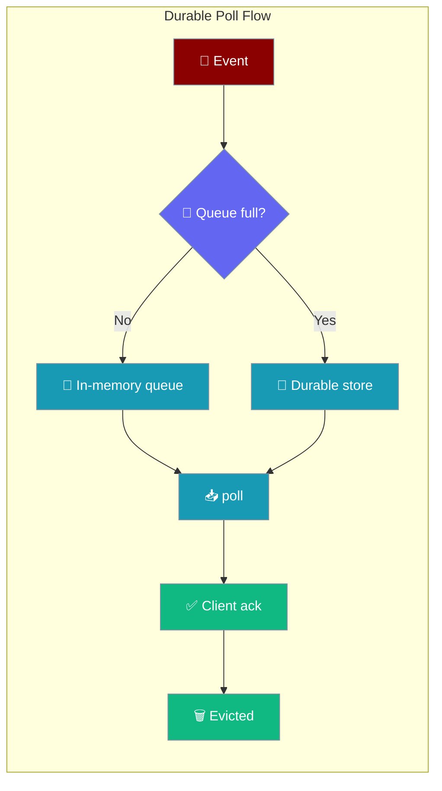
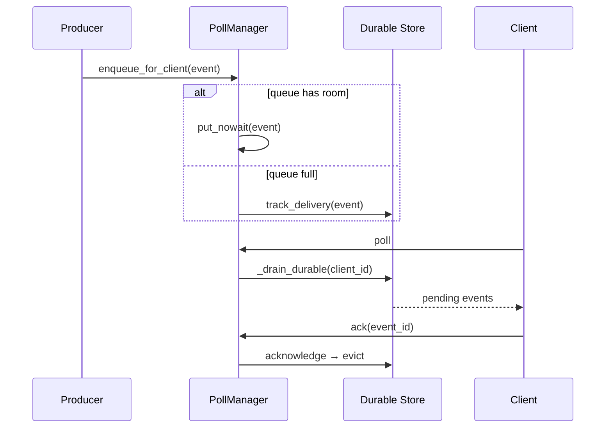
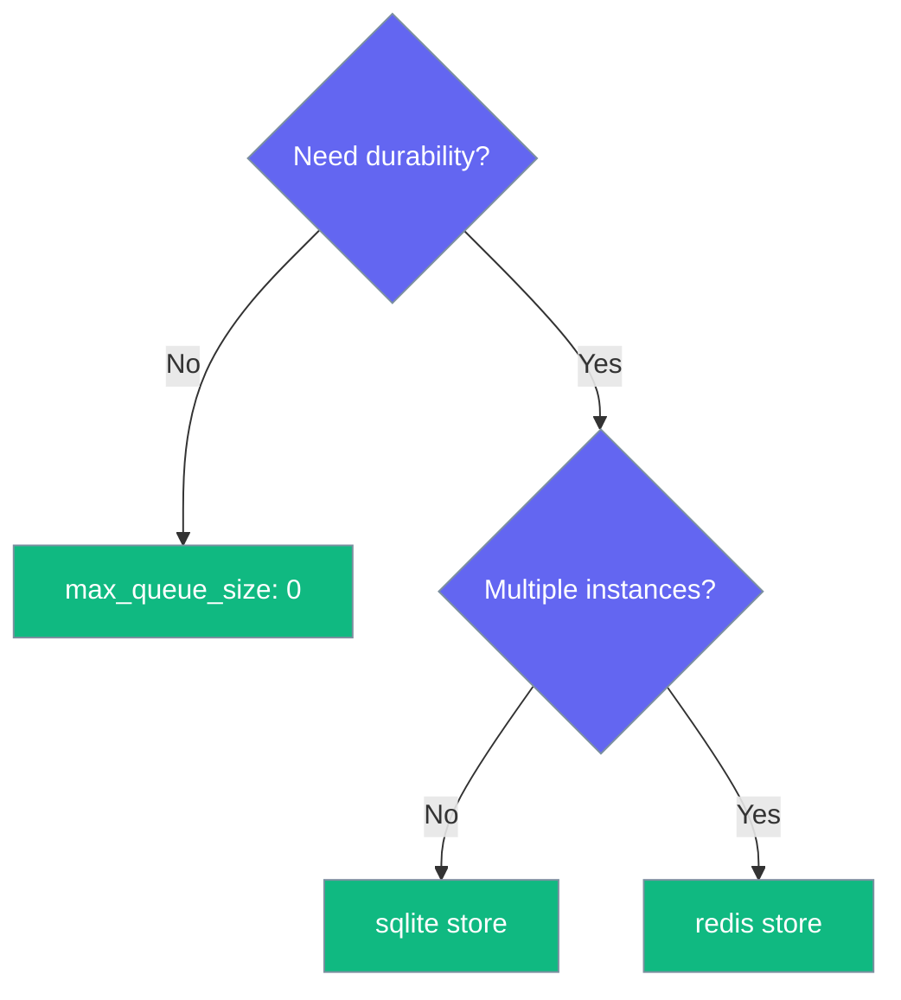

Long-poll clients get the same at-least-once guarantee as WebSocket clients — a full queue overflows to the durable store instead of silently dropping.



A client polling over HTTP receives every event even when its queue backs up or the gateway restarts mid-delivery — the overflow lands in the durable store and replays on the next poll.

## Quick Start

<Steps>
<Step title="Run an agent behind the gateway">

Any agent hosted on the gateway can push to poll clients — no code change needed:

```python
from praisonaiagents import Agent

agent = Agent(
    name="alerts-agent",
    instructions="Summarise incoming alert events in one sentence",
)
agent.start("Ready to push alerts to polling clients")
```

</Step>

<Step title="Bound the poll queue in gateway.yaml">

Set a per-client queue bound; overflow persists to the durable store:

```yaml
# gateway.yaml
push:
  enabled: true
  polling:
    max_queue_size: 1000   # default; overflow persists to the durable store
```

</Step>

<Step title="Enable a delivery store for durability">

A delivery backend makes the overflow at-least-once and survives restarts:

```yaml
# gateway.yaml
push:
  enabled: true
  delivery:
    store_backend: sqlite   # "sqlite" (default) | "redis" | "memory"
```

</Step>
</Steps>

---

## How It Works

An event that arrives for a poll client whose in-memory queue is full is persisted to the shared push store, then replayed on the next poll and held until the client acks.



| Step | Behaviour |
|------|-----------|
| Queue has room | Event goes into the in-memory queue (`enqueue_for_client` returns `True`) |
| Queue full + delivery manager | Event persisted via `track_delivery` (returns `True`) — no drop |
| Queue full + no delivery manager | Best-effort drop, honest `False` return and a `WARNING` log |
| Poll | `_drain_durable` replays pending events **before** the in-memory queue |
| Ack | Delivery manager acknowledges and evicts the event from the store |

---

## Configuration Options

`PollingConfig` controls the poll transport. Every field is extracted from the SDK dataclass.

| Option | Type | Default | Description |
|--------|------|---------|-------------|
| `enabled` | `bool` | `True` | Toggle the polling fallback |
| `long_poll_timeout` | `int` | `30` | Long-poll hang duration in seconds |
| `max_batch_size` | `int` | `100` | Max messages returned per poll response |
| `max_queue_size` | `int` | `1000` | Per-client in-memory queue bound. `>0` overflows to the durable store when full; `0` keeps the queue unbounded (no overflow) |

```yaml
# gateway.yaml — full push block
push:
  enabled: true
  polling:
    enabled: true
    long_poll_timeout: 30
    max_batch_size: 100
    max_queue_size: 1000
  delivery:
    enabled: true
    store_backend: sqlite
```

<Note>
`max_queue_size` is durable only when a delivery store is wired. With `store_backend: memory` (or delivery disabled) an overflowing queue falls back to a best-effort drop.
</Note>

---

## Compatibility Note

<Warning>
`POST /api/push/poll/ack` now returns **HTTP 503** with `{"ok": false, "error": "delivery guarantee not enabled"}` when no delivery manager is configured. It previously returned `{"ok": true}` — a hidden success for an ack that was never recorded. Enable a delivery backend, or handle the 503 explicitly in your client.
</Warning>

```python
import httpx

resp = httpx.post(
    "http://localhost:8765/api/push/poll/ack",
    json={"poll_token": token, "event_id": event_id},
)
if resp.status_code == 503:
    # Delivery guarantees are off — the ack was a no-op by design.
    logger.warning("Poll ack skipped: delivery guarantee not enabled")
else:
    resp.raise_for_status()
```

---

## Common Patterns

Choose a `max_queue_size` and store that matches your durability needs.

```yaml
# Durable, single-instance (default) — survives restarts
push:
  polling:
    max_queue_size: 1000
  delivery:
    store_backend: sqlite
```

```yaml
# Durable, multi-instance — shared store across replicas
push:
  polling:
    max_queue_size: 1000
  delivery:
    store_backend: redis
```

```yaml
# Legacy unbounded — no overflow, no durability (not recommended)
push:
  polling:
    max_queue_size: 0
```



---

## Best Practices

<AccordionGroup>
<Accordion title="Keep max_queue_size bounded in production">
The default `1000` overflows to the durable store instead of growing memory without limit. Leave it `>0` unless you have a specific reason to run unbounded.
</Accordion>
<Accordion title="Always pair overflow with a delivery store">
`max_queue_size` only becomes at-least-once when `delivery.store_backend` is `sqlite` or `redis`. With `memory` (or delivery disabled) an overflowing queue drops the event.
</Accordion>
<Accordion title="Handle the 503 on ack">
Clients that assert `ok === true` on ack break after this change. Treat a 503 as "delivery not enabled" and enable a store, or stop acking.
</Accordion>
<Accordion title="Ack every event to evict it">
Durable events stay in the store until acknowledged. A client that never acks will keep receiving the same pending events on each poll.
</Accordion>
</AccordionGroup>

---

## Related

<CardGroup cols={2}>
<Card title="Push Notifications" icon="bell" href="/features/push-notifications">
  Channel pub/sub with WebSocket-first, polling fallback
</Card>
<Card title="Redis Pub/Sub Resilience" icon="heart-pulse" href="/features/gateway-redis-pubsub-resilience">
  Multi-instance transport reconnect and outage surfacing
</Card>
</CardGroup>
