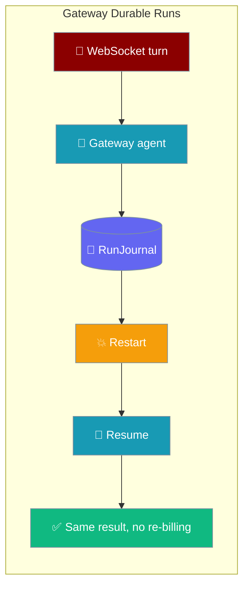
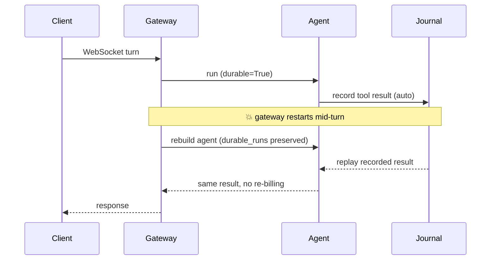

Turn on one flag in `gateway.yaml` and every gateway agent journals its turns, so a gateway restart resumes an interrupted run instead of re-firing side-effecting tools or re-billing LLM calls.



## Quick Start

<Steps>

<Step title="Enable for every gateway agent">

One flag opts every gateway agent into durable runs — each agent is constructed with `execution=ExecutionConfig(durable=True)`:

```yaml
# gateway.yaml
gateway:
  durable_runs: true    # every gateway agent is now durable

agents:
  order_processor:
    instructions: "Charge the card and ship the order."
    tools: [charge_card, ship_order, notify_customer]
```

Restart the gateway mid-run and the interrupted turn resumes — recorded tool results replay from the [`RunJournal`](/features/run-state-journal) instead of re-charging the card or re-billing the model.

</Step>

<Step title="Override per agent">

A per-agent `durable` flag wins in both directions — opt one agent in even when the gateway default is off, or opt one out even when it's on:

```yaml
gateway:
  durable_runs: false      # gateway default: off

agents:
  order_processor:
    instructions: "Charge the card and ship the order."
    durable: true          # this one agent is durable
  chit_chat:
    instructions: "Small talk only."
    # inherits the gateway default (non-durable)
```

</Step>

<Step title="Wire it from the environment">

`gateway.durable_runs` accepts an `${ENV_VAR}`-substituted string. Because `${DURABLE}` renders as a string, the value is coerced explicitly — `"true"`/`"1"`/`"yes"`/`"on"` enable, and `"false"`/`"0"`/`"no"`/`"off"`/`""` disable:

```yaml
# ${DURABLE} → "false" from the environment
gateway:
  durable_runs: ${DURABLE}   # "false"/"0"/"no"/"off"/"" disable; "true"/"1"/"yes"/"on" enable
```

<Warning>
`"false"` really means false here. Without this coercion, `bool("false")` would be truthy and silently enable durability.
</Warning>

</Step>

</Steps>

---

## How It Works

Each gateway agent journals its turn to the core `RunJournal`; a restart re-drives the loop from the top, replaying journalled steps and running only the un-journalled ones.



| Role | Responsibility |
|------|----------------|
| Gateway | Reads `durable_runs`; builds each agent with `ExecutionConfig(durable=True)` |
| Agent | Journals every model and tool boundary to the core journal |
| RunJournal | Records results so a restart replays instead of re-executing |
| Per-agent `durable` | Overrides the gateway default for a single agent |

<Note>
The `durable_runs` value is passed through on **every** load path — initial load, full-restart reload, and selective reload — so restarting the gateway keeps durability wired.
</Note>

<Note>
**Zero overhead when off.** With neither flag set the execution hot path is unchanged and `ExecutionConfig` is never imported.
</Note>

<Note>
**Graceful degrade.** If `ExecutionConfig` can't be imported (an older core), the gateway logs a warning and the agent runs non-durably — the gateway never fails to start over durability.
</Note>

---

## Configuration Options

| Config path | Type | Default | Effect |
|-------------|------|---------|--------|
| `gateway.durable_runs` | `bool` (accepts env-substituted string forms) | `false` / unset | When truthy, every gateway agent is constructed with `execution=ExecutionConfig(durable=True)` so each turn is journalled to the core `RunJournal`. |
| `agents.<id>.durable` | `bool` (accepts string forms) | inherits `gateway.durable_runs` | Per-agent override — opts a single agent in (or out) regardless of the gateway-wide default. |

The underlying agent primitive is [`ExecutionConfig(durable=True)`](/features/durable-tool-runs) — see that page for `journal_path`, `resume_run_id`, and the resume contract.

---

## Common Patterns

**Fleet-wide durability with a chit-chat escape hatch** — journal the agents that touch money or ship goods, skip the ones that only make small talk:

```yaml
gateway:
  durable_runs: true         # durable fleet by default

agents:
  order_processor:
    instructions: "Charge the card and ship the order."
    tools: [charge_card, ship_order]
  chit_chat:
    instructions: "Small talk only."
    durable: false           # no journalling for stateless banter
```

**Toggle by environment** — durable in production, off in ephemeral CI:

```yaml
gateway:
  durable_runs: ${DURABLE}   # export DURABLE=true in prod, DURABLE=false in CI
```

---

## Best Practices

<AccordionGroup>

<Accordion title="Point journal_path at a persistent volume in containers">
The default `~/.praisonai/runs/journal.db` is lost when a container is recreated. Configure a mounted volume so the journal survives restarts — see [Durable Tool Runs](/features/durable-tool-runs#configuration-options).
</Accordion>

<Accordion title="Use ${DURABLE} from the environment">
Wire `durable_runs: ${DURABLE}` and toggle per environment. Remember the string `"false"` really disables durability here — the coercion exists precisely so `bool("false")` never silently enables it.
</Accordion>

<Accordion title="Per-agent durable is your escape hatch">
Small-talk agents don't need journalling. Set `durable: false` on them even when the gateway default is on, keeping the hot path clean for stateless turns.
</Accordion>

<Accordion title="Compose with session persistence">
Durable gateway runs and [session persistence](/features/gateway-session-persistence) are different layers — one resumes the in-flight turn, the other restores conversation history. Both survive a restart and work together.
</Accordion>

</AccordionGroup>

---

## Related

<CardGroup cols={2}>
<Card title="Durable Tool Runs" icon="rotate" href="/features/durable-tool-runs">
  The underlying agent primitive — `ExecutionConfig(durable=True)`.
</Card>
<Card title="Run-State Journal" icon="book-bookmark" href="/features/run-state-journal">
  The SQLite journal durable runs write to.
</Card>
<Card title="Gateway Session Persistence" icon="database" href="/features/gateway-session-persistence">
  Sibling gateway-side durability for conversation state.
</Card>
<Card title="Gateway Overview" icon="tower-broadcast" href="/features/gateway-overview">
  The full gateway config surface.
</Card>
</CardGroup>
