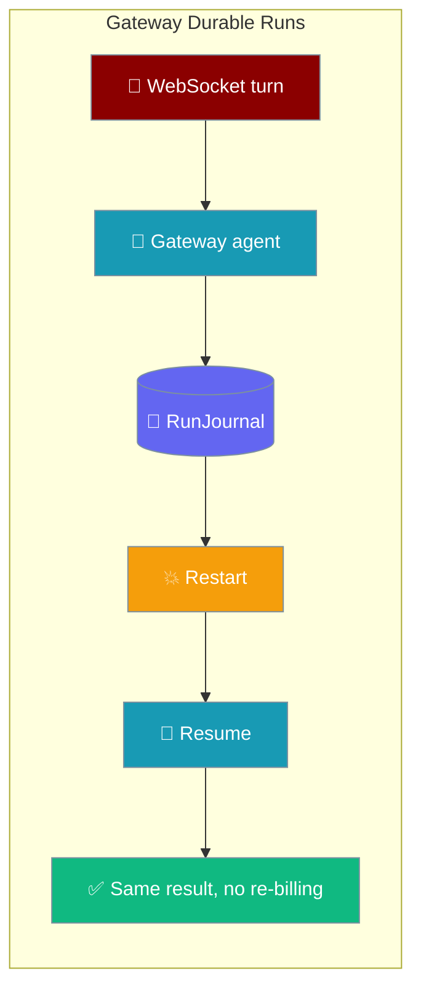
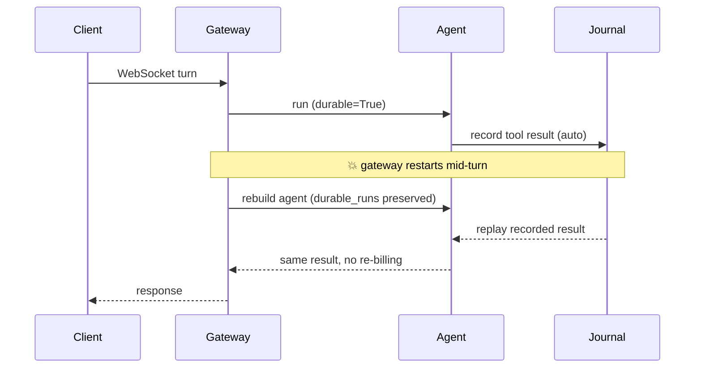

Gateway agents journal every turn by default, so a gateway restart resumes an interrupted run instead of re-firing side-effecting tools or re-billing LLM calls. No flag needed — it auto-enables whenever your session store is durable (the shipped default). Two explicit opt-outs are supported for the zero-overhead path.



## Quick Start

<Note>
**Migration (PR #4218).** Prior releases required `gateway.durable_runs: true` to opt in. The default is now on whenever your session store is durable — no config change needed to gain crash-safe resume. Want the old zero-overhead behaviour? Set `gateway.durable_runs: false` or `gateway.reliability: "off"`.
</Note>

<Steps>

<Step title="Zero-config default (crash-safe out of the box)">

Sessions persist by default, so durable runs are already on — no `gateway:` block required:

```yaml
# gateway.yaml
agents:
  order_processor:
    instructions: "Charge the card and ship the order."
    tools: [charge_card, ship_order, notify_customer]
```

Restart the gateway mid-run and the interrupted turn resumes — recorded tool results replay from the [`RunJournal`](/features/run-state-journal) instead of re-charging the card or re-billing the model.

</Step>

<Step title="Opt out (zero-overhead path)">

Two explicit escape hatches turn durable runs off:

```yaml
# gateway.yaml — either one opts out
gateway:
  durable_runs: false     # explicit off
  # reliability: "off"    # immediate-teardown posture also forces off
```

In-memory sessions disable it too — with `session.persist: false` there is no durable store to journal against, so durable runs silently stay off.

</Step>

<Step title="Override per agent">

A per-agent `durable` flag wins in both directions — opt one agent out even when the gateway default is on, or opt one in even when it's off:

```yaml
gateway:
  durable_runs: false      # gateway-wide off

agents:
  order_processor:
    instructions: "Charge the card and ship the order."
    durable: true          # this one agent is durable
  chit_chat:
    instructions: "Small talk only."
    # inherits the gateway default (non-durable)
```

</Step>

<Step title="Toggle the default off from the environment">

`gateway.durable_runs` accepts an `${ENV_VAR}`-substituted string. Because `${DURABLE}` renders as a string, the value is coerced explicitly — `"false"`/`"0"`/`"no"`/`"off"`/`""` disable, and `"true"`/`"1"`/`"yes"`/`"on"` enable:

```yaml
# ${DURABLE} → "false" from the environment
gateway:
  durable_runs: ${DURABLE}   # "false"/"0"/"no"/"off"/"" disable; "true"/"1"/"yes"/"on" enable
```

<Warning>
`"false"` really means false here. Without this coercion, `bool("false")` would be truthy and silently enable durability.
</Warning>

</Step>

</Steps>

---

## How It Works

Each gateway agent journals its turn to the core `RunJournal`; a restart re-drives the loop from the top, replaying journalled steps and running only the un-journalled ones. Whether journalling runs at all is decided from config plus the effective session store.



| Role | Responsibility |
|------|----------------|
| Gateway | Consults `gateway.durable_runs` when explicitly set; otherwise auto-enables when the effective session store is durable (`self._session_store is not None`) |
| Agent | Journals every model and tool boundary to the core journal |
| RunJournal | Records results so a restart replays instead of re-executing |
| Per-agent `durable` | Overrides the gateway default for a single agent |

### Choosing whether durable runs run

```mermaid
graph TB
    Start[⚙️ Gateway loads config] --> Q1{gateway.durable_runs<br/>set explicitly?}
    Q1 -->|Yes| Explicit[✅ Use the operator's value]
    Q1 -->|No| Q2{gateway.reliability<br/>== "off"?}
    Q2 -->|Yes| Off[⏸️ Off zero-overhead path]
    Q2 -->|No| Q3{Durable session store<br/>actually present?}
    Q3 -->|Yes default| On[🔁 Auto-on crash-safe resume]
    Q3 -->|No| Off

    classDef start fill:#6366F1,stroke:#7C90A0,color:#fff
    classDef decision fill:#F59E0B,stroke:#7C90A0,color:#fff
    classDef on fill:#10B981,stroke:#7C90A0,color:#fff
    classDef off fill:#8B0000,stroke:#7C90A0,color:#fff
    class Start start
    class Q1,Q2,Q3 decision
    class Explicit,On on
    class Off off
```

**Precedence ladder:** per-agent `durable` > explicit `gateway.durable_runs` > `gateway.reliability: "off"` (forces off) > effective session store (auto-on when durable, off when in-memory).

<Note>
The durable-runs decision is re-evaluated on **every** load path — initial load, full-restart reload, and selective reload — so restarting the gateway keeps durability wired.
</Note>

<Note>
**Zero overhead when off.** On an opted-out path the execution hot path is unchanged and `ExecutionConfig` is never imported.
</Note>

<Note>
**Graceful degrade.** If `ExecutionConfig` can't be imported (an older core), the gateway logs a warning and the agent runs non-durably — the gateway never fails to start over durability.
</Note>

---

## How to opt out

There are three ways to end up with `durable_runs=false`, plus one silent fallback:

1. **Explicit off** — set `gateway.durable_runs: false`.
2. **Reliability off** — set `gateway.reliability: "off"` (the immediate-teardown posture forces durable runs off for the zero-overhead path).
3. **No durable store** — set `session.persist: false`; with no store to journal against, durable runs auto-default to off.
4. **Silent fallback** — `session.persist: true` but the persistent store failed to initialise (e.g. absent or read-only `~`). The gateway logs the fallback and stays non-durable — worth checking, because operators otherwise assume their intent is honoured.

---

## Configuration Options

| Config path | Type | Default | Effect |
|-------------|------|---------|--------|
| `gateway.durable_runs` | `bool` (accepts env-substituted string forms) | `true` when a durable session store is present (the shipped default); `false` otherwise or when `reliability: "off"` | When truthy, every gateway agent is constructed with `execution=ExecutionConfig(durable=True)` so each turn is journalled to the core `RunJournal`. |
| `gateway.reliability` | `str` | unset | `"off"` forces `durable_runs` off (immediate-teardown, zero-overhead posture). See [Gateway Reliability](/features/gateway-reliability). |
| `session.persist` | `bool` | `true` | `false` removes the durable store, so the auto-default disables durable runs. See [Gateway Session Persistence](/features/gateway-session-persistence). |
| `agents.<id>.durable` | `bool` (accepts string forms) | inherits `gateway.durable_runs` | Per-agent override — opts a single agent in (or out) regardless of the gateway-wide default. |

The underlying agent primitive is [`ExecutionConfig(durable=True)`](/features/durable-tool-runs) — see that page for `journal_path`, `resume_run_id`, and the resume contract.

---

## Common Patterns

**Fleet-wide durability with a chit-chat escape hatch** — durable runs are already on by default, so opt out only the agents that make small talk:

```yaml
# no gateway.durable_runs needed — on by default

agents:
  order_processor:
    instructions: "Charge the card and ship the order."
    tools: [charge_card, ship_order]
  chit_chat:
    instructions: "Small talk only."
    durable: false           # no journalling for stateless banter
```

**Toggle by environment** — durable in production, off in ephemeral CI:

```yaml
gateway:
  durable_runs: ${DURABLE}   # export DURABLE=true in prod, DURABLE=false in CI
```

---

## Best Practices

<AccordionGroup>

<Accordion title="Point journal_path at a persistent volume in containers">
The default `~/.praisonai/runs/journal.db` is lost when a container is recreated. Configure a mounted volume so the journal survives restarts — see [Durable Tool Runs](/features/durable-tool-runs#configuration-options).
</Accordion>

<Accordion title="Verify the store actually initialised">
Durable runs only auto-enable when the session store instantiates. On an absent or read-only home directory the store degrades to in-memory and durable runs silently stay off — check the gateway log for the fallback if you expected crash-safe resume.
</Accordion>

<Accordion title="Per-agent durable is your escape hatch">
Small-talk agents don't need journalling. Set `durable: false` on them, keeping the hot path clean for stateless turns even while the gateway default is on.
</Accordion>

<Accordion title="Compose with session persistence">
Durable gateway runs and [session persistence](/features/gateway-session-persistence) are different layers — one resumes the in-flight turn, the other restores conversation history. Both survive a restart and work together.
</Accordion>

</AccordionGroup>

---

## Related

<CardGroup cols={2}>
<Card title="Durable Tool Runs" icon="rotate" href="/features/durable-tool-runs">
  The underlying agent primitive — `ExecutionConfig(durable=True)`.
</Card>
<Card title="Run-State Journal" icon="book-bookmark" href="/features/run-state-journal">
  The SQLite journal durable runs write to.
</Card>
<Card title="Gateway Session Persistence" icon="database" href="/features/gateway-session-persistence">
  The durable store durable runs auto-enable against.
</Card>
<Card title="Gateway Reliability" icon="shield-halved" href="/features/gateway-reliability">
  `reliability: "off"` forces durable runs off.
</Card>
</CardGroup>
