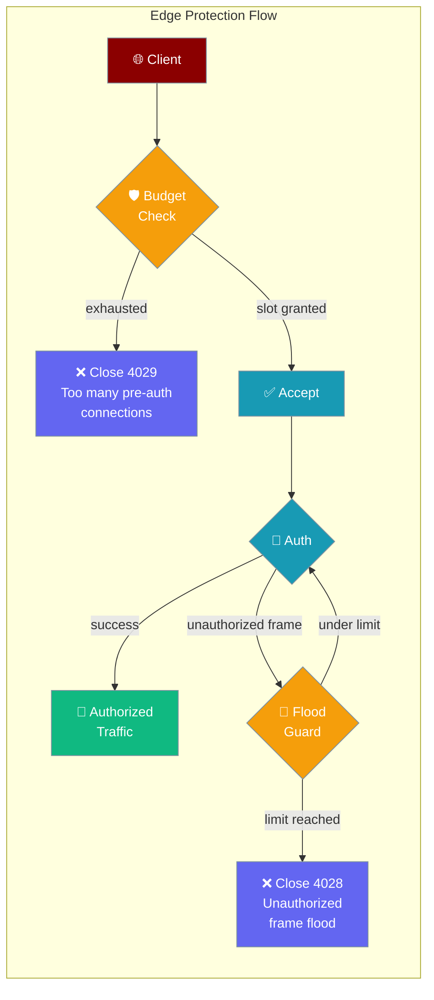
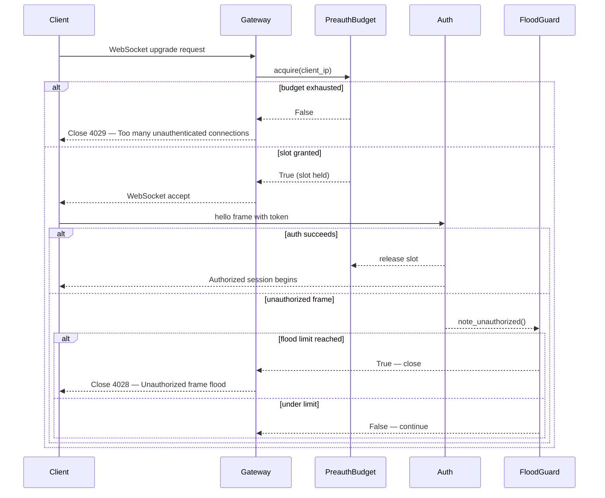

Two built-in guards protect publicly exposed gateways: a per-IP connection budget that caps half-open sockets before authentication, and a per-connection flood guard that closes connections sending too many unauthorized frames.



## Quick Start

<Steps>

<Step title="Defaults are on">
Both protections are active the moment you start the gateway — no configuration required.

```bash
praisonai serve gateway
```

```python
from praisonaiagents import GatewayConfig

config = GatewayConfig(
    preauth_max_connections_per_ip=32,   # default
    max_unauthorized_frames=10,          # default
)
```

Internet-facing deployments are protected immediately. Loopback clients (`127.0.0.1`, `localhost`, `::1`) are always exempt.
</Step>

<Step title="Tune via YAML">
Override the defaults in your `gateway.yaml` under the top-level `gateway:` block:

```yaml
gateway:
  preauth_max_connections_per_ip: 64   # raise for shared-egress IPs
  max_unauthorized_frames: 20          # raise for exploratory clients
```

Missing keys inherit the defaults (`32` and `10`). Set either key to `0` to disable that protection.
</Step>

<Step title="Tune via Python">
Pass the values directly to `GatewayConfig`:

```python
from praisonaiagents import Agent, GatewayConfig

agent = Agent(
    name="PublicGatewayAgent",
    instructions="Handle public requests securely.",
    gateway=GatewayConfig(
        preauth_max_connections_per_ip=64,
        max_unauthorized_frames=20,
    )
)
```
</Step>

</Steps>

---

## How It Works



| Mechanism | Scope | Trigger | Action |
|---|---|---|---|
| `PreauthConnectionBudget` | Per source IP | Concurrent pre-auth WS slots ≥ `preauth_max_connections_per_ip` | Reject upgrade with close `4029` |
| `UnauthorizedFloodGuard` | Per connection | Unauthorized frames ≥ `max_unauthorized_frames` | Close connection with `4028` |
| `AuthRateLimiter` overflow | Per IP | Key map saturated, new IP arrives | Reject closed (preserves existing lockouts) |

<Note>
**Loopback is always exempt.** Connections from any semantic loopback address (`127.0.0.0/8`, `::1`, `localhost`), or a gateway bound to loopback, bypass the pre-auth budget entirely. Your local dev workflow is never affected.
</Note>

---

## Configuration Options

| Option | Type | Default | Description |
|---|---|---|---|
| `preauth_max_connections_per_ip` | `int` | `32` | Max concurrent unauthenticated WebSocket connections per source IP. `0` disables. Loopback exempt. |
| `max_unauthorized_frames` | `int` | `10` | Close the connection after N unauthorized frames on a single connection. `0` disables. |

**Validation:** Both values must be `>= 0`. Negative values raise `ValueError` at startup.

```python
# 0 disables the protection — use when your edge proxy already handles this
from praisonaiagents import GatewayConfig

config = GatewayConfig(
    preauth_max_connections_per_ip=0,   # disabled — trust upstream proxy
    max_unauthorized_frames=0,          # disabled — trust upstream proxy
)
```

---

## Close Codes Reference

| Code | Cause | Client action |
|---|---|---|
| `4008` | WS upgrade rate limit (`AuthRateLimiter` per-IP handshake bucket) | Back off, retry after `retry_after_seconds` hint |
| `4028` | Too many unauthorized frames on this connection | Fix scope/token. **Do NOT reconnect immediately** |
| `4029` | Per-IP pre-auth connection budget exhausted | Wait, close/reuse existing connections before retrying |

<Warning>
**Do not retry-loop on `4028`.** Reconnecting immediately after a `4028` close will trigger another `4028` and amplify load. Fix the authentication token or scope first, then reconnect.
</Warning>

Minimal correct reconnect handler:

```python
import asyncio
import websockets

CLOSE_CODE_UNAUTHORIZED_FLOOD = 4028
CLOSE_CODE_PREAUTH_BUDGET = 4029

async def connect_with_backoff(uri, agent_id, token):
    backoff = 1.0
    auth_uri = f"{uri}?token={token}" if token else uri
    while True:
        try:
            async with websockets.connect(auth_uri) as ws:
                backoff = 1.0
                await ws.send(f'{{"type":"hello","agent_id":"{agent_id}"}}')
                async for message in ws:
                    handle(message)
        except websockets.exceptions.ConnectionClosed as e:
            if e.code == CLOSE_CODE_UNAUTHORIZED_FLOOD:
                print("Unauthorized frame flood (4028): fix token before retrying")
                await asyncio.sleep(backoff * 10)
            elif e.code == CLOSE_CODE_PREAUTH_BUDGET:
                print(f"Pre-auth budget (4029): backing off {backoff}s")
                await asyncio.sleep(backoff)
                backoff = min(backoff * 2, 60)
            else:
                await asyncio.sleep(backoff)
                backoff = min(backoff * 2, 60)
        except (websockets.exceptions.WebSocketException, OSError) as e:
            print(f"Connection failed ({e}): backing off {backoff}s")
            await asyncio.sleep(backoff)
            backoff = min(backoff * 2, 60)

def handle(message):
    print("Received:", message)
```

---

## When to Change the Defaults

<AccordionGroup>

<Accordion title="Behind a trusted reverse proxy (nginx, Cloudflare, WAF)">
If your proxy already caps concurrent connections per IP and applies its own rate limiting, you can disable both guards:

```yaml
gateway:
  preauth_max_connections_per_ip: 0   # proxy handles this
  max_unauthorized_frames: 0          # proxy handles this
```

Only disable when the proxy is on the same trusted network and you are confident it enforces comparable limits. A misconfigured proxy with `preauth_max_connections_per_ip=0` leaves the gateway fully open to half-open socket exhaustion.
</Accordion>

<Accordion title="Shared-egress IPs (office NAT, corporate proxy)">
Multiple legitimate users behind a single NAT IP share one budget slot pool. Raise `preauth_max_connections_per_ip` to accommodate your expected peak simultaneous connections:

```yaml
gateway:
  preauth_max_connections_per_ip: 128   # office of ~40 people, peak 3 tabs each
```

A value of `2–4× your expected simultaneous users` from that IP is a reasonable starting point.
</Accordion>

<Accordion title="Chatty exploratory clients">
Clients probing for available scopes before obtaining a token may exhaust their unauthorized frame budget quickly. Raise `max_unauthorized_frames` or, better, fix the client to send a valid token on the first frame:

```yaml
gateway:
  max_unauthorized_frames: 30   # generous budget for scope discovery
```

The cleaner fix is client-side: fetch a token before opening the WebSocket, not after.
</Accordion>

<Accordion title="Hardening for hostile environments">
Lower both values to reduce the attack surface for internet-exposed deployments facing active scanning:

```yaml
gateway:
  preauth_max_connections_per_ip: 8   # strict: 8 concurrent pre-auth slots
  max_unauthorized_frames: 3          # strict: close on 3rd unauthorized frame
```

Test with your legitimate traffic first — values that are too low will reject real users.
</Accordion>

</AccordionGroup>

---

## Unresolvable IP Handling

When the client IP cannot be resolved (e.g., a broken reverse-proxy configuration omits the `X-Forwarded-For` header), all unresolvable connections are grouped into a single shared bucket keyed `__unresolved__`. This is **fail-closed** — the shared bucket still counts toward the cap, so a flood of unresolvable IPs cannot exhaust the gateway by bypassing IP-level limits.

<Tip>
If you see unexpected `4029` closes on a proxied deployment, check that your proxy correctly forwards `X-Forwarded-For` or `X-Real-IP`. Every connection that arrives without a resolvable source IP competes for the same shared slot pool.
</Tip>

---

## AuthRateLimiter Overflow Hardening

Beyond the two user-tunable knobs, the underlying `AuthRateLimiter` includes a defensive-in-depth overflow fix:

- When the key map is **saturated** (max tracked IPs reached) and a **new IP** arrives, the request is rejected rather than admitted — preventing a fresh-IP flood from evicting existing lockouts.
- **Existing lockouts are preserved** even when the map is full — a flood of new IPs cannot clear the lockout of a previously blocked attacker.
- **Expired-lockout recovery**: IPs already in the lockout table can clear their stale entry even when the map is saturated, preventing permanent trapping.

This is not a user-tunable knob. It is active by default on all gateway deployments.

---

## Best Practices

<AccordionGroup>
  <Accordion title="Leave the defaults on for public gateways">
    Both guards — the per-IP connection budget and the unauthorized-frame flood guard — are active by default. Don't disable them on internet-exposed deployments; they close the pre-auth window that a naive gateway leaves open to half-open socket floods.
  </Accordion>

  <Accordion title="Understand the close codes when debugging">
    A client closed with **4029** hit the per-IP pre-auth connection budget; **4028** means it sent too many unauthorized frames on one connection. Treat 4029 as "too many sockets from this IP" and 4028 as "this connection misbehaved after connecting" when triaging client issues.
  </Accordion>

  <Accordion title="Tune the budget to your real client fan-out">
    If legitimate clients behind a shared NAT trip the per-IP budget, raise it deliberately rather than turning the guard off. Size it to the maximum concurrent connections you expect from a single source IP, with headroom for reconnect storms.
  </Accordion>

  <Accordion title="Don't rely on edge guards alone">
    These protections stop pre-auth abuse, not authenticated misuse. Pair them with per-identity rate limiting and authentication so an attacker who gets past the handshake still faces request-level limits.
  </Accordion>
</AccordionGroup>

---

## Related

<CardGroup cols={2}>
  <Card title="Gateway" icon="tower-broadcast" href="/docs/features/gateway">
    Full gateway configuration reference
  </Card>
  <Card title="Security" icon="shield-check" href="/docs/security">
    Security policies and deployment hardening
  </Card>
  <Card title="Gateway Handshake Protocol" icon="handshake" href="/docs/features/gateway-handshake-protocol">
    Version negotiation, capabilities, and structured connection errors
  </Card>
  <Card title="Gateway Rate Limiting" icon="gauge" href="/docs/features/gateway-rate-limiting">
    Per-identity request rate limiting with sliding-window policy
  </Card>
</CardGroup>
