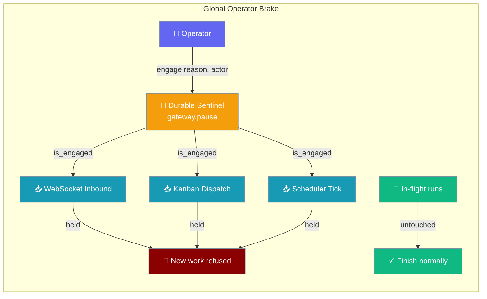
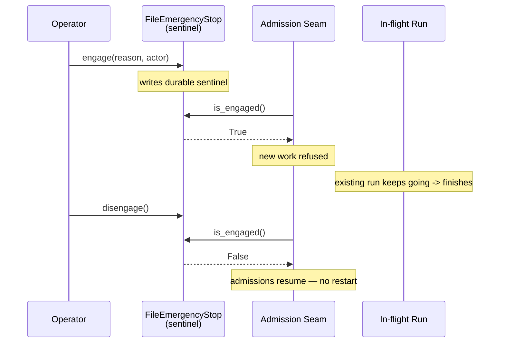
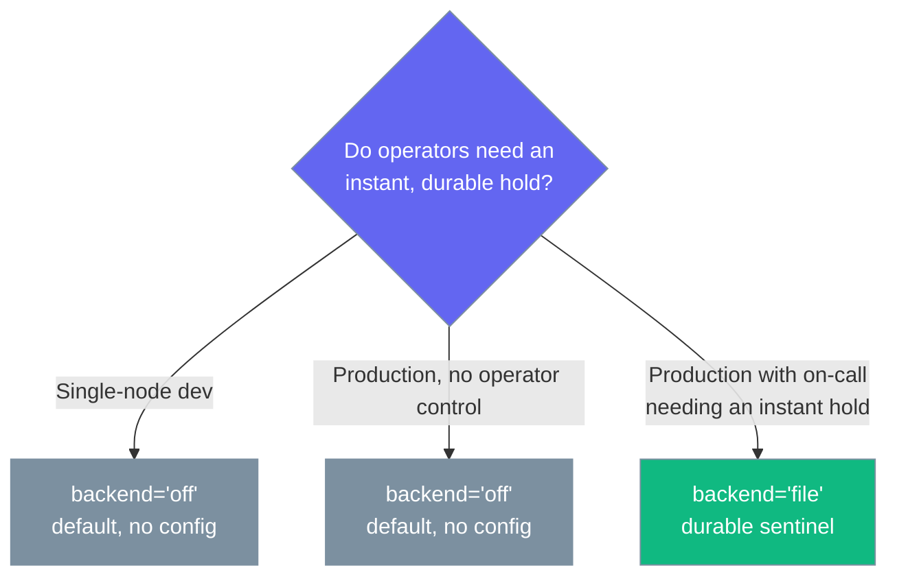

One shared brake every new-work seam can consult — halt new admissions instantly, keep in-flight runs, resume without a restart.



## Quick Start

<Steps>

<Step title="Default — no config, behaviour unchanged">

A gateway with no `control` block defaults to `backend: "off"`, a no-op brake that is byte-for-byte today's behaviour.

```python
from praisonaiagents import Agent
from praisonai_bot.gateway import WebSocketGateway

agent = Agent(name="Support", instructions="Help users")
WebSocketGateway(agent=agent).start()   # gateway.control defaults to "off" -> NullEmergencyStop
```

</Step>

<Step title="Enable the durable file brake">

Selecting `backend: "file"` instantiates a durable sentinel that survives a restart and is shared across replicas that point at the same `path`.

```python
from praisonaiagents import Agent
from praisonaiagents.gateway import EmergencyStopConfig, GatewayConfig
from praisonai_bot.gateway import WebSocketGateway

agent = Agent(name="Support", instructions="Help users")

gateway = WebSocketGateway(
    agent=agent,
    config=GatewayConfig(
        control=EmergencyStopConfig(
            backend="file",
            path="~/.praisonai/state/gateway.pause",
        ),
    ),
)
gateway.start()
```

</Step>

<Step title="Or configure it in gateway.yaml">

```yaml
gateway:
  control:
    backend: file      # "off" (default, no-op) | "file" (durable sentinel)
    path: ~/.praisonai/state/gateway.pause
```

</Step>

<Step title="Drive the brake from Python (works today)">

Engage, inspect, and release the durable brake directly — the sentinel behaviour is available today.

```python
from praisonaiagents.gateway import EmergencyStopConfig

brake = EmergencyStopConfig(
    backend="file",
    path="/var/lib/praisonai/gateway.pause",
).to_estop()

brake.engage(reason="cost spike", actor="mervin")
assert brake.is_engaged() is True

state = brake.state()
# state.engaged, state.reason, state.actor, state.at

brake.disengage()
assert brake.is_engaged() is False
```

</Step>

</Steps>

---

## How It Works

The operator engages one durable sentinel; every admission seam consults it to refuse new work, while runs already in flight are untouched and finish normally.



| Piece | Role |
|---|---|
| `EmergencyStopConfig` | User-facing knob — selects `off` or `file`, wired as `control=…` |
| `EmergencyStopProtocol` | Pure contract: `is_engaged` / `engage` / `disengage` / `state` |
| `NullEmergencyStop` | Default backend for `"off"` — never engaged, inert |
| `FileEmergencyStop` | Durable backend for `"file"` — JSON sentinel, atomic write, fail-safe reads |
| `EmergencyStopState` | Frozen audit snapshot: `engaged`, `reason`, `actor`, `at` |

`engage` and `disengage` are idempotent — engaging twice or disengaging a missing sentinel is safe.

---

## Fail-Safe Behaviour

An ambiguous brake holds new work rather than letting it run freely: any sentinel that cannot be read with confidence counts as **engaged**.

<Note>
`gateway stop` and `gateway stop --force` fail safely too: if the target process can't be signalled (e.g. it's owned by another user), the stop is reported as "not confirmed" and the PID lock is **left intact**, so the still-running gateway stays protected against a duplicate start. See [Gateway CLI — stop](/features/gateway-cli#commands).
</Note>

| Sentinel state | `is_engaged()` | `state().engaged` | `state().reason` |
|---|---|---|---|
| Missing | `False` | `False` | `""` |
| Present, valid JSON object | `True` | `True` | as written |
| Present, unreadable / corrupt / permission error | `True` | `True` | `"unreadable-sentinel"` |
| Valid JSON object, non-numeric `at` (e.g. `[]`) | `True` | `True` | `"unreadable-sentinel"` |

```python
from pathlib import Path
from praisonaiagents.gateway import FileEmergencyStop

sentinel = Path("/tmp/demo.pause")
sentinel.write_text("{ not valid json")
brake = FileEmergencyStop(str(sentinel))
assert brake.is_engaged() is True     # ambiguous sentinel -> holds new work
assert brake.state().reason == "unreadable-sentinel"
```

---

## Configuration Options

`EmergencyStopConfig` from `praisonaiagents.gateway`.

| Option | Type | Default | Description |
|---|---|---|---|
| `backend` | `str` | `"off"` | `"off"` (no-op, default) or `"file"` (durable sentinel). Any other value raises `ValueError`. |
| `path` | `Optional[str]` | `None` | Sentinel file location. **Required** when `backend="file"`, else `ValueError`. |

Properties and methods:

- `enabled` → `bool` — `True` when `backend != "off"`.
- `to_estop()` → the concrete brake (`NullEmergencyStop` for `"off"`, `FileEmergencyStop(path)` for `"file"`).
- `to_dict()` / `from_dict()` — YAML/JSON roundtrip; `from_dict(None)` tolerates a missing block.

Wired into `GatewayConfig` as `control` and surfaces in `GatewayConfig.to_dict()` as `{"control": {"backend": "off", "path": None}}` when defaults hold.

<Card icon="code" href="/sdk/reference/praisonaiagents/modules/feature_configs">
  Full field, type, and default reference for `EmergencyStopConfig`, `EmergencyStopProtocol`, `NullEmergencyStop`, `FileEmergencyStop`, and `EmergencyStopState`
</Card>

---

## When to Enable

Match the backend to whether an on-call operator needs an instant, durable hold.



---

## Backward Compatibility

`off` is the default and reproduces today's behaviour byte-for-byte — no brake is engaged, `is_engaged()` is always `False`, and no new dependency is added.

---

## Roadmap (what this ships vs. what comes next)

<Note>
Kept intentionally minimal per the lightweight-and-powerful mandate: this PR ships the **shared core contract + fail-safe policy + config selector** only. The heavy bot-side wiring (WS inbound, kanban dispatch, scheduler seams) and the `praisonai gateway pause/resume` CLI belong in the wrapper/bot packages and are a natural follow-up that consumes this contract.
</Note>

Today's release ships the pure protocol, the `off`/`file` selector, and the audit-safe state snapshot. Selecting `backend: "file"` instantiates the durable brake and wires it into `GatewayConfig.control`; you can already engage it and inspect `state()` from Python. Consultation at the WebSocket inbound, kanban dispatch, and scheduler seams — plus a `praisonai gateway pause/resume` CLI — is follow-up work in the bot/wrapper packages.

---

## Best Practices

<AccordionGroup>

<Accordion title="Put the sentinel on durable, shared storage">
Point `path` at a location that survives a restart and is visible to every replica — a mounted volume, not a container's ephemeral `/tmp`. That is what makes the hold outlast a crash and apply fleet-wide.
</Accordion>

<Accordion title="Always pass reason and actor when engaging">
`engage(reason="cost spike", actor="mervin")` records who paused and why in the sentinel, surfaced by `state()` for `/health` and audit. An unlabelled hold is hard to explain later.
</Accordion>

<Accordion title="Trust the fail-safe, but alert on it">
An unreadable or corrupt sentinel counts as engaged on purpose — new work stays held. Treat `state().reason == "unreadable-sentinel"` as a signal to inspect the file, not as a normal engaged state.
</Accordion>

<Accordion title="Leave it off unless an operator needs the brake">
Single-node dev and deployments without on-call control gain nothing from a durable sentinel. Keep `backend: "off"` there for zero cost and unchanged behaviour.
</Accordion>

</AccordionGroup>

---

## Related

<CardGroup cols={2}>
<Card title="Gateway Turn Lock" icon="lock" href="/features/gateway-turn-lock">
  Serialise turns cluster-wide.
</Card>
<Card title="Gateway Admission Control" icon="gauge-high" href="/features/gateway-admission-control">
  Concurrency ceiling & backpressure.
</Card>
<Card title="Gateway Graceful Drain" icon="power-off" href="/features/gateway-graceful-drain">
  Drain toward shutdown — orthogonal to the brake.
</Card>
<Card title="Gateway Channel Supervision" icon="sliders" href="/features/gateway-channel-supervision">
  Per-channel pause vs. this fleet-wide brake.
</Card>
</CardGroup>
