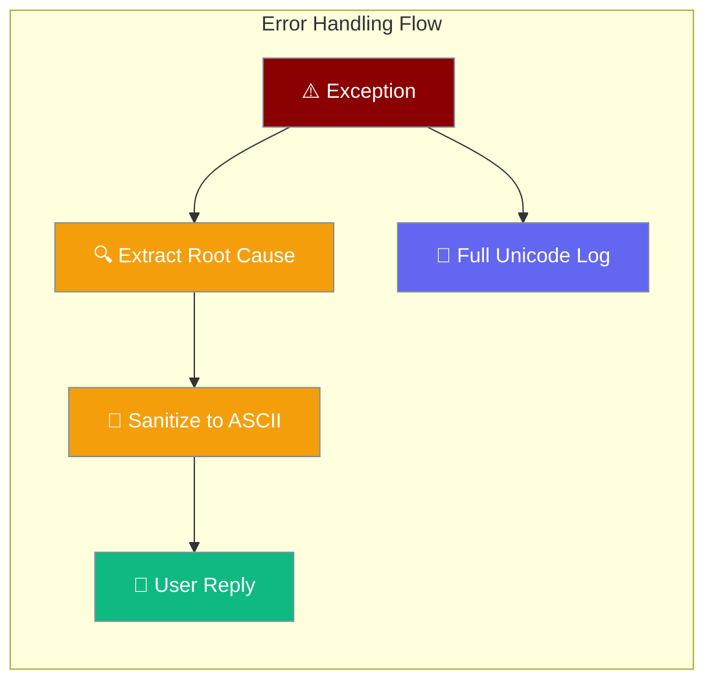
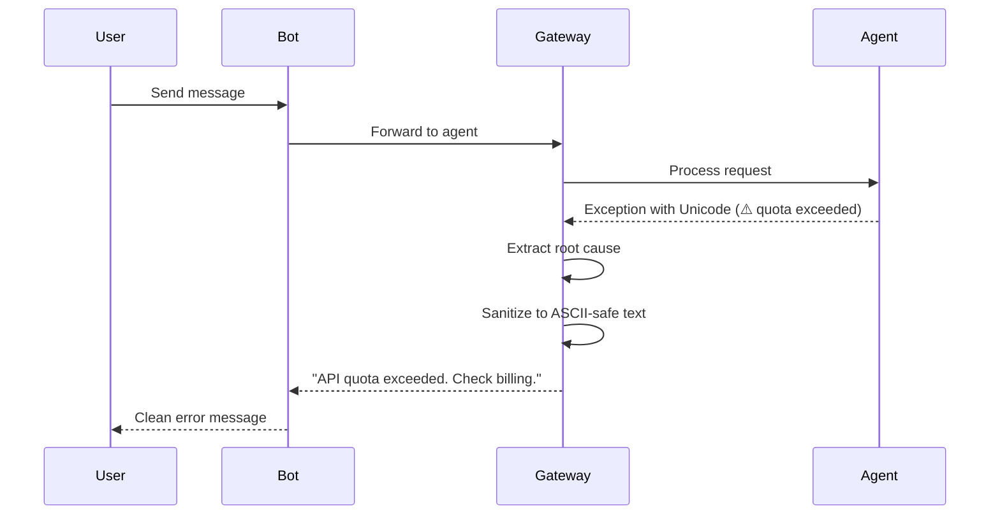

<Note>
The gateway now ships in the `praisonai-bot` package. `praisonai serve gateway` still works exactly as documented here; for a standalone install see [praisonai-bot Migration](/docs/guides/praisonai-bot-migration).
</Note>


Gateway error handling automatically sanitises exception text to prevent encoding crashes while preserving meaningful error information for users.

```python
from praisonaiagents import Agent

agent = Agent(
    name="Assistant",
    instructions="Help the user",
    model="gpt-4o-mini",
)
# Gateway bots receive clean ASCII-safe errors — not raw stack traces
agent.start("What's the weather?")
```


The user sends a message that triggers an internal error; the gateway sanitises the exception to ASCII-safe text in the reply while logging full detail.



## Quick Start

<Steps>
<Step title="Simple Usage">
Error handling is automatic — no configuration needed. When agents throw exceptions containing Unicode characters, the gateway safely converts them for bot replies.

```python
from praisonaiagents import Agent

agent = Agent(
    name="Assistant",
    instructions="Help the user",
    model="gpt-4o-mini"
)
# When the agent hits an API error (quota, rate limit, auth, timeout),
# the gateway sends the user a clean message — not a stack trace.
agent.start("What's the weather?")
```
</Step>

<Step title="Test Error Handling">
Verify your version includes Unicode-safe error handling:

```bash
python -c "from praisonai.gateway.unicode_utils import safe_error_message; print('OK')"
```

If this runs without error, you have the fix from PR #1754.
</Step>
</Steps>

---

## How It Works



The gateway processes exceptions in three stages:
1. **Root-cause extraction** — identifies the underlying API error
2. **Unicode sanitization** — converts symbols to ASCII-safe equivalents  
3. **Safe reply** — sends clean message to user via bot

---

## Configuration Options

Error handling is automatic with no required configuration. The feature is included in PraisonAI versions containing PR #1754.

<Card title="Gateway Error Handling Reference" icon="code" href="https://github.com/MervinPraison/PraisonAI/pull/1754">
  Source implementation details in PraisonAI PR #1754
</Card>

---

## Structured Connection Errors

The `hello` handshake returns machine-readable `ConnectErrorCode` values (`auth_required`, `auth_unauthorized`, `protocol_unsupported`, `pairing_required`, `agent_not_found`) with optional `next_action` hints — instead of free-text-only connection failures.

See [Gateway Handshake Protocol](/docs/features/gateway-handshake-protocol) for the full error matrix and capability negotiation.

---

## Reconnect After Disconnect

Pending inbox messages and in-flight executions are preserved when a WebSocket disconnects. On reconnect with the same `session_id`, the client receives a `status` frame:

```json
{
  "type": "status",
  "message": "Resuming processing (2 pending messages)..."
}
```

Queued messages are processed in FIFO order. See [Gateway Session Continuity](/docs/features/gateway-session-continuity) for drain behaviour and persisted session shape.

---

## Common Patterns

### Recognized Error Types

The gateway automatically recognizes and formats these error patterns:

| Pattern matched in exception | User-facing reply |
|------------------------------|-------------------|
| `Error code: <N> - <msg>` (OpenAI format) | `Error <N>: <msg>` |
| `HTTP <N>: <msg>` | `Error <N>: <msg>` |
| Contains `quota` (exceeded / insufficient) | `API quota exceeded. Check billing.` |
| Contains `rate limit` (exceeded) | `Rate limit exceeded. Try again later.` |
| Contains `authentication` (failed) | `Authentication failed. Check API key.` |
| Contains `timeout` | `Request timeout. Try again.` |
| (anything else) | Original error text, sanitized to ASCII |

### Symbol Replacements

Unicode symbols are replaced with ASCII equivalents:

| Unicode | ASCII | Description |
|---------|-------|-------------|
| `⚠` | `!` | Warning symbol |
| `✓` | `OK` | Check mark |
| `✗` | `X` | Cross mark |
| `→` | `->` | Right arrow |
| `…` | `...` | Ellipsis |
| `"` `"` | `"` | Smart quotes |
| `—` `–` | `--` `-` | Em/en dash |

Accented letters (á, é, ñ, etc.) are converted to their base forms (a, e, n).

### Before vs After

**Before PR #1754 (broken on Windows):**
```
User sees: 'charmap' codec can't encode character '⚠' in position 27: character maps to <undefined>
```

**After PR #1754 (safe on all platforms):**
```
User sees: API quota exceeded. Check billing.
```

---

## Best Practices

<AccordionGroup>
<Accordion title="Monitor Gateway Logs">
Full Unicode exception details are preserved in gateway logs for debugging while users see clean ASCII-safe messages.

```bash
praisonai gateway logs
```
</Accordion>

<Accordion title="Handle API Quota Limits">
Set up billing alerts and monitor usage to prevent quota exceeded errors:

```bash
# Users see: "API quota exceeded. Check billing."
# Solution: Add credits at platform.openai.com
```
</Accordion>

<Accordion title="Test Cross-Platform Compatibility">
The Unicode-safe error handling works on Windows, macOS, and Linux:

```python
# Test with Unicode in agent instructions or error messages
agent = Agent(
    name="Test",
    instructions="Handle errors with Unicode: ⚠️ warnings, ✅ success",
    model="gpt-4o-mini"
)
```
</Accordion>

<Accordion title="Upgrade Legacy Environments">
No workaround needed on supported versions. Previously recommended environment variables (`PYTHONUTF8=1`) are no longer required for the bot reply path.
</Accordion>
</AccordionGroup>

---

## Related

<CardGroup cols={2}>
  <Card title="Gateway Troubleshooting" icon="wrench" href="/docs/guides/troubleshoot-gateway">
    Troubleshoot Windows charmap errors and other gateway issues
  </Card>
  <Card title="Bot Gateway" icon="server" href="/docs/features/bot-gateway">
    Configure multiple bots with the gateway server
  </Card>
</CardGroup>