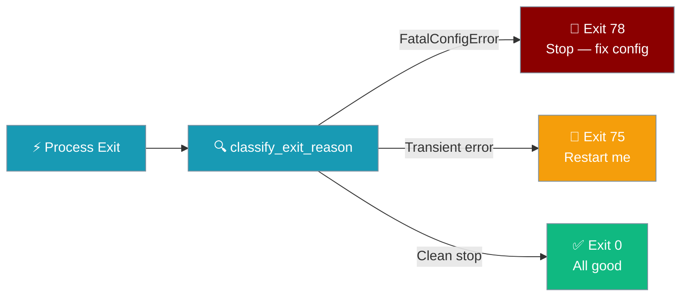
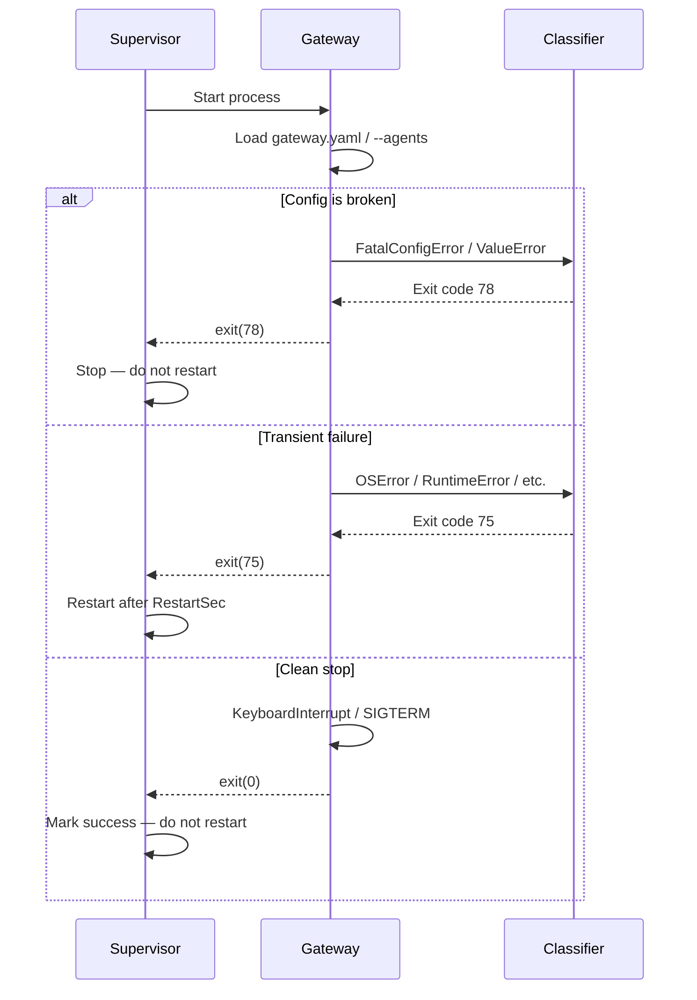

Gateway exits with a `sysexits.h`-based code so a process supervisor knows whether to restart, give up, or treat the shutdown as clean.



## Quick Start

<Steps>
<Step title="Run under systemd with the right restart policy">
Drop this unit file into `/etc/systemd/system/praisonai-gateway.service`. The gateway already emits the right codes — you just need to tell systemd not to restart on exit `78`:

```ini
[Unit]
Description=PraisonAI Gateway
After=network.target

[Service]
ExecStart=/usr/local/bin/praisonai serve gateway
Restart=on-failure
RestartSec=2
# A typo in gateway.yaml exits 78 — don't crash-loop, page instead
RestartPreventExitStatus=78
SuccessExitStatus=0

[Install]
WantedBy=multi-user.target
```

Reload and enable:

```bash
systemctl daemon-reload
systemctl enable --now praisonai-gateway
```
</Step>

<Step title="Catch FatalConfigError in custom embeddings">
If you embed the gateway start path in your own code, translate to your supervisor contract:

```python
import sys
from praisonaiagents.gateway import FatalConfigError, classify_exit_reason

try:
    run_my_gateway()
except FatalConfigError as exc:
    print(f"Fatal config — stop restarting: {exc}")
    sys.exit(78)
except Exception as exc:
    sys.exit(classify_exit_reason(exc))
```
</Step>
</Steps>

---

## How It Works



The classifier (`classify_exit_reason`) is a pure function with no side effects. It lives in the core package so the wrapper CLI (`praisonai serve gateway`) and the runtime entry point (`python -m praisonai.runtime`) share one source of truth.

---

## Exit Code Reference

| Constant | Value | sysexits.h | When | Supervisor should |
|----------|-------|------------|------|-------------------|
| `GATEWAY_OK_EXIT_CODE` | `0` | `EX_OK` | Clean shutdown (SIGTERM, Ctrl+C, normal stop) | Not restart |
| `GATEWAY_RESTART_EXIT_CODE` | `75` | `EX_TEMPFAIL` | Transient failure (network blip, dependency restart) | Restart |
| `GATEWAY_FATAL_CONFIG_EXIT_CODE` | `78` | `EX_CONFIG` | Misconfiguration (bad YAML, missing `--agents`, missing deps) | Stop and alert |

```python
from praisonaiagents.gateway import (
    GATEWAY_OK_EXIT_CODE,         # 0
    GATEWAY_RESTART_EXIT_CODE,    # 75
    GATEWAY_FATAL_CONFIG_EXIT_CODE,  # 78
)
```

---

## Fatal vs Transient

`classify_exit_reason(exc)` applies these rules in order:

**Clean exit (0):**
- `exc` is `None`
- `exc` is `KeyboardInterrupt` (includes SIGTERM mapped to `KeyboardInterrupt`)
- `exc` is `SystemExit(0)` or `SystemExit(None)`
- `exc` is `SystemExit(n)` where `n` is any integer — passes `n` through unchanged

**Fatal (`78` — do not restart):**
- `FatalConfigError` raised explicitly anywhere in the start path
- `gateway.yaml` missing, empty, or schema-invalid (`load_gateway_config` raises `ValueError`)
- `--agents` file missing or unreadable
- `agents:` key absent or falsy in the agents YAML
- `agents:` is not a list (e.g. `agents: {name: bad}`)
- `agents:` list contains a non-mapping entry (e.g. `agents: ["bad"]`) — previously triggered `AttributeError` and crash-looped at code 75; now correctly raises `FatalConfigError` and exits 78
- Missing required gateway dependencies at boot (e.g. `pip install praisonai[api]` not run)

**Transient (`75` — ask supervisor to restart):**
- Any `Exception` not matched by the rules above

<Warning>
Before this fix, a malformed `gateway.yaml` (missing `agents:` section, empty file, or schema-invalid YAML) caused `load_gateway_config` to raise `ValueError`, which routed through `classify_exit_reason` to exit `75` — a crash-loop that ran forever. It now exits `78`. If your supervisor was relying on the old `75` behaviour to eventually surface the problem, add `RestartPreventExitStatus=78` and a matching alert rule.
</Warning>

---

## Supervisor Integration

<Tabs>
<Tab title="systemd">
```ini
[Unit]
Description=PraisonAI Gateway
After=network.target

[Service]
ExecStart=/usr/local/bin/praisonai serve gateway
Restart=on-failure
RestartSec=2
# Exit 78 = fatal config; don't crash-loop, page the operator instead
RestartPreventExitStatus=78
SuccessExitStatus=0
# Optional: capture logs
StandardOutput=journal
StandardError=journal
SyslogIdentifier=praisonai-gateway

[Install]
WantedBy=multi-user.target
```

With `--config` for multi-bot mode:

```ini
[Service]
ExecStart=/usr/local/bin/praisonai serve gateway --config /etc/praisonai/gateway.yaml
Restart=on-failure
RestartSec=2
RestartPreventExitStatus=78
```
</Tab>

<Tab title="Kubernetes">
Kubernetes `restartPolicy: OnFailure` restarts on any non-zero exit, so exit `78` will still restart by default. Surface the fatal-config state via an init container or a wrapper script:

```yaml
apiVersion: v1
kind: Pod
spec:
  restartPolicy: OnFailure
  initContainers:
    - name: validate-config
      image: your-praisonai-image
      command: ["sh", "-c"]
      args:
        - |
          praisonai serve gateway --config /config/gateway.yaml --check-only
          if [ $? -eq 78 ]; then
            echo "FATAL: gateway.yaml is invalid — fix before deploying"
            exit 1
          fi
      volumeMounts:
        - name: gateway-config
          mountPath: /config
  containers:
    - name: gateway
      image: your-praisonai-image
      command: ["praisonai", "serve", "gateway", "--config", "/config/gateway.yaml"]
      volumeMounts:
        - name: gateway-config
          mountPath: /config
  volumes:
    - name: gateway-config
      configMap:
        name: gateway-config
```

<Note>
Kubernetes does not have a built-in `RestartPreventExitStatus` equivalent. Validate `gateway.yaml` in CI (see Best Practices) and use an init container to reject bad configs before the gateway pod starts.
</Note>
</Tab>

<Tab title="s6 / runit">
Place this `finish` script alongside your `run` script. `$1` is the exit code from `run`:

```sh
#!/bin/sh
# finish — called by s6/runit after 'run' exits
# $1 = exit code from run

if [ "$1" = "78" ]; then
    # Fatal config — operator must fix gateway.yaml
    # Tell s6 to stop this service permanently (don't auto-restart)
    s6-svc -O .
fi

# For any other code (including 75), exit 0 to let the supervisor restart
exit 0
```

For runit (`finish`):

```sh
#!/bin/sh
# $1 = exit code, $2 = signal
if [ "$1" = "78" ]; then
    # Signal the runsvdir to down this service
    sv down .
fi
```
</Tab>
</Tabs>

---

## Embedding the Classifier

Use `classify_exit_reason` directly when you run the gateway start path from your own code:

```python
import sys
from praisonaiagents.gateway import classify_exit_reason, FatalConfigError

def run_my_gateway():
    # ... your gateway startup logic ...
    pass

try:
    run_my_gateway()
except Exception as exc:
    sys.exit(classify_exit_reason(exc))
```

Signal "stop restarting me" from anywhere in a custom start path by raising `FatalConfigError`:

```python
from praisonaiagents.gateway import FatalConfigError

def validate_my_config(path):
    if not config_is_valid(path):
        raise FatalConfigError(f"Invalid config at {path} — fix before restarting")
```

---

## Backward Compatibility

The wrapper (`praisonai serve gateway`) imports the exit-code symbols from `praisonaiagents.gateway` at startup. Two fallback rules apply:

- If `praisonaiagents.gateway` is absent (`ModuleNotFoundError`) or predates the protocol (missing symbols → `AttributeError`), the wrapper uses local sysexits.h values (`0` / `75` / `78`) and a minimal classifier with the same semantics.
- Any other `ImportError` (a broken core install) surfaces immediately — broken cores are no longer silently swallowed.

Pre-PR #2439 wrappers returned `None` from `start()`; the new `int` return is backward-compatible — callers that ignored the return value continue to work and see exit `0` semantics from the shell.

---

## Best Practices

<AccordionGroup>
<Accordion title="Pin RestartPreventExitStatus=78 in systemd">
Without it, a typo in `gateway.yaml` restarts the gateway indefinitely, burning through CPU, log storage, and pager budget.

```ini
RestartPreventExitStatus=78
```
</Accordion>

<Accordion title="Treat exit 78 as a paging event">
Exit `75` is normal supervisor noise — the gateway will come back. Exit `78` means a human deployed a broken config and the gateway will never come back on its own.

```sh
# Example: alert on 78 from journald
journalctl -u praisonai-gateway -f | grep "Fatal config"
```
</Accordion>

<Accordion title="Validate gateway.yaml in CI before rollout">
A `78` at boot is cheap. A `78` caught mid-rollout after rolling out to 10 pods is not.

```bash
# In your CI pipeline, before deploying:
praisonai serve gateway --config gateway.yaml
# Exit 78 will fail the pipeline step
```
</Accordion>

<Accordion title="Don't swallow FatalConfigError without re-raising">
Catching `FatalConfigError` and not re-raising converts exit `78` back to `75` and re-enables the crash-loop.

```python
# Wrong — crash-loops forever on a bad config
try:
    run_my_gateway()
except FatalConfigError:
    pass  # Don't do this

# Right — let the supervisor see 78
try:
    run_my_gateway()
except FatalConfigError as exc:
    sys.exit(78)
```
</Accordion>
</AccordionGroup>

---

## Related

<CardGroup cols={2}>
<Card icon="gateway" href="/docs/gateway">
  Gateway architecture, auth posture, and lifecycle predicates
</Card>
<Card icon="moon" href="/docs/features/gateway-scale-to-zero">
  Quiesce gateway when idle (ScaleToZeroPolicy)
</Card>
<Card icon="timer" href="/docs/features/gateway-session-continuity">
  Bounded drain wait on shutdown (DrainTimeoutPolicy)
</Card>
<Card icon="signal" href="/docs/features/gateway-drain-trigger">
  Port-less external drain signal (DrainMarkerPolicy)
</Card>
</CardGroup>
