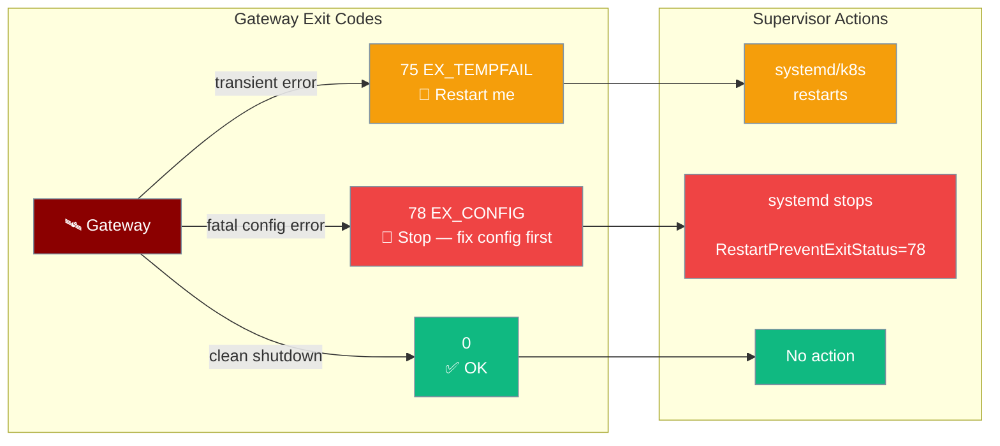
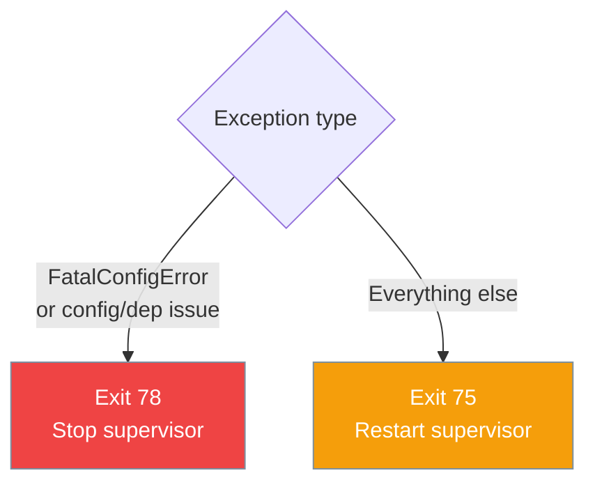

`praisonai serve gateway` exits with a specific code to tell your supervisor whether to restart or stop — a misconfigured gateway should not crash-loop forever.



## Quick Start

<Steps>
<Step title="Run the gateway with a process supervisor">

The gateway already emits the correct exit code — no configuration needed in your code:

```bash
praisonai serve gateway --config gateway.yaml
```

</Step>

<Step title="Configure systemd to restart on transient failures">

```ini
# /etc/systemd/system/praisonai-gateway.service
[Service]
ExecStart=/usr/local/bin/praisonai serve gateway --config /etc/praisonai/gateway.yaml
Restart=on-failure
RestartPreventExitStatus=78
RestartSec=5
```

With this config, systemd restarts on exit 75 (transient) but **stops** on exit 78 (fatal config) so you know to fix the config before re-enabling.

</Step>

<Step title="Configure Kubernetes restart policy">

```yaml
# In your Pod spec
spec:
  restartPolicy: OnFailure  # restart on non-zero exit
```

For more granular control, use an init container or liveness probe to detect the 78 exit code and send an alert.

</Step>
</Steps>

---

## Exit Code Reference

| Exit Code | Constant | Meaning | Supervisor action |
|-----------|----------|---------|-------------------|
| `0` | `GATEWAY_OK_EXIT_CODE` | Clean shutdown (signal received or graceful stop) | None |
| `75` | `GATEWAY_RESTART_EXIT_CODE` | Transient failure — network blip, upstream timeout | Restart |
| `78` | `GATEWAY_FATAL_CONFIG_EXIT_CODE` | Fatal misconfiguration — fix config before restarting | Stop |

Exit codes 75 (`EX_TEMPFAIL`) and 78 (`EX_CONFIG`) follow the BSD `sysexits.h` standard, which most Linux supervisors understand natively.

---

## What Triggers Each Code

### Fatal configuration (exit 78)

The gateway exits 78 when it detects a problem that restarting won't fix:

- Missing required dependencies (e.g. platform SDK not installed)
- Missing or unreadable `gateway.yaml`
- Schema-invalid `gateway.yaml` (type errors, unknown keys)
- `--agents` file with non-mapping entries
- `FatalConfigError` raised by a plugin or adapter during startup

### Transient failures (exit 75)

Everything else — network errors, upstream timeouts, unexpected exceptions during operation — exits 75.



---

## Common Patterns

### Raise FatalConfigError from a custom plugin

```python
from praisonaiagents.gateway.protocols import FatalConfigError

class MyPlugin:
    def startup(self, config):
        if not config.get("api_key"):
            raise FatalConfigError("MyPlugin: 'api_key' is required in gateway.yaml")
```

### Detect exit code in a shell script

```bash
#!/bin/bash
praisonai serve gateway --config gateway.yaml
CODE=$?

if [ "$CODE" -eq 78 ]; then
    echo "Fatal config error — alert on-call team" >&2
    send_alert "gateway misconfigured" &
    exit 1
elif [ "$CODE" -eq 75 ]; then
    echo "Transient failure — will restart" >&2
fi
```

### Classify exits programmatically

```python
from praisonaiagents.gateway import classify_exit_reason, FatalConfigError

try:
    run_gateway()
except Exception as exc:
    code = classify_exit_reason(exc)
    raise SystemExit(code)
```

---

## Supervisor Configuration Reference

### systemd

```ini
[Unit]
Description=PraisonAI Gateway

[Service]
ExecStart=/usr/local/bin/praisonai serve gateway --config /etc/praisonai/gateway.yaml
Restart=on-failure
RestartPreventExitStatus=78
RestartSec=5
StartLimitBurst=5
StartLimitIntervalSec=60

[Install]
WantedBy=multi-user.target
```

### s6-overlay

```bash
#!/bin/execlineb -P
# /etc/s6-overlay/s6-rc.d/gateway/run
foreground { praisonai serve gateway --config /etc/praisonai/gateway.yaml }
importas -u ? ?
ifelse { test ${?} -eq 78 } { s6-svscanctl -t /var/run/s6/services }
```

### Docker Compose

```yaml
services:
  gateway:
    image: praisonai/gateway:latest
    command: serve gateway --config /config/gateway.yaml
    restart: on-failure
    volumes:
      - ./gateway.yaml:/config/gateway.yaml
```

---

## Best Practices

<AccordionGroup>

<Accordion title="Always set RestartPreventExitStatus=78 in systemd">
Without this, systemd will restart a misconfigured gateway in a tight crash loop, filling logs and burning CPU. Exit 78 is the standard way to say "don't restart me".
</Accordion>

<Accordion title="Raise FatalConfigError for unrecoverable plugin errors">
If your plugin needs a required API key or a database connection that can't be deferred, raise `FatalConfigError` at startup so the operator knows to fix the config before the gateway will run.
</Accordion>

<Accordion title="Monitor for exit 78 in your alerting">
A `78` exit in production means a deployment broke the config. Wire it to your on-call alerting so it isn't silently swallowed by a restart loop.
</Accordion>

<Accordion title="Exit 0 on clean shutdown">
The gateway exits 0 when it receives a shutdown signal (SIGTERM, `/drain` endpoint). Supervisors that restart on any non-zero exit will leave the gateway alone after a graceful stop.
</Accordion>

</AccordionGroup>

---

## Related

<CardGroup cols={2}>
<Card title="Gateway Overview" icon="server" href="/docs/features/gateway-overview">
  Architecture and startup sequence
</Card>
<Card title="Gateway CLI" icon="terminal" href="/docs/features/gateway-cli">
  Command-line interface for the gateway
</Card>
<Card title="Gateway Code-Skew Guard" icon="fingerprint" href="/docs/features/gateway-code-skew-guard">
  Detect in-place updates and prompt a restart
</Card>
<Card title="Gateway Error Handling" icon="triangle-exclamation" href="/docs/features/gateway-error-handling">
  How the gateway handles runtime errors
</Card>
</CardGroup>
