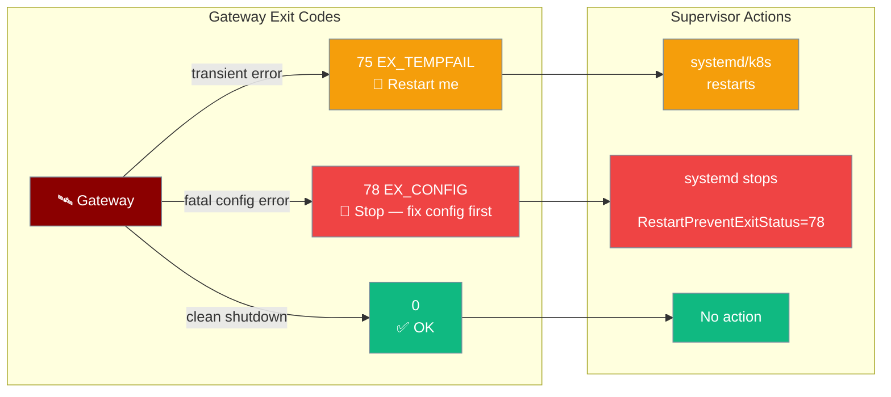
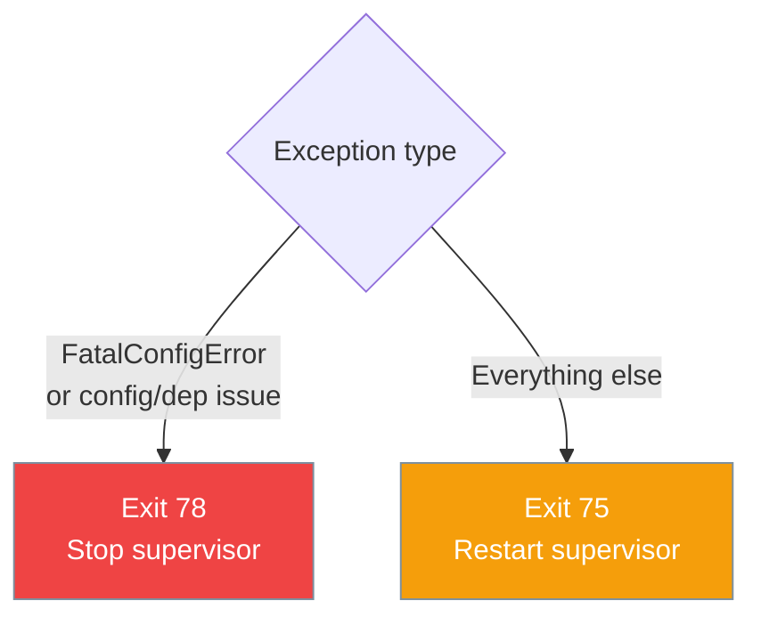
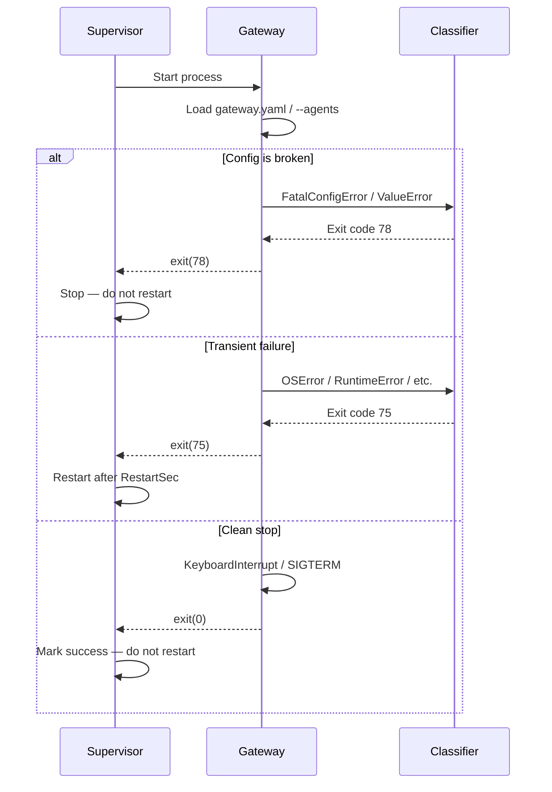

<Note>
The gateway now ships in the `praisonai-bot` package. `praisonai serve gateway` still works exactly as documented here; for a standalone install see [praisonai-bot Migration](/docs/guides/praisonai-bot-migration).
</Note>

`praisonai serve gateway` exits with a specific code to tell your supervisor whether to restart or stop — a misconfigured gateway should not crash-loop forever.

```python
from praisonaiagents import Agent

agent = Agent(name="assistant", instructions="Serve users via the gateway.")
agent.start("Start the gateway under systemd supervision.")
```

The user runs the gateway under a supervisor; exit codes signal whether to restart, stop for config fixes, or exit cleanly.



## Quick Start

<Steps>
<Step title="Start the gateway normally">
```bash
praisonai gateway start --agents my_agents.yaml
```

The process exits with code `0` on clean shutdown, `75` on transient failure (supervisor should restart), and `78` on fatal config error (supervisor should alert, not restart).
</Step>

<Step title="Systemd service with correct restart policy">
```ini
[Unit]
Description=PraisonAI Gateway
After=network.target

[Service]
ExecStart=/usr/local/bin/praisonai gateway start --agents /etc/praisonai/agents.yaml
Restart=on-failure
RestartSec=5
# Restart on transient failure (75), but not on fatal config error (78)
RestartForceExitStatus=75
SuccessExitStatus=0

[Install]
WantedBy=multi-user.target
```
</Step>

<Step title="Kubernetes restart policy">
```yaml
apiVersion: v1
kind: Pod
spec:
  restartPolicy: OnFailure
  containers:
    - name: praisonai-gateway
      image: praisonai/gateway:latest
      command: ["praisonai", "gateway", "start", "--agents", "/etc/praisonai/agents.yaml"]
      lifecycle:
        postStart:
          exec:
            command: ["/bin/sh", "-c", "echo Gateway started"]
```

For exit code 78, set an alert in your monitoring system and do not auto-restart.
</Step>
</Steps>

---

## Exit Code Reference

| Exit Code | Constant | Meaning | Supervisor action |
|-----------|----------|---------|-------------------|
| `0` | `GATEWAY_OK_EXIT_CODE` | Clean shutdown (signal received or graceful stop) | None |
| `75` | `GATEWAY_RESTART_EXIT_CODE` | Transient failure — network blip, upstream timeout | Restart |
| `78` | `GATEWAY_FATAL_CONFIG_EXIT_CODE` | Fatal misconfiguration — fix config before restarting | Stop |

Exit codes 75 (`EX_TEMPFAIL`) and 78 (`EX_CONFIG`) follow the BSD `sysexits.h` standard, which most Linux supervisors understand natively.

---

## What Triggers Each Code

### Fatal configuration (exit 78)

The gateway exits 78 when it detects a problem that restarting won't fix:

- Missing required dependencies (e.g. platform SDK not installed)
- Missing or unreadable `gateway.yaml`
- Schema-invalid `gateway.yaml` (type errors, unknown keys)
- **Unknown / typo'd channel platform** — e.g. `telegran:` when you meant `telegram:`. Previously warned and started; now fails closed with exit 78.
- **Missing `token:` on a tokenful platform** — the `token:` key must be present; an empty `${VAR}` resolution is tolerated (the channel is skipped), but a missing key is fatal.
- **Plugin platform not on the registry** — a `platform:` name that isn't built-in, isn't published via `praisonai.channels` / `praisonai.bots` entry points, and isn't registered at runtime via `register_platform()` fails closed. To validate against your custom platform, register it before calling `WebSocketGateway.start_with_config()`.
- `--agents` file with non-mapping entries
- `FatalConfigError` raised by a plugin or adapter during startup

<Note>
A channel credential that is merely **unavailable** — an unset env var, an empty secret file, a rotation/expiry blip — is **not** an exit-78 condition. That channel is isolated as degraded and the gateway keeps serving every healthy channel; see [Degraded Channel Isolation](/docs/features/gateway-degraded-channels). Only a missing `token:` *key* or a structurally invalid config fails closed.
</Note>

### Transient failures (exit 75)

Everything else — network errors, upstream timeouts, unexpected exceptions during operation — exits 75.



---

## Common Patterns

### Raise FatalConfigError from a custom plugin

```python
from praisonaiagents.gateway.protocols import FatalConfigError

class MyPlugin:
    def startup(self, config):
        if not config.get("api_key"):
            raise FatalConfigError("MyPlugin: 'api_key' is required in gateway.yaml")
```

### Detect exit code in a shell script

```bash
#!/bin/bash
praisonai serve gateway --config gateway.yaml
CODE=$?

if [ "$CODE" -eq 78 ]; then
    echo "Fatal config error — alert on-call team" >&2
    send_alert "gateway misconfigured" &
    exit 1
elif [ "$CODE" -eq 75 ]; then
    echo "Transient failure — will restart" >&2
fi
```

### Classify exits programmatically

```python
from praisonaiagents.gateway import classify_exit_reason, FatalConfigError

try:
    run_gateway()
except Exception as exc:
    code = classify_exit_reason(exc)
    raise SystemExit(code)
```

---

## Supervisor Configuration Reference

### systemd

```ini
[Unit]
Description=PraisonAI Gateway
After=network.target

[Service]
ExecStart=/usr/local/bin/praisonai serve gateway
Restart=on-failure
RestartSec=2
# A typo in gateway.yaml exits 78 — don't crash-loop, page instead
RestartPreventExitStatus=78
SuccessExitStatus=0

[Install]
WantedBy=multi-user.target
```

Reload and enable:

```bash
systemctl daemon-reload
systemctl enable --now praisonai-gateway
```

---

## How It Works



The classifier (`classify_exit_reason`) is a pure function with no side effects. It lives in the core package so the wrapper CLI (`praisonai serve gateway`) and the runtime entry point (`python -m praisonai.runtime`) share one source of truth.

---

## Exit Code Reference

| Constant | Value | sysexits.h | When | Supervisor should |
|----------|-------|------------|------|-------------------|
| `GATEWAY_OK_EXIT_CODE` | `0` | `EX_OK` | Clean shutdown (SIGTERM, Ctrl+C, normal stop) | Not restart |
| `GATEWAY_RESTART_EXIT_CODE` | `75` | `EX_TEMPFAIL` | Transient failure (network blip, dependency restart) | Restart |
| `GATEWAY_FATAL_CONFIG_EXIT_CODE` | `78` | `EX_CONFIG` | Misconfiguration (bad YAML, missing `--agents`, missing deps) | Stop and alert |

```python
from praisonaiagents.gateway import (
    GATEWAY_OK_EXIT_CODE,         # 0
    GATEWAY_RESTART_EXIT_CODE,    # 75
    GATEWAY_FATAL_CONFIG_EXIT_CODE,  # 78
)
```

---

## Fatal vs Transient

`classify_exit_reason(exc)` applies these rules in order:

**Clean exit (0):**
- `exc` is `None`
- `exc` is `KeyboardInterrupt` (includes SIGTERM mapped to `KeyboardInterrupt`)
- `exc` is `SystemExit(0)` or `SystemExit(None)`
- `exc` is `SystemExit(n)` where `n` is any integer — passes `n` through unchanged

**Fatal (`78` — do not restart):**
- `FatalConfigError` raised explicitly anywhere in the start path
- `gateway.yaml` missing, empty, or schema-invalid (`load_gateway_config` raises `ValueError`)
- `--agents` file missing or unreadable
- `agents:` key absent or falsy in the agents YAML
- `agents:` is not a list (e.g. `agents: {name: bad}`)
- `agents:` list contains a non-mapping entry (e.g. `agents: ["bad"]`) — previously triggered `AttributeError` and crash-looped at code 75; now correctly raises `FatalConfigError` and exits 78
- Unknown or typo'd channel platform (e.g. `telegran:`) — previously warned and started; now raises `ValueError` from the registry-aware validator and exits 78
- Missing `token:` key on a tokenful platform — previously warned; now fatal (an empty `${VAR}` resolution is tolerated and the channel is skipped)
- Plugin `platform:` not on the registry (not built-in, not an entry point, not `register_platform()`d) — exits 78
- Missing required gateway dependencies at boot (e.g. `pip install praisonai[api]` not run)

**Transient (`75` — ask supervisor to restart):**
- Any `Exception` not matched by the rules above

<Warning>
Before this fix, a malformed `gateway.yaml` (missing `agents:` section, empty file, or schema-invalid YAML) caused `load_gateway_config` to raise `ValueError`, which routed through `classify_exit_reason` to exit `75` — a crash-loop that ran forever. It now exits `78`. If your supervisor was relying on the old `75` behaviour to eventually surface the problem, add `RestartPreventExitStatus=78` and a matching alert rule.
</Warning>

<Warning>
Before PR #3019, an unknown `platform:` value only produced a warning and the gateway started with that channel silently dead. It now exits `78`. If you have configs with typos that were previously "working" (i.e. reporting healthy while doing nothing), fix them before upgrading.
</Warning>

---

## Supervisor Integration

<Tabs>
<Tab title="systemd">
```ini
[Unit]
Description=PraisonAI Gateway
After=network.target

[Service]
ExecStart=/usr/local/bin/praisonai serve gateway
Restart=on-failure
RestartSec=2
# Exit 78 = fatal config; don't crash-loop, page the operator instead
RestartPreventExitStatus=78
SuccessExitStatus=0
# Optional: capture logs
StandardOutput=journal
StandardError=journal
SyslogIdentifier=praisonai-gateway

[Install]
WantedBy=multi-user.target
```

With `--config` for multi-bot mode:

```ini
[Service]
ExecStart=/usr/local/bin/praisonai serve gateway --config /etc/praisonai/gateway.yaml
Restart=on-failure
RestartSec=2
RestartPreventExitStatus=78
```
</Tab>

<Tab title="Kubernetes">
Kubernetes `restartPolicy: OnFailure` restarts on any non-zero exit, so exit `78` will still restart by default. Surface the fatal-config state via an init container or a wrapper script:

```yaml
apiVersion: v1
kind: Pod
spec:
  restartPolicy: OnFailure
  initContainers:
    - name: validate-config
      image: your-praisonai-image
      command: ["sh", "-c"]
      args:
        - |
          praisonai serve gateway --config /config/gateway.yaml --check-only
          if [ $? -eq 78 ]; then
            echo "FATAL: gateway.yaml is invalid — fix before deploying"
            exit 1
          fi
      volumeMounts:
        - name: gateway-config
          mountPath: /config
  containers:
    - name: gateway
      image: your-praisonai-image
      command: ["praisonai", "serve", "gateway", "--config", "/config/gateway.yaml"]
      volumeMounts:
        - name: gateway-config
          mountPath: /config
  volumes:
    - name: gateway-config
      configMap:
        name: gateway-config
```

<Note>
Kubernetes does not have a built-in `RestartPreventExitStatus` equivalent. Validate `gateway.yaml` in CI (see Best Practices) and use an init container to reject bad configs before the gateway pod starts.
</Note>
</Tab>

<Tab title="s6 / runit">
Place this `finish` script alongside your `run` script. `$1` is the exit code from `run`:

```sh
#!/bin/sh
# finish — called by s6/runit after 'run' exits
# $1 = exit code from run

if [ "$1" = "78" ]; then
    # Fatal config — operator must fix gateway.yaml
    # Tell s6 to stop this service permanently (don't auto-restart)
    s6-svc -O .
fi

# For any other code (including 75), exit 0 to let the supervisor restart
exit 0
```

For runit (`finish`):

```sh
#!/bin/sh
# $1 = exit code, $2 = signal
if [ "$1" = "78" ]; then
    # Signal the runsvdir to down this service
    sv down .
fi
```
</Tab>
</Tabs>

---

## Embedding the Classifier

Use `classify_exit_reason` directly when you run the gateway start path from your own code:

```python
import sys
from praisonaiagents.gateway import classify_exit_reason, FatalConfigError

def run_my_gateway():
    # ... your gateway startup logic ...
    pass

try:
    run_my_gateway()
except Exception as exc:
    sys.exit(classify_exit_reason(exc))
```

Signal "stop restarting me" from anywhere in a custom start path by raising `FatalConfigError`:

```python
from praisonaiagents.gateway import FatalConfigError

def validate_my_config(path):
    if not config_is_valid(path):
        raise FatalConfigError(f"Invalid config at {path} — fix before restarting")
```

---

## Backward Compatibility

The wrapper (`praisonai serve gateway`) imports the exit-code symbols from `praisonaiagents.gateway` at startup. Two fallback rules apply:

- If `praisonaiagents.gateway` is absent (`ModuleNotFoundError`) or predates the protocol (missing symbols → `AttributeError`), the wrapper uses local sysexits.h values (`0` / `75` / `78`) and a minimal classifier with the same semantics.
- Any other `ImportError` (a broken core install) surfaces immediately — broken cores are no longer silently swallowed.

Pre-PR #2439 wrappers returned `None` from `start()`; the new `int` return is backward-compatible — callers that ignored the return value continue to work and see exit `0` semantics from the shell.


### s6-overlay

```bash
#!/bin/execlineb -P
# /etc/s6-overlay/s6-rc.d/gateway/run
foreground { praisonai serve gateway --config /etc/praisonai/gateway.yaml }
importas -u ? ?
ifelse { test ${?} -eq 78 } { s6-svscanctl -t /var/run/s6/services }
```

### Docker Compose

```yaml
services:
  gateway:
    image: praisonai/gateway:latest
    command: serve gateway --config /config/gateway.yaml
    restart: on-failure
    volumes:
      - ./gateway.yaml:/config/gateway.yaml

[Service]
ExecStart=praisonai gateway start --agents /etc/praisonai/agents.yaml
Restart=on-failure
RestartSec=5
RestartForceExitStatus=75
SuccessExitStatus=0 75
```

`RestartForceExitStatus=75` tells systemd to restart even when `Restart=on-failure` would not normally trigger (e.g. the process exits quickly). Exit code 78 is NOT in `RestartForceExitStatus`, so systemd will not restart on fatal config errors.

### Kubernetes

```yaml
spec:
  restartPolicy: OnFailure
  containers:
    - name: gateway
      image: praisonai/gateway:latest
      command: ["praisonai", "gateway", "start"]
      env:
        - name: PRAISONAI_AGENTS_FILE
          value: /config/agents.yaml
```

Add a liveness probe alert on exit code 78:

```yaml
livenessProbe:
  exec:
    command: ["test", "-f", "/tmp/gateway.ready"]
  initialDelaySeconds: 10
  periodSeconds: 30
```

### s6 / runit

```bash
#!/bin/sh
# /etc/services.d/praisonai-gateway/run
exec praisonai gateway start --agents /etc/praisonai/agents.yaml

# /etc/services.d/praisonai-gateway/finish
#!/bin/sh
# $1 = exit code
if [ "$1" -eq 78 ]; then
  echo "Fatal config error — alerting operator"
  touch /tmp/praisonai-config-error
  exit 125  # s6: do not restart
fi
```

---

## Best Practices

<AccordionGroup>
<Accordion title="Pin RestartPreventExitStatus=78 in systemd">
Without it, a typo in `gateway.yaml` restarts the gateway indefinitely, burning through CPU, log storage, and pager budget.

```ini
RestartPreventExitStatus=78
```
</Accordion>

<Accordion title="Treat exit 78 as a paging event">
Exit `75` is normal supervisor noise — the gateway will come back. Exit `78` means a human deployed a broken config and the gateway will never come back on its own.

```sh
# Example: alert on 78 from journald
journalctl -u praisonai-gateway -f | grep "Fatal config"
```
</Accordion>

<Accordion title="Validate gateway.yaml in CI before rollout">
A `78` at boot is cheap. A `78` caught mid-rollout after rolling out to 10 pods is not.

```bash
# In your CI pipeline, before deploying:
praisonai serve gateway --config gateway.yaml
# Exit 78 will fail the pipeline step
```
</Accordion>

<Accordion title="Don't swallow FatalConfigError without re-raising">
Catching `FatalConfigError` and not re-raising converts exit `78` back to `75` and re-enables the crash-loop.

```python
# Wrong — crash-loops forever on a bad config
try:
    run_my_gateway()
except FatalConfigError:
    pass  # Don't do this

# Right — let the supervisor see 78
try:
    run_my_gateway()
except FatalConfigError as exc:
    sys.exit(78)
```
</Accordion>


<Accordion title="Always set RestartPreventExitStatus=78 in systemd">
Without this, systemd will restart a misconfigured gateway in a tight crash loop, filling logs and burning CPU. Exit 78 is the standard way to say "don't restart me".
</Accordion>

<Accordion title="Raise FatalConfigError for unrecoverable plugin errors">
If your plugin needs a required API key or a database connection that can't be deferred, raise `FatalConfigError` at startup so the operator knows to fix the config before the gateway will run.
</Accordion>

<Accordion title="Monitor for exit 78 in your alerting">
A `78` exit in production means a deployment broke the config. Wire it to your on-call alerting so it isn't silently swallowed by a restart loop.
</Accordion>

<Accordion title="Exit 0 on clean shutdown">
The gateway exits 0 when it receives a shutdown signal (SIGTERM, `/drain` endpoint). Supervisors that restart on any non-zero exit will leave the gateway alone after a graceful stop.
</Accordion>


<Accordion title="Never treat exit code 78 as a transient failure">
Code 78 means the configuration is broken. Auto-restarting on 78 creates a restart loop that burns CPU without making progress. Always alert an operator first.
</Accordion>

<Accordion title="Add RestartSec to avoid restart storms">
When restarting on exit code 75, add at least 5 seconds between restarts to avoid hammering a degraded upstream.

```ini
RestartSec=5
StartLimitIntervalSec=60
StartLimitBurst=5
```
</Accordion>

<Accordion title="Use FatalConfigError for missing secrets">
At startup, validate that all required API keys and config values are present. Raise `FatalConfigError` immediately rather than letting the process crash mid-run.
</Accordion>

<Accordion title="Log the exit code in your monitoring system">
Route stdout/stderr to your log aggregator and alert on `exit_code=78` to catch config regressions in CI/CD pipelines.
</Accordion>
</AccordionGroup>

---

## Related

<CardGroup cols={2}>
<Card title="Gateway Overview" icon="server" href="/docs/features/gateway-overview">
  Architecture and startup sequence
</Card>
<Card title="Gateway CLI" icon="terminal" href="/docs/features/gateway-cli">
  Command-line interface for the gateway
</Card>
<Card title="Gateway Code-Skew Guard" icon="fingerprint" href="/docs/features/gateway-code-skew-guard">
  Detect in-place updates and prompt a restart
</Card>
<Card title="Gateway Error Handling" icon="triangle-exclamation" href="/docs/features/gateway-error-handling">
  How the gateway handles runtime errors
</Card>
</CardGroup>
