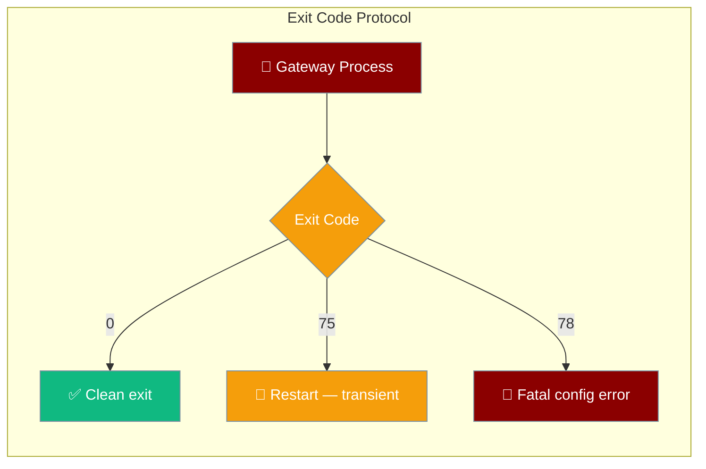

The `praisonai gateway` process uses structured exit codes so process supervisors (systemd, Kubernetes, s6) can decide whether to restart, wait, or alert.



## Quick Start

<Steps>
<Step title="Start the gateway normally">
```bash
praisonai gateway start --agents my_agents.yaml
```

The process exits with code `0` on clean shutdown, `75` on transient failure (supervisor should restart), and `78` on fatal config error (supervisor should alert, not restart).
</Step>

<Step title="Systemd service with correct restart policy">
```ini
[Unit]
Description=PraisonAI Gateway
After=network.target

[Service]
ExecStart=/usr/local/bin/praisonai gateway start --agents /etc/praisonai/agents.yaml
Restart=on-failure
RestartSec=5
# Restart on transient failure (75), but not on fatal config error (78)
RestartForceExitStatus=75
SuccessExitStatus=0

[Install]
WantedBy=multi-user.target
```
</Step>

<Step title="Kubernetes restart policy">
```yaml
apiVersion: v1
kind: Pod
spec:
  restartPolicy: OnFailure
  containers:
    - name: praisonai-gateway
      image: praisonai/gateway:latest
      command: ["praisonai", "gateway", "start", "--agents", "/etc/praisonai/agents.yaml"]
      lifecycle:
        postStart:
          exec:
            command: ["/bin/sh", "-c", "echo Gateway started"]
```

For exit code 78, set an alert in your monitoring system and do not auto-restart.
</Step>
</Steps>

---

## Exit Code Reference

| Name | Value | Meaning | Operator action |
|------|-------|---------|-----------------|
| `GATEWAY_OK_EXIT_CODE` | `0` | Clean, intentional exit | No action needed |
| `GATEWAY_RESTART_EXIT_CODE` | `75` (`EX_TEMPFAIL`) | Transient failure — restart is safe | Restart with backoff |
| `GATEWAY_FATAL_CONFIG_EXIT_CODE` | `78` (`EX_CONFIG`) | Fatal configuration error — restart will not help | Alert operator; fix config first |

Exit code `75` is the POSIX `EX_TEMPFAIL` — a widely-recognised signal to supervisors that a retry is appropriate. Exit code `78` is the POSIX `EX_CONFIG` — a fatal misconfiguration.

---

## When Each Code Is Raised

### `0` — Clean exit
Emitted when:
- `SIGTERM` / `SIGINT` received and graceful drain completes
- `praisonai gateway stop` is called
- The process exits normally at end of a finite run

### `75` — Restart intent
Emitted when:
- A transient infrastructure error occurs (database unreachable, relay disconnected)
- The gateway detects a need to reload (e.g. after `git pull` requires a full restart)
- A non-fatal runtime exception forces a clean restart attempt

### `78` — Fatal config error
Emitted when:
- `--agents` file is malformed or missing
- Required environment variables are absent at startup
- A `FatalConfigError` is raised anywhere in the startup path

---

## `FatalConfigError`

`FatalConfigError` is the Python exception that triggers exit code 78. Raise it in custom startup code to signal a misconfiguration that requires operator intervention.

```python
from praisonai.gateway import FatalConfigError

def load_custom_agents(path: str):
    if not os.path.exists(path):
        raise FatalConfigError(f"Agents file not found: {path}")
    ...
```

The gateway catches `FatalConfigError` at the top level, logs the message, and exits with code 78.

---

## Supervisor Configurations

### systemd

```ini
[Service]
ExecStart=praisonai gateway start --agents /etc/praisonai/agents.yaml
Restart=on-failure
RestartSec=5
RestartForceExitStatus=75
SuccessExitStatus=0 75
```

`RestartForceExitStatus=75` tells systemd to restart even when `Restart=on-failure` would not normally trigger (e.g. the process exits quickly). Exit code 78 is NOT in `RestartForceExitStatus`, so systemd will not restart on fatal config errors.

### Kubernetes

```yaml
spec:
  restartPolicy: OnFailure
  containers:
    - name: gateway
      image: praisonai/gateway:latest
      command: ["praisonai", "gateway", "start"]
      env:
        - name: PRAISONAI_AGENTS_FILE
          value: /config/agents.yaml
```

Add a liveness probe alert on exit code 78:

```yaml
livenessProbe:
  exec:
    command: ["test", "-f", "/tmp/gateway.ready"]
  initialDelaySeconds: 10
  periodSeconds: 30
```

### s6 / runit

```bash
#!/bin/sh
# /etc/services.d/praisonai-gateway/run
exec praisonai gateway start --agents /etc/praisonai/agents.yaml

# /etc/services.d/praisonai-gateway/finish
#!/bin/sh
# $1 = exit code
if [ "$1" -eq 78 ]; then
  echo "Fatal config error — alerting operator"
  touch /tmp/praisonai-config-error
  exit 125  # s6: do not restart
fi
```

---

## Best Practices

<AccordionGroup>
<Accordion title="Never treat exit code 78 as a transient failure">
Code 78 means the configuration is broken. Auto-restarting on 78 creates a restart loop that burns CPU without making progress. Always alert an operator first.
</Accordion>

<Accordion title="Add RestartSec to avoid restart storms">
When restarting on exit code 75, add at least 5 seconds between restarts to avoid hammering a degraded upstream.

```ini
RestartSec=5
StartLimitIntervalSec=60
StartLimitBurst=5
```
</Accordion>

<Accordion title="Use FatalConfigError for missing secrets">
At startup, validate that all required API keys and config values are present. Raise `FatalConfigError` immediately rather than letting the process crash mid-run.
</Accordion>

<Accordion title="Log the exit code in your monitoring system">
Route stdout/stderr to your log aggregator and alert on `exit_code=78` to catch config regressions in CI/CD pipelines.
</Accordion>
</AccordionGroup>

---

## Related

<CardGroup cols={2}>
<Card title="Bot Gateway" icon="server" href="/docs/features/bot-gateway">
Gateway concepts and startup
</Card>
<Card title="Gateway CLI" icon="terminal" href="/docs/features/gateway-cli">
All `praisonai gateway` subcommands
</Card>
<Card title="Gateway Scale-to-Zero" icon="circle-pause" href="/docs/features/gateway-scale-to-zero">
Idle detection and go_dormant
</Card>
<Card title="Gateway Relay Transport" icon="arrow-right-arrow-left" href="/docs/features/gateway-relay-transport">
Out-of-process relay transport
</Card>
</CardGroup>
