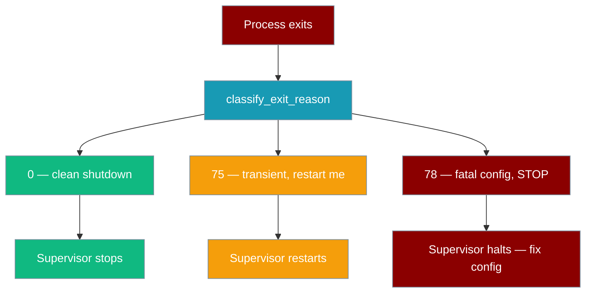

```python
from praisonaiagents.gateway import FatalConfigError

raise FatalConfigError("duplicate Telegram token across two bots")
```

Raising `FatalConfigError` from your startup hook tells systemd / Kubernetes to **stop restarting** the gateway immediately. Any other unhandled exception is treated as transient and maps to exit 75 — ask supervisor to restart.



## Quick Start

<Steps>

<Step title="systemd — prevent crash-loops on bad config">

Add `RestartPreventExitStatus=78` to your unit so systemd stops restarting when the gateway detects a fatal configuration error:

```ini
[Unit]
Description=PraisonAI Gateway
After=network.target

[Service]
ExecStart=/usr/local/bin/praisonai gateway start --config /etc/praisonai/gateway.yaml
Restart=on-failure
RestartPreventExitStatus=78
RestartSec=5

[Install]
WantedBy=multi-user.target
```

With this config: exit `0` stops the service normally, exit `75` triggers a restart, and exit `78` stops restarting until you fix the config and run `systemctl start`.

</Step>

<Step title="Kubernetes — avoid crash-loop back-off on fatal configs">

Set `restartPolicy: OnFailure` and use a `terminationMessagePolicy` so you can read the fatal error from `kubectl`:

```yaml
apiVersion: v1
kind: Pod
spec:
  restartPolicy: OnFailure
  containers:
    - name: gateway
      image: myregistry/praisonai-gateway:latest
      command: ["praisonai", "gateway", "start", "--config", "/config/gateway.yaml"]
      terminationMessagePolicy: FallbackToLogsOnError
      volumeMounts:
        - name: config
          mountPath: /config
  volumes:
    - name: config
      configMap:
        name: gateway-config
```

<Note>
Kubernetes `restartPolicy: OnFailure` restarts on any non-zero exit. To prevent crash-looping on exit `78`, wrap the entrypoint in a shell script that checks `$?` and converts `78` to `0` after logging the error, or use a `Job` instead of a `Pod`.
</Note>

</Step>

<Step title="s6 — stop supervisor on fatal config">

In an s6-overlay `finish` script, exit with code `125` to tell s6 not to restart the service:

```sh
#!/bin/sh
# /etc/s6-overlay/s6-rc.d/gateway/finish

EXIT_CODE=$1

if [ "$EXIT_CODE" -eq 78 ]; then
    echo "Gateway fatal config error — not restarting" >&2
    exit 125
fi

exit 0
```

s6 treats a `finish` exit of `125` as "do not restart this service".

</Step>

</Steps>

---

## The Contract

The classifier is a pure function — no side effects, no I/O. It maps any exception (or `None` for a clean run) to one of the three exit codes:

| Cause | Exit code | Meaning |
|---|---|---|
| `None` (clean run) | `0` | Clean shutdown |
| `KeyboardInterrupt` | `0` | Clean shutdown (Ctrl-C) |
| `SystemExit(None)` / `SystemExit(0)` | `0` | Explicit clean exit |
| `SystemExit(<int>)` | passes the int through | Caller-controlled code |
| `SystemExit(<non-int>)` | `75` | Treat as transient |
| `FatalConfigError` | `78` | Fatal — stop restarting |
| Any other exception | `75` | Transient — restart |

The constants map to POSIX `sysexits.h`:

| Constant | Value | POSIX name |
|---|---|---|
| `GATEWAY_OK_EXIT_CODE` | `0` | `EX_OK` |
| `GATEWAY_RESTART_EXIT_CODE` | `75` | `EX_TEMPFAIL` |
| `GATEWAY_FATAL_CONFIG_EXIT_CODE` | `78` | `EX_CONFIG` |

---

## `FatalConfigError` Usage

Raise `FatalConfigError` from your own startup hooks or custom validators to signal that the error is **permanent** and restarting will not help. The supervisor should stop and wait for operator intervention.

```python
from praisonaiagents.gateway import FatalConfigError

def my_startup_hook(config):
    tokens = [ch["token"] for ch in config.get("channels", {}).values()]
    if len(tokens) != len(set(tokens)):
        raise FatalConfigError("Duplicate bot token detected across channels")
```

Do **not** catch `FatalConfigError` in hook code — let it propagate so the gateway's exit-code classifier picks it up and returns `78` to the supervisor.

---

## `classify_exit_reason()` Usage

When you embed the gateway programmatically and want the same exit-code semantics in your own entry point:

```python
from praisonaiagents.gateway import classify_exit_reason

exc = None
try:
    result = gateway.start(config)
except BaseException as e:
    exc = e

exit_code = classify_exit_reason(exc)
raise SystemExit(exit_code)
```

Import path (canonical):

```python
from praisonaiagents.gateway import (
    GATEWAY_OK_EXIT_CODE,
    GATEWAY_RESTART_EXIT_CODE,
    GATEWAY_FATAL_CONFIG_EXIT_CODE,
    FatalConfigError,
    classify_exit_reason,
)
```

---

## Behaviour Changes (PR #2439)

The following conditions now exit with code `78` (fatal config). Before this PR they were silently ignored or returned exit `0`:

- **`--agents` file missing, unreadable, or malformed** — the gateway no longer starts with an empty agent set; it now exits `78` immediately.
- **`gateway.yaml` empty, no `agents` section, no `channels` section, or missing token** — fatal at startup.
- **`agents` section that is not a list of mappings** — e.g. `agents: ["bad"]` or `agents: {name: bad}` is now fatal.
- **Missing admission-control values** — invalid `max_concurrent_runs`, `queue_depth`, or `overflow_policy` is now fatal.
- **`pip install praisonai[api]` not done** — missing optional API dependencies now map to `78` (fatal config) instead of a silent return.

Additionally, `GatewayHandler.start()` now returns an `int` and the `serve_gateway` / `handle_gateway_command` wrappers propagate it. Before PR #2439, failures were swallowed and the CLI exited with `0`.

---

## Best Practices

<AccordionGroup>

<Accordion title="Set RestartPreventExitStatus=78 in systemd">
Always add `RestartPreventExitStatus=78` to every systemd unit that runs the gateway. Without it, systemd will restart indefinitely on bad config — burning resources and hiding the root error in logs.
</Accordion>

<Accordion title="Don't catch FatalConfigError in your bot hooks">
`FatalConfigError` is a sentinel for the process supervisor. Catching and swallowing it defeats the protocol. Let it propagate to the top-level entry point where `classify_exit_reason` will map it to exit `78`.
</Accordion>

<Accordion title="Pin a recent core to avoid the fallback path">
Both the wrapper CLI (`praisonai`) and `praisonai/runtime/__main__.py` ship a fallback definition of the constants and `FatalConfigError` for the window where users pin an older core. The canonical import is always `from praisonaiagents.gateway import …` — pin `praisonaiagents>=` the version that shipped PR #2439 to use the canonical path.
</Accordion>

<Accordion title="Use classify_exit_reason() to mirror gateway semantics in custom entry points">
If you embed the gateway in a larger process or wrap it in a custom launcher, call `classify_exit_reason(exc)` to get the same exit code the standalone CLI would have produced. This ensures your custom entry point is also supervisor-friendly.
</Accordion>

</AccordionGroup>

---

## Related

<CardGroup cols={2}>
<Card title="Gateway Overview" icon="broadcast-tower" href="/docs/features/gateway-overview">
  Architecture, quick start, and configuration reference
</Card>
<Card title="Gateway CLI" icon="tower-broadcast" href="/docs/features/gateway-cli">
  Command-line interface for starting and managing the gateway
</Card>
<Card title="Gateway Error Handling" icon="triangle-exclamation" href="/docs/features/gateway-error-handling">
  Unicode-safe reply sanitisation and bot-level error strategies
</Card>
<Card title="Channel Supervision" icon="heart-pulse" href="/docs/features/gateway-channel-supervision">
  Self-healing channels with operator pause/resume/reconnect controls
</Card>
</CardGroup>
