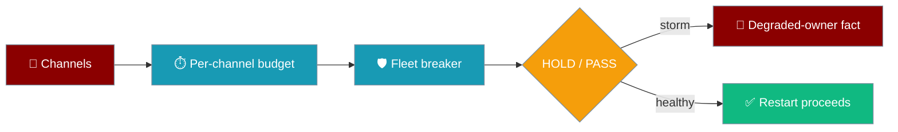
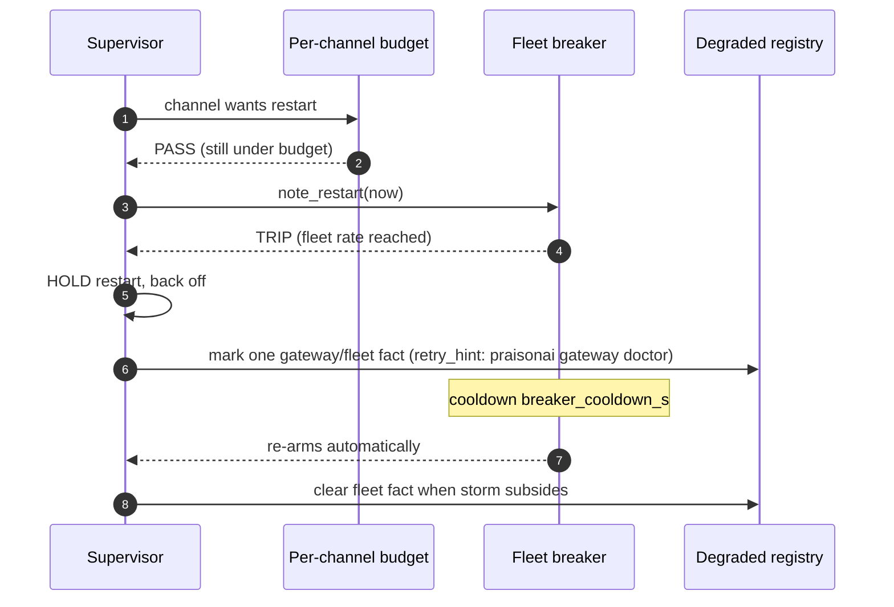

<Note>
The gateway now ships in the `praisonai-bot` package. `praisonai serve gateway` still works exactly as documented here; for a standalone install see [praisonai-bot Migration](/guides/praisonai-bot-migration).
</Note>


```python
from praisonaiagents import Agent

agent = Agent(name="Support", instructions="Help operators triage gateway health")
agent.start("Is the gateway holding channel restarts right now?")
```

The fleet breaker sits on top of the per-channel restart budget and trips one aggregate circuit when a systemic fault — a bad shared provider, a network partition, an org-wide expired token — makes every channel restart at once. Instead of a silent fleet-wide reconnect storm, restarts are held and a single operator-facing degraded fact appears with a next step.



## Quick Start

<Steps>

<Step title="Simple — nothing to change">

The breaker is on by default with sensible thresholds. Watch the new `fleet` block in health output:

```bash
praisonai gateway status --deep
```

```json
"fleet": {
  "breaker_tripped": false,
  "fleet_restarts_per_hour": 40,
  "failing_channels": 0,
  "total_channels": 3
}
```

`breaker_tripped: false` with `failing_channels: 0` means the fleet is healthy — no action needed.

</Step>

<Step title="Tune the thresholds">

Set any of the three thresholds under `gateway.health`. Tuning is optional; the defaults trip on a real storm.

```yaml
# gateway.yaml — tuning is optional; the defaults trip on a real storm.
gateway:
  health:
    fleet_restarts_per_hour: 40
    failing_channel_fraction: 0.5
    breaker_cooldown_s: 120
```

</Step>

</Steps>

---

## What "tripped" means

A tripped breaker means the gateway detected a fleet-wide storm and is now **holding** channel restarts to avoid feeding it — not that a single channel failed.



The breaker trips when **either** aggregate signal crosses its threshold within the trailing hour: the fleet restart rate reaches `fleet_restarts_per_hour`, or the fraction of failing channels reaches `failing_channel_fraction`. It stays tripped for `breaker_cooldown_s`, then re-arms on its own.

---

## Agent-centric quick start

Does it protect you out of the box? Yes — the defaults trip on a real storm, and the same doctor already knows what to say.

```yaml
# gateway.yaml — tuning is optional; the defaults trip on a real storm.
gateway:
  health:
    fleet_restarts_per_hour: 40
    failing_channel_fraction: 0.5
    breaker_cooldown_s: 120
```

```bash
# See whether the breaker is holding right now:
praisonai gateway status --deep

# If health() flags the fleet is degraded, the same doctor already knows what to say:
praisonai gateway doctor
```

When the breaker is tripped, the degraded registry carries one `gateway` / `fleet` fact. Its `retry_hint` points straight at the next command:

```json
{
  "owner_kind": "gateway",
  "owner_id": "fleet",
  "state": "stale",
  "reason": "channel crash-loop: 2/3 channels failing",
  "retry_hint": "praisonai gateway doctor"
}
```

The fact clears automatically once the storm subsides.

---

## Configuration Options

All three thresholds live under `gateway.health`. Values verified against `HealthMonitorConfig` (`praisonai_bot/gateway/health_monitor.py`) and `FleetSupervisionPolicy` (`praisonaiagents/gateway/protocols.py`).

| Key | Type | Default | Purpose |
|-----|------|---------|---------|
| `fleet_restarts_per_hour` | `int` | `40` | Aggregate rolling-window restart cap across the fleet. Clamped to `>= 1`. |
| `failing_channel_fraction` | `float` in `(0.0, 1.0]` | `0.5` | Trip when the failing-channel fraction crosses this. Clamped to `[0.01, 1.0]`. |
| `breaker_cooldown_s` | `int` (seconds) | `120` | Hold restarts for this long after the breaker trips; auto re-arms. Clamped to `>= 0`. |

The `fleet` block on `gateway status` health output carries the live state:

| Field | Meaning |
|-------|---------|
| `breaker_tripped` | Whether restarts are currently held. |
| `fleet_restarts_per_hour` | The configured aggregate restart cap. |
| `failing_channels` | Channels whose per-channel restart budget is exhausted. |
| `total_channels` | Total supervised channels. |

---

## Common Patterns

Trip earlier on a smaller fleet — lower the fraction so a couple of failing channels are enough:

```yaml
gateway:
  health:
    failing_channel_fraction: 0.34
```

Hold longer during a known-flaky upstream — extend the cooldown so the breaker does not re-arm into the same storm:

```yaml
gateway:
  health:
    breaker_cooldown_s: 600
```

---

## Best Practices

<AccordionGroup>
<Accordion title="Leave the defaults unless you see false trips">
`40` restarts/hour and `0.5` failing fraction trip on a genuine fleet-wide storm, not on one flaky channel. Change them only if your fleet size or upstream makes the defaults noisy.
</Accordion>

<Accordion title="Read the fleet block, not ten per-channel counters">
`breaker_tripped` plus `failing_channels` / `total_channels` is the single fleet-health signal. You never have to infer "the gateway is thrashing" from individual channel restart counts.
</Accordion>

<Accordion title="Follow the retry_hint">
The one degraded-owner fact points at `praisonai gateway doctor`. Run it to see what tripped rather than restarting channels by hand while the breaker is holding.
</Accordion>

<Accordion title="Let it re-arm on its own">
After `breaker_cooldown_s` the breaker clears its event window and re-arms automatically; the degraded fact clears when the storm subsides. Manual intervention is only needed to fix the underlying systemic fault.
</Accordion>
</AccordionGroup>

---

## Related

<CardGroup cols={2}>
  <Card title="Config Migration" icon="wrench" href="/features/gateway-config-migration">
    One-shot upgrade of an older gateway.yaml with `praisonai gateway doctor --fix`
  </Card>
  <Card title="Channel Supervision" icon="heart-pulse" href="/features/gateway-channel-supervision">
    Per-channel restart budgets and operator pause/resume/reconnect
  </Card>
</CardGroup>
