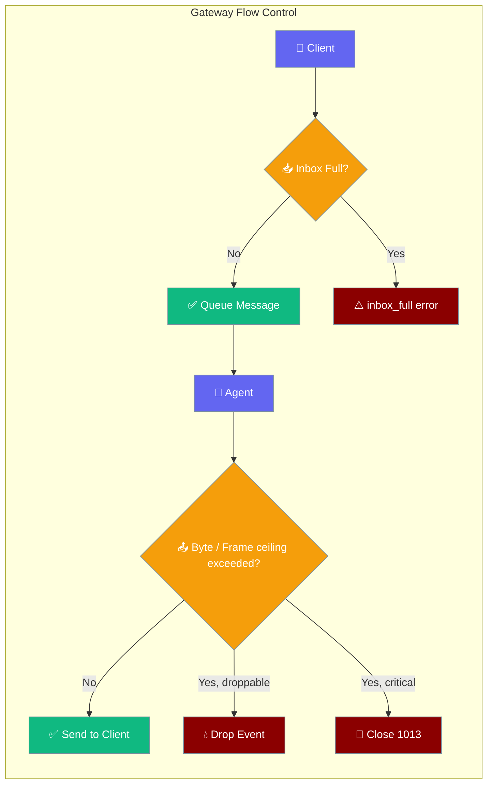
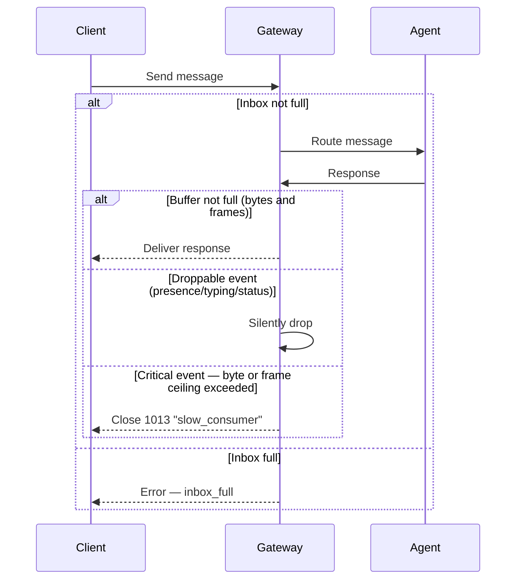

Flow control bounds per-session inboxes and disconnects slow consumers so a single misbehaving client can't degrade the whole gateway.

```python
from praisonaiagents import Agent, GatewayConfig

agent = Agent(
    name="assistant",
    instructions="You help users with tasks",
)
# Flow control is enabled by default — 256-message inbox, 1 MB buffer ceiling
```



## Quick Start

<Steps>

<Step title="Defaults work out of the box">
Flow control is enabled by default — no configuration needed. Every session gets a 256-message inbox and the gateway disconnects clients whose transport buffer exceeds 1 MB or whose outbound frame queue exceeds 1000 frames.

```python
from praisonaiagents import Agent, GatewayConfig

agent = Agent(
    name="assistant",
    instructions="You help users with tasks"
)
```
</Step>

<Step title="Tune the limits">
Adjust thresholds to match your workload.

```python
from praisonaiagents import Agent, GatewayConfig, SessionConfig

config = GatewayConfig(
    max_buffered_bytes=4 * 1024 * 1024,
    max_queued_frames=2000,            # NEW: frame-count ceiling
    session_config=SessionConfig(
        max_inbox=512,
    )
)

agent = Agent(
    name="assistant",
    instructions="You help users with tasks"
)
```
</Step>

</Steps>

---

## How It Works

Two checks protect the gateway from overload:



A frame is rejected when *either* ceiling would be exceeded, or a single frame already exceeds `max_buffered_bytes` on its own.

| Event type | When buffer is full |
|------------|---------------------|
| `presence` | Silently dropped |
| `typing` | Silently dropped |
| `status` | Silently dropped |
| All other types | Connection closed with code `1013` |

---

## Configuration Options

| Option | Type | Default | Description |
|--------|------|---------|-------------|
| `max_inbox` | `int` | `256` | Maximum queued messages per session. `0` = unlimited. Negative values raise `ValueError`. |
| `max_buffered_bytes` | `int` | `1048576` | Maximum buffered bytes before a slow consumer is disconnected. `0` = disable the byte ceiling. Negative values raise `ValueError`. |
| `max_queued_frames` | `int` | `1000` | Maximum queued outbound frames per client. `0` = unlimited frame count (byte ceiling still applies). Negative values raise `ValueError`. |

`max_inbox` is set on `SessionConfig`; `max_buffered_bytes` and `max_queued_frames` are set on `GatewayConfig`.

```python
from praisonaiagents import GatewayConfig, SessionConfig

config = GatewayConfig(
    max_buffered_bytes=1024 * 1024,
    max_queued_frames=1000,
    session_config=SessionConfig(
        max_inbox=256,
    )
)
```

These options are also available in `gateway.yaml`:

```yaml
gateway:
  max_buffered_bytes: 1048576
  max_queued_frames: 1000      # frame-count ceiling
  session_config:
    max_inbox: 256
```

---

## Client-Side Error Contract

When the inbox is full, the gateway sends this JSON frame before rejecting the message:

```json
{
  "type": "error",
  "code": "inbox_full",
  "message": "Message queue is full. Please wait for current messages to be processed."
}
```

When either transport ceiling is exceeded for a critical event, the gateway closes the WebSocket with:

- **Code:** `1013` (Try Again Later)
- **Reason:** `"slow_consumer"` (the value of `GatewayCloseCode.SLOW_CONSUMER`)

Use the typed enum from Python clients:

```python
from praisonaiagents.gateway import GatewayCloseCode

if close.reason == GatewayCloseCode.SLOW_CONSUMER.value:
    # reconnect and resume from the last known message
    ...
```

Clients should reconnect and resume from the last known message. The gateway preserves session state during the `resume_window` (default 24 h), so conversation context is not lost.

---

## Common Patterns

**Chat-heavy workloads** — Tighten the inbox to shed load early and fail fast:

```python
from praisonaiagents import GatewayConfig, SessionConfig

config = GatewayConfig(
    max_buffered_bytes=512 * 1024,
    session_config=SessionConfig(max_inbox=64)
)
```

**Long-running tools** — Loosen both limits to avoid spurious disconnections during slow AI responses:

```python
from praisonaiagents import GatewayConfig, SessionConfig

config = GatewayConfig(
    max_buffered_bytes=8 * 1024 * 1024,
    session_config=SessionConfig(max_inbox=1024)
)
```

**Stream-heavy workloads** — Lower `max_queued_frames` to shed load on backpressure earlier:

```python
from praisonaiagents import GatewayConfig

config = GatewayConfig(
    max_buffered_bytes=4 * 1024 * 1024,
    max_queued_frames=200,           # eager eviction for chatty streams
)
```

**Local development** — Disable slow-consumer checks so network hiccups don't interrupt debugging:

```python
from praisonaiagents import GatewayConfig, SessionConfig

config = GatewayConfig(
    max_buffered_bytes=0,
    session_config=SessionConfig(max_inbox=0)
)
```

---

## Best Practices

<AccordionGroup>
  <Accordion title="Never set max_inbox=0 in production">
    An unlimited inbox (`max_inbox=0`) lets a slow or malicious client queue messages indefinitely, eventually exhausting gateway memory. Reserve it for local testing only.
  </Accordion>

  <Accordion title="Size max_buffered_bytes against your payload">
    A typical chat message is a few kilobytes. Set `max_buffered_bytes` to at least 10× your largest expected event payload. For file-transfer or streaming use cases, increase to 4–8 MB.
  </Accordion>

  <Accordion title="Handle inbox_full on the client side">
    When your client receives `{"code": "inbox_full"}`, pause new sends and retry with exponential backoff (e.g., 1 s → 2 s → 4 s). Do not flood the gateway with immediate retries.
  </Accordion>

  <Accordion title="React to a 1013 slow-consumer close">
    On receiving WebSocket close code `1013` with reason `"slow_consumer"`, reconnect after a short delay and replay any messages that were in-flight. The gateway preserves session state during the `resume_window` (default 24 h), so conversation context is not lost.
  </Accordion>

  <Accordion title="Disable one ceiling without the other">
    Set `max_queued_frames=0` to bound only by bytes (good for large but infrequent payloads); set `max_buffered_bytes=0` to bound only by frame count.
  </Accordion>
</AccordionGroup>

---

## Related

<Note>
Flow control bounds **outbound** send throughput and per-session inbox depth. For bounding **inbound** concurrent agent runs across all users, see [Admission Control](/docs/features/gateway-admission-control).
</Note>

<CardGroup cols={2}>
  <Card title="Gateway Admission Control" icon="shield-check" href="/docs/features/gateway-admission-control">
    Bound concurrent inbound agent runs with a fair queue and overflow policy
  </Card>
  <Card title="Gateway" icon="tower-broadcast" href="/docs/features/gateway">
    Full gateway configuration and YAML reference
  </Card>
  <Card title="Gateway Error Handling" icon="triangle-alert" href="/docs/features/gateway-error-handling">
    Error handling patterns for the gateway
  </Card>
</CardGroup>
