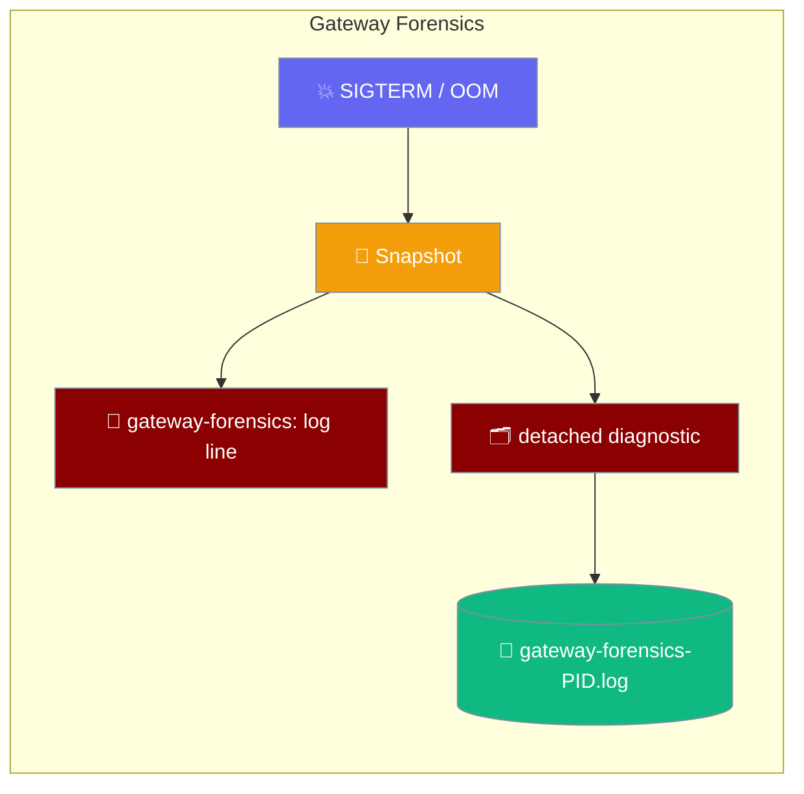
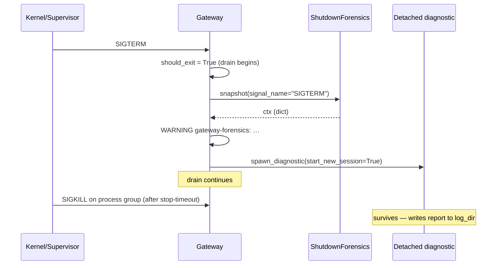

<Note>
The gateway now ships in the `praisonai-bot` package. `praisonai serve gateway` still works exactly as documented here; for a standalone install see [praisonai-bot Migration](/docs/guides/praisonai-bot-migration).
</Note>

When the gateway dies unexpectedly, forensics writes one log line and one diagnostic file so the next boot can tell you *why*.

```python
from praisonaiagents import Agent
from praisonai.bots import BotOS

agent = Agent(name="Support", instructions="Help users on chat channels.")

BotOS(agent=agent, platforms=["telegram"]).start()
```

The user keeps chatting until SIGTERM or OOM; forensics captures a snapshot line and a detached diagnostic file for the next operator review.



## Quick Start

<Steps>
<Step title="Default behaviour — nothing to configure">

Forensics is **on by default**. Start the gateway normally:

```bash
praisonai gateway start --config gateway.yaml
```

The gateway automatically creates `~/.praisonai/gateway/forensics/` at startup and registers signal handlers. No extra steps needed.

</Step>

<Step title="On the next crash, check the log line">

After a shutdown or crash, search your logs for the `gateway-forensics:` marker:

```text
WARNING  gateway-forensics: signal=SIGTERM pid=1234 ppid=1 supervised=yes loadavg_1m=0.50 traced=no maxrss_kb=99000
```

This single line tells you the signal, whether the process was supervised, system load at crash time, and peak memory use.

</Step>

<Step title="Read the detached diagnostic file">

The gateway also writes a full diagnostic report that survives a `SIGKILL` of the process group (started with `start_new_session=True`):

```bash
ls ~/.praisonai/gateway/forensics/
# gateway-forensics-1234.log

cat ~/.praisonai/gateway/forensics/gateway-forensics-1234.log
# # gateway forensics ctx: {...}
# ## process tree
# ...
# ## load
# 0.50 0.40 0.30 2/123 4567
# ## recent kernel OOM/killed
# [Mon Jun 30 ...] Killed process 1234 (python) ...
```

</Step>
</Steps>

---

## How It Works



The gateway sets `should_exit = True` **first**, so draining always begins even if the forensic snapshot takes time under memory pressure. The snapshot and diagnostic are fire-and-forget — they never gate the drain.

### What ends up in the log line

| Key | Source | Meaning |
|-----|--------|---------|
| `signal` | passed by handler | `SIGTERM` or `SIGINT` |
| `pid` | `os.getpid()` | Gateway PID |
| `ppid` | `os.getppid()` | Parent PID; `1` means reparented to init |
| `supervised` | `is_supervised(ppid, $INVOCATION_ID)` | `yes` when systemd or container init |
| `loadavg_1m` | `os.getloadavg()[0]` | 1-minute load average |
| `traced` | `/proc/self/status` TracerPid | `yes` if a debugger was attached |
| `maxrss_kb` | `getrusage(RUSAGE_SELF).ru_maxrss` | Max RSS in kB |

Any field that can't be read is silently omitted from the line.

### What ends up in the diagnostic file

| Section | Source |
|---------|--------|
| `# gateway forensics ctx:` | The snapshot dict |
| `## process tree` | `ps -o pid,ppid,stat,rss,etime,cmd --ppid 1` |
| `## load` | `/proc/loadavg` |
| `## recent kernel OOM/killed` | `dmesg | grep -iE 'killed process|out of memory|oom' | tail -n 20` |

---

## Configuration Options

```yaml
# gateway.yaml
gateway:
  forensics:
    enabled: true                                       # default true
    diagnostic_dir: ~/.praisonai/gateway/forensics      # default
    stop_timeout: 90                                    # optional; only used for the startup warning
```

| Key | Type | Default | Description |
|-----|------|---------|-------------|
| `gateway.forensics.enabled` | `bool` (or `"true"`/`"false"` string) | `true` | Turn shutdown forensics on/off. String values from env-substituted YAML are honoured. |
| `gateway.forensics.diagnostic_dir` | `str` | `~/.praisonai/gateway/forensics` | Where detached `gateway-forensics-<pid>.log` files are written. The directory is created **at startup** (bounded 2s), not on the signal path. |
| `gateway.forensics.stop_timeout` | `float` (seconds) | `None` | Your supervisor's configured stop-timeout. Used only by the startup warning to detect mid-drain SIGKILL risk. |

**Environment variable:**

| Var | Equivalent | Default |
|-----|-----------|---------|
| `PRAISONAI_STOP_TIMEOUT` | `gateway.forensics.stop_timeout` | unset |

### The startup warning

If `stop_timeout` (from config or `PRAISONAI_STOP_TIMEOUT`) is less than `drain_timeout + 30s`, the gateway logs once at startup:

```text
WARNING  Supervisor stop-timeout (40s) < drain_timeout (30s) + headroom; gateway may be killed mid-drain with no explanation.
```

To silence it: raise your supervisor's stop-timeout to at least `drain_timeout + 30s`, or set `gateway.forensics.stop_timeout` to match your real supervisor config.

### Disabling

```yaml
gateway:
  forensics:
    enabled: false
```

Set `enabled: "false"` when substituting from an environment variable. The log-line snapshot is suppressed too — there is no separate switch.

---

## Common Patterns

### systemd unit

```ini
# /etc/systemd/system/praisonai-gateway.service
[Service]
TimeoutStopSec=120
Environment=PRAISONAI_STOP_TIMEOUT=120
ExecStart=praisonai gateway start --config /etc/praisonai/gateway.yaml
```

Set `TimeoutStopSec` to at least `drain_timeout + 30s`. Export `PRAISONAI_STOP_TIMEOUT` so the startup warning matches reality.

### Kubernetes

```yaml
spec:
  terminationGracePeriodSeconds: 120
  containers:
    - name: gateway
      env:
        - name: PRAISONAI_STOP_TIMEOUT
          value: "120"
      volumeMounts:
        - name: forensics
          mountPath: /home/app/.praisonai/gateway/forensics
  volumes:
    - name: forensics
      persistentVolumeClaim:
        claimName: gateway-forensics-pvc
```

Mount a persistent volume at `diagnostic_dir` so reports survive pod termination.

### Docker (foreground)

```bash
docker run \
  -v /host/forensics:/root/.praisonai/gateway/forensics \
  praisonai gateway start --config /config/gateway.yaml
```

Bind-mount `diagnostic_dir` onto the host for inspection after container exit.

---

## Programmatic Use

Operators wiring custom supervision can use the pure helpers and the protocol directly:

```python
from praisonai.gateway import (
    ShutdownForensicsProtocol,
    format_forensics_for_log,
    is_supervised,
    drain_timeout_has_headroom,
)

assert is_supervised(ppid=1, invocation_id=None) is True
assert drain_timeout_has_headroom(stop_timeout_s=90, drain_timeout_s=30) is True

class MyForensics:
    def snapshot(self, signal_name=None): ...
    def spawn_diagnostic(self, ctx, log_dir): ...

assert isinstance(MyForensics(), ShutdownForensicsProtocol)
```

`format_forensics_for_log(ctx)` renders a snapshot dict as a single log line prefixed with `gateway-forensics:`. Grep this marker to wire restart-cause dashboards.

---

## Best Practices

<AccordionGroup>
<Accordion title="Leave forensics on">
The snapshot is &lt;10ms and never blocks asyncio teardown. The cost of being wrong about a future crash is much higher than the cost of one log line per shutdown.
</Accordion>

<Accordion title="Match stop_timeout to your supervisor">
The startup warning is the only way to learn at boot that your supervisor would SIGKILL you mid-drain. Set `gateway.forensics.stop_timeout` or `PRAISONAI_STOP_TIMEOUT` to match your real supervisor config so the check fires when it matters.
</Accordion>

<Accordion title="Persist diagnostic_dir">
A tmpfs or container-local dir loses the report when the container dies. Mount a host path or PVC so diagnostic files are available after restart.
</Accordion>

<Accordion title="Grep gateway-forensics: in your log scraper">
The log marker is stable, single-line, and key=value. Wire it into your log aggregator for restart-cause dashboards:

```bash
grep "gateway-forensics:" /var/log/praisonai/gateway.log
```
</Accordion>

<Accordion title="Don't rely only on the diagnostic file for fast crashes">
The detached subprocess writes asynchronously. On an instant SIGKILL of the whole group there may not be enough time. The single log line is your reliable signal — the diagnostic file provides additional detail when time permits.
</Accordion>
</AccordionGroup>

---

## Related

<CardGroup cols={2}>
  <Card title="Gateway Overview" icon="broadcast-tower" href="/docs/features/gateway-overview">
    Architecture and Quick Start for the gateway server
  </Card>
  <Card title="Drain Trigger" icon="water" href="/docs/features/gateway-drain-trigger">
    Control graceful shutdown drain behaviour
  </Card>
  <Card title="Scale to Zero" icon="moon" href="/docs/features/gateway-scale-to-zero">
    Suspend the gateway when idle — pay only for active time
  </Card>
  <Card title="Error Handling" icon="shield-check" href="/docs/features/gateway-error-handling">
    Unicode-safe error handling for gateway bot replies
  </Card>
  <Card title="Tracing Hook" icon="route" href="/docs/features/gateway-tracing-hook">
    Carry the same correlation id onto per-stage spans in your tracer
  </Card>
</CardGroup>
