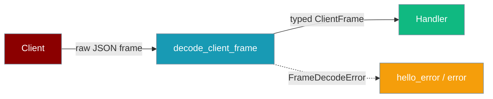
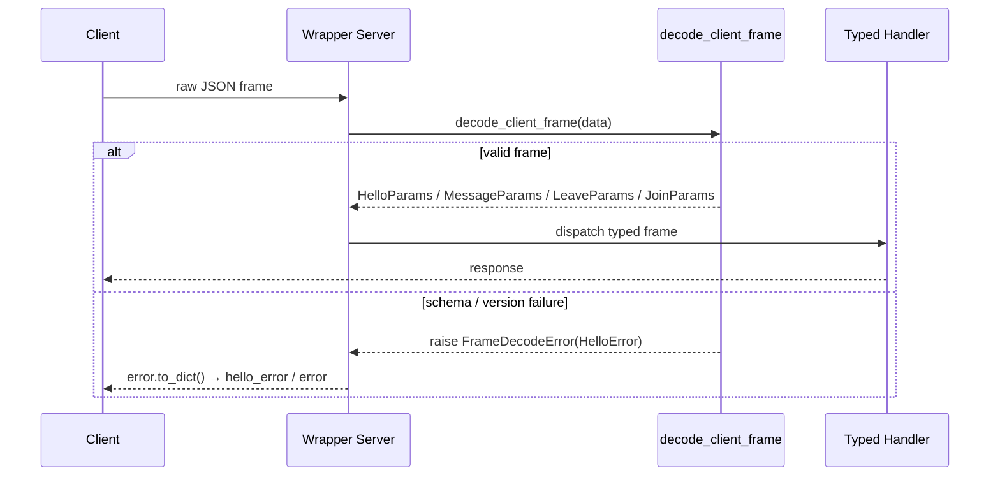

<Note>
The gateway ships in the `praisonai-bot` package. `praisonai serve gateway` works exactly as documented here; for a standalone install see [praisonai-bot Migration](/docs/guides/praisonai-bot-migration).
</Note>

```python
from praisonaiagents import Agent

agent = Agent(name="gateway-agent", instructions="Handle validated inbound gateway frames.")
agent.start("Process a client message that arrived over the gateway wire contract.")
```

`decode_client_frame` is the single validating decode step at the WebSocket boundary. Instead of each handler hand-parsing `data.get(...)`, you decode a raw JSON frame once into a typed, discriminated `ClientFrame` — or get a `FrameDecodeError` carrying a structured `HelloError` that is safe to serialise straight back to the client.

```python
from praisonaiagents.gateway import (
    decode_client_frame,
    FrameDecodeError,
    HelloParams,
    MessageParams,
    LeaveParams,
    JoinParams,
)

frame = decode_client_frame({
    "type": "message",
    "content": "Book the meeting for 3pm.",
    "session_id": "abc-123",
})

assert isinstance(frame, MessageParams)
print(frame.content)      # "Book the meeting for 3pm."
print(frame.session_id)   # "abc-123"
```

The client sends a raw JSON frame; `decode_client_frame` validates it once and dispatches on `type` to a typed handler, or rejects it with a structured error.



## Quick Start

<Steps>

<Step title="Decode once at the boundary">

Swap per-handler `data.get(...)` for a single validating decode. Every advertised inbound method — `hello`, `message`, `leave`, and the legacy `join` — is decoded here into an already-typed object.

```python
import json
from praisonaiagents.gateway import (
    decode_client_frame,
    FrameDecodeError,
    HelloParams,
    MessageParams,
    LeaveParams,
    JoinParams,
)

async def on_ws_frame(raw_bytes, ws, agent, session_store):
    try:
        frame = decode_client_frame(json.loads(raw_bytes))
    except FrameDecodeError as e:
        await ws.send_json(e.error.to_dict())   # structured hello_error / error
        return

    if isinstance(frame, HelloParams):
        ...  # negotiate protocol — see Handshake Protocol
    elif isinstance(frame, MessageParams):
        await agent.handle_message(frame.content, session_id=frame.session_id)
    elif isinstance(frame, LeaveParams):
        await session_store.close(frame.session_id, reason=frame.reason)
    elif isinstance(frame, JoinParams):
        ...  # legacy path
```

</Step>

<Step title="Reject invalid frames deterministically">

When a raw frame is not a mapping, carries an unknown or missing `type`, or fails per-frame validation, `decode_client_frame` raises `FrameDecodeError`. The attached `HelloError` maps straight onto the outbound `hello_error` (or `error`) wire frame via `error.to_dict()`.

```python
import json
from praisonaiagents.gateway import decode_client_frame, FrameDecodeError

try:
    decode_client_frame({"type": "message", "content": ""})   # empty content is rejected
except FrameDecodeError as e:
    print(e.error.code)        # ConnectErrorCode.CONFIGURATION_ERROR
    print(e.error.next_step)   # ConnectRecoveryStep.DO_NOT_RETRY
    wire_frame = e.error.to_dict()
    print(json.dumps(wire_frame))   # ready to send back to the client
```

</Step>

</Steps>

## Inbound Frames

`decode_client_frame` returns one of four typed frames, discriminated on the wire `type` field:

```python
ClientFrame = Union[HelloParams, MessageParams, LeaveParams, JoinParams]
```

`HelloParams` is documented on the [Gateway Handshake Protocol](/docs/features/gateway-handshake-protocol) page (the `hello` half of the same union). The codec adds two conveniences to the hello path: it tolerates both the flat `protocol_min` / `protocol_max` shape **and** the legacy nested `protocol: {min, max}` shape, and it accepts a `capabilities` / `caps` alias.

### MessageParams

The validated `message` frame — previously hand-parsed per handler.

| Field | Type | Default | Description |
|-------|------|---------|-------------|
| `content` | `Union[str, Dict[str, Any]]` | required | The message body — text, or a structured payload |
| `session_id` | `Optional[str]` | `None` | Optional session the message belongs to |
| `message_id` | `Optional[str]` | `None` | Optional client-supplied idempotency / correlation id |
| `metadata` | `Dict[str, Any]` | `{}` | Optional additional message metadata |
| `type` | `str` | `"message"` | Wire-type discriminant (set automatically) |

<Note>
`content` is required and also accepts the legacy `text` alias. Empty-string content is rejected, and `content` must be a `str` or `dict`. Non-dict `metadata` is silently coerced to `{}`.
</Note>

```json
{
  "type": "message",
  "content": "Book the meeting for 3pm.",
  "session_id": "abc-123",
  "message_id": "client-msg-001",
  "metadata": {"user_id": "alice"}
}
```

### LeaveParams

The validated `leave` frame.

| Field | Type | Default | Description |
|-------|------|---------|-------------|
| `session_id` | `Optional[str]` | `None` | Optional session the client is leaving |
| `reason` | `Optional[str]` | `None` | Optional human-readable reason (display / logging only) |
| `type` | `str` | `"leave"` | Wire-type discriminant (set automatically) |

```json
{"type": "leave", "session_id": "abc-123", "reason": "user closed tab"}
```

### JoinParams

The legacy `join` handshake. New clients should prefer `hello`, but the codec keeps `join` in the same single validating decode step so the wrapper can share validation.

| Field | Type | Default | Description |
|-------|------|---------|-------------|
| `agent_id` | `str` | required | The agent to connect to |
| `min_version` | `int` | `1` (`MIN_CLIENT_PROTOCOL_VERSION`) | Minimum protocol version the client supports |
| `max_version` | `int` | `1` (`GATEWAY_PROTOCOL_VERSION`) | Maximum protocol version the client supports |
| `session_id` | `Optional[str]` | `None` | Optional session to resume |
| `type` | `str` | `"join"` | Wire-type discriminant (set automatically) |

<Warning>
`agent_id` is required and must be a non-empty string. An inverted version range (`min_version > max_version`) is rejected with a `FrameDecodeError` carrying `PROTOCOL_UNSUPPORTED` / `UPGRADE_CLIENT`.
</Warning>

```json
{"type": "join", "agent_id": "assistant", "min_version": 1, "max_version": 1}
```

## How It Works

Field coercion and validation happen once, at the WebSocket boundary. Handlers receive already-typed objects; the transport gets a deterministic rejection.



Every rejection returns a `FrameDecodeError` whose `.error` is a `HelloError` with:

- `code` — `ConnectErrorCode.CONFIGURATION_ERROR` for a schema failure, or `ConnectErrorCode.PROTOCOL_UNSUPPORTED` for a version-range failure
- `next_step` — `ConnectRecoveryStep.DO_NOT_RETRY` for schema failures, or `UPGRADE_CLIENT` for version failures

The `HelloError` fields and full recovery-step vocabulary are documented on the [Gateway Handshake Protocol](/docs/features/gateway-handshake-protocol) and [Gateway Error Handling](/docs/features/gateway-error-handling) pages — `error.to_dict()` produces the same wire shape used there.

## Best Practices

<AccordionGroup>

<Accordion title="Decode once at the boundary">
Call `decode_client_frame` in one place — the WebSocket receive loop — and pass typed frames to handlers. Validation and coercion happen exactly once, so downstream code never re-checks types or defaults.
</Accordion>

<Accordion title="Return the attached HelloError on FrameDecodeError">
On `FrameDecodeError`, send `e.error.to_dict()` straight back to the client. It is a safe, structured `hello_error` / `error` frame carrying `(code, next_step, retry_after_seconds)` — no per-handler `try/except` or ad-hoc `isinstance` checks needed.
</Accordion>

<Accordion title="Prefer decode_client_frame over per-handler data.get(...)">
Hand-parsing each frame with `data.get(...)` drifts from the wire contract and duplicates validation. `decode_client_frame` is the single source of truth: it decodes every advertised inbound method plus the legacy `join` in one validating step.
</Accordion>

</AccordionGroup>

## Related

<CardGroup cols={2}>

<Card title="Gateway Handshake Protocol" icon="handshake" href="/docs/features/gateway-handshake-protocol">
The `hello` half of the same union — `HelloParams`, `HelloResult`, and `HelloError`.
</Card>

<Card title="Gateway Error Handling" icon="triangle-exclamation" href="/docs/features/gateway-error-handling">
The `code` / `next_step` recovery-step vocabulary carried by `FrameDecodeError`.
</Card>

<Card title="Session Protocol" icon="arrows-rotate" href="/docs/features/session-protocol">
How `session_id` on message and leave frames maps to gateway sessions.
</Card>

<Card title="Gateway Overview" icon="server" href="/docs/features/gateway-overview">
The full gateway architecture the frame codec plugs into.
</Card>

</CardGroup>
