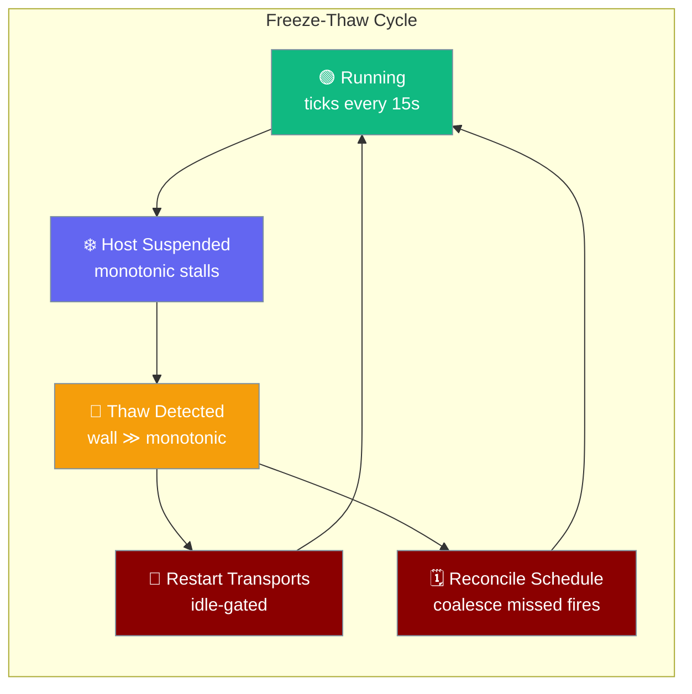
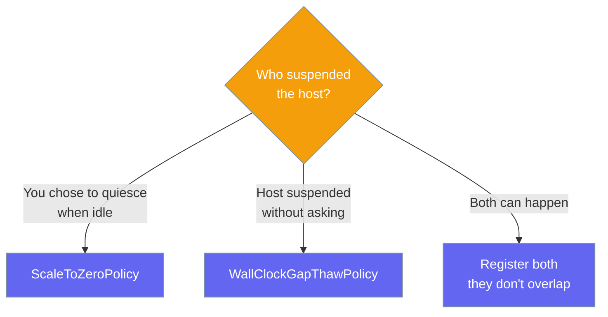

```python
from praisonaiagents import Agent
from praisonai.bots import BotOS, Bot
from praisonaiagents.gateway import WallClockGapThawPolicy

agent = Agent(name="assistant", instructions="Be helpful.")

botos = BotOS(
    bots=[Bot("telegram", agent=agent)],
    thaw_policy=WallClockGapThawPolicy(),  # sensible defaults
)
botos.run()
```

The gateway detects when the host was frozen (laptop sleep, VM pause / snapshot / live-migrate) and drives recovery on thaw — restart channel sockets when idle, refresh presence, and coalesce missed cron fires.



## Quick Start

<Steps>

<Step title="Default — sensible thresholds">

```python
from praisonaiagents import Agent
from praisonai.bots import BotOS, Bot
from praisonaiagents.gateway import WallClockGapThawPolicy

agent = Agent(name="assistant", instructions="Help users")

botos = BotOS(
    bots=[Bot("telegram", agent=agent)],
    thaw_policy=WallClockGapThawPolicy(),
)
botos.run()
```

The gateway compares wall-clock and monotonic time on every run-loop tick. A wall-clock jump that runs far ahead of monotonic elapsed time is a freeze — recovery fires on the next tick after resume.

</Step>

<Step title="Tuned thresholds — slower loop, higher tolerance">

```python
from praisonaiagents import Agent
from praisonai.bots import BotOS, Bot
from praisonaiagents.gateway import WallClockGapThawPolicy

agent = Agent(name="assistant", instructions="Help users")

thaw_policy = WallClockGapThawPolicy(
    tick_interval_s=30.0,
    gap_threshold_s=120.0,
)

botos = BotOS(
    bots=[Bot("telegram", agent=agent)],
    thaw_policy=thaw_policy,
)
botos.run()
```

Match `tick_interval_s` to your run-loop cadence and set `gap_threshold_s` above your worst legitimate stall.

</Step>

</Steps>

---

## How It Works

```mermaid
sequenceDiagram
    participant Loop as RunLoop
    participant Policy as WallClockGapThawPolicy
    participant Decision as ThawDecision

    Loop->>Policy: observe(monotonic_now, wall_now)
    Note over Policy: First tick seeds baseline only
    Policy-->>Decision: suspended=False
    Note over Loop,Policy: ... host suspends ...
    Loop->>Policy: observe(monotonic_now, wall_now)
    Note over Policy: wall_delta − monotonic_delta > gap_threshold_s<br/>AND monotonic_delta < tick_interval_s
    Policy-->>Decision: suspended=True, gap_seconds≈divergence
    Decision-->>Loop: restart_transports=True, reconcile_schedule=True
```

On Linux `CLOCK_MONOTONIC` does not advance while the host is suspended, so wall-clock running far ahead of monotonic is a positive signature of a freeze the process could not otherwise observe.

**Detection rule** — a gap is reported only when both are true:

| Condition | Meaning |
|-----------|---------|
| `wall_delta − monotonic_delta > gap_threshold_s` | Wall-clock ran ahead of the process's own elapsed time |
| `monotonic_delta < tick_interval_s` | Monotonic actually stalled — the process was frozen, not just late |

The second condition rejects the NTP / manual-clock-step false positive: if monotonic advanced a full tick or more, the process was alive and no recovery fires.

---

## Choosing between Freeze-Thaw and Scale-to-Zero

Freeze-Thaw handles the *involuntary* suspend; Scale-to-Zero handles the *intentional* one.



| Situation | Use |
|-----------|-----|
| You **choose** to quiesce the gateway when idle (dev laptop, cheap Fly.io deploy) | `ScaleToZeroPolicy` |
| The host was suspended **without asking you** (laptop lid closed, VM live-migrated) | `WallClockGapThawPolicy` |
| Both can happen | Register both — they don't overlap; one covers the graceful path, the other covers the involuntary path |

---

## Configuration Options

### `WallClockGapThawPolicy` constructor

```python
from praisonaiagents.gateway import WallClockGapThawPolicy

policy = WallClockGapThawPolicy(
    tick_interval_s=15.0,
    gap_threshold_s=60.0,
    enabled=True,
)
```

| Option | Type | Default | Description |
|--------|------|---------|-------------|
| `tick_interval_s` | `float` | `15.0` | How often the run-loop is expected to call `observe()`. Must be `> 0` — raises `ValueError`. Used to decide whether monotonic "stalled" between two ticks. |
| `gap_threshold_s` | `float` | `60.0` | Minimum divergence (wall-delta − monotonic-delta) before a gap counts as a real host suspend. Must be `> 0` — raises `ValueError`. Small NTP jitter and scheduler slack stay below this. |
| `enabled` | `bool` | `True` | When `False`, `observe()` always returns `ThawDecision(suspended=False)` — a clean disable path with no code removal. |

### `ThawDecision` — result of every `observe()` call

`@dataclass(frozen=True)` — assigning to a field raises.

| Field | Type | Default | Meaning |
|-------|------|---------|---------|
| `suspended` | `bool` | (required) | `True` if an involuntary host-suspend gap was detected since the previous observation. |
| `gap_seconds` | `float` | `0.0` | Estimated duration the host was frozen. `0.0` when `suspended=False`. |
| `restart_transports` | `bool` | `False` | Wrapper should re-probe / restart outbound channel sockets (idle-gated) because they may be silently half-dead after the freeze. |
| `reconcile_schedule` | `bool` | `False` | Wrapper should coalesce missed cron fires against the gap instead of letting wall-clock catch-up storm on resume. |

### `ThawPolicyProtocol` — custom detectors

`@runtime_checkable` protocol with a single method. Implement your own detector and pass it wherever a `ThawPolicyProtocol` is accepted — `isinstance(policy, ThawPolicyProtocol)` succeeds without inheritance.

```python
def observe(self, *, monotonic_now: float, wall_now: float) -> ThawDecision: ...
```

### Imports

```python
from praisonaiagents.gateway import (
    ThawDecision,
    ThawPolicyProtocol,
    WallClockGapThawPolicy,
)
```

<Note>
These names export from `praisonaiagents.gateway`. Top-level `praisonaiagents` does not re-export them. `BotOS` itself imports from `praisonai.bots`.
</Note>

---

## Common Patterns

### Disable in tests

```python
from praisonaiagents.gateway import WallClockGapThawPolicy

policy = WallClockGapThawPolicy(enabled=False)
# observe() always returns ThawDecision(suspended=False), even for a 2400s wall jump
```

Use `enabled=False` to keep the wiring in place while turning detection off — no code removal.

### Custom detector implementing `ThawPolicyProtocol`

```python
from pathlib import Path
from praisonaiagents.gateway import ThawDecision, WallClockGapThawPolicy


class WakeCountThawPolicy:
    """Also consult /sys/power/wakeup_count on Linux for a second signal."""

    def __init__(self):
        self._base = WallClockGapThawPolicy()

    def observe(self, *, monotonic_now: float, wall_now: float) -> ThawDecision:
        decision = self._base.observe(
            monotonic_now=monotonic_now, wall_now=wall_now
        )
        if decision.suspended:
            wakeups = Path("/sys/power/wakeup_count").read_text().strip()
            print(f"Freeze confirmed by wakeup_count={wakeups}")
        return decision
```

Custom detectors must still ignore NTP steps — reuse the built-in guard or replicate it.

### Log the observed freeze window

```python
from praisonaiagents.gateway import WallClockGapThawPolicy

policy = WallClockGapThawPolicy()

decision = policy.observe(monotonic_now=mono, wall_now=wall)
if decision.suspended:
    print(f"Host was frozen for ~{decision.gap_seconds:.0f}s")
```

Read `ThawDecision.gap_seconds` in a hook to record how long the host was suspended.

---

## Best Practices

<AccordionGroup>

<Accordion title="Match tick_interval_s to your loop cadence">
If the run-loop ticks every 30s, set `tick_interval_s=30.0`. Otherwise a legitimate stall longer than the configured interval can look like a freeze, and the "monotonic stalled" guard loses its meaning.
</Accordion>

<Accordion title="Keep gap_threshold_s above your worst legitimate stall">
GC pauses, cold starts, and NTP jitter shouldn't trip the detector. `60s` is a safe floor — raise it if your environment has known long stalls, lower it only when you need faster freeze detection and your loop is reliably quick.
</Accordion>

<Accordion title="Don't rely on Loop Watchdog to catch host suspends">
`LoopWatchdog` uses `time.monotonic()` and is deliberately blind to frozen hosts — monotonic doesn't advance during a suspend, so the watchdog never notices. Freeze-Thaw is a separate, complementary policy that watches wall-vs-monotonic divergence.
</Accordion>

<Accordion title="NTP corrections are not freezes">
A forward wall-clock correction (NTP step / manual set) leaves monotonic advancing in step with the loop — proof the process kept running. The built-in detector already ignores this, so it never churns healthy sockets. Custom detectors must do the same or they'll restart transports needlessly.
</Accordion>

</AccordionGroup>

---

## Related

<CardGroup cols={2}>
  <Card title="Scale to Zero" icon="moon" href="/features/gateway-scale-to-zero">
    Intentional-suspend counterpart — quiesce the gateway when idle and wake on the next message.
  </Card>
  <Card title="Loop Watchdog" icon="stopwatch" href="/features/gateway-loop-watchdog">
    Event-loop liveness watchdog — deliberately blind to host suspends.
  </Card>
  <Card title="Graceful Drain" icon="power-off" href="/features/gateway-graceful-drain">
    Drain in-flight turns cleanly on shutdown before the process exits.
  </Card>
  <Card title="Liveness" icon="heart-pulse" href="/features/gateway-liveness">
    Application-level connection liveness for detecting silently-dead sockets.
  </Card>
</CardGroup>
