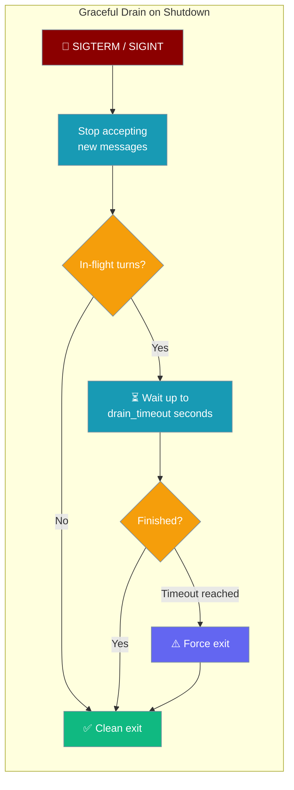
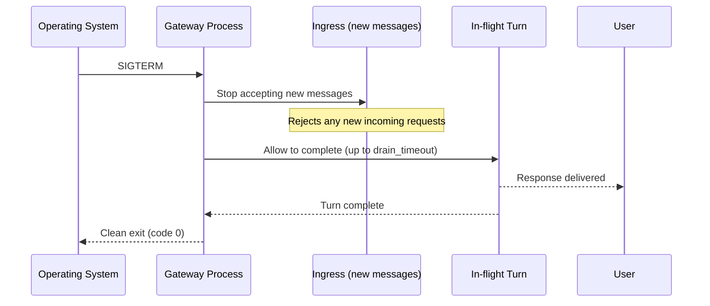

<Note>
For the composed one-switch experience, see [Reliability Preset](/docs/features/gateway-reliability). This page documents the drain-only knob.
</Note>

When a gateway process receives SIGTERM or SIGINT, it can wait for in-flight bot turns to complete before exiting — instead of cutting them off mid-response. Configure the drain window via the CLI, YAML, or Python.

```python
from praisonaiagents import Agent
from praisonai.bots.botos import BotOS

agent = Agent(
    name="SupportBot",
    instructions="Help users with support questions.",
    model="gpt-4o-mini",
)

bots = BotOS(
    agent=agent,
    drain_timeout=30,
)
bots.run()
```


The user sends SIGTERM to the gateway process; graceful drain stops new work and waits for in-flight bot turns up to `drain_timeout`.



## Quick Start

<Steps>
<Step title="Enable via the CLI flag">

```bash
praisonai gateway start gateway.yaml --drain-timeout 30
```

The gateway waits up to 30 seconds for in-flight turns to complete before exiting.
</Step>

<Step title="Enable via YAML config">

```yaml
# gateway.yaml
drain_timeout: 30

agent:
  name: assistant
  instructions: "Help users"
  model: gpt-4o-mini

channels:
  telegram:
    platform: telegram
    token: "${TELEGRAM_BOT_TOKEN}"
```

```bash
praisonai gateway start gateway.yaml
```
</Step>

<Step title="Enable via Python">

```python
from praisonaiagents import Agent
from praisonai.bots.botos import BotOS

agent = Agent(
    name="Bot",
    instructions="Be helpful.",
    model="gpt-4o-mini",
)

bots = BotOS(agent=agent, drain_timeout=30)
bots.run()
```
</Step>

<Step title="Override drain timeout at stop time">

You can also pass a one-off timeout when stopping programmatically:

```python
import asyncio

async def main():
    bots = BotOS(agent=agent, drain_timeout=30)
    asyncio.create_task(bots.run_async())

    await asyncio.sleep(60)
    await bots.stop(drain_timeout=10)
```
</Step>
</Steps>

---

## How It Works



The drain phase uses `DrainTimeoutPolicy` from `praisonaiagents.gateway.protocols`. If the timeout elapses before all turns finish, the process exits forcefully but still attempts to flush any queued outbound messages.

---

## Behaviour Table

| Scenario | Within drain window | After drain timeout |
|----------|--------------------|--------------------|
| In-flight turn (started before signal) | Runs to completion | Force-killed |
| New inbound message (after signal) | Rejected / queued for next instance | Rejected |
| Queued outbound message | Flushed | Best-effort |

---

## Configuration Precedence

When multiple sources specify `drain_timeout`, the most specific wins:

| Source | Precedence |
|--------|-----------|
| `bots.stop(drain_timeout=N)` call | Highest |
| `BotOS(drain_timeout=N)` constructor | High |
| `gateway.drain_timeout` in YAML | Medium |
| `--drain-timeout N` CLI flag | Low |
| Default (`reliability` unset) | Lowest — 5 s drain window applied; use `reliability="off"` for immediate exit |

When `drain_timeout` is `0`, the gateway exits immediately on SIGTERM without draining. When `drain_timeout` is `None` (and no `reliability` preset is set), a 5-second drain window is applied by the default posture — use `reliability="off"` to restore immediate-teardown behaviour.

---

<Note>
Want to turn on graceful drain with a single switch alongside inbound admission control? See [Gateway Reliability Presets](/docs/features/gateway-reliability).
</Note>

## Best Practices

<AccordionGroup>
<Accordion title="Set drain_timeout in Kubernetes or container deployments">

Container orchestrators send SIGTERM before force-killing a pod. Set `drain_timeout` to slightly less than the `terminationGracePeriodSeconds` in your pod spec:

```yaml
# kubernetes deployment
terminationGracePeriodSeconds: 60

# gateway.yaml
drain_timeout: 50
```

This gives the gateway 50 seconds to finish turns and 10 seconds of buffer for the process to exit cleanly.
</Accordion>

<Accordion title="Keep the timeout proportional to your P99 turn latency">

If your agent typically responds in 5 seconds and your P99 is 20 seconds, set `drain_timeout: 25`. A timeout much larger than your P99 adds unnecessary shutdown delay without benefit.
</Accordion>

<Accordion title="Cross-link with gateway-scale-to-zero">

Graceful drain is especially important for scale-to-zero deployments. Combine it with the existing scale-to-zero feature to ensure scale-down events don't interrupt active users.
</Accordion>
</AccordionGroup>

---

## Related

<CardGroup cols={2}>
<Card title="Gateway Scale to Zero" icon="moon" href="/docs/features/gateway-scale-to-zero">
  Scale the gateway down when idle and back up on demand
</Card>
<Card title="Gateway Drain Trigger" icon="power-off" href="/docs/features/gateway-drain-trigger">
  Port-less external drain signal for hosted deployments
</Card>
</CardGroup>
