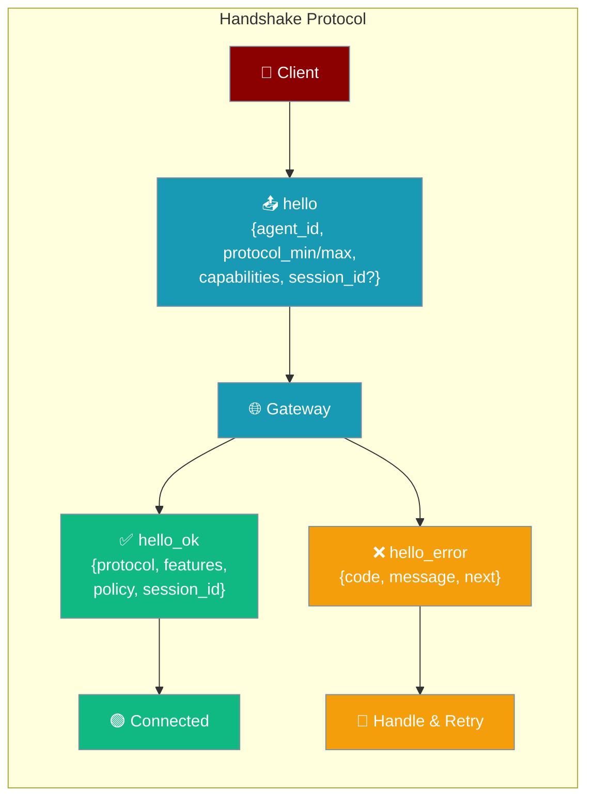
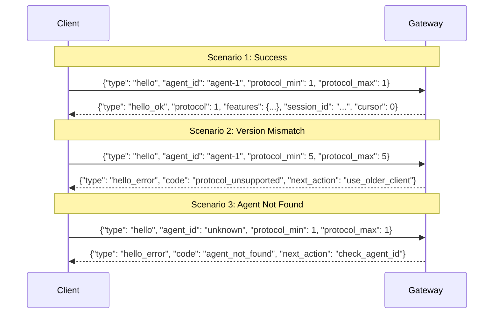

The gateway handshake lets clients and servers agree on a protocol version, discover supported features, and recover from disconnects — all in one round trip.



## Quick Start

<Steps>
<Step title="Send a Hello Message">
Connect via WebSocket and send a `hello` message to begin the handshake:

```python
import asyncio
import json
import websockets

async def connect_to_agent():
    async with websockets.connect("ws://127.0.0.1:8765/ws") as ws:
        # Send hello to start the handshake
        await ws.send(json.dumps({
            "type": "hello",
            "agent_id": "my-agent",
            "protocol_min": 1,
            "protocol_max": 1
        }))
        
        # Receive hello_ok or hello_error
        response = json.loads(await ws.recv())
        
        if response["type"] == "hello_ok":
            print(f"Connected! Session: {response['session_id']}")
            print(f"Protocol: {response['protocol']}")
        else:
            print(f"Error: {response['code']} — {response['message']}")
            print(f"Next step: {response.get('next_action')}")

asyncio.run(connect_to_agent())
```
</Step>

<Step title="Opt Into Capabilities">
Request optional features by listing capability tokens:

```python
await ws.send(json.dumps({
    "type": "hello",
    "agent_id": "my-agent",
    "protocol_min": 1,
    "protocol_max": 1,
    "capabilities": ["streaming", "presence", "ack"]
}))

response = json.loads(await ws.recv())

if response["type"] == "hello_ok":
    features = response["features"]
    print(f"Methods: {features['methods']}")
    print(f"Events: {features['events']}")
    # With streaming: ['message', 'error', 'token_stream', 'tool_call_stream', 'stream_end']
```
</Step>

<Step title="Resume a Session After Reconnect">
Pass `session_id` and `since` cursor to resume a dropped connection:

```python
# Store session info from initial hello_ok
session_id = response["session_id"]
cursor = response["cursor"]

# On reconnect, replay missed events automatically
await ws.send(json.dumps({
    "type": "hello",
    "agent_id": "my-agent",
    "protocol_min": 1,
    "protocol_max": 1,
    "session_id": session_id,
    "since": cursor
}))

response = json.loads(await ws.recv())
if response["type"] == "hello_ok" and response["resumed"]:
    print("Session resumed! Reading replayed events...")
    # Replayed events arrive as: {"type": "replay", "event": {...}}
    while True:
        msg = json.loads(await ws.recv())
        if msg["type"] == "replay":
            print(f"Replayed: {msg['event']}")
        else:
            break  # Normal messages start after replay
```
</Step>
</Steps>

---

## How It Works

The gateway handshake completes in a single round trip before any messages are exchanged.



**Handshake steps the server performs:**

| Step | Action | Failure response |
|------|--------|-----------------|
| 1. Agent lookup | Find `agent_id` in registry | `hello_error` code `agent_not_found` |
| 2. Version negotiation | Check `protocol_min`/`protocol_max` overlap | `hello_error` code `protocol_unsupported` |
| 3. Capability negotiation | Match client capabilities to server support | Only advertise supported events |
| 4. Session resolution | Resume or create a session | `hello_error` code `auth_unauthorized` if session mismatch |
| 5. Replay | Send missed events as `{"type": "replay", "event": ...}` | — |
| 6. hello_ok | Return negotiated protocol, features, policy, session | — |

---

## Configuration Options

### HelloParams (Client → Server)

Fields sent in the `hello` message:

| Field | Type | Required | Description |
|-------|------|----------|-------------|
| `agent_id` | `str` | Yes | The agent to connect to |
| `protocol_min` | `int` | Yes | Minimum protocol version the client supports |
| `protocol_max` | `int` | Yes | Maximum protocol version the client supports |
| `capabilities` | `List[str]` | No | Capability tokens to opt into (`streaming`, `presence`, `ack`) |
| `session_id` | `str` | No | Existing session ID to resume |
| `since` | `int` | No | Event cursor for replaying missed events |

### HelloResult (Server → Client on success)

Fields in the `hello_ok` response:

| Field | Type | Description |
|-------|------|-------------|
| `protocol` | `int` | Negotiated protocol version |
| `features` | `Dict[str, List[str]]` | Supported `methods` and `events` (filtered by your capabilities) |
| `policy` | `Dict[str, int]` | Gateway limits (see Policy Limits section) |
| `session_id` | `str` | Session ID for this connection (new or resumed) |
| `resumed` | `bool` | `True` if an existing session was resumed |
| `cursor` | `int` | Current event cursor position |

### HelloError (Server → Client on failure)

Fields in the `hello_error` response:

| Field | Type | Description |
|-------|------|-------------|
| `code` | `str` | Structured error code (see table below) |
| `message` | `str` | Human-readable explanation |
| `next_action` | `str` | Suggested next step |

### ConnectErrorCode Values

| Code | Meaning | Suggested `next_action` |
|------|---------|------------------------|
| `auth_required` | Authentication is required but missing | — |
| `auth_unauthorized` | Credentials present but invalid, or session belongs to different agent | `start_new_session` |
| `protocol_unsupported` | Client and server cannot agree on a protocol version | `upgrade_client` or `use_older_client` |
| `pairing_required` | Client must complete pairing first | `pair_device` |
| `agent_not_found` | The requested `agent_id` does not exist | `check_agent_id` |

---

## Capability Matrix

Capabilities you list in `hello.capabilities` unlock additional events in `hello_ok.features.events`:

| Capability | Events unlocked | Server prerequisite |
|------------|----------------|---------------------|
| *(none)* | `message`, `error` | — |
| `streaming` | `token_stream`, `tool_call_stream`, `stream_end` | — |
| `presence` | `presence_join`, `presence_leave`, `presence_update` | Server must have `_presence_tracker` configured |
| `ack` | `message_ack`, `message_nack`, `delivery_retry` | Server must have `_delivery_tracker` configured |

Base `methods` are always `["message", "leave"]`.

<Note>
`presence` and `ack` events are only advertised when the gateway server has the corresponding tracker configured. If the server does not have `_presence_tracker`, requesting `presence` capability will not add presence events to the feature list.
</Note>

---

## Protocol Version Constants

The current server constants (as of PR #2154):

| Constant | Value | Meaning |
|----------|-------|---------|
| `GATEWAY_PROTOCOL_VERSION` | `1` | Server's current protocol version |
| `MIN_CLIENT_PROTOCOL_VERSION` | `1` | Lowest client version the server accepts |

The server negotiates the version as `min(client_max, GATEWAY_PROTOCOL_VERSION)`.

**Version negotiation rules:**
- If `client_max < MIN_CLIENT_PROTOCOL_VERSION` → `protocol_unsupported` + `next_action: "upgrade_client"`
- If `client_min > GATEWAY_PROTOCOL_VERSION` → `protocol_unsupported` + `next_action: "use_older_client"`
- Otherwise → negotiated version is `min(client_max, GATEWAY_PROTOCOL_VERSION)`

---

## Policy Limits

The `hello_ok` response includes a `policy` object with gateway limits your client should respect:

| Policy field | Default | Description |
|---|---|---|
| `max_payload` | `1048576` (1 MB) | Maximum WebSocket message size in bytes |
| `max_buffered_bytes` | `8388608` (8 MB) | Maximum bytes the server buffers per client |
| `heartbeat_ms` | `30000` (30 s) | Interval in milliseconds between server heartbeats |

```python
if response["type"] == "hello_ok":
    policy = response["policy"]
    max_msg_size = policy["max_payload"]       # Respect when sending messages
    heartbeat_ms = policy["heartbeat_ms"]       # Set client-side timeout accordingly
    print(f"Max message: {max_msg_size / 1024:.0f} KB, heartbeat: {heartbeat_ms}ms")
```

---

## Backward Compatibility

The legacy `join` → `joined` connection flow is fully preserved for existing clients — nothing breaks.

| Flow | When to use | Benefit |
|------|-------------|---------|
| **Legacy `join`** | Existing clients | No changes needed |
| **New `hello`** | New clients | Version negotiation, capability discovery, policy limits, structured errors |

New clients should prefer `hello` to get the full handshake experience. Clients that continue to use `join` will connect as before.

---

## Common Patterns

### Handle Errors by Code

```python
async def handle_hello_response(ws):
    response = json.loads(await ws.recv())
    
    if response["type"] == "hello_ok":
        return response  # Success
    
    code = response["code"]
    next_action = response.get("next_action", "")
    
    if code == "agent_not_found":
        print(f"Agent not found. Check your agent_id.")
    elif code == "protocol_unsupported":
        if next_action == "upgrade_client":
            print("Upgrade your client to a newer version.")
        elif next_action == "use_older_client":
            print("Server does not support this protocol version.")
    elif code == "auth_unauthorized":
        if next_action == "start_new_session":
            print("Session mismatch — start a new session without session_id.")
    elif code == "pairing_required":
        print("Complete device pairing first.")
    
    return None
```

### Minimal Connection

```python
await ws.send(json.dumps({
    "type": "hello",
    "agent_id": "assistant",
    "protocol_min": 1,
    "protocol_max": 1
}))
```

### Full-Featured Connection with Reconnect

```python
async def connect(agent_id, session_id=None, cursor=None, capabilities=None):
    payload = {
        "type": "hello",
        "agent_id": agent_id,
        "protocol_min": 1,
        "protocol_max": 1,
        "capabilities": capabilities or ["streaming"]
    }
    if session_id:
        payload["session_id"] = session_id
    if cursor is not None:
        payload["since"] = cursor
    
    await ws.send(json.dumps(payload))
    response = json.loads(await ws.recv())
    return response
```

---

## Best Practices

<AccordionGroup>
<Accordion title="Always advertise a protocol_min/protocol_max range">
Send both `protocol_min` and `protocol_max` even if they are the same value. This allows the server to negotiate gracefully and provide a clear `next_action` if versions don't overlap.

```python
# Good: explicit range
{"protocol_min": 1, "protocol_max": 1}

# Avoid: omitting version fields (server falls back to defaults silently)
{}
```
</Accordion>

<Accordion title="Only request capabilities you actually handle">
If you request `streaming` but don't listen for `token_stream` events, you waste bandwidth. Request only the capabilities your client actively processes.

```python
# Request streaming only if you handle token-by-token events
capabilities = []
if my_client.supports_streaming:
    capabilities.append("streaming")
if my_client.has_presence_ui:
    capabilities.append("presence")
```
</Accordion>

<Accordion title="Use session_id + since to resume cleanly after reconnect">
Save `session_id` and `cursor` from every `hello_ok`. On reconnect, pass both to resume without losing events.

```python
# Save after connecting
state = {
    "session_id": response["session_id"],
    "cursor": response["cursor"]
}

# On reconnect
await ws.send(json.dumps({
    "type": "hello",
    "agent_id": agent_id,
    "protocol_min": 1,
    "protocol_max": 1,
    "session_id": state["session_id"],
    "since": state["cursor"]
}))
```
</Accordion>

<Accordion title="Branch on code + next_action from hello_error for graceful UX">
Structured error codes let you give users specific, helpful feedback rather than generic "connection failed" messages.

```python
error_messages = {
    "agent_not_found": "The agent you requested is not available.",
    "auth_unauthorized": "Access denied. Try reconnecting without a session ID.",
    "protocol_unsupported": "Please update your app to connect.",
    "pairing_required": "Complete device pairing in Settings.",
    "auth_required": "Authentication required."
}
user_message = error_messages.get(code, response["message"])
```
</Accordion>

<Accordion title="Respect policy limits from hello_ok">
Read `max_payload` before sending large messages and use `heartbeat_ms` to set your client-side connection timeout.

```python
policy = response["policy"]
# Don't send messages larger than this
MAX_SEND_SIZE = policy["max_payload"]
# If no message arrives within 2x heartbeat, reconnect
TIMEOUT = policy["heartbeat_ms"] / 1000 * 2
```
</Accordion>
</AccordionGroup>

---

## Related

<CardGroup cols={2}>
<Card title="Gateway Overview" icon="broadcast-tower" href="/docs/features/gateway-overview">
  WebSocket gateway architecture and multi-channel setup
</Card>
<Card title="Gateway Error Handling" icon="shield-check" href="/docs/features/gateway-error-handling">
  Unicode-safe error handling and error patterns
</Card>
<Card title="Gateway & Control Plane" icon="gateway" href="/docs/gateway">
  Unified gateway configuration and deployment
</Card>
<Card title="Bot Gateway" icon="server" href="/docs/features/bot-gateway">
  Configure multiple bots with the gateway server
</Card>
</CardGroup>
