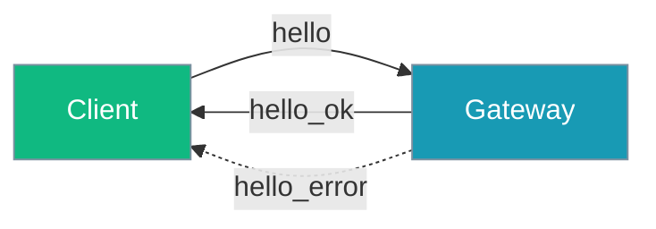
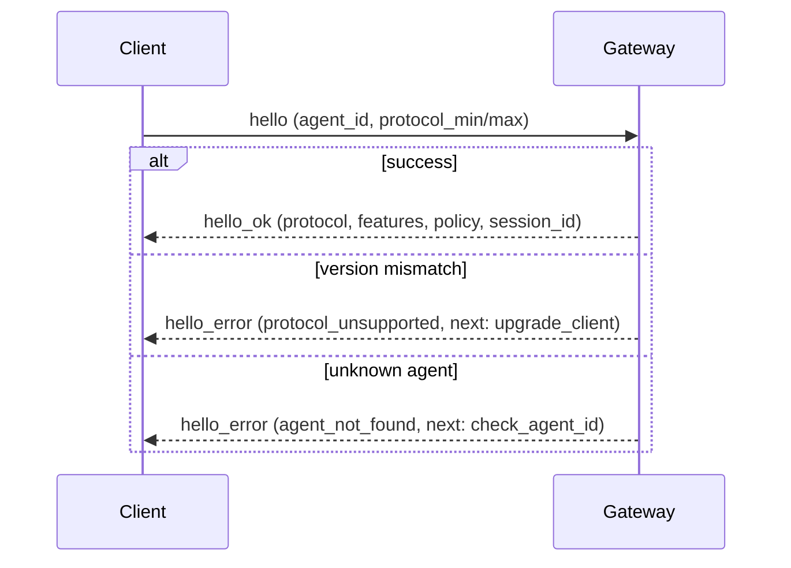

The gateway handshake lets clients and servers agree on a protocol version, discover supported features, and recover from disconnects — all in one round trip.



## Quick Start

<Steps>

<Step title="Minimal hello">

```json
{
  "type": "hello",
  "agent_id": "assistant",
  "protocol_min": 1,
  "protocol_max": 1
}
```

</Step>

<Step title="Opt into capabilities">

```json
{
  "type": "hello",
  "agent_id": "assistant",
  "protocol_min": 1,
  "protocol_max": 1,
  "capabilities": ["streaming", "presence", "ack"]
}
```

</Step>

<Step title="Resume a session">

```json
{
  "type": "hello",
  "agent_id": "assistant",
  "protocol_min": 1,
  "protocol_max": 1,
  "session_id": "abc-123",
  "since": 42
}
```

After `hello_ok`, replayed events arrive as `{"type": "replay", "event": …}` before normal traffic resumes.

</Step>

</Steps>

---

## How It Works



Negotiated protocol version: `min(client_max, GATEWAY_PROTOCOL_VERSION)` where server version is **1** and minimum accepted client version is **1**.

Legacy `join` → `joined` still works for existing clients. New clients should prefer `hello`.

---

## HelloParams (client → server)

| Field | Type | Default | Description |
|-------|------|---------|-------------|
| `agent_id` | `str` | — | Agent to connect to |
| `protocol_min` | `int` | — | Minimum protocol version client supports |
| `protocol_max` | `int` | — | Maximum protocol version client supports |
| `capabilities` | `List[str]` | `[]` | e.g. `streaming`, `presence`, `ack` |
| `session_id` | `Optional[str]` | `None` | Existing session to resume |
| `since` | `Optional[int]` | `None` | Event cursor for replay |

Legacy nested `protocol: {min, max}` is also accepted; missing values fall back to `1`.

---

## HelloResult (server → client, `hello_ok`)

| Field | Type | Description |
|-------|------|-------------|
| `protocol` | `int` | Negotiated protocol version |
| `features` | `Dict[str, List[str]]` | Supported `methods` and `events` |
| `policy` | `Dict[str, int]` | `max_payload`, `max_buffered_bytes`, `heartbeat_ms` |
| `session_id` | `str` | Session ID (new or resumed) |
| `resumed` | `bool` | `True` if an existing session was resumed |
| `cursor` | `int` | Current event cursor |

Example success frame:

```json
{
  "type": "hello_ok",
  "protocol": 1,
  "features": {"methods": ["message", "leave"], "events": ["message", "error", "token_stream"]},
  "policy": {"max_payload": 1048576, "max_buffered_bytes": 8388608, "heartbeat_ms": 30000},
  "session_id": "...",
  "resumed": false,
  "cursor": 0
}
```

Base `methods`: `message`, `leave` only (`abort` is not implemented). Base `events`: `message`, `error`.

---

## HelloError (server → client, `hello_error`)

| Field | Type | Description |
|-------|------|-------------|
| `code` | `ConnectErrorCode` | Structured error code |
| `message` | `str` | Human-readable explanation |
| `next_action` | `Optional[str]` | Suggested next step |

### ConnectErrorCode

| Code | Meaning | Typical `next_action` |
|------|---------|----------------------|
| `auth_required` | Authentication required but missing | — |
| `auth_unauthorized` | Invalid credentials or wrong agent for session | `start_new_session` |
| `protocol_unsupported` | Client/server version mismatch | `upgrade_client` or `use_older_client` |
| `pairing_required` | Client must complete pairing first | `pair_device` |
| `agent_not_found` | Unknown `agent_id` | `check_agent_id` |

---

## Capability Matrix

| Capability | Events unlocked | Server prerequisite |
|------------|-----------------|---------------------|
| (none) | `message`, `error` | — |
| `streaming` | `token_stream`, `tool_call_stream`, `stream_end` | — |
| `presence` | `presence_join`, `presence_leave`, `presence_update` | server has `_presence_tracker` |
| `ack` | `message_ack`, `message_nack`, `delivery_retry` | server has `_delivery_tracker` |

Events are advertised only if the client requested the matching capability.

---

## Policy Limits

| Key | Default | Description |
|-----|---------|-------------|
| `max_payload` | `1048576` (1 MB) | Maximum message payload size |
| `max_buffered_bytes` | `8388608` (8 MB) | Maximum buffered bytes per connection |
| `heartbeat_ms` | `30000` | Heartbeat interval (`heartbeat_interval * 1000`, default 30 s) |

Clients should self-configure from the `policy` object in `hello_ok`.

---

## Best Practices

<AccordionGroup>

<Accordion title="Always advertise protocol_min and protocol_max">
Even when you only support version 1 today, send an explicit range so future servers can negotiate.
</Accordion>

<Accordion title="Only request capabilities you handle">
Requesting `streaming` without handling `token_stream` events wastes bandwidth and confuses clients.
</Accordion>

<Accordion title="Use session_id + since on reconnect">
Resume cleanly after disconnect and process `replay` envelopes before sending new messages.
</Accordion>

<Accordion title="Branch on code and next from hello_error">
Use structured `ConnectErrorCode` values for graceful UX instead of parsing free-text errors.
</Accordion>

</AccordionGroup>

---

## Related

<CardGroup cols={2}>
  <Card title="Gateway & Control Plane" icon="gateway" href="/docs/gateway">
    Unified gateway architecture
  </Card>
  <Card title="Gateway Overview" icon="tower-broadcast" href="/docs/features/gateway-overview">
    WebSocket gateway features
  </Card>
  <Card title="Session Protocol" icon="messages" href="/docs/features/session-protocol">
    Session message format
  </Card>
  <Card title="Error Handling" icon="shield-check" href="/docs/features/gateway-error-handling">
    Structured connection errors
  </Card>
</CardGroup>
