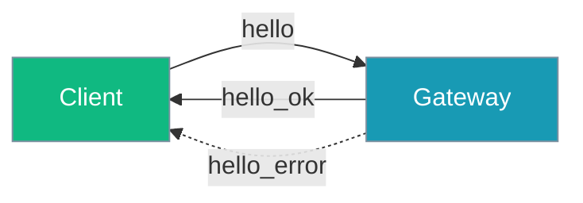
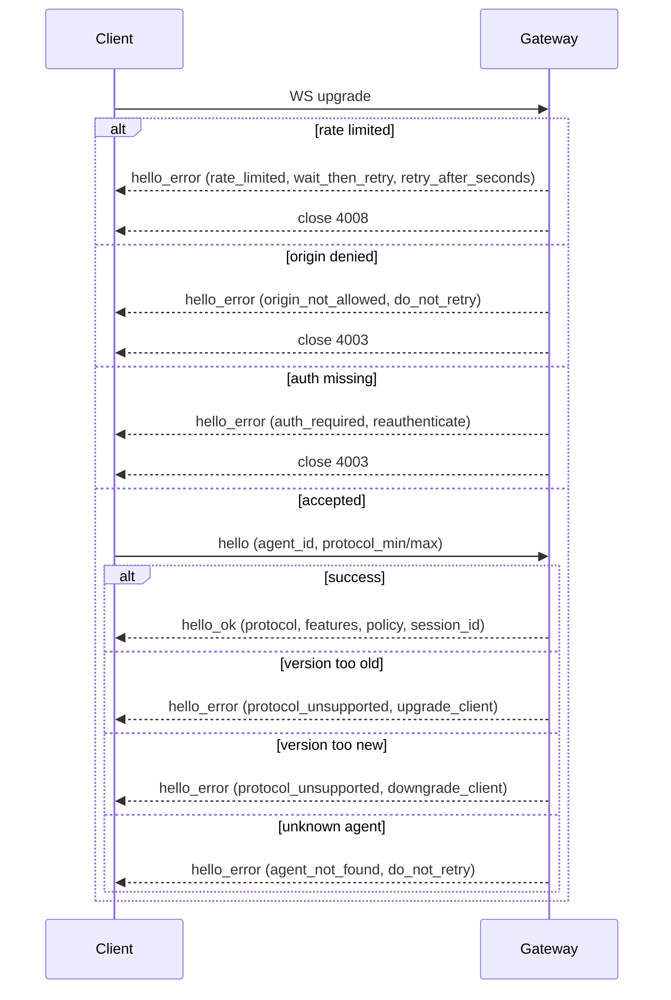
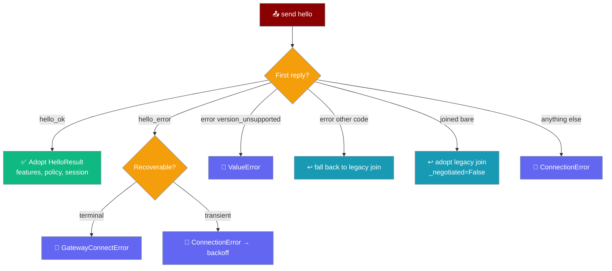

<Note>
The gateway now ships in the `praisonai-bot` package. `praisonai serve gateway` still works exactly as documented here; for a standalone install see [praisonai-bot Migration](/docs/guides/praisonai-bot-migration).
</Note>


```python
from praisonaiagents import Agent

agent = Agent(name="handshake-agent", instructions="Perform gateway connection handshake.")
agent.start("Establish a secure handshake with the remote gateway.")
```


The gateway handshake lets clients and servers agree on a protocol version, discover supported features, and recover from disconnects — all in one round trip.

```python
import asyncio
from praisonai.gateway import GatewayClient

async def main():
    client = GatewayClient(url="ws://localhost:8765", agent_id="assistant")
    await client.connect()  # sends hello; receives hello_ok with negotiated protocol

asyncio.run(main())
```


The user connects via GatewayClient; hello and hello_ok negotiate protocol version, features, and session cursor in one round trip.



## Quick Start

<Steps>

<Step title="Minimal hello">

```json
{
  "type": "hello",
  "agent_id": "assistant",
  "protocol_min": 1,
  "protocol_max": 1
}
```

</Step>

<Step title="Opt into capabilities">

```json
{
  "type": "hello",
  "agent_id": "assistant",
  "protocol_min": 1,
  "protocol_max": 1,
  "capabilities": ["streaming", "presence", "ack"]
}
```

</Step>

<Step title="Resume a session">

```json
{
  "type": "hello",
  "agent_id": "assistant",
  "protocol_min": 1,
  "protocol_max": 1,
  "session_id": "abc-123",
  "since": 42
}
```

After `hello_ok`, replayed events arrive as `{"type": "replay", "event": …}` before normal traffic resumes.

</Step>

</Steps>

---

## How It Works



Negotiated protocol version: `min(client_max, GATEWAY_PROTOCOL_VERSION)` where server version is **1** and minimum accepted client version is **1**.

Legacy `join` → `joined` still works for existing clients. New clients should prefer `hello`.

---

## HelloParams (client → server)

| Field | Type | Default | Description |
|-------|------|---------|-------------|
| `agent_id` | `str` | — | Agent to connect to |
| `protocol_min` | `int` | — | Minimum protocol version client supports |
| `protocol_max` | `int` | — | Maximum protocol version client supports |
| `capabilities` | `List[str]` | `[]` | e.g. `streaming`, `presence`, `ack` |
| `session_id` | `Optional[str]` | `None` | Existing session to resume |
| `since` | `Optional[int]` | `None` | Event cursor for replay |

Legacy nested `protocol: {min, max}` is also accepted; missing values fall back to `1`.

---

## HelloResult (server → client, `hello_ok`)

| Field | Type | Description |
|-------|------|-------------|
| `protocol` | `int` | Negotiated protocol version |
| `features` | `Dict[str, List[str]]` | Supported `methods` and `events` |
| `policy` | `Dict[str, int]` | `max_payload`, `max_buffered_bytes`, `max_queued_frames`, `heartbeat_ms` |
| `session_id` | `str` | Session ID (new or resumed) |
| `resumed` | `bool` | `True` if an existing session was resumed |
| `cursor` | `int` | Current event cursor |

Example success frame:

```json
{
  "type": "hello_ok",
  "protocol": 1,
  "features": {"methods": ["message", "leave"], "events": ["message", "error", "token_stream"]},
  "policy": {"max_payload": 1048576, "max_buffered_bytes": 8388608, "max_queued_frames": 1000, "heartbeat_ms": 30000},
  "session_id": "...",
  "resumed": false,
  "cursor": 0
}
```

Base `methods`: `message`, `leave` only (`abort` is not implemented). Base `events`: `message`, `error`.

---

## HelloError (server → client, `hello_error`)

| Field | Type | Description |
|-------|------|-------------|
| `code` | `ConnectErrorCode` | Structured, machine-readable error code |
| `message` | `str` | Human-readable explanation (display only) |
| `next_step` | `Optional[ConnectRecoveryStep]` | Machine-readable recovery hint |
| `retry_after_seconds` | `Optional[int]` | Backoff hint, only meaningful with `wait_then_retry` |
| `next_action` | `Optional[str]` | **Deprecated** free-text hint; prefer `next_step` |

<Note>
Wire frame also includes a legacy `next` key for backward compatibility — it mirrors `next_action` (or falls back to `next_step.value`). The `next_step`, `retry_after_seconds`, and `next` keys are **omitted entirely** when no recovery hint is set — they are never `null`.
</Note>

Example wire frame (rate-limited):

```json
{
  "type": "hello_error",
  "code": "rate_limited",
  "message": "Too many connection attempts",
  "next_step": "wait_then_retry",
  "retry_after_seconds": 30,
  "next": "wait_then_retry"
}
```

### ConnectErrorCode

| Code | Meaning | Typical `next_step` |
|------|---------|---------------------|
| `auth_required` | Authentication missing on a non-loopback bind | `reauthenticate` |
| `auth_unauthorized` | Invalid credentials or wrong agent for session | `reauthenticate` |
| `protocol_unsupported` | Client/server version mismatch | `upgrade_client` or `downgrade_client` |
| `pairing_required` | Client must complete pairing first | `repair` |
| `agent_not_found` | Unknown `agent_id` | `do_not_retry` |
| `rate_limited` | Too many connection attempts — driven by an injectable [`RateLimitPolicyProtocol`](/docs/features/gateway-rate-limit-policy) | `wait_then_retry` (+ `retry_after_seconds`) |
| `origin_not_allowed` | Origin not in allowed list (CSWSH defence) | `do_not_retry` |
| `configuration_error` | Server is misconfigured (e.g. external bind with no allowlist) | `do_not_retry` |

<Note>
The `rate_limited` code is driven by an injectable `RateLimitPolicyProtocol` — see [Gateway Rate Limit Policy](/docs/features/gateway-rate-limit-policy) for `SlidingWindowRateLimitPolicy`, YAML `gateway.rate_limit`, and custom policies.
</Note>

### ConnectRecoveryStep

Machine-readable recovery hint. Clients branch on `(code, next_step)` instead of parsing `message`.

| Value | Meaning |
|-------|--------|
| `reauthenticate` | Obtain fresh credentials, then reconnect |
| `repair` | Re-run device pairing, then reconnect |
| `upgrade_client` | Client protocol too old — update the client |
| `downgrade_client` | Client protocol newer than server — use an older client |
| `wait_then_retry` | Back off (`retry_after_seconds`), then reconnect |
| `do_not_retry` | Terminal — reconnecting will not help |

---

## Capability Matrix

| Capability | Events unlocked | Server prerequisite |
|------------|-----------------|---------------------|
| (none) | `message`, `error` | — |
| `streaming` | `token_stream`, `tool_call_stream`, `stream_end` | — |
| `presence` | `presence_join`, `presence_leave`, `presence_update` | server has `_presence_tracker` |
| `ack` | `message_ack`, `message_nack`, `delivery_retry` | server has `_delivery_tracker` |

Events are advertised only if the client requested the matching capability.

---

## Server-side state after handshake

After `hello_ok` is sent, the gateway records the negotiated protocol version and the client's advertised capabilities on the session itself. Both are read-only and survive resume.

```python
session = gateway.get_session(session_id)
session.protocol_version    # → 1   (negotiated min(client_max, GATEWAY_PROTOCOL_VERSION))
session.capabilities        # → ["streaming", "presence", "ack"]   (defensive copy)
```

| Property | Type | Notes |
|----------|------|-------|
| `session.protocol_version` | `int` | Read-only. Set by the `hello` handler from the negotiated value. |
| `session.capabilities` | `List[str]` | Read-only. Returns a copy — mutating the returned list does not change session state. Empty list when the client advertised no capabilities. |

Both properties are populated on the `hello` path **and** the legacy `join` path, so server code can branch on `session.capabilities` without checking which handshake the client used.

<Tip>
Use this to tailor delivery — e.g. only enqueue `token_stream` events when `"streaming" in session.capabilities` — without re-parsing the original `hello` frame.
</Tip>

---

## Client-side wiring (`praisonai-bot`)

The bundled `praisonai-bot[gateway]` client speaks the modern handshake for you — construct it with the capabilities you handle, `connect()`, then read the negotiated manifest off the instance.

```python
import asyncio
from praisonai_bot.gateway import GatewayClient, PayloadTooLarge

async def main():
    client = GatewayClient(
        url="ws://localhost:8765",
        agent_id="assistant",
        capabilities=["streaming", "ack"],   # what to advertise in `hello`
    )
    await client.connect()

    # Read the negotiated manifest — empty on legacy gateways.
    print("protocol   :", client.features)               # {"methods": [...], "events": [...]}
    print("policy     :", client.policy)                 # {"max_payload": ..., "heartbeat_ms": ...}
    print("heartbeat  :", client.heartbeat_ms, "ms")     # convenience getter

    # Gate optional behaviour on the negotiated event set instead of probing.
    if client.supports_event("token_stream"):
        # enable streaming UI
        pass

    # Self-guarded send — oversized frame fails locally, never hits the wire.
    try:
        await client.send({"type": "message", "content": "hello"})
    except PayloadTooLarge as e:
        print("dropped:", e)

asyncio.run(main())
```

The client **always** sends `hello` first — `capabilities=` controls *what* it advertises, not whether the modern handshake is used.

### Client construction

| Argument | Type | Default | Description |
|----------|------|---------|-------------|
| `capabilities` | `Optional[List[str]]` | `None` → `["streaming", "ack"]` | Capability tokens advertised in the outbound `hello` frame. `None` uses the default; `[]` explicitly opts out of every capability. The list is defensively copied into `self.capabilities`. |

### Negotiated accessors

`connect()` populates these from the server's `hello_ok`. Against a legacy gateway they stay at permissive defaults so existing code keeps working.

| Attribute | Type | Legacy default | Description |
|-----------|------|----------------|-------------|
| `client.capabilities` | `List[str]` | echoed from constructor | The capability tokens actually sent in `hello`. Client intent, never mutated by the handshake. |
| `client.features` | `Dict[str, List[str]]` | `{}` | Negotiated feature manifest: `{"methods": [...], "events": [...]}`. Empty dict on a legacy gateway. |
| `client.policy` | `Dict[str, int]` | `{}` | Negotiated transport policy (`max_payload`, `max_buffered_bytes`, `max_queued_frames`, `heartbeat_ms`). Empty dict on legacy. |
| `client.heartbeat_ms` | `Optional[int]` | `None` | Convenience getter → `policy["heartbeat_ms"]` coerced to a non-negative `int`. Strings and floats coerce; booleans and unparseable values yield `None`. |

### `supports_event(event)`

Gate optional behaviour on the negotiated event set instead of `try: … except:` probing.

```python
from praisonaiagents.gateway import EventType

client.supports_event("token_stream")     # str lookup
client.supports_event(EventType.MESSAGE)  # EventType — uses .value
```

- Accepts a `str` (e.g. `"token_stream"`) or an `EventType` member; the enum's `.value` is used for lookup.
- Returns `True` for **legacy gateways** (empty `features["events"]`) so code that assumed everything worked keeps working — this is the intentional permissive default.
- Otherwise returns `True` iff `event in client.features["events"]`.

### Handshake flow — client branch on the server's first reply

The wire is documented server-side above; this is what the *client* does with each reply.



| Server's reply to `hello` | Client action | Notes |
|---------------------------|---------------|-------|
| `hello_ok` | Adopt `HelloResult` → populate `features`, `policy`, `session_id`, `cursor`, `protocol_version`. Set `_negotiated=True`. | Canonical modern path. |
| `hello_error` | Classify via `ConnectErrorCode`: terminal → raise `GatewayConnectError`, transient → raise `ConnectionError` (reconnect loop backs off, honouring `retry_after_seconds`). | Same classification, now reachable via `hello_error`. |
| `error` (bare), `code="version_unsupported"` | Raise `ValueError("Protocol version unsupported: …")`. | Preserved legacy behaviour. |
| `error` (bare), any other code | **Fall back to legacy `join`** (`_legacy_join`). | Older gateway that doesn't understand `hello`. Compatibility fallback #1. |
| `joined` (bare) | Adopt legacy join → session bookkeeping populated, `_negotiated=False`, `features`/`policy` stay `{}`. | Server treated `hello` as `join`. Compatibility fallback #2. |
| Anything else | Raise `ConnectionError("Unexpected handshake reply: …")`. | Guard against a broken server. |

### `PayloadTooLarge`

```python
from praisonai_bot.gateway import PayloadTooLarge
```

Raised inside `client.send(...)`, **before** the WebSocket write, when `len(payload.encode("utf-8")) > client.policy["max_payload"]`.

- The frame never leaves the client — nothing reaches the server and no round-trip is spent.
- Size is measured in **UTF-8 bytes**, not `len(str)`, matching how the server counts. Size payloads by encoded length, not string length.
- Catch it and shrink/split the payload or accept the loss — retrying the same frame fails identically.
- A `max_payload` of `0` is honoured as "reject everything"; `None`/missing means unbounded. On a legacy gateway (`policy == {}`) this exception is unreachable and the previous server-side reject still applies.

---

## Policy Limits

| Key | Default | Description |
|-----|---------|-------------|
| `max_payload` | `1048576` (1 MB) | Maximum message payload size |
| `max_buffered_bytes` | `8388608` (8 MB) | Maximum buffered bytes per connection |
| `max_queued_frames` | `1000` | Maximum queued outbound frames per client. Clients can read this to pace their own sends. |
| `heartbeat_ms` | `30000` | Heartbeat interval (`heartbeat_interval * 1000`, default 30 s) |

Clients should self-configure from the `policy` object in `hello_ok`. See [Gateway Flow Control](/docs/features/gateway-flow-control) for tuning `max_buffered_bytes` and `max_queued_frames`.

---

## Persisted Session State

After `hello_ok`, the gateway records both the negotiated protocol version and the client-advertised capabilities on the `GatewaySession`. These values survive disconnect and resume.

```python
import asyncio
from praisonai.gateway import GatewayClient

async def main():
    client = GatewayClient(
        url="ws://localhost:8765",
        agent_id="assistant",
        capabilities=["streaming", "ack"],
    )
    await client.connect()
    # After hello_ok, the server-side session exposes:
    # session.protocol_version  → "1"  (negotiated version string)
    # session.capabilities      → ["streaming", "ack"]  (client-advertised)

asyncio.run(main())
```

| Property | Type | Description |
|---|---|---|
| `session.protocol_version` | `str` | The negotiated protocol version agreed during `hello`. |
| `session.capabilities` | `list[str]` | The capabilities the client advertised in the `hello` message. |

Both properties are written into `session.to_dict()` and restored by `from_dict()`, so they survive server restarts and session persistence backends.

**Server-side hooks** and **custom routing code** can read these off any live session:

```python
def on_message(session, payload):
    if "streaming" in session.capabilities:
        # send token_stream events
        ...
    else:
        # send complete message at once
        ...
```

<Note>
If `to_dict()` / `from_dict()` encounters a non-list value for capabilities (e.g. from an older snapshot), it is safely restored as `[]` to avoid errors.
</Note>

---

## Best Practices

<AccordionGroup>

<Accordion title="Always advertise protocol_min and protocol_max">
Even when you only support version 1 today, send an explicit range so future servers can negotiate.
</Accordion>

<Accordion title="Only request capabilities you handle">
Requesting `streaming` without handling `token_stream` events wastes bandwidth and confuses clients.
</Accordion>

<Accordion title="Use session_id + since on reconnect">
Resume cleanly after disconnect and process `replay` envelopes before sending new messages.
</Accordion>

<Accordion title="Advertise only the capabilities you handle">
Requesting `streaming` you don't consume wastes bandwidth *and* the server advertises `token_stream` back at you — you'll get events your loop drops silently.
</Accordion>

<Accordion title="Prefer client.supports_event(...) over try/except probing">
The manifest is the source of truth once negotiated; probing races the server's advertisement. Use `client.supports_event("token_stream")` to gate optional behaviour.
</Accordion>

<Accordion title="Catch PayloadTooLarge around client.send(...) for user-generated content">
The local guard is the fast-fail seam; without a catch, a single oversized user message crashes the send loop.
</Accordion>

<Accordion title="Do not depend on client.features being populated on a legacy gateway">
Fall through to `supports_event(...)`'s permissive `True` default so a mixed-version fleet keeps working.
</Accordion>

<Accordion title="Branch on (code, next_step) from hello_error">
Use the structured `(code, next_step)` pair instead of parsing `message`. The legacy `next` key is still emitted for older clients but new code should branch on `next_step`.

```python
if frame.get("type") == "hello_error":
    step = frame.get("next_step")
    if step == "wait_then_retry":
        await asyncio.sleep(frame.get("retry_after_seconds", 1))
        await reconnect()
    elif step == "reauthenticate":
        await refresh_credentials()
        await reconnect()
    elif step in ("do_not_retry", "upgrade_client", "downgrade_client", "repair"):
        surface_to_user(frame["message"])
    else:
        await reconnect()  # default: try again
```
</Accordion>

</AccordionGroup>

---

## Related

<CardGroup cols={2}>
  <Card title="Gateway & Control Plane" icon="gateway" href="/docs/gateway">
    Unified gateway architecture
  </Card>
  <Card title="Gateway Overview" icon="tower-broadcast" href="/docs/features/gateway-overview">
    WebSocket gateway features
  </Card>
  <Card title="Session Protocol" icon="messages" href="/docs/features/session-protocol">
    Session message format
  </Card>
  <Card title="Error Handling" icon="shield-check" href="/docs/features/gateway-error-handling">
    Structured connection errors
  </Card>
</CardGroup>
